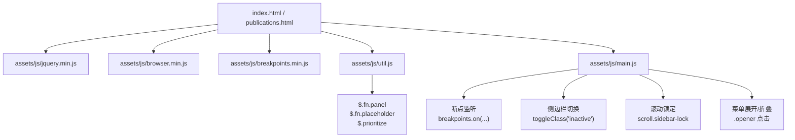
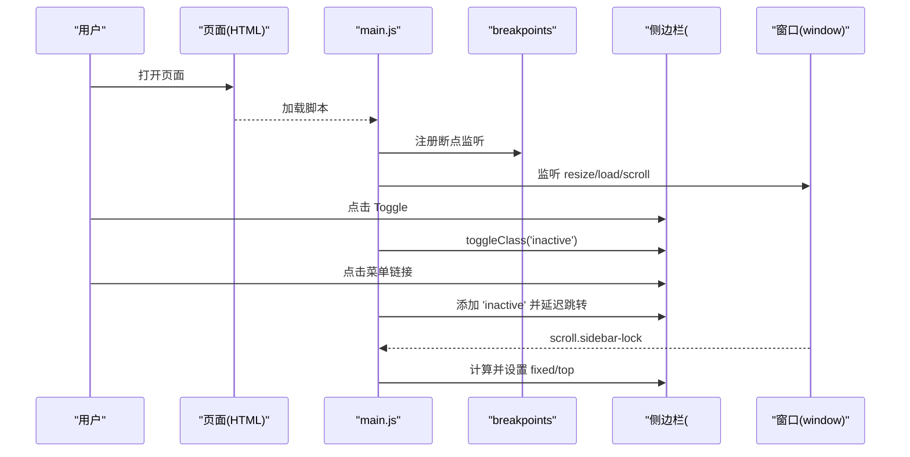
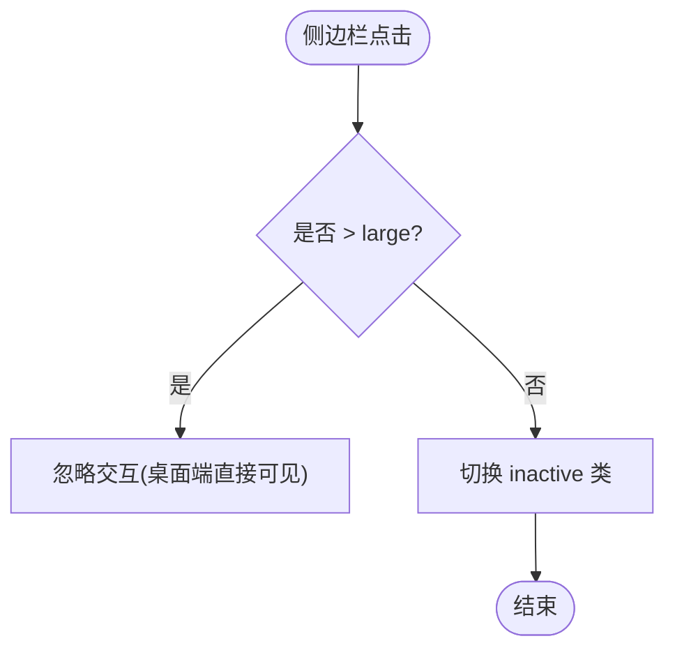
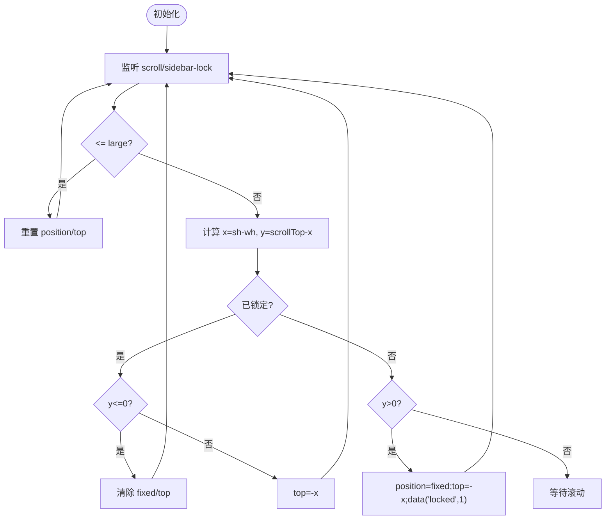
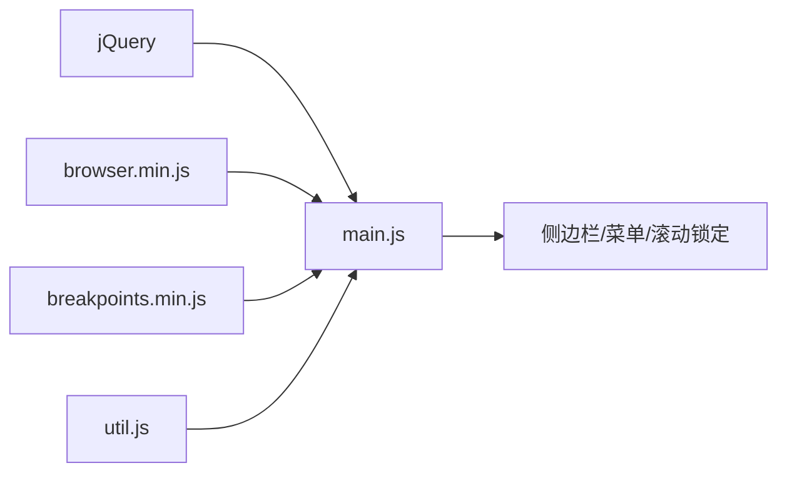

# JavaScript交互

<cite>
**本文引用的文件**
- [index.html](file://index.html)
- [publications.html](file://publications.html)
- [assets/js/main.js](file://assets/js/main.js)
- [assets/js/util.js](file://assets/js/util.js)
- [assets/js/browser.min.js](file://assets/js/browser.min.js)
- [assets/sass/layout/_sidebar.scss](file://assets/sass/layout/_sidebar.scss)
- [assets/sass/layout/_menu.scss](file://assets/sass/layout/_menu.scss)
- [assets/sass/libs/_breakpoints.scss](file://assets/sass/libs/_breakpoints.scss)
- [assets/css/main.css](file://assets/css/main.css)
</cite>

## 目录
1. [简介](#简介)
2. [项目结构](#项目结构)
3. [核心组件](#核心组件)
4. [架构总览](#架构总览)
5. [详细组件分析](#详细组件分析)
6. [依赖关系分析](#依赖关系分析)
7. [性能考虑](#性能考虑)
8. [故障排查指南](#故障排查指南)
9. [结论](#结论)
10. [附录：API参考与使用示例](#附录api参考与使用示例)

## 简介
本文件面向开发者，系统化说明网站中所有用户交互功能的实现原理，重点覆盖侧边栏控制、响应式适配、滚动锁定等核心功能；解释jQuery的使用模式与事件处理机制；梳理工具函数的作用与复用方式；总结浏览器兼容性处理与错误处理策略；提供具体API参考与使用示例；并给出性能优化技巧、调试方法与扩展新交互功能的开发指南。

## 项目结构
- 入口页面包含必要的脚本加载顺序：jQuery → 浏览器检测 → 断点库 → 工具函数 → 主交互逻辑。
- 主交互逻辑集中在 main.js，负责初始化断点、侧边栏切换、链接点击导航、滚动锁定、菜单展开/折叠等。
- 通用工具封装在 util.js，提供面板（panel）、占位符兼容（placeholder）、元素优先级移动（prioritize）等能力。
- 样式与响应式由SASS编译后的CSS与断点系统配合，main.js通过断点库进行运行时判断。



图表来源
- [index.html:120-126](file://index.html#L120-L126)
- [publications.html:165-171](file://publications.html#L165-L171)
- [assets/js/main.js:1-262](file://assets/js/main.js#L1-L262)
- [assets/js/util.js:1-587](file://assets/js/util.js#L1-L587)

章节来源
- [index.html:120-126](file://index.html#L120-L126)
- [publications.html:165-171](file://publications.html#L165-L171)

## 核心组件
- 断点系统：通过 breakpoints 配置多档断点，并在JS中监听断点变化以驱动交互行为（如侧边栏默认隐藏/显示）。
- 侧边栏控制：动态注入切换按钮，绑定点击事件切换 inactive 类；在小屏下阻止事件冒泡，点击body关闭侧边栏。
- 滚动锁定：在宽屏模式下，根据窗口高度与侧边栏内容高度计算固定位置，实现“吸顶”效果；在窄屏下禁用锁定。
- 菜单交互：为带 .opener 的菜单项绑定点击，切换 active 状态并触发重算滚动锁定。
- 工具函数：提供 panel（可配置的弹出面板）、placeholder（旧浏览器占位符兼容）、prioritize（DOM元素前置/还原）等。

章节来源
- [assets/js/main.js:13-23](file://assets/js/main.js#L13-L23)
- [assets/js/main.js:72-164](file://assets/js/main.js#L72-L164)
- [assets/js/main.js:166-235](file://assets/js/main.js#L166-L235)
- [assets/js/main.js:237-260](file://assets/js/main.js#L237-L260)
- [assets/js/util.js:7-35](file://assets/js/util.js#L7-L35)
- [assets/js/util.js:42-297](file://assets/js/util.js#L42-L297)
- [assets/js/util.js:303-519](file://assets/js/util.js#L303-L519)
- [assets/js/util.js:526-585](file://assets/js/util.js#L526-L585)

## 架构总览
整体采用“轻量库 + 业务逻辑”的分层设计：
- 基础库：jQuery、browser（UA检测）、breakpoints（断点），提供能力支撑。
- 工具层：util.js 提供跨页面复用的交互组件。
- 业务层：main.js 组合基础库与工具，完成侧边栏、滚动锁定、菜单等交互。



图表来源
- [assets/js/main.js:13-23](file://assets/js/main.js#L13-L23)
- [assets/js/main.js:72-164](file://assets/js/main.js#L72-L164)
- [assets/js/main.js:166-235](file://assets/js/main.js#L166-L235)

## 详细组件分析

### 侧边栏控制
- 默认状态：在 <=large 断点下，侧边栏默认 inactive（隐藏）；>large 时移除 inactive（显示）。
- 切换按钮：动态创建 <a class="toggle"> 并插入到侧边栏，点击时阻止默认行为与冒泡，切换 inactive。
- 小屏交互：在 <=large 时，侧边栏内部事件阻止冒泡，避免穿透；点击 body 时关闭侧边栏。
- 链接导航：在 <=large 时，点击侧边栏内链接会先关闭侧边栏，再延迟跳转；支持 target="_blank"。



图表来源
- [assets/js/main.js:72-164](file://assets/js/main.js#L72-L164)

章节来源
- [assets/js/main.js:72-164](file://assets/js/main.js#L72-L164)
- [assets/sass/layout/_sidebar.scss:117-196](file://assets/sass/layout/_sidebar.scss#L117-L196)

### 响应式适配
- 断点定义：在 main.js 中通过 breakpoints() 声明多个断点区间，用于JS逻辑分支。
- 运行时监听：通过 breakpoints.on() 监听断点变化，动态调整侧边栏状态。
- 样式断点：SASS 中使用 @include breakpoint(...) 生成媒体查询，保证UI在不同宽度下的表现一致。

```mermaid
classDiagram
class Breakpoints {
+配置断点映射
+on(query, handler)
+active(query) bool
}
class MainJS {
+breakpoints({...})
+breakpoints.on("<=large", ...)
+breakpoints.active(">large")
}
Breakpoints <.. MainJS : "调用"
```

图表来源
- [assets/js/main.js:13-23](file://assets/js/main.js#L13-L23)
- [assets/sass/libs/_breakpoints.scss:13-15](file://assets/sass/libs/_breakpoints.scss#L13-L15)
- [assets/sass/libs/_breakpoints.scss:27-223](file://assets/sass/libs/_breakpoints.scss#L27-L223)

章节来源
- [assets/js/main.js:13-23](file://assets/js/main.js#L13-L23)
- [assets/sass/libs/_breakpoints.scss:27-223](file://assets/sass/libs/_breakpoints.scss#L27-L223)

### 滚动锁定
- 触发时机：window.load 后初始化，监听 scroll.sidebar-lock 与 resize.sidebar-lock。
- 计算逻辑：获取窗口高度 wh 与侧边栏内容高度 sh，计算最大偏移 x = max(sh - wh, 0)。
- 锁定/解锁：当滚动超过阈值时，将侧边栏 inner 设为 fixed 并 top = -x；回滚到顶部时恢复默认布局。
- 小屏禁用：<=large 时直接重置 position 与 top，不启用锁定。
- 动态更新：菜单展开/折叠或内容高度变化时，需触发 resize.sidebar-lock 重新计算。



图表来源
- [assets/js/main.js:166-235](file://assets/js/main.js#L166-L235)

章节来源
- [assets/js/main.js:166-235](file://assets/js/main.js#L166-L235)

### 菜单展开/折叠
- 目标元素：#menu 下的 ul > li > a.opener。
- 行为：点击 opener 时，移除其他 opener 的 active，当前项切换 active；随后触发 resize.sidebar-lock 以同步滚动锁定高度。

章节来源
- [assets/js/main.js:237-260](file://assets/js/main.js#L237-L260)
- [assets/sass/layout/_menu.scss:33-65](file://assets/sass/layout/_menu.scss#L33-L65)

### 工具函数与复用
- $.fn.navList：从导航生成带缩进的链接列表，便于面板渲染。
- $.fn.panel：将任意元素变为可配置的面板，支持点击关闭、ESC关闭、滑动关闭、滚动/表单重置、侧边定位等。
- $.fn.placeholder：为不支持 placeholder 的浏览器提供兼容方案，含密码输入框的特殊处理。
- $.prioritize：将元素移动到父容器顶部或还原到原位，常用于移动端优先展示关键内容。

章节来源
- [assets/js/util.js:7-35](file://assets/js/util.js#L7-L35)
- [assets/js/util.js:42-297](file://assets/js/util.js#L42-L297)
- [assets/js/util.js:303-519](file://assets/js/util.js#L303-L519)
- [assets/js/util.js:526-585](file://assets/js/util.js#L526-L585)

### 浏览器兼容性处理
- UA检测：browser.min.js 提供 name/version/os/osVersion/touch/mobile 等属性，以及 canUse() 特性检测。
- 图片适配：在不支持 object-fit 或 Safari 环境下，将图片转为背景图并模拟 cover/center 效果。
- Android Chrome滚动条：注入样式隐藏滚动条以避免滚动位置异常。
- 占位符兼容：placeholder polyfill 在旧浏览器中模拟占位提示行为。

章节来源
- [assets/js/browser.min.js:1-3](file://assets/js/browser.min.js#L1-L3)
- [assets/js/main.js:53-70](file://assets/js/main.js#L53-L70)
- [assets/js/main.js:85-90](file://assets/js/main.js#L85-L90)
- [assets/js/util.js:303-519](file://assets/js/util.js#L303-L519)

### 错误处理策略
- 事件防护：多处使用 event.preventDefault() 与 event.stopPropagation() 防止默认跳转与冒泡导致的意外行为。
- 条件守卫：对空链接、无效 href、目标为空等情况进行提前返回，避免异常跳转。
- 健壮性：工具函数对空集合、多元素、非jQuery对象进行兼容处理，确保链式调用安全。

章节来源
- [assets/js/main.js:91-164](file://assets/js/main.js#L91-L164)
- [assets/js/util.js:44-56](file://assets/js/util.js#L44-L56)
- [assets/js/util.js:309-321](file://assets/js/util.js#L309-L321)

## 依赖关系分析
- 脚本加载顺序严格：jQuery 必须先于其他脚本；browser 与 breakpoints 在 main.js 之前；util.js 在 main.js 之前。
- main.js 依赖：
  - jQuery：DOM操作与事件绑定。
  - browser：特性检测与UA信息。
  - breakpoints：断点监听与判断。
  - util.js：可选的工具方法（当前页面未直接使用 panel/placeholder/prioritize，但可作为扩展基座）。



图表来源
- [index.html:120-126](file://index.html#L120-L126)
- [publications.html:165-171](file://publications.html#L165-L171)
- [assets/js/main.js:1-262](file://assets/js/main.js#L1-L262)

章节来源
- [index.html:120-126](file://index.html#L120-L126)
- [publications.html:165-171](file://publications.html#L165-L171)

## 性能考虑
- 防抖resize：使用 setTimeout 标记 is-resizing，避免频繁重排重绘。
- 事件委托：侧边栏内部事件绑定到 #sidebar，减少监听器数量。
- 按需计算：滚动锁只在 >large 时生效，减少不必要的计算。
- 样式与动画：通过 CSS transition 控制过渡，避免JS动画开销。
- 资源加载：is-preload 类在加载完成后移除，减少首屏闪烁。

章节来源
- [assets/js/main.js:25-49](file://assets/js/main.js#L25-L49)
- [assets/js/main.js:105-164](file://assets/js/main.js#L105-L164)
- [assets/js/main.js:166-235](file://assets/js/main.js#L166-L235)
- [assets/css/main.css:80-90](file://assets/css/main.css#L80-L90)

## 故障排查指南
- 侧边栏无法切换：检查是否在 <=large 断点下；确认 toggle 按钮是否存在；查看是否有 JS 报错阻止执行。
- 滚动锁定异常：确认内容高度变化后是否触发了 resize.sidebar-lock；检查 <=large 时是否被禁用。
- 链接点击无响应：检查 href 是否为空或无效；确认未在 >large 时被忽略。
- 兼容性问题：确认 browser.canUse 检测结果；必要时增加 polyfill。
- 调试建议：
  - 在控制台打印 breakpoints.active(...) 结果验证断点。
  - 监听 window 的 scroll 与 resize 事件，观察触发频率。
  - 使用浏览器开发者工具的“元素”面板检查 .inactive/.active 类名变化。

章节来源
- [assets/js/main.js:72-164](file://assets/js/main.js#L72-L164)
- [assets/js/main.js:166-235](file://assets/js/main.js#L166-L235)
- [assets/js/main.js:237-260](file://assets/js/main.js#L237-L260)

## 结论
该交互系统以简洁的jQuery与断点库为核心，结合SASS响应式样式，实现了稳定的侧边栏控制、滚动锁定与菜单交互。通过工具函数提升复用性，并通过浏览器检测与兼容处理保障多环境一致性。遵循本文的API参考与扩展指南，可快速新增交互模块并保持与现有架构一致。

## 附录：API参考与使用示例

### 断点API（breakpoints）
- 配置断点：在 main.js 中通过 breakpoints({...}) 定义断点映射。
- 监听断点：breakpoints.on(query, handler) 在断点匹配时执行回调。
- 查询断点：breakpoints.active(query) 返回当前是否匹配指定断点。

使用示例路径
- [assets/js/main.js:13-23](file://assets/js/main.js#L13-L23)
- [assets/js/main.js:77-83](file://assets/js/main.js#L77-L83)
- [assets/js/main.js:111-112](file://assets/js/main.js#L111-L112)

### 侧边栏API（main.js）
- 切换侧边栏：$('#sidebar').toggleClass('inactive')
- 监听侧边栏链接点击：$('#sidebar').on('click', 'a', handler)
- 阻止侧边栏内部事件冒泡：$('#sidebar').on('click touchend touchstart touchmove', handler)
- 点击body关闭侧边栏：$('body').on('click touchend', handler)

使用示例路径
- [assets/js/main.js:91-103](file://assets/js/main.js#L91-L103)
- [assets/js/main.js:107-140](file://assets/js/main.js#L107-L140)
- [assets/js/main.js:142-164](file://assets/js/main.js#L142-L164)

### 滚动锁定API（main.js）
- 初始化：$(window).on('load.sidebar-lock', handler)
- 滚动监听：$(window).on('scroll.sidebar-lock', handler)
- 尺寸变更：$(window).on('resize.sidebar-lock', handler)
- 手动刷新：$(window).trigger('resize.sidebar-lock')

使用示例路径
- [assets/js/main.js:166-235](file://assets/js/main.js#L166-L235)
- [assets/js/main.js:255-257](file://assets/js/main.js#L255-L257)

### 菜单API（main.js）
- 展开/折叠：$('.opener').on('click', handler)
- 同步滚动锁定：$(window).triggerHandler('resize.sidebar-lock')

使用示例路径
- [assets/js/main.js:237-260](file://assets/js/main.js#L237-L260)

### 工具函数API（util.js）
- 面板：$(selector).panel({delay, hideOnClick, hideOnEscape, hideOnSwipe, resetScroll, resetForms, side, target, visibleClass})
- 占位符：$(form).placeholder()
- 元素优先级：$.prioritize($elements, condition)

使用示例路径
- [assets/js/util.js:42-297](file://assets/js/util.js#L42-L297)
- [assets/js/util.js:303-519](file://assets/js/util.js#L303-L519)
- [assets/js/util.js:526-585](file://assets/js/util.js#L526-L585)

### 扩展新交互功能的开发指南
- 步骤一：在 main.js 中引入新的选择器与事件监听，遵循现有命名约定（如 .toggle、.opener）。
- 步骤二：如需响应式行为，使用 breakpoints.on() 与 breakpoints.active() 进行条件控制。
- 步骤三：若涉及复杂交互，优先考虑在 util.js 中封装为可复用插件（如新增 $.fn.xxx）。
- 步骤四：在SASS中补充样式与过渡，确保不同断点下的视觉一致性。
- 步骤五：在HTML中按约定添加结构与类名，保持与JS选择器一致。
- 步骤六：测试各断点与设备，验证事件冒泡、默认行为与兼容性。