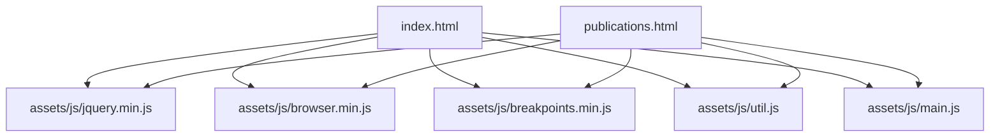
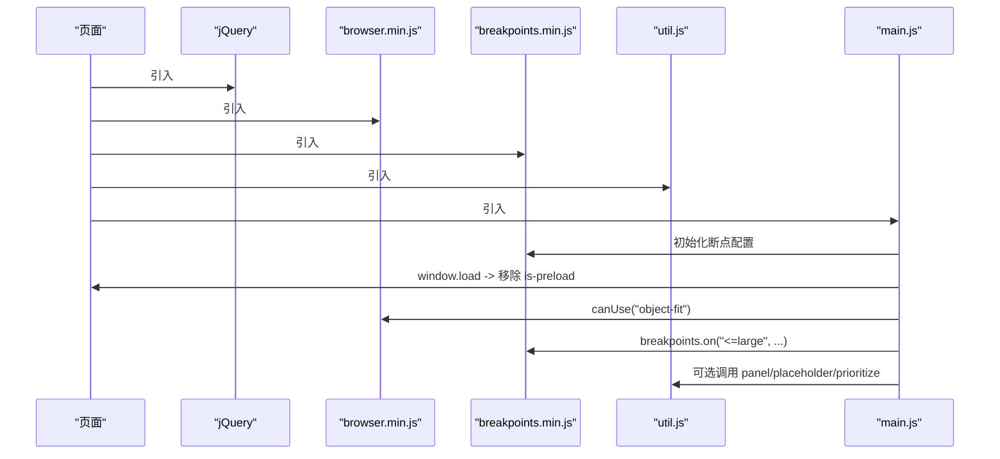
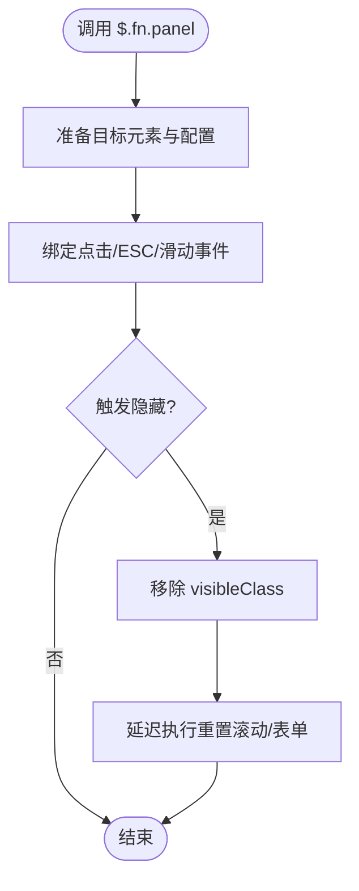
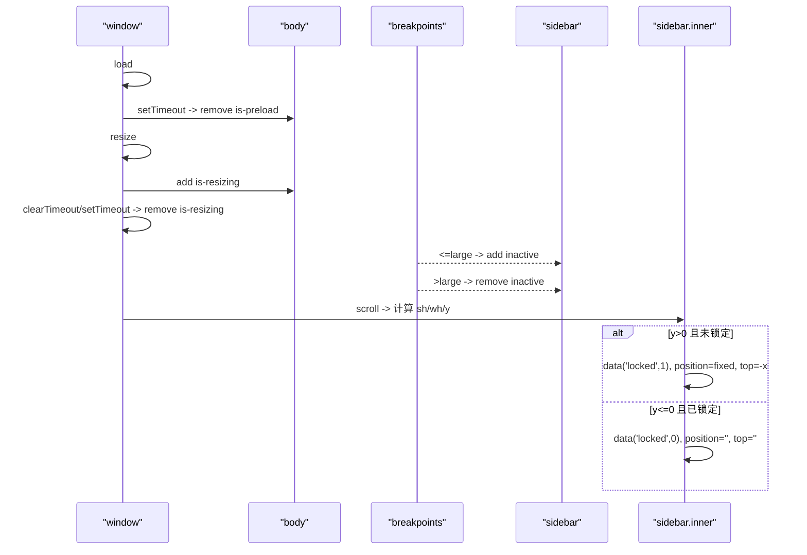
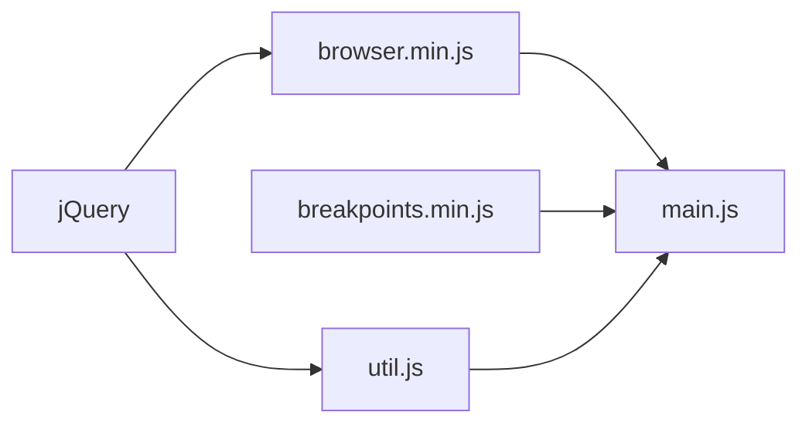

# 工具函数库

<cite>
**本文引用的文件**
- [assets/js/util.js](file://assets/js/util.js)
- [assets/js/browser.min.js](file://assets/js/browser.min.js)
- [assets/js/main.js](file://assets/js/main.js)
- [index.html](file://index.html)
- [publications.html](file://publications.html)
</cite>

## 目录
1. [简介](#简介)
2. [项目结构](#项目结构)
3. [核心组件](#核心组件)
4. [架构总览](#架构总览)
5. [详细组件分析](#详细组件分析)
6. [依赖关系分析](#依赖关系分析)
7. [性能考虑](#性能考虑)
8. [故障排查指南](#故障排查指南)
9. [结论](#结论)
10. [附录：自定义工具函数开发指南与最佳实践](#附录自定义工具函数开发指南与最佳实践)

## 简介
本仓库包含一组可复用的前端工具函数，主要围绕以下能力：
- 浏览器检测与特性探测（基于 browser.min.js）
- 响应式断点管理（通过 breakpoints.min.js，由 main.js 调用）
- jQuery 扩展工具（panel、placeholder、prioritize、navList 等）
- 页面交互与动画控制（侧边栏锁定、菜单切换、加载过渡等）

这些工具函数以模块化方式组织，遵循“低耦合、高内聚”的原则，便于在多个页面复用。

## 项目结构
- assets/js
  - util.js：jQuery 插件集合（面板、占位符、元素优先级移动、导航列表生成）
  - browser.min.js：浏览器/操作系统/触摸能力检测
  - main.js：应用级逻辑（断点初始化、侧边栏行为、滚动锁定、菜单交互）
- index.html / publications.html：页面入口，按顺序引入依赖脚本

图表来源
- [index.html:120-125](file://index.html#L120-L125)
- [publications.html:165-170](file://publications.html#L165-L170)

章节来源
- [index.html:120-125](file://index.html#L120-L125)
- [publications.html:165-170](file://publications.html#L165-L170)

## 核心组件
- 浏览器检测模块（browser.min.js）
  - 提供 name、version、os、osVersion、touch、mobile 属性
  - 提供 canUse(prop) 方法用于 CSS 特性探测
- 断点管理（breakpoints.min.js，外部依赖）
  - 在 main.js 中定义断点范围并监听断点变化
- jQuery 工具集（util.js）
  - $.fn.navList()：为导航生成带缩进的链接列表
  - $.fn.panel(userConfig)：将元素转换为可滑出/隐藏的面板，支持点击、ESC、滑动关闭等
  - $.fn.placeholder()：为不支持 placeholder 的浏览器提供兼容实现
  - $.prioritize($elements, condition)：根据条件将元素移动到父容器顶部或恢复原位
- 页面交互与动画（main.js）
  - 初始化断点、处理 is-preload 移除、窗口 resize 节流
  - 侧边栏切换、移动端事件阻止冒泡、滚动时固定定位锁定
  - 菜单展开/收起联动滚动锁定

章节来源
- [assets/js/browser.min.js:1-3](file://assets/js/browser.min.js#L1-L3)
- [assets/js/util.js:7-35](file://assets/js/util.js#L7-L35)
- [assets/js/util.js:42-297](file://assets/js/util.js#L42-L297)
- [assets/js/util.js:303-519](file://assets/js/util.js#L303-L519)
- [assets/js/util.js:526-585](file://assets/js/util.js#L526-L585)
- [assets/js/main.js:13-23](file://assets/js/main.js#L13-L23)
- [assets/js/main.js:25-49](file://assets/js/main.js#L25-L49)
- [assets/js/main.js:72-164](file://assets/js/main.js#L72-L164)
- [assets/js/main.js:166-235](file://assets/js/main.js#L166-L235)
- [assets/js/main.js:237-260](file://assets/js/main.js#L237-L260)

## 架构总览
整体执行顺序与依赖关系如下：
- 页面加载后依次引入 jQuery → browser → breakpoints → util → main
- main.js 初始化断点，并在 load 事件中移除 is-preload 类以触发页面加载动画
- main.js 使用 browser.canUse() 进行特性回退（如 object-fit）
- main.js 通过 breakpoints.on() 监听断点变化控制侧边栏状态
- util.js 提供的 panel、placeholder、prioritize 被 main.js 或其他业务代码复用

图表来源
- [index.html:120-125](file://index.html#L120-L125)
- [assets/js/main.js:13-23](file://assets/js/main.js#L13-L23)
- [assets/js/main.js:25-32](file://assets/js/main.js#L25-L32)
- [assets/js/main.js:51-70](file://assets/js/main.js#L51-L70)
- [assets/js/main.js:72-83](file://assets/js/main.js#L72-L83)

## 详细组件分析

### 浏览器检测（browser.min.js）
- 功能概述
  - 解析 navigator.userAgent，识别浏览器名称与版本、操作系统及版本
  - 判断是否支持触摸与是否为移动设备
  - 提供 canUse(prop) 动态检测 CSS 特性支持
- 关键属性与方法
  - name/version：浏览器名与版本号
  - os/osVersion：操作系统与版本
  - touch/mobile：布尔值，指示触摸能力与移动设备
  - canUse(prop)：返回布尔值，表示是否支持指定 CSS 特性
- 使用示例（概念性）
  - 若 !browser.canUse('object-fit') 或浏览器为 Safari，则采用背景图模拟 object-fit
  - 针对特定 OS+浏览器组合注入样式修复（如 Android Chrome 滚动条问题）

章节来源
- [assets/js/browser.min.js:1-3](file://assets/js/browser.min.js#L1-L3)
- [assets/js/main.js:51-70](file://assets/js/main.js#L51-L70)
- [assets/js/main.js:85-89](file://assets/js/main.js#L85-L89)

### 断点处理（breakpoints.min.js + main.js）
- 功能概述
  - 在 main.js 中定义多档断点范围，并通过 breakpoints.on() 监听断点变化
  - 根据当前断点切换 UI 状态（如侧边栏 inactive）
- 关键用法
  - 初始化断点：breakpoints({...})
  - 监听断点：breakpoints.on('<=large', fn) / breakpoints.on('>large', fn)
  - 查询当前断点：breakpoints.active('>large')
- 使用示例（概念性）
  - 当断点 <= large 时，给侧边栏添加 inactive 类；> large 时移除
  - 在移动端点击侧边栏链接后，先隐藏侧边栏再跳转

章节来源
- [assets/js/main.js:13-23](file://assets/js/main.js#L13-L23)
- [assets/js/main.js:72-83](file://assets/js/main.js#L72-L83)
- [assets/js/main.js:107-140](file://assets/js/main.js#L107-L140)
- [assets/js/main.js:142-164](file://assets/js/main.js#L142-L164)

### 面板工具（$.fn.panel）
- 功能概述
  - 将任意元素转换为可滑出/隐藏的面板，支持多种关闭方式（点击、ESC、滑动）
  - 支持重置滚动位置与表单、目标元素 class 切换
- 参数说明（userConfig）
  - delay：延迟毫秒数
  - hideOnClick：点击链接时是否隐藏
  - hideOnEscape：按 ESC 是否隐藏
  - hideOnSwipe：是否支持滑动关闭
  - resetScroll：隐藏时是否重置滚动到顶部
  - resetForms：隐藏时是否重置表单
  - side：滑动方向（left/right/top/bottom）
  - target：要切换 class 的目标元素（默认自身）
  - visibleClass：可见时的 class（默认 'visible'）
- 返回值
  - jQuery 对象，支持链式调用
- 事件与行为
  - 绑定 touchstart/touchmove 计算滑动距离与方向
  - 阻止内部事件冒泡，避免影响外层滚动
  - 支持 body 点击关闭与锚点链接切换
- 使用示例（概念性）
  - $('#myPanel').panel({ side: 'right', hideOnSwipe: true })

图表来源
- [assets/js/util.js:42-297](file://assets/js/util.js#L42-L297)

章节来源
- [assets/js/util.js:42-297](file://assets/js/util.js#L42-L297)

### 占位符兼容（$.fn.placeholder）
- 功能概述
  - 为不支持原生 placeholder 的浏览器提供兼容实现
  - 对文本框与密码框分别处理，保持焦点/失焦时的视觉与数据一致性
- 行为要点
  - 检测原生支持，若支持则直接返回
  - 为文本输入添加 polyfill-placeholder 类以显示提示文案
  - 密码输入通过克隆并替换 type 的方式实现“明文提示”字段
  - 提交与重置时清理临时字段与状态
- 使用示例（概念性）
  - $('form').placeholder()

章节来源
- [assets/js/util.js:303-519](file://assets/js/util.js#L303-L519)

### 元素优先级移动（$.prioritize）
- 功能概述
  - 根据条件将元素移动到其父容器的顶部，或在条件不满足时恢复到原始位置
- 参数说明
  - $elements：jQuery 对象或选择器字符串
  - condition：布尔值，决定是否移动到顶部
- 行为要点
  - 首次移动时记录原位置作为占位标记
  - 条件反转时依据占位标记恢复原位
- 使用示例（概念性）
  - $.prioritize('.item', isMobile)

章节来源
- [assets/js/util.js:526-585](file://assets/js/util.js#L526-L585)

### 导航列表生成（$.fn.navList）
- 功能概述
  - 遍历导航中的链接，根据层级计算缩进并生成带 depth 类的 HTML 片段
- 返回值
  - 拼接后的 HTML 字符串
- 使用示例（概念性）
  - var html = $('#menu').navList();

章节来源
- [assets/js/util.js:7-35](file://assets/js/util.js#L7-L35)

### 页面交互与动画（main.js）
- 加载与过渡
  - 在 window.load 后延迟移除 is-preload，触发页面加载动画
- 窗口尺寸变化
  - 监听 resize，短暂添加 is-resizing 类，防抖后移除
- 特性回退
  - 使用 browser.canUse('object-fit') 与浏览器名判断，回退为 background-image 方案
- 侧边栏行为
  - 断点切换时添加/移除 inactive 类
  - 移动端点击链接后隐藏侧边栏并跳转
  - 阻止侧边栏内部事件冒泡
  - 点击 body 区域关闭侧边栏
- 滚动锁定
  - 在 > large 断点下，滚动时根据高度差将侧边栏内容固定定位并偏移 top，实现“锁定”效果
  - 监听 resize 重新计算高度并触发滚动事件同步状态
- 菜单交互
  - 展开/收起菜单项，并触发滚动锁定的重算

图表来源
- [assets/js/main.js:25-49](file://assets/js/main.js#L25-L49)
- [assets/js/main.js:72-83](file://assets/js/main.js#L72-L83)
- [assets/js/main.js:166-235](file://assets/js/main.js#L166-L235)

章节来源
- [assets/js/main.js:25-49](file://assets/js/main.js#L25-L49)
- [assets/js/main.js:51-70](file://assets/js/main.js#L51-L70)
- [assets/js/main.js:72-164](file://assets/js/main.js#L72-L164)
- [assets/js/main.js:166-235](file://assets/js/main.js#L166-L235)
- [assets/js/main.js:237-260](file://assets/js/main.js#L237-L260)

## 依赖关系分析
- 脚本加载顺序
  - jQuery → browser → breakpoints → util → main
- 模块间依赖
  - main.js 依赖 browser（特性检测）、breakpoints（断点监听）、util（可选）
  - util.js 仅依赖 jQuery
  - browser.min.js 无外部依赖
- 可能的循环依赖
  - 无直接循环依赖；main.js 仅在运行时调用 util 的方法

图表来源
- [index.html:120-125](file://index.html#L120-L125)
- [publications.html:165-170](file://publications.html#L165-L170)

章节来源
- [index.html:120-125](file://index.html#L120-L125)
- [publications.html:165-170](file://publications.html#L165-L170)

## 性能考虑
- 事件节流与防抖
  - resize 事件使用 setTimeout 清除与重建定时器，避免频繁 DOM 操作
- 最小化重排重绘
  - 通过 class 切换（inactive、is-resizing、is-preload）驱动样式变化，减少直接样式写入
- 特性回退优化
  - 仅在必要时执行回退逻辑（如 object-fit），避免不必要的 DOM 操作
- 滚动锁定计算
  - 仅在 > large 断点下启用，减少小屏设备的计算开销
- 建议
  - 对大量元素的遍历（如 placeholder）应确保选择器精确，避免全表扫描
  - 面板滑动计算中注意边界条件，防止无效事件触发

[本节为通用性能建议，不直接引用具体文件]

## 故障排查指南
- 面板无法关闭
  - 检查 visibleClass 是否正确设置
  - 确认事件绑定未被其他脚本阻止冒泡
  - 验证 hideOnEscape 与 hideOnSwipe 配置
- 占位符不显示
  - 确认浏览器是否原生支持 placeholder
  - 检查密码输入框的克隆字段是否成功插入
- 侧边栏滚动锁定异常
  - 确认断点 > large 生效
  - 检查 sidebar.inner 高度计算是否正确
  - 在修改侧边栏高度后触发 resize.sidebar-lock 事件
- object-fit 回退失效
  - 检查 browser.canUse('object-fit') 与浏览器名判断逻辑
  - 确认图片元素结构与样式类正确

章节来源
- [assets/js/util.js:42-297](file://assets/js/util.js#L42-L297)
- [assets/js/util.js:303-519](file://assets/js/util.js#L303-L519)
- [assets/js/main.js:166-235](file://assets/js/main.js#L166-L235)
- [assets/js/main.js:51-70](file://assets/js/main.js#L51-L70)

## 结论
该工具函数库提供了稳定的浏览器检测、断点管理与一系列实用的 jQuery 工具方法，配合 main.js 的页面交互逻辑，实现了跨设备一致的体验。通过合理的依赖顺序与事件节流策略，保证了良好的性能与可维护性。建议在新增功能时遵循现有模式，保持低耦合与高内聚。

[本节为总结性内容，不直接引用具体文件]

## 附录：自定义工具函数开发指南与最佳实践
- 设计原则
  - 单一职责：每个工具函数聚焦一个明确的功能
  - 可配置：通过配置对象暴露常用选项，提供合理默认值
  - 可链式：jQuery 插件返回 jQuery 对象，支持链式调用
  - 可测试：避免全局状态污染，尽量纯函数或可隔离副作用
- 推荐模式
  - 插件封装：$.fn.xxx = function(config){...}
  - 工具函数：$.xxx = function(...){...}
  - 事件委托：在父容器上绑定事件，提升性能与兼容性
  - 特性检测：优先使用 canUse 或原生 API 检测，再决定降级方案
- 错误处理
  - 输入校验：对空集合、非法类型做快速返回
  - 异常捕获：对可能失败的 DOM 操作包裹 try/catch 或前置检查
  - 日志输出：在生产环境关闭调试日志，开发环境保留
- 性能优化
  - 批量 DOM 操作：合并样式写入，减少回流
  - 事件节流/防抖：resize、scroll、input 等高频事件
  - 选择器优化：限定作用域，避免全局匹配
- 调用顺序与依赖
  - 在 HTML 中按依赖顺序引入脚本
  - 在 main.js 中统一初始化与注册钩子
  - 避免循环依赖，必要时延迟初始化

[本节为通用指导，不直接引用具体文件]