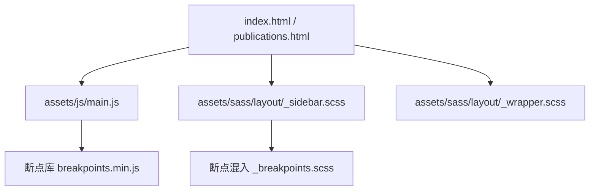
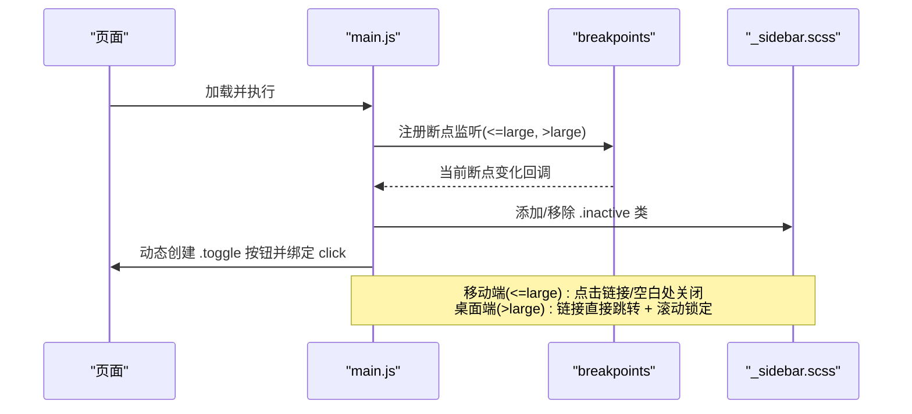
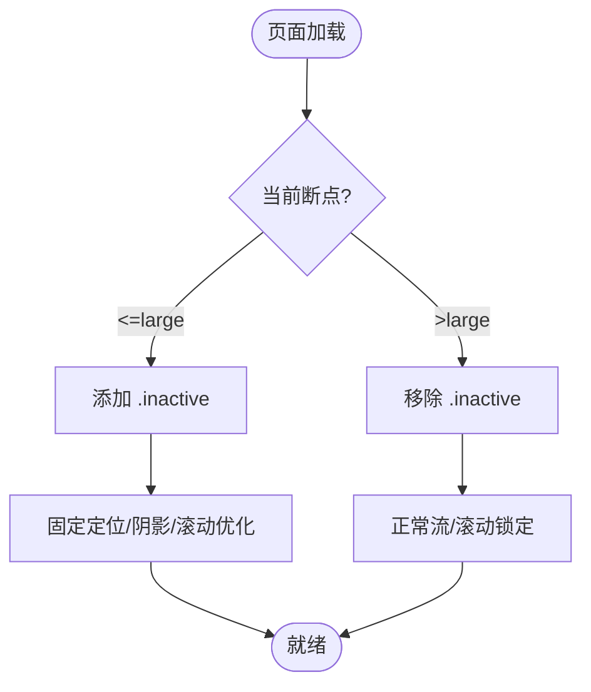
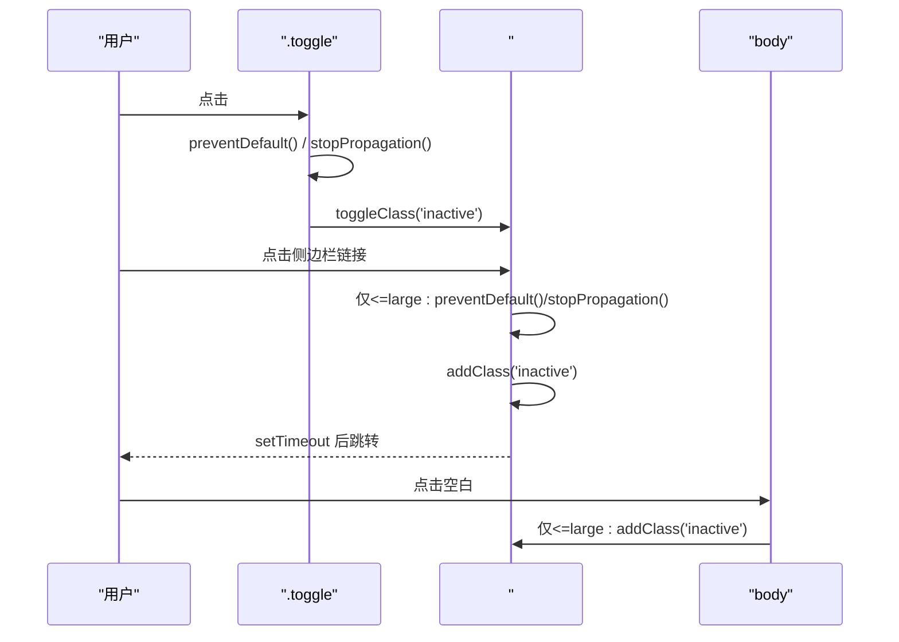
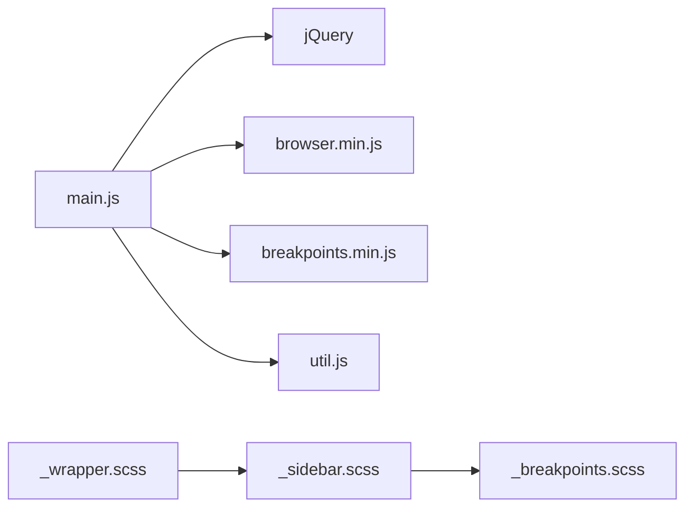

# 侧边栏控制

<cite>
**本文引用的文件**
- [assets/js/main.js](file://assets/js/main.js)
- [assets/sass/layout/_sidebar.scss](file://assets/sass/layout/_sidebar.scss)
- [assets/sass/libs/_breakpoints.scss](file://assets/sass/libs/_breakpoints.scss)
- [assets/sass/layout/_wrapper.scss](file://assets/sass/layout/_wrapper.scss)
- [index.html](file://index.html)
- [publications.html](file://publications.html)
</cite>

## 目录
1. [简介](#简介)
2. [项目结构](#项目结构)
3. [核心组件](#核心组件)
4. [架构总览](#架构总览)
5. [详细组件分析](#详细组件分析)
6. [依赖关系分析](#依赖关系分析)
7. [性能考量](#性能考量)
8. [故障排查指南](#故障排查指南)
9. [结论](#结论)
10. [附录：扩展与定制示例](#附录：扩展与定制示例)

## 简介
本文件详细说明本项目中侧边栏的显示/隐藏机制、断点系统集成、切换按钮交互、移动端与桌面端差异化策略，并提供调试技巧与常见问题解决方案。文档同时给出可操作的扩展建议，帮助你在不破坏现有行为的前提下增强或修改侧边栏功能。

## 项目结构
- 页面结构：两个页面均包含一个 wrapper（flex 反向布局）以及 #sidebar 区域，侧边栏内部包含菜单、个人资料和页脚等模块。
- 样式层：通过 SCSS 定义侧边栏在不同断点下的布局、定位与动画；在 <=large 时采用固定定位并支持阴影与滚动优化；<=xlarge 调整宽度与切换按钮尺寸。
- 脚本层：main.js 初始化断点监听、注入切换按钮、处理点击事件、阻止默认行为与事件冒泡，并在移动端点击空白处关闭侧边栏；同时实现桌面端的滚动锁定逻辑。

图表来源
- [index.html:11-131](file://index.html#L11-L131)
- [publications.html:11-163](file://publications.html#L11-L163)
- [assets/js/main.js:13-23](file://assets/js/main.js#L13-L23)
- [assets/sass/layout/_sidebar.scss:37-196](file://assets/sass/layout/_sidebar.scss#L37-L196)
- [assets/sass/layout/_wrapper.scss:9-13](file://assets/sass/layout/_wrapper.scss#L9-L13)

章节来源
- [index.html:11-131](file://index.html#L11-L131)
- [publications.html:11-163](file://publications.html#L11-L163)
- [assets/sass/layout/_wrapper.scss:9-13](file://assets/sass/layout/_wrapper.scss#L9-L13)

## 核心组件
- 断点系统：在 main.js 中通过 breakpoints() 配置多个断点，包括 large（981px–1280px）。使用 breakpoints.on('<=large') 与 breakpoints.on('>large') 分别触发侧边栏 inactive 类的添加与移除。
- 侧边栏状态类：inactive 表示“收起/隐藏”状态。CSS 中通过 margin-left 负值将侧边栏移出可视区；在 <=large 下还配合 fixed 定位与阴影提升体验。
- 切换按钮：main.js 动态创建 <a class="toggle">Toggle</a> 并插入到侧边栏内，绑定 click 事件以 toggleClass('inactive')。
- 事件处理：
  - 链接点击：在 <=large 下，点击侧边栏链接会阻止默认跳转、先收起侧边栏，再延迟跳转；>large 直接放行。
  - 面板内事件冒泡阻止：在 <=large 下，侧边栏内的 click/touchend/touchstart/touchmove 阻止冒泡，避免误触关闭。
  - 点击空白关闭：在 <=large 下，点击 body 任意位置会收起侧边栏。
- 滚动锁定（桌面端）：>large 时，侧边栏内容根据滚动位置进行固定与偏移计算，保持内容对齐视口顶部。

章节来源
- [assets/js/main.js:13-23](file://assets/js/main.js#L13-L23)
- [assets/js/main.js:72-164](file://assets/js/main.js#L72-L164)
- [assets/js/main.js:166-235](file://assets/js/main.js#L166-L235)
- [assets/sass/layout/_sidebar.scss:117-196](file://assets/sass/layout/_sidebar.scss#L117-L196)

## 架构总览
下图展示了从页面加载到侧边栏交互的完整流程，包括断点监听、切换按钮注入、事件绑定与状态切换。

图表来源
- [assets/js/main.js:13-23](file://assets/js/main.js#L13-L23)
- [assets/js/main.js:72-164](file://assets/js/main.js#L72-L164)
- [assets/sass/layout/_sidebar.scss:117-196](file://assets/sass/layout/_sidebar.scss#L117-L196)

## 详细组件分析

### 断点系统与 inactive 类管理
- 断点配置：定义了 xlarge、large、medium、small、xsmall、xxsmall 等断点范围。
- 行为差异：
  - <=large：初始为 inactive（收起），用于移动端/平板窄屏。
  - >large：移除 inactive（展开），用于桌面端宽屏。
- 样式表现：inactive 通过负 margin-left 将侧边栏移出屏幕；在 <=large 下侧边栏采用 fixed 定位、全屏高度、阴影与触摸滚动优化。

图表来源
- [assets/js/main.js:13-23](file://assets/js/main.js#L13-L23)
- [assets/js/main.js:76-83](file://assets/js/main.js#L76-L83)
- [assets/sass/layout/_sidebar.scss:117-196](file://assets/sass/layout/_sidebar.scss#L117-L196)

章节来源
- [assets/js/main.js:13-23](file://assets/js/main.js#L13-L23)
- [assets/js/main.js:76-83](file://assets/js/main.js#L76-L83)
- [assets/sass/layout/_sidebar.scss:117-196](file://assets/sass/layout/_sidebar.scss#L117-L196)

### 切换按钮实现与事件处理
- 按钮注入：在侧边栏内部动态创建 <a class="toggle">Toggle</a>，便于统一样式与定位。
- 点击处理：
  - 阻止默认行为与事件冒泡，防止锚点跳转与事件穿透。
  - 切换 inactive 类以显示/隐藏侧边栏。
- 链接点击：
  - 仅在 <=large 生效；>large 直接放行，由浏览器处理跳转。
  - 点击链接后先收起侧边栏，再延迟跳转，保证用户体验。
- 空白处关闭：
  - 在 <=large 下，点击 body 任意位置收起侧边栏。
- 事件冒泡阻止：
  - 在 <=large 下，侧边栏内的事件阻止冒泡，避免触发 body 的关闭逻辑。

图表来源
- [assets/js/main.js:91-164](file://assets/js/main.js#L91-L164)

章节来源
- [assets/js/main.js:91-164](file://assets/js/main.js#L91-L164)

### 移动端与桌面端差异化策略
- 移动端（<=large）：
  - 侧边栏固定定位、全屏高度、阴影遮罩、触摸滚动优化。
  - 初始状态为 inactive（收起），通过切换按钮或点击空白处打开/关闭。
  - 侧边栏内链接点击会先收起再跳转，避免遮挡。
- 桌面端（>large）：
  - 侧边栏正常流布局，始终可见。
  - 链接点击直接跳转，不改变侧边栏状态。
  - 启用滚动锁定：当侧边栏内容高于视口时，滚动过程中侧边栏内容相对固定，保持与主内容对齐。

章节来源
- [assets/sass/layout/_sidebar.scss:121-196](file://assets/sass/layout/_sidebar.scss#L121-L196)
- [assets/js/main.js:107-164](file://assets/js/main.js#L107-L164)
- [assets/js/main.js:166-235](file://assets/js/main.js#L166-L235)

### 滚动锁定（桌面端）
- 触发条件：仅在 >large 时生效。
- 工作原理：
  - 计算侧边栏内容与视口的高度差，确定最大偏移量。
  - 滚动时根据滚动位置设置 position: fixed 与 top 偏移，使侧边栏内容始终与主内容顶部对齐。
  - 当滚动回到顶部时解除固定，恢复自然滚动。
- 注意事项：若侧边栏内容高度发生变化，需触发 resize.sidebar-lock 事件以保持同步。

章节来源
- [assets/js/main.js:166-235](file://assets/js/main.js#L166-L235)

## 依赖关系分析
- main.js 依赖：
  - jQuery：用于 DOM 操作与事件绑定。
  - browser.min.js：检测浏览器特性（如 Android Chrome 滚动条兼容）。
  - breakpoints.min.js：提供断点监听能力。
  - util.js：提供通用工具方法（本侧边栏未直接使用 panel/placeholder 等）。
- 样式依赖：
  - _sidebar.scss：定义侧边栏在不同断点下的样式与动画。
  - _wrapper.scss：使用 flex 反向布局，确保侧边栏在视觉上位于右侧。

图表来源
- [assets/js/main.js:1-12](file://assets/js/main.js#L1-L12)
- [assets/sass/layout/_sidebar.scss:121-196](file://assets/sass/layout/_sidebar.scss#L121-L196)
- [assets/sass/layout/_wrapper.scss:9-13](file://assets/sass/layout/_wrapper.scss#L9-L13)

章节来源
- [assets/js/main.js:1-12](file://assets/js/main.js#L1-L12)
- [assets/sass/layout/_sidebar.scss:121-196](file://assets/sass/layout/_sidebar.scss#L121-L196)
- [assets/sass/layout/_wrapper.scss:9-13](file://assets/sass/layout/_wrapper.scss#L9-L13)

## 性能考量
- 断点监听开销低：仅在断点变化时执行少量 DOM 操作（addClass/removeClass）。
- 事件委托与冒泡控制：在 <=large 下阻止不必要的冒泡，减少重复处理。
- 滚动锁定节流：通过窗口 scroll 事件计算偏移，建议在复杂场景下考虑节流/防抖优化。
- 移动端滚动优化：启用 -webkit-overflow-scrolling: touch，提升滚动流畅度。

[本节为通用指导，无需特定文件引用]

## 故障排查指南
- 问题：侧边栏在移动端无法收起或无法打开
  - 检查是否成功注入 .toggle 按钮并绑定 click 事件。
  - 确认 breakpoints.on('<=large') 是否正确添加 inactive 类。
  - 查看控制台是否有 JS 错误导致脚本中断。
- 问题：点击侧边栏链接直接跳转，未收起
  - 确认当前断点是否为 >large；>large 下设计为直接跳转。
  - 如需强制收起，可在链接点击事件中显式添加 inactive 类。
- 问题：点击空白处未关闭侧边栏
  - 检查是否在 <=large 下绑定了 body 的 click/touchend 事件。
  - 确认侧边栏内事件是否阻止了冒泡，避免误触发。
- 问题：滚动锁定错位
  - 若侧边栏内容高度变化，触发 window 的 'resize.sidebar-lock' 事件以重新计算。
  - 检查 $sidebar_inner.outerHeight() 计算是否包含额外边距或边框。

章节来源
- [assets/js/main.js:91-164](file://assets/js/main.js#L91-L164)
- [assets/js/main.js:166-235](file://assets/js/main.js#L166-L235)

## 结论
本项目通过断点系统与 inactive 类协同实现了响应式侧边栏控制：在移动端（<=large）默认收起并通过切换按钮或点击空白处控制显示；在桌面端（>large）默认展开并启用滚动锁定以提升阅读体验。事件处理严谨，兼顾默认行为阻止与冒泡控制，确保交互一致性与可用性。基于此架构，可轻松扩展更多交互或样式定制。

[本节为总结性内容，无需特定文件引用]

## 附录：扩展与定制示例
以下示例展示如何在不破坏现有行为的前提下扩展或修改侧边栏功能。请根据实际项目结构调整选择。

- 自定义切换按钮文案或图标
  - 目标：修改 .toggle 的文本或图标。
  - 步骤：
    - 在 main.js 中查找创建 .toggle 的代码位置，替换文本或伪元素内容。
    - 或在 _sidebar.scss 中覆盖 :before 的内容与字体大小。
  - 参考路径：
    - [assets/js/main.js:91-103](file://assets/js/main.js#L91-L103)
    - [assets/sass/layout/_sidebar.scss:85-115](file://assets/sass/layout/_sidebar.scss#L85-L115)

- 在移动端点击链接后不自动收起
  - 目标：保留链接点击后的侧边栏展开状态。
  - 步骤：
    - 在侧边栏链接点击事件中移除 addClass('inactive') 调用。
  - 参考路径：
    - [assets/js/main.js:107-140](file://assets/js/main.js#L107-L140)

- 禁用点击空白处关闭侧边栏
  - 目标：仅在切换按钮控制显示/隐藏。
  - 步骤：
    - 注释掉 body 的 click/touchend 事件处理。
  - 参考路径：
    - [assets/js/main.js:154-164](file://assets/js/main.js#L154-L164)

- 调整断点阈值
  - 目标：更改 large 断点范围。
  - 步骤：
    - 在 main.js 的 breakpoints() 配置中调整 large 的上下限。
  - 参考路径：
    - [assets/js/main.js:13-23](file://assets/js/main.js#L13-L23)

- 增加侧边栏过渡动画时长
  - 目标：延长或缩短切换动画时间。
  - 步骤：
    - 在 _sidebar.scss 中修改 transition 的时长。
  - 参考路径：
    - [assets/sass/layout/_sidebar.scss:42-45](file://assets/sass/layout/_sidebar.scss#L42-L45)

- 在桌面端也允许收起侧边栏
  - 目标：>large 时可通过按钮收起。
  - 步骤：
    - 移除 >large 分支中的 removeClass('inactive') 限制，或改为条件判断。
  - 参考路径：
    - [assets/js/main.js:76-83](file://assets/js/main.js#L76-L83)

[本节为概念性扩展指导，具体代码修改请参考对应文件路径]