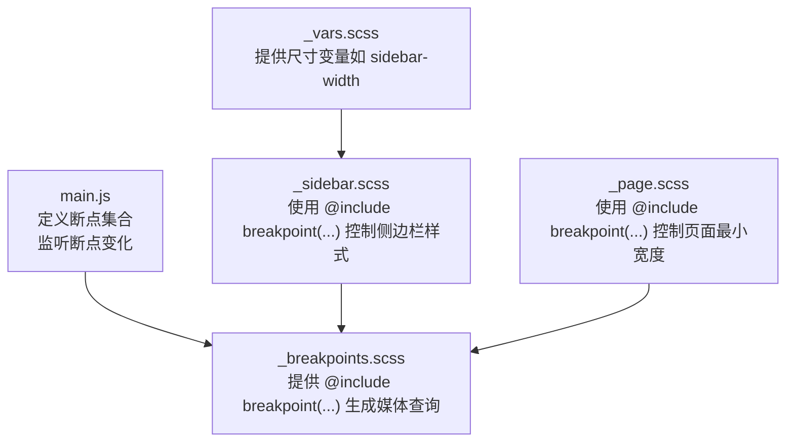
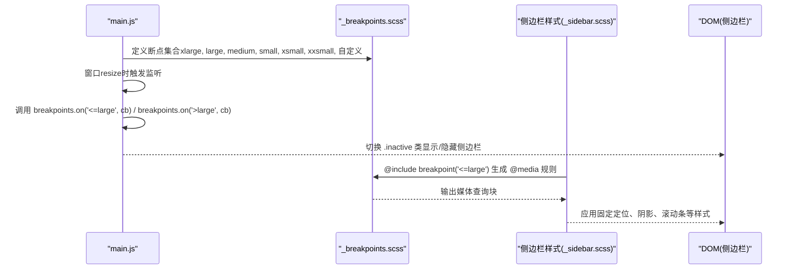
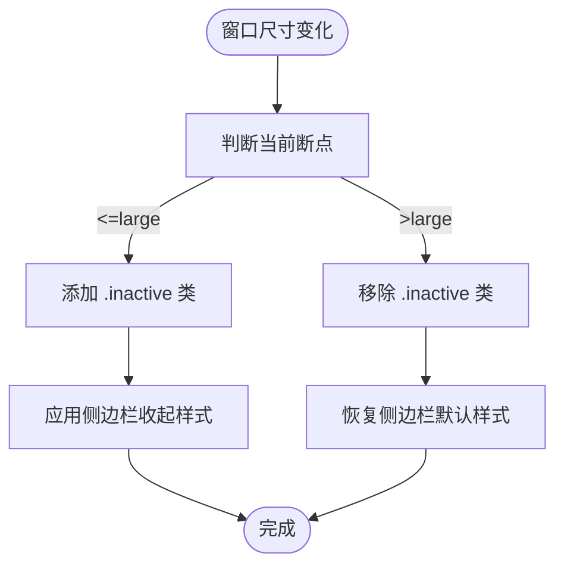
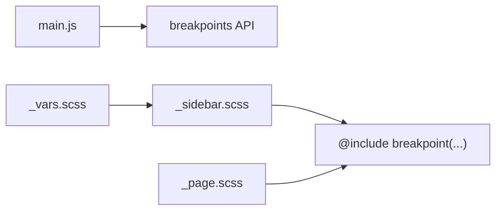

# 断点系统

<cite>
**本文引用的文件**
- [assets/js/main.js](file://assets/js/main.js)
- [assets/sass/libs/_breakpoints.scss](file://assets/sass/libs/_breakpoints.scss)
- [assets/sass/layout/_sidebar.scss](file://assets/sass/layout/_sidebar.scss)
- [assets/sass/base/_page.scss](file://assets/sass/base/_page.scss)
- [assets/sass/libs/_vars.scss](file://assets/sass/libs/_vars.scss)
</cite>

## 目录
1. [简介](#简介)
2. [项目结构](#项目结构)
3. [核心组件](#核心组件)
4. [架构总览](#架构总览)
5. [详细组件分析](#详细组件分析)
6. [依赖关系分析](#依赖关系分析)
7. [性能考虑](#性能考虑)
8. [故障排查指南](#故障排查指南)
9. [结论](#结论)
10. [附录：示例与最佳实践](#附录示例与最佳实践)

## 简介
本文件系统性说明本项目中的“断点系统”，涵盖以下方面：
- 断点配置的定义方式与各断点的像素范围
- 断点监听机制与 breakpoints.on() 的用法、回调执行时机
- 断点状态检测与 breakpoints.active() 的使用场景
- 断点变化时的响应逻辑（以侧边栏 inactive 切换为例）
- 自定义断点的创建与管理方法
- 添加新断点或扩展现有断点逻辑的具体步骤（含代码片段路径）
- 断点调试技巧与最佳实践

## 项目结构
本项目将断点能力分为两层：
- 样式层（Sass）：通过 mixins 将断点映射为 @media 查询，用于在不同视口宽度下应用不同样式。
- 脚本层（JS）：在运行时根据当前视口宽度判断断点状态，驱动交互行为（如侧边栏显隐、滚动锁定等）。

图表来源
- [assets/js/main.js:14-23](file://assets/js/main.js#L14-L23)
- [assets/sass/libs/_breakpoints.scss:13-223](file://assets/sass/libs/_breakpoints.scss#L13-L223)
- [assets/sass/layout/_sidebar.scss:121-196](file://assets/sass/layout/_sidebar.scss#L121-L196)
- [assets/sass/base/_page.scss:20-24](file://assets/sass/base/_page.scss#L20-L24)
- [assets/sass/libs/_vars.scss:13-20](file://assets/sass/libs/_vars.scss#L13-L20)

章节来源
- [assets/js/main.js:14-23](file://assets/js/main.js#L14-L23)
- [assets/sass/libs/_breakpoints.scss:13-223](file://assets/sass/libs/_breakpoints.scss#L13-L223)
- [assets/sass/layout/_sidebar.scss:121-196](file://assets/sass/layout/_sidebar.scss#L121-L196)
- [assets/sass/base/_page.scss:20-24](file://assets/sass/base/_page.scss#L20-L24)
- [assets/sass/libs/_vars.scss:13-20](file://assets/sass/libs/_vars.scss#L13-L20)

## 核心组件
- 断点定义与监听（JS）：在 main.js 中集中声明断点集合，并通过 breakpoints.on() 注册监听器；通过 breakpoints.active() 进行条件判断。
- 媒体查询生成（Sass）：_breakpoints.scss 提供 @include breakpoint(...)，将断点名称或表达式编译为 @media 规则。
- 布局与交互（Sass/JS）：_sidebar.scss 基于断点切换侧边栏样式；main.js 在断点变化时切换 .inactive 类并处理滚动锁定等行为。

章节来源
- [assets/js/main.js:14-23](file://assets/js/main.js#L14-L23)
- [assets/js/main.js:77-83](file://assets/js/main.js#L77-L83)
- [assets/js/main.js:111-112](file://assets/js/main.js#L111-L112)
- [assets/sass/libs/_breakpoints.scss:13-223](file://assets/sass/libs/_breakpoints.scss#L13-L223)
- [assets/sass/layout/_sidebar.scss:117-196](file://assets/sass/layout/_sidebar.scss#L117-L196)

## 架构总览
下图展示了断点在样式与脚本之间的协作方式：JS 负责运行期断点判定与事件监听，Sass 负责编译期媒体查询生成，二者共同实现响应式行为。

图表来源
- [assets/js/main.js:14-23](file://assets/js/main.js#L14-L23)
- [assets/js/main.js:77-83](file://assets/js/main.js#L77-L83)
- [assets/sass/libs/_breakpoints.scss:27-223](file://assets/sass/libs/_breakpoints.scss#L27-L223)
- [assets/sass/layout/_sidebar.scss:154-196](file://assets/sass/layout/_sidebar.scss#L154-L196)

## 详细组件分析

### 断点配置与像素范围
- 断点集合在 main.js 中定义，包含内置断点与自定义媒体查询：
  - 内置断点：xlarge、large、medium、small、xsmall、xxsmall（部分为区间，部分为单边界）
  - 自定义断点：'xlarge-to-max'、'small-to-xlarge'（直接传入媒体查询字符串）
- 这些断点既可用于 JS 的运行期判断，也可作为 Sass 的命名断点被 @include breakpoint(...) 引用。

章节来源
- [assets/js/main.js:14-23](file://assets/js/main.js#L14-L23)

### 断点监听机制与 breakpoints.on()
- 作用：在断点进入或离开指定范围时执行回调。
- 用法要点：
  - 支持比较操作符：'>='、'<='、'>'、'<'、'!'、'eq'（等于）
  - 可引用已定义的断点名或直接传入媒体查询字符串
  - 典型用法：在 <=large 时给侧边栏添加 .inactive，在 >large 时移除
- 执行时机：当浏览器视口宽度跨越断点阈值时触发，通常由 resize 事件驱动。

章节来源
- [assets/js/main.js:77-83](file://assets/js/main.js#L77-L83)
- [assets/sass/libs/_breakpoints.scss:27-81](file://assets/sass/libs/_breakpoints.scss#L27-L81)

### 断点状态检测与 breakpoints.active()
- 作用：返回布尔值，表示当前是否满足某个断点条件。
- 使用场景：
  - 在事件处理器中短路逻辑（例如在大屏时不处理移动端侧边栏点击）
  - 在滚动锁定逻辑中，仅在特定断点范围内启用固定定位
- 示例位置：
  - 侧边栏链接点击前检查是否大于 large
  - 阻止事件冒泡时检查是否大于 large
  - 滚动锁定时检查是否小于等于 large

章节来源
- [assets/js/main.js:111-112](file://assets/js/main.js#L111-L112)
- [assets/js/main.js:146-147](file://assets/js/main.js#L146-L147)
- [assets/js/main.js:158-159](file://assets/js/main.js#L158-L159)
- [assets/js/main.js:184-193](file://assets/js/main.js#L184-L193)

### 断点变化时的响应逻辑（侧边栏 inactive 切换）
- 行为描述：
  - 当断点进入 <=large：为侧边栏添加 .inactive 类，使其收起（隐藏）
  - 当断点进入 >large：移除 .inactive 类，恢复默认显示
- 样式配合：
  - _sidebar.scss 中定义了 .inactive 的负外边距偏移，使侧边栏滑出视口
  - 在 <=large 时，侧边栏采用固定定位、全屏高度、阴影等样式，适配移动端交互

图表来源
- [assets/js/main.js:77-83](file://assets/js/main.js#L77-L83)
- [assets/sass/layout/_sidebar.scss:117-196](file://assets/sass/layout/_sidebar.scss#L117-L196)

章节来源
- [assets/js/main.js:77-83](file://assets/js/main.js#L77-L83)
- [assets/sass/layout/_sidebar.scss:117-196](file://assets/sass/layout/_sidebar.scss#L117-L196)

### 自定义断点的创建与管理
- 在 main.js 中新增自定义断点：
  - 若为区间：使用数组形式 [min, max]
  - 若为复杂条件：直接使用媒体查询字符串
- 在 Sass 中使用：
  - 通过 @include breakpoint('你的断点名') 包裹样式块，编译为对应 @media
- 注意事项：
  - 确保断点名称唯一且语义清晰
  - 避免断点重叠导致样式冲突
  - 保持与 JS 断点集合一致，便于前后端联动

章节来源
- [assets/js/main.js:14-23](file://assets/js/main.js#L14-L23)
- [assets/sass/libs/_breakpoints.scss:27-223](file://assets/sass/libs/_breakpoints.scss#L27-L223)

### 具体示例与扩展建议（含代码片段路径）
- 添加新的断点并在侧边栏中应用：
  - 在 main.js 中新增断点键值对（参考现有断点定义位置）
  - 在 _sidebar.scss 中使用 @include breakpoint('新断点名') 包裹样式
  - 如需在 JS 中监听该断点变化，使用 breakpoints.on('新断点名', cb)
- 扩展现有断点逻辑：
  - 在 main.js 中为现有断点追加监听器，实现更多交互（如菜单展开/收起）
  - 在 _sidebar.scss 中细化不同断点下的间距、字号、定位策略

代码片段路径（仅路径，不含内容）
- 断点定义位置：[assets/js/main.js:14-23](file://assets/js/main.js#L14-L23)
- 断点监听示例：[assets/js/main.js:77-83](file://assets/js/main.js#L77-L83)
- 断点状态检测示例：[assets/js/main.js:111-112](file://assets/js/main.js#L111-L112)
- 侧边栏样式断点：[assets/sass/layout/_sidebar.scss:121-196](file://assets/sass/layout/_sidebar.scss#L121-L196)
- 页面最小宽度断点：[assets/sass/base/_page.scss:20-24](file://assets/sass/base/_page.scss#L20-L24)

章节来源
- [assets/js/main.js:14-23](file://assets/js/main.js#L14-L23)
- [assets/js/main.js:77-83](file://assets/js/main.js#L77-L83)
- [assets/js/main.js:111-112](file://assets/js/main.js#L111-L112)
- [assets/sass/layout/_sidebar.scss:121-196](file://assets/sass/layout/_sidebar.scss#L121-L196)
- [assets/sass/base/_page.scss:20-24](file://assets/sass/base/_page.scss#L20-L24)

## 依赖关系分析
- main.js 依赖断点库提供的 breakpoints API（on、active），并据此驱动 DOM 行为。
- _sidebar.scss 依赖 _breakpoints.scss 的 @include breakpoint(...) 生成媒体查询。
- _page.scss 同样依赖 _breakpoints.scss 来设置最小宽度等基础样式。
- _vars.scss 提供尺寸变量（如 sidebar-width），被 _sidebar.scss 使用，影响断点相关布局。

图表来源
- [assets/js/main.js:14-23](file://assets/js/main.js#L14-L23)
- [assets/sass/libs/_breakpoints.scss:27-223](file://assets/sass/libs/_breakpoints.scss#L27-L223)
- [assets/sass/layout/_sidebar.scss:121-196](file://assets/sass/layout/_sidebar.scss#L121-L196)
- [assets/sass/base/_page.scss:20-24](file://assets/sass/base/_page.scss#L20-L24)
- [assets/sass/libs/_vars.scss:13-20](file://assets/sass/libs/_vars.scss#L13-L20)

章节来源
- [assets/js/main.js:14-23](file://assets/js/main.js#L14-L23)
- [assets/sass/libs/_breakpoints.scss:27-223](file://assets/sass/libs/_breakpoints.scss#L27-L223)
- [assets/sass/layout/_sidebar.scss:121-196](file://assets/sass/layout/_sidebar.scss#L121-L196)
- [assets/sass/base/_page.scss:20-24](file://assets/sass/base/_page.scss#L20-L24)
- [assets/sass/libs/_vars.scss:13-20](file://assets/sass/libs/_vars.scss#L13-L20)

## 性能考虑
- 减少频繁重排：在 resize 事件中通过节流/防抖降低计算频率（项目中已有 is-resizing 标记，可在需要时复用思路）。
- 避免过度监听：仅在必要时注册 breakpoints.on 监听器，避免重复绑定。
- 样式合并：尽量将同一断点的样式集中在一个 @include breakpoint(...) 块内，减少重复渲染。
- 使用变量：通过 _vars.scss 统一管理尺寸，便于维护和优化。

## 故障排查指南
- 现象：侧边栏在小屏未收起
  - 检查是否在 <=large 时正确添加了 .inactive 类
  - 确认 _sidebar.scss 中 .inactive 的样式生效
  - 验证 breakpoints.on('<=large', ...) 是否被调用
- 现象：大屏侧边栏异常
  - 检查 breakpoints.active('>large') 的判断逻辑
  - 确认 >large 时移除了 .inactive 类
- 现象：自定义断点无效
  - 核对 main.js 中自定义断点的键名与媒体查询是否正确
  - 在 Sass 中使用相同的键名进行 @include breakpoint(...)
- 现象：滚动锁定异常
  - 检查 breakpoints.active('<=large') 分支是否提前 return
  - 确认滚动事件与 resize.sidebar-lock 触发时机

章节来源
- [assets/js/main.js:77-83](file://assets/js/main.js#L77-L83)
- [assets/js/main.js:111-112](file://assets/js/main.js#L111-L112)
- [assets/js/main.js:184-193](file://assets/js/main.js#L184-L193)
- [assets/sass/layout/_sidebar.scss:117-196](file://assets/sass/layout/_sidebar.scss#L117-L196)

## 结论
本项目通过 JS 与 Sass 的双层断点体系实现了灵活的响应式交互与样式控制。JS 负责运行期断点监听与状态检测，Sass 负责编译期媒体查询生成。遵循统一的断点命名与变量管理，可以高效地扩展与维护断点逻辑。

## 附录：示例与最佳实践
- 添加新断点
  - 在 main.js 中新增断点键值对（区间或媒体查询字符串）
  - 在 _sidebar.scss 或其他样式文件中用 @include breakpoint('新断点名') 包裹样式
  - 在 main.js 中通过 breakpoints.on('新断点名', cb) 监听变化
- 扩展现有断点逻辑
  - 在 main.js 中为现有断点追加监听器，实现更多交互（如菜单、弹窗）
  - 在样式中细化不同断点下的布局、间距、字体大小等
- 调试技巧
  - 使用浏览器开发者工具观察视口宽度变化与类名切换
  - 在控制台打印 breakpoints.active(...) 的结果，验证条件是否符合预期
  - 逐步注释断点监听器，定位问题来源
- 最佳实践
  - 统一断点命名，避免歧义
  - 将常用尺寸放入 _vars.scss，提升一致性
  - 在 resize 事件中尽量减少计算量，避免卡顿
  - 保持 JS 与 Sass 断点集合一致，避免不一致导致的样式与行为错位