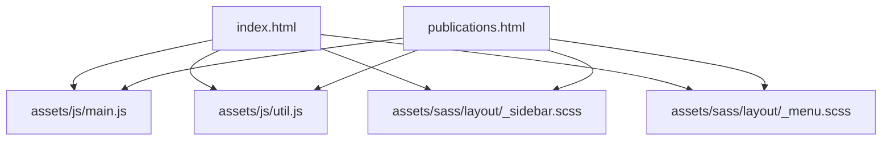
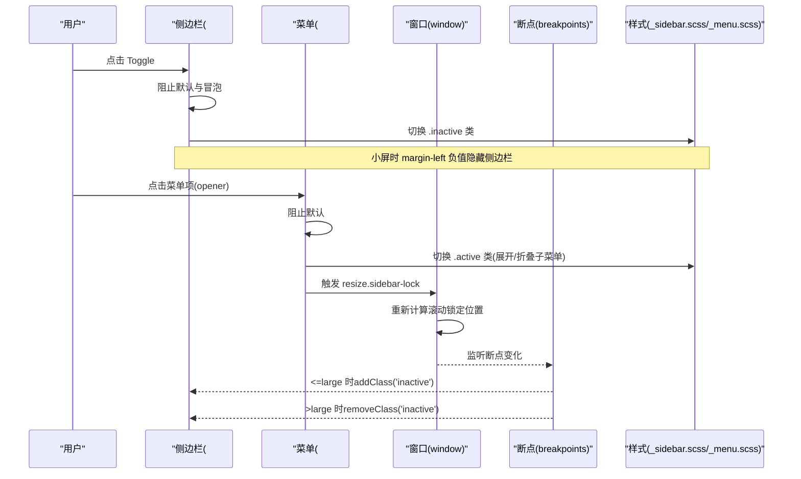
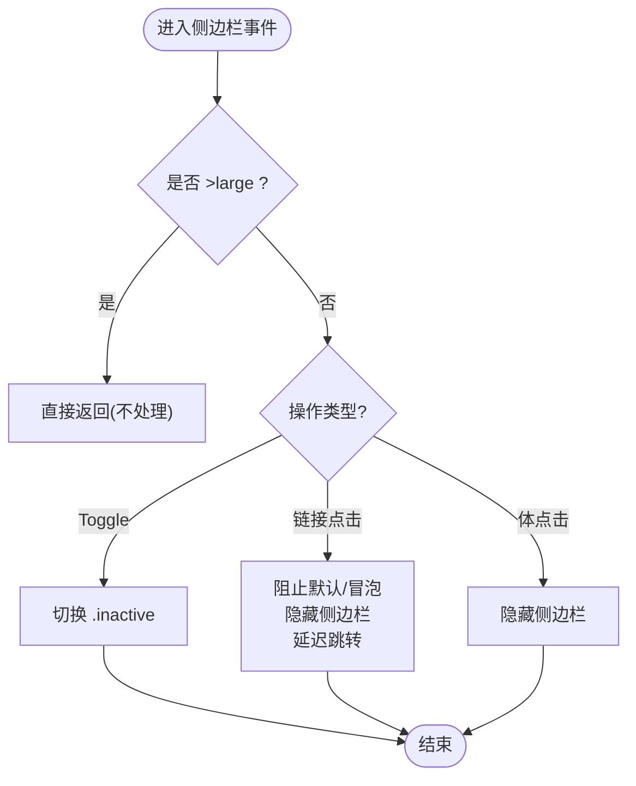
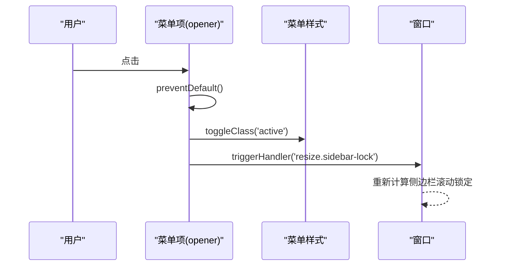
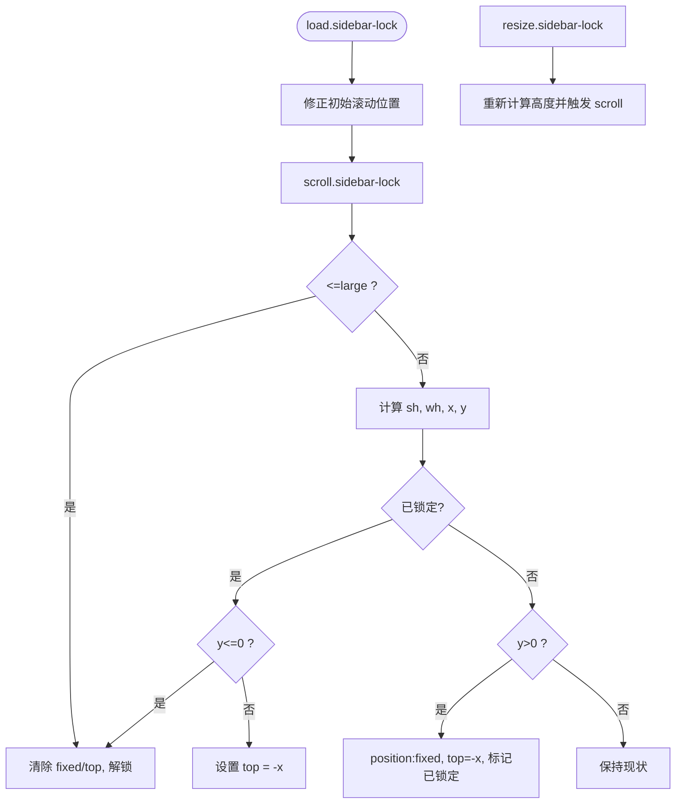
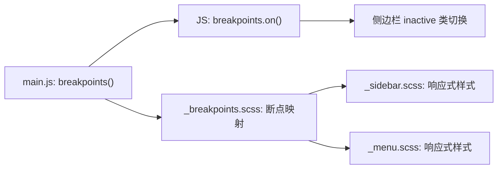
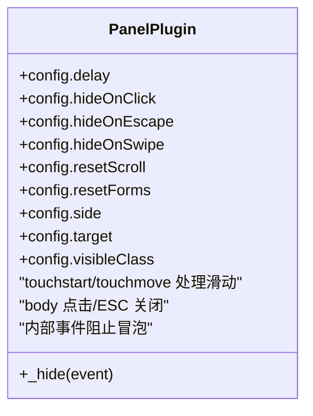
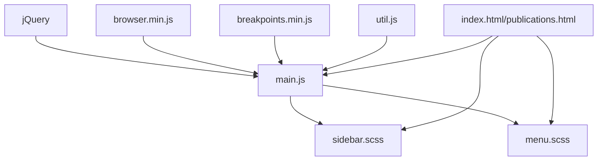

# 核心交互逻辑

<cite>
**本文引用的文件**
- [assets/js/main.js](file://assets/js/main.js)
- [assets/js/util.js](file://assets/js/util.js)
- [index.html](file://index.html)
- [publications.html](file://publications.html)
- [assets/sass/layout/_sidebar.scss](file://assets/sass/layout/_sidebar.scss)
- [assets/sass/layout/_menu.scss](file://assets/sass/layout/_menu.scss)
- [assets/sass/libs/_breakpoints.scss](file://assets/sass/libs/_breakpoints.scss)
</cite>

## 目录
1. [简介](#简介)
2. [项目结构](#项目结构)
3. [核心组件](#核心组件)
4. [架构总览](#架构总览)
5. [详细组件分析](#详细组件分析)
6. [依赖关系分析](#依赖关系分析)
7. [性能考虑](#性能考虑)
8. [故障排查指南](#故障排查指南)
9. [结论](#结论)
10. [附录](#附录)

## 简介
本文聚焦于站点中侧边栏控制、菜单切换、滚动锁定等核心用户交互的实现，系统梳理 jQuery 事件处理机制（点击、触摸）、断点系统与响应式行为控制、事件冒泡与默认行为取消策略，并提供调试技巧与常见问题解决方案。内容基于仓库中的 JavaScript、SCSS 与 HTML 源码进行逐层解析。

## 项目结构
该站点采用“页面 + 样式 + 脚本”的清晰分层：
- HTML 页面提供 DOM 骨架与入口脚本加载顺序
- SCSS 通过 mixins 与变量组织响应式布局与交互状态样式
- JS 负责初始化断点、绑定事件、处理交互逻辑与滚动锁定

图表来源
- [index.html:120-125](file://index.html#L120-L125)
- [publications.html:165-170](file://publications.html#L165-L170)
- [assets/sass/layout/_sidebar.scss:37-223](file://assets/sass/layout/_sidebar.scss#L37-L223)
- [assets/sass/layout/_menu.scss:9-98](file://assets/sass/layout/_menu.scss#L9-L98)

章节来源
- [index.html:1-147](file://index.html#L1-L147)
- [publications.html:1-184](file://publications.html#L1-L184)

## 核心组件
- 断点系统：在 main.js 中通过 breakpoints 配置多档断点，并在 JS 与 SCSS 中统一使用，驱动响应式行为。
- 侧边栏控制：通过类名 inactive 切换显示/隐藏；在大屏下默认展开，在小屏下默认收起并支持点击遮罩关闭。
- 菜单切换：为菜单项添加 active 类以展开/折叠子菜单，同时触发滚动锁重新计算。
- 滚动锁定：在小屏模式下禁用侧边栏内部滚动对主内容的干扰，实现固定定位与顶部偏移的动态计算。
- 通用面板工具：util.js 提供 panel() 插件，封装了点击、触摸、滑动、ESC 关闭等通用交互能力，便于扩展。

章节来源
- [assets/js/main.js:13-23](file://assets/js/main.js#L13-L23)
- [assets/js/main.js:72-164](file://assets/js/main.js#L72-L164)
- [assets/js/main.js:166-235](file://assets/js/main.js#L166-L235)
- [assets/js/main.js:237-260](file://assets/js/main.js#L237-L260)
- [assets/js/util.js:42-297](file://assets/js/util.js#L42-L297)

## 架构总览
整体交互由 main.js 作为协调中心，结合 util.js 提供的通用能力，配合 SCSS 的状态样式完成 UI 变化。断点系统贯穿 JS 与 CSS，确保在不同屏幕尺寸下的行为一致。

图表来源
- [assets/js/main.js:91-164](file://assets/js/main.js#L91-L164)
- [assets/js/main.js:237-260](file://assets/js/main.js#L237-L260)
- [assets/sass/layout/_sidebar.scss:117-196](file://assets/sass/layout/_sidebar.scss#L117-L196)
- [assets/sass/layout/_menu.scss:33-65](file://assets/sass/layout/_menu.scss#L33-L65)

## 详细组件分析

### 侧边栏控制（Toggle、链接点击、体点击关闭）
- 初始状态：根据断点设置 inactive 类，<=large 时默认隐藏，>large 时默认显示。
- Toggle 按钮：动态插入到侧边栏内，点击时阻止默认与冒泡，切换 inactive 类。
- 侧边栏内链接点击：在非大屏时阻止默认与冒泡，先隐藏侧边栏，再延迟跳转或在新标签页打开。
- 体点击关闭：在 body 上监听 click/touchend，非大屏时点击空白区域关闭侧边栏。
- 事件冒泡阻止：在侧边栏容器上统一拦截 click/touchend/touchstart/touchmove，防止事件冒泡影响外部逻辑。

图表来源
- [assets/js/main.js:72-164](file://assets/js/main.js#L72-L164)
- [assets/sass/layout/_sidebar.scss:117-196](file://assets/sass/layout/_sidebar.scss#L117-L196)

章节来源
- [assets/js/main.js:72-164](file://assets/js/main.js#L72-L164)
- [assets/sass/layout/_sidebar.scss:37-223](file://assets/sass/layout/_sidebar.scss#L37-L223)

### 菜单切换（多级菜单展开/折叠）
- 选择器：选取 #menu 下的 opener 元素。
- 交互：点击 opener 时阻止默认行为，切换当前项的 active 类，同时移除其他项的 active 类（互斥）。
- 联动：切换后触发 resize.sidebar-lock，使滚动锁定重新计算高度与偏移。

图表来源
- [assets/js/main.js:237-260](file://assets/js/main.js#L237-L260)
- [assets/sass/layout/_menu.scss:33-65](file://assets/sass/layout/_menu.scss#L33-L65)

章节来源
- [assets/js/main.js:237-260](file://assets/js/main.js#L237-L260)
- [assets/sass/layout/_menu.scss:9-98](file://assets/sass/layout/_menu.scss#L9-L98)

### 滚动锁定（Sidebar Lock）
- 触发时机：window load.sidebar-lock 后初始化，并在 window.resize.sidebar-lock 时重新计算。
- 逻辑要点：
  - 小屏模式（<=large）：重置 position 与 top，解除锁定。
  - 大屏模式：计算可滚动范围与当前滚动位置，决定固定定位与 top 偏移，避免侧边栏内容被遮挡。
  - 数据标记：使用 data('locked') 记录锁定状态，减少重复计算。
- 注意事项：若侧边栏内容高度发生变化，需手动触发 resize.sidebar-lock 以保持同步。

图表来源
- [assets/js/main.js:166-235](file://assets/js/main.js#L166-L235)

章节来源
- [assets/js/main.js:166-235](file://assets/js/main.js#L166-L235)

### 断点系统与响应式行为
- 断点定义：在 main.js 中通过 breakpoints() 配置多个断点区间，包括 xlarge、large、medium、small、xsmall、xxsmall 以及自定义媒体查询。
- JS 响应：通过 breakpoints.on() 监听断点变化，动态为侧边栏添加/移除 inactive 类，控制显示/隐藏。
- CSS 响应：_sidebar.scss 与 _menu.scss 中使用 @include breakpoint(...) 针对不同断点调整布局与交互样式。
- 工具库：_breakpoints.scss 提供 mixin 与断点解析逻辑，将别名映射为媒体查询。

图表来源
- [assets/js/main.js:13-23](file://assets/js/main.js#L13-L23)
- [assets/sass/libs/_breakpoints.scss:1-223](file://assets/sass/libs/_breakpoints.scss#L1-L223)
- [assets/sass/layout/_sidebar.scss:121-196](file://assets/sass/layout/_sidebar.scss#L121-L196)
- [assets/sass/layout/_menu.scss:9-98](file://assets/sass/layout/_menu.scss#L9-L98)

章节来源
- [assets/js/main.js:13-23](file://assets/js/main.js#L13-L23)
- [assets/sass/libs/_breakpoints.scss:1-223](file://assets/sass/libs/_breakpoints.scss#L1-L223)
- [assets/sass/layout/_sidebar.scss:121-196](file://assets/sass/layout/_sidebar.scss#L121-L196)
- [assets/sass/layout/_menu.scss:9-98](file://assets/sass/layout/_menu.scss#L9-L98)

### 通用面板工具（panel 插件）
- 功能：将任意元素转换为可控制的“面板”，支持点击关闭、ESC 关闭、滑动关闭、重置滚动/表单、目标元素高亮等。
- 事件：
  - touchstart/touchmove：记录触点坐标，计算滑动方向与阈值，决定是否关闭面板。
  - 阻止冒泡：在面板内部捕获 click/touchend/touchstart/touchmove，防止事件冒泡到 body。
  - 关闭回调：可选延迟执行滚动复位与表单重置。
- 适用场景：可作为侧边栏或其他弹出层的通用交互基座。

图表来源
- [assets/js/util.js:42-297](file://assets/js/util.js#L42-L297)

章节来源
- [assets/js/util.js:42-297](file://assets/js/util.js#L42-L297)

## 依赖关系分析
- main.js 依赖：
  - jQuery：事件绑定与 DOM 操作
  - browser.min.js：浏览器特性检测（如 object-fit、Safari 兼容）
  - breakpoints.min.js：断点监听与判断
  - util.js：通用工具方法（如 panel、placeholder、prioritize）
- SCSS 依赖：
  - _breakpoints.scss：断点 mixin 与媒体查询生成
  - _sidebar.scss / _menu.scss：响应式样式与交互状态
- HTML 依赖：
  - 脚本加载顺序：jQuery → browser → breakpoints → util → main

图表来源
- [index.html:120-125](file://index.html#L120-L125)
- [publications.html:165-170](file://publications.html#L165-L170)
- [assets/js/main.js:1-262](file://assets/js/main.js#L1-L262)

章节来源
- [index.html:120-125](file://index.html#L120-L125)
- [publications.html:165-170](file://publications.html#L165-L170)
- [assets/js/main.js:1-262](file://assets/js/main.js#L1-L262)

## 性能考虑
- 事件节流：resize 事件使用 setTimeout 去抖，避免频繁重排重绘。
- 滚动锁定优化：仅在需要时切换 position 与 top，并使用 data('locked') 缓存状态，减少重复计算。
- 移动端体验：利用 -webkit-overflow-scrolling: touch 提升滚动流畅度；在小屏下使用固定定位与阴影增强层级感。
- 兼容性处理：针对不支持 object-fit 的浏览器，使用背景图模拟图片缩放效果。

[本节为通用性能建议，不直接分析具体文件]

## 故障排查指南
- 侧边栏无法关闭
  - 检查是否在 <=large 断点下正确添加了 inactive 类
  - 确认 body 上的 click/touchend 事件未被其他代码阻止冒泡
  - 参考：[assets/js/main.js:154-164](file://assets/js/main.js#L154-L164)、[assets/sass/layout/_sidebar.scss:154-196](file://assets/sass/layout/_sidebar.scss#L154-L196)
- 菜单切换无效
  - 确认 opener 元素存在且绑定了 click 事件
  - 检查 active 类是否正确切换，子菜单 display 是否受样式控制
  - 参考：[assets/js/main.js:237-260](file://assets/js/main.js#L237-L260)、[assets/sass/layout/_menu.scss:33-65](file://assets/sass/layout/_menu.scss#L33-L65)
- 滚动锁定错位
  - 若侧边栏内容高度变化，需手动触发 resize.sidebar-lock
  - 检查窗口高度与侧边栏内容高度的计算逻辑
  - 参考：[assets/js/main.js:166-235](file://assets/js/main.js#L166-L235)
- 移动端触摸异常
  - 检查 touchstart/touchmove 事件是否被阻止冒泡
  - 确认滑动阈值与方向判断逻辑是否符合预期
  - 参考：[assets/js/util.js:180-255](file://assets/js/util.js#L180-L255)

章节来源
- [assets/js/main.js:154-164](file://assets/js/main.js#L154-L164)
- [assets/js/main.js:237-260](file://assets/js/main.js#L237-L260)
- [assets/js/main.js:166-235](file://assets/js/main.js#L166-L235)
- [assets/js/util.js:180-255](file://assets/js/util.js#L180-L255)
- [assets/sass/layout/_sidebar.scss:154-196](file://assets/sass/layout/_sidebar.scss#L154-L196)
- [assets/sass/layout/_menu.scss:33-65](file://assets/sass/layout/_menu.scss#L33-L65)

## 结论
本项目的核心交互围绕“断点驱动的响应式布局 + jQuery 事件处理 + 滚动锁定”构建。通过统一的断点系统与清晰的类名状态管理，实现了侧边栏与菜单在多端设备上的稳定表现。util.js 提供了可扩展的通用面板能力，便于后续迭代与维护。建议在新增交互时遵循现有模式：明确断点条件、合理使用 preventDefault/stopPropagation、及时触发必要的自定义事件以保持一致性。

[本节为总结性内容，不直接分析具体文件]

## 附录

### API 调用方式与示例路径
- 断点监听
  - 用法：breakpoints.on('<=large', callback)
  - 示例路径：[assets/js/main.js:77-83](file://assets/js/main.js#L77-L83)
- 侧边栏切换
  - 用法：$('#sidebar').toggleClass('inactive')
  - 示例路径：[assets/js/main.js:91-103](file://assets/js/main.js#L91-L103)
- 菜单项切换
  - 用法：$('.opener').on('click', handler)
  - 示例路径：[assets/js/main.js:241-259](file://assets/js/main.js#L241-L259)
- 滚动锁定
  - 用法：$window.trigger('resize.sidebar-lock')
  - 示例路径：[assets/js/main.js:223-233](file://assets/js/main.js#L223-L233)
- 面板工具
  - 用法：$('#panel').panel({ hideOnClick: true, side: 'left' })
  - 示例路径：[assets/js/util.js:42-297](file://assets/js/util.js#L42-L297)

章节来源
- [assets/js/main.js:77-83](file://assets/js/main.js#L77-L83)
- [assets/js/main.js:91-103](file://assets/js/main.js#L91-L103)
- [assets/js/main.js:241-259](file://assets/js/main.js#L241-L259)
- [assets/js/main.js:223-233](file://assets/js/main.js#L223-L233)
- [assets/js/util.js:42-297](file://assets/js/util.js#L42-L297)