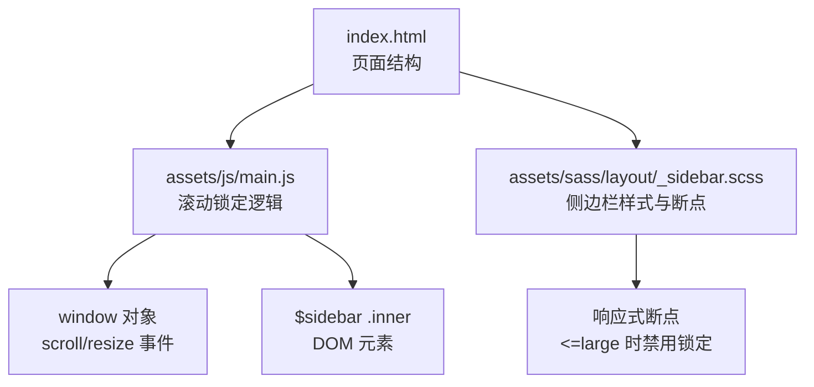
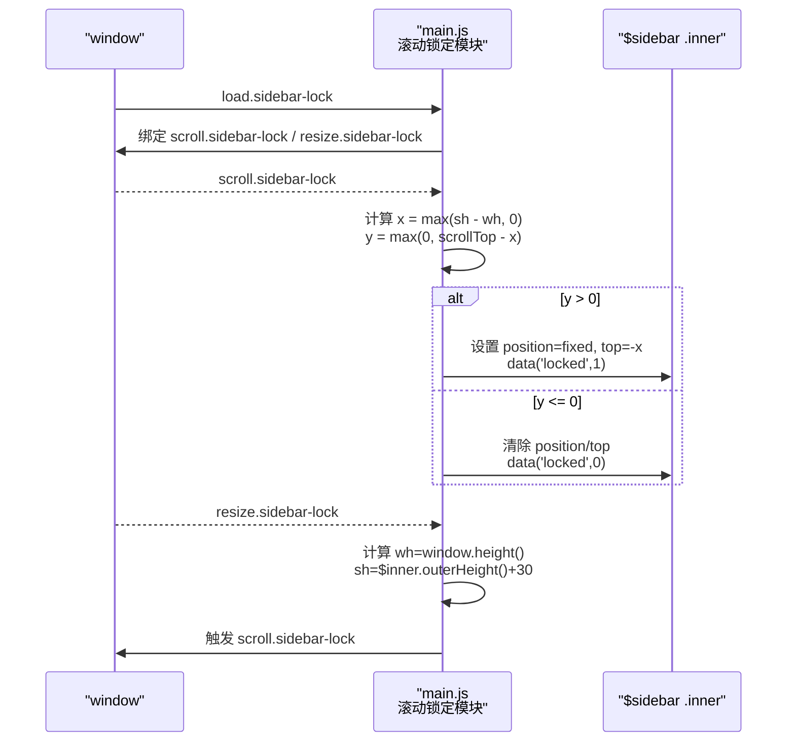
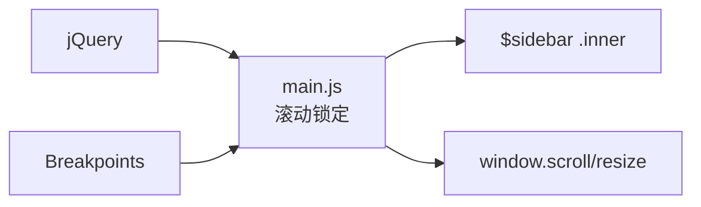

# 滚动锁定

<cite>
**本文引用的文件**
- [assets/js/main.js](file://assets/js/main.js)
- [assets/sass/layout/_sidebar.scss](file://assets/sass/layout/_sidebar.scss)
- [index.html](file://index.html)
</cite>

## 目录
1. [简介](#简介)
2. [项目结构](#项目结构)
3. [核心组件](#核心组件)
4. [架构总览](#架构总览)
5. [详细组件分析](#详细组件分析)
6. [依赖分析](#依赖分析)
7. [性能考虑](#性能考虑)
8. [故障排查指南](#故障排查指南)
9. [结论](#结论)
10. [附录：示例与扩展](#附录示例与扩展)

## 简介
本文件详细说明侧边栏“滚动锁定”功能的实现原理与行为，包括固定定位的动态切换、滚动位置计算算法（x/y坐标）、锁定状态管理、滚动监听器事件处理流程、高度计算时机与方法，以及何时启用/禁用固定定位。同时提供调整滚动锁定行为的实践方法与兼容性优化建议。

## 项目结构
该站点使用 jQuery + Breakpoints 进行交互与响应式控制，侧边栏滚动锁定逻辑集中在主脚本中，样式由 SCSS 编译后的 CSS 控制布局与过渡效果。HTML 页面包含侧边栏容器与内部内容区域，供脚本操作。

图表来源
- [index.html:87-119](file://index.html#L87-L119)
- [assets/js/main.js:166-233](file://assets/js/main.js#L166-L233)
- [assets/sass/layout/_sidebar.scss:154-196](file://assets/sass/layout/_sidebar.scss#L154-L196)

章节来源
- [index.html:87-119](file://index.html#L87-L119)
- [assets/js/main.js:166-233](file://assets/js/main.js#L166-L233)
- [assets/sass/layout/_sidebar.scss:154-196](file://assets/sass/layout/_sidebar.scss#L154-L196)

## 核心组件
- 滚动锁定模块：在窗口加载后初始化，绑定 scroll.sidebar-lock 与 resize.sidebar-lock 事件，负责计算并切换固定定位。
- 侧边栏 DOM：通过 #sidebar 与 .inner 选择器获取容器与内容区，用于设置 position/top 与数据标记 locked。
- 响应式策略：当断点 <= large 时，直接退出锁定逻辑，恢复默认流式布局。

章节来源
- [assets/js/main.js:166-233](file://assets/js/main.js#L166-L233)
- [assets/sass/layout/_sidebar.scss:154-196](file://assets/sass/layout/_sidebar.scss#L154-L196)
- [index.html:87-119](file://index.html#L87-L119)

## 架构总览
滚动锁定的整体流程如下：
- 页面加载完成后，初始化侧边栏锁定模块。
- 监听 window 的 scroll.sidebar-lock 事件，计算 x、y 值，根据 y 是否大于 0 决定锁定或解锁。
- 监听 window 的 resize.sidebar-lock 事件，重新计算窗口高度与侧边栏内容高度，并触发一次滚动事件以同步状态。
- 在 <= large 断点下，强制解除锁定并清空样式，确保移动端体验一致。

图表来源
- [assets/js/main.js:170-233](file://assets/js/main.js#L170-L233)

## 详细组件分析

### 滚动监听器与事件处理流程
- 事件命名空间：scroll.sidebar-lock、resize.sidebar-lock、load.sidebar-lock，避免与其他插件冲突。
- 加载阶段：重置滚动位置到 0（某些浏览器初始滚动为 1），随后绑定事件并触发一次 resize 以初始化高度。
- 滚动阶段：
  - 若断点 <= large，立即移除锁定状态并清空样式。
  - 否则计算 x、y：
    - x = Math.max(sh - wh, 0)
    - y = Math.max(0, $window.scrollTop() - x)
  - 基于 y 的值切换锁定：
    - 已锁定且 y <= 0：解锁（移除 fixed，清空 top）
    - 未锁定且 y > 0：锁定（设置 fixed，top = -x）
- 尺寸变化阶段：
  - 重新计算 wh（窗口高度）与 sh（侧边栏内容高度 + 30px）。
  - 触发一次 scroll.sidebar-lock 以应用最新高度下的锁定状态。

章节来源
- [assets/js/main.js:170-233](file://assets/js/main.js#L170-L233)

### 高度计算的时机与方法
- 窗口高度：wh = $window.height()
- 侧边栏内容高度：sh = $sidebar_inner.outerHeight() + 30
  - 额外 30px 用于补偿内边距或视觉留白，确保滚动到底部时不会出现空白或跳动。
- 计算时机：
  - 首次加载后触发 resize.sidebar-lock 完成初始化。
  - 窗口尺寸变化时重新计算，并再次触发滚动事件以同步状态。
  - 菜单项展开/折叠后也会触发 resize.sidebar-lock，保证动态内容变化后状态正确。

章节来源
- [assets/js/main.js:223-233](file://assets/js/main.js#L223-L233)
- [assets/js/main.js:255-257](file://assets/js/main.js#L255-L257)

### 锁定状态的管理与固定定位切换
- 状态存储：$sidebar_inner.data('locked') 记录当前是否处于锁定状态。
- 切换条件：
  - 启用固定定位：当 y > 0 且未锁定时，设置 position='fixed'，top = -x。
  - 禁用固定定位：当 y <= 0 或断点 <= large 时，移除 position 与 top，回到文档流。
- 断点策略：<= large 时始终禁用锁定，保持移动端侧边栏可滚动体验。

章节来源
- [assets/js/main.js:179-221](file://assets/js/main.js#L179-L221)
- [assets/sass/layout/_sidebar.scss:154-196](file://assets/sass/layout/_sidebar.scss#L154-L196)

### 滚动位置计算算法（x 与 y 的含义）
- x = Math.max(sh - wh, 0)
  - 表示侧边栏内容超出可视区域的“最大可滚动距离”。当 sh <= wh 时，x 为 0，即无需锁定。
- y = Math.max(0, $window.scrollTop() - x)
  - 表示“超过临界点后继续滚动的距离”。当滚动尚未达到临界点（scrollTop <= x）时，y 为 0，不锁定；超过临界点后，y 为正，开始锁定。
- 视觉效果：
  - 锁定后，top = -x，使侧边栏内容顶部对齐视口顶部，并在剩余滚动范围内保持固定。
  - 解锁后，恢复文档流，跟随页面滚动。

章节来源
- [assets/js/main.js:195-219](file://assets/js/main.js#L195-L219)

### 响应式与样式配合
- 在 <= large 断点下，侧边栏采用固定定位的全屏面板模式，内部 .inner 可滚动，因此不需要额外的滚动锁定。
- 在 > large 断点下，侧边栏为正常文档流的一部分，滚动锁定生效以保持内容可见性。

章节来源
- [assets/sass/layout/_sidebar.scss:154-196](file://assets/sass/layout/_sidebar.scss#L154-L196)

## 依赖分析
- jQuery：用于 DOM 操作与事件绑定。
- Breakpoints：用于断点判断，控制锁定逻辑在不同屏幕宽度下的行为。
- 侧边栏 HTML 结构：#sidebar 与 .inner 是锁定逻辑的目标元素。

图表来源
- [assets/js/main.js:166-233](file://assets/js/main.js#L166-L233)
- [index.html:87-119](file://index.html#L87-L119)

章节来源
- [assets/js/main.js:166-233](file://assets/js/main.js#L166-L233)
- [index.html:87-119](file://index.html#L87-L119)

## 性能考虑
- 事件节流/防抖：在高频率滚动场景下，可对 scroll.sidebar-lock 增加节流或 requestAnimationFrame 包裹，减少频繁重排与重绘。
- 最小化 DOM 查询：缓存 $sidebar_inner、$window 等引用，避免重复查找。
- 避免不必要的样式变更：仅在 locked 状态变化或 top 值变化时更新样式。
- 合理使用 outerHeight：outerHeight() 会触发回流，尽量在 resize 事件中集中计算，而非每次滚动都调用。
- 移动端优化：<= large 时完全跳过锁定逻辑，减少计算开销。

[本节为通用性能建议，不直接分析具体文件]

## 故障排查指南
- 侧边栏内容高度变化后不同步：
  - 在内容高度改变后，手动触发 $window.trigger('resize.sidebar-lock') 以重新计算高度并同步状态。
- 移动端锁定异常：
  - 检查断点判断是否正确，<= large 时应禁用锁定。
- 滚动位置初始偏移：
  - 加载时已将 scrollTop 重置为 0，若仍有偏移，检查是否有其他脚本修改了滚动位置。
- 菜单展开/折叠后状态错乱：
  - 确保菜单项点击后触发了 resize.sidebar-lock，以便重新计算高度。

章节来源
- [assets/js/main.js:223-233](file://assets/js/main.js#L223-L233)
- [assets/js/main.js:255-257](file://assets/js/main.js#L255-L257)

## 结论
滚动锁定通过精确的高度与滚动位置计算，结合响应式断点策略，在大屏上实现了侧边栏内容的“吸顶”效果，在小屏上则退化为可滚动的全屏面板，兼顾了可用性与性能。通过合理的事件管理与状态维护，保证了在不同交互场景下的稳定性与一致性。

[本节为总结性内容，不直接分析具体文件]

## 附录：示例与扩展

### 如何调整滚动锁定行为
- 调整临界点偏移：
  - 可在计算 y 时加入额外偏移量，例如 y = Math.max(0, $window.scrollTop() - x + offset)，以实现提前或延后锁定。
- 自定义高度补偿：
  - 将 sh = $sidebar_inner.outerHeight() + 30 中的常量 30 改为变量，便于根据不同主题或布局进行调整。
- 添加新的滚动相关功能：
  - 在 scroll.sidebar-lock 回调中插入新逻辑，例如记录滚动进度、显示/隐藏工具栏等。
  - 注意避免阻塞主线程，必要时使用节流或 requestAnimationFrame。

章节来源
- [assets/js/main.js:195-219](file://assets/js/main.js#L195-L219)
- [assets/js/main.js:223-233](file://assets/js/main.js#L223-L233)

### 兼容性处理方案
- 浏览器差异：
  - 针对 Android Chrome 的滚动条问题，已在脚本中注入样式隐藏滚动条，避免影响布局。
- 旧版浏览器：
  - 若不支持 object-fit，脚本已提供回退方案；滚动锁定本身依赖 jQuery，需确保引入兼容版本。
- 移动端：
  - 在 <= large 断点下禁用锁定，确保触摸滚动体验自然。

章节来源
- [assets/js/main.js:85-89](file://assets/js/main.js#L85-L89)
- [assets/sass/layout/_sidebar.scss:154-196](file://assets/sass/layout/_sidebar.scss#L154-L196)