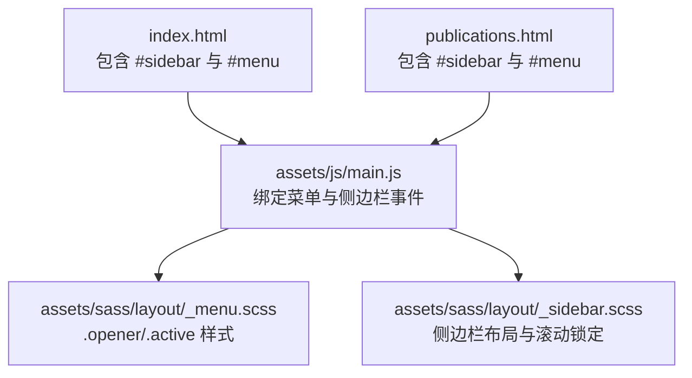
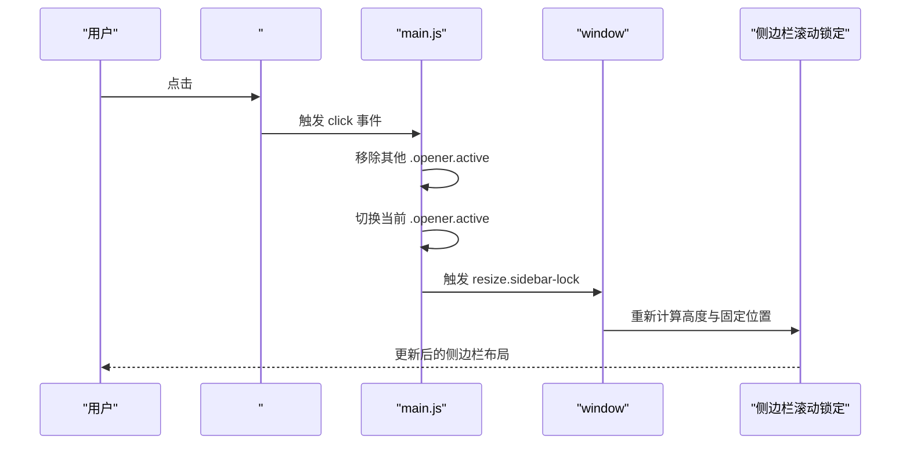
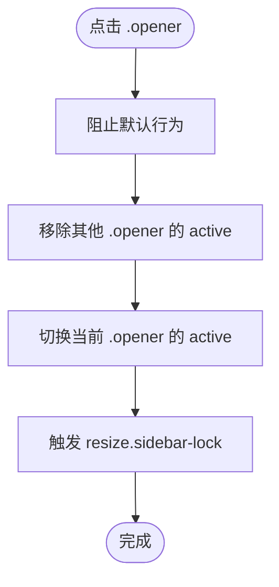
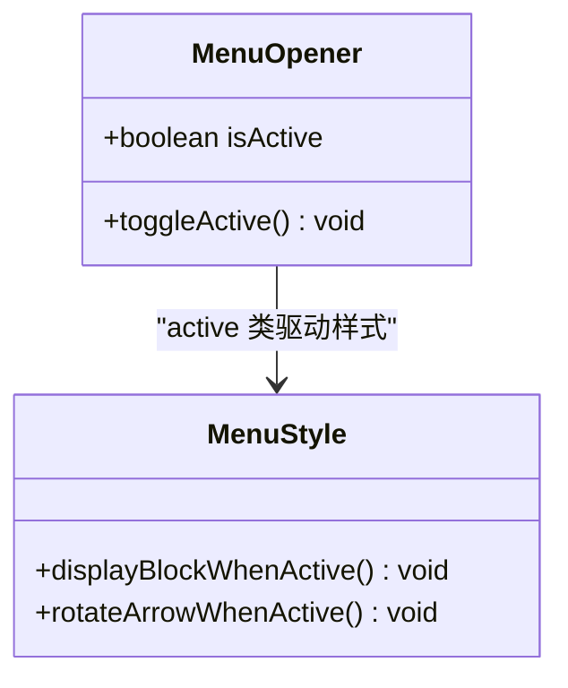
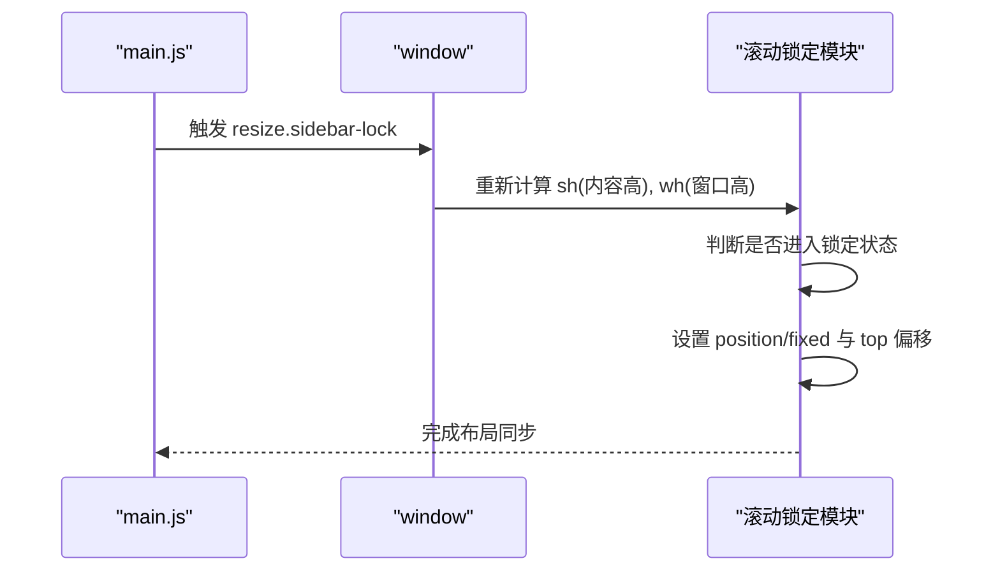
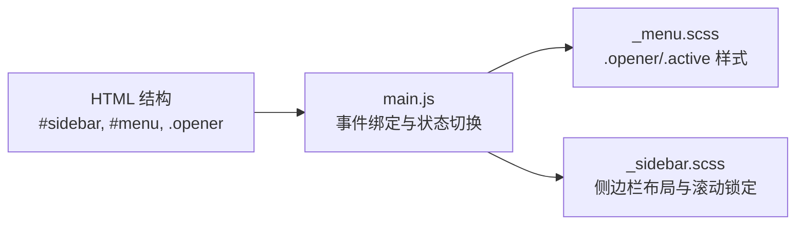

# 菜单交互

<cite>
**本文引用的文件**
- [assets/js/main.js](file://assets/js/main.js)
- [assets/sass/layout/_menu.scss](file://assets/sass/layout/_menu.scss)
- [assets/sass/layout/_sidebar.scss](file://assets/sass/layout/_sidebar.scss)
- [index.html](file://index.html)
- [publications.html](file://publications.html)
</cite>

## 目录
1. [简介](#简介)
2. [项目结构](#项目结构)
3. [核心组件](#核心组件)
4. [架构总览](#架构总览)
5. [详细组件分析](#详细组件分析)
6. [依赖关系分析](#依赖关系分析)
7. [性能考虑](#性能考虑)
8. [故障排除指南](#故障排除指南)
9. [结论](#结论)
10. [附录：扩展与自定义示例](#附录：扩展与自定义示例)

## 简介
本文件聚焦于侧边栏“菜单”的交互实现，覆盖以下要点：
- 展开/折叠机制：通过 .opener 元素的点击事件驱动。
- 活动状态切换：使用 active 类管理当前展开项。
- 互斥展开行为：同时仅允许一个子菜单处于展开状态。
- 与侧边栏滚动锁定的集成：菜单展开后触发 resize.sidebar-lock 以重新计算锁定位置。
- 扩展方法：如何添加新的菜单项或自定义菜单行为。
- 性能优化建议与常见问题排查。

## 项目结构
本项目采用前端静态站点结构，菜单交互由 JavaScript 控制、SCSS 样式定义、HTML 页面承载结构。关键文件如下：
- assets/js/main.js：初始化断点、侧边栏显示/隐藏、滚动锁定、菜单展开/折叠逻辑。
- assets/sass/layout/_menu.scss：菜单结构与样式（含 .opener 与 .active 的视觉表现）。
- assets/sass/layout/_sidebar.scss：侧边栏容器、响应式布局与滚动锁定相关样式。
- index.html / publications.html：包含侧边栏导航 #menu 的 HTML 结构。

图表来源
- [index.html:87-119](file://index.html#L87-L119)
- [publications.html:130-162](file://publications.html#L130-L162)
- [assets/js/main.js:72-260](file://assets/js/main.js#L72-L260)
- [assets/sass/layout/_menu.scss:9-98](file://assets/sass/layout/_menu.scss#L9-L98)
- [assets/sass/layout/_sidebar.scss:37-223](file://assets/sass/layout/_sidebar.scss#L37-L223)

章节来源
- [index.html:87-119](file://index.html#L87-L119)
- [publications.html:130-162](file://publications.html#L130-L162)
- [assets/js/main.js:72-260](file://assets/js/main.js#L72-L260)
- [assets/sass/layout/_menu.scss:9-98](file://assets/sass/layout/_menu.scss#L9-L98)
- [assets/sass/layout/_sidebar.scss:37-223](file://assets/sass/layout/_sidebar.scss#L37-L223)

## 核心组件
- 菜单容器与项：#menu > ul > li > a.opener + ul（子菜单）
- 活动状态类：.active 用于标记当前展开的 .opener
- 事件处理：main.js 中为所有 .opener 绑定 click 事件，实现互斥展开并触发侧边栏滚动锁定重算
- 样式控制：_menu.scss 中通过 .active 控制子菜单显示与箭头旋转

章节来源
- [assets/js/main.js:237-260](file://assets/js/main.js#L237-L260)
- [assets/sass/layout/_menu.scss:21-66](file://assets/sass/layout/_menu.scss#L21-L66)

## 架构总览
菜单交互的核心流程如下：
- 页面加载后，main.js 初始化断点监听与侧边栏行为。
- 针对 #menu 下的所有 .opener 元素绑定点击事件。
- 点击时：
  - 阻止默认行为
  - 移除其他 .opener 的 .active 类（互斥）
  - 切换当前 .opener 的 .active 类（展开/折叠）
  - 触发 window 的 resize.sidebar-lock 事件，使侧边栏滚动锁定重新计算高度与固定位置

图表来源
- [assets/js/main.js:237-260](file://assets/js/main.js#L237-L260)
- [assets/js/main.js:166-235](file://assets/js/main.js#L166-L235)

## 详细组件分析

### 菜单展开/折叠机制（.opener 点击事件）
- 选择器：$menu_openers = $('#menu').children('ul').find('.opener')
- 事件：click
- 行为：
  - event.preventDefault() 阻止默认跳转
  - $menu_openers.not($this).removeClass('active') 确保互斥
  - $this.toggleClass('active') 切换当前项展开/折叠
  - $window.triggerHandler('resize.sidebar-lock') 通知侧边栏滚动锁定模块重新计算

图表来源
- [assets/js/main.js:237-260](file://assets/js/main.js#L237-L260)

章节来源
- [assets/js/main.js:237-260](file://assets/js/main.js#L237-L260)

### 活动状态切换逻辑（active 类管理）
- 样式层：_menu.scss 中 .opener.active + ul { display: block } 控制子菜单显示；.opener.active:before 旋转箭头图标。
- 行为层：main.js 通过 removeClass('active') 和 toggleClass('active') 维护单一活动项。
- 结果：同一时间仅有一个子菜单展开，符合互斥原则。

图表来源
- [assets/sass/layout/_menu.scss:33-66](file://assets/sass/layout/_menu.scss#L33-L66)
- [assets/js/main.js:242-258](file://assets/js/main.js#L242-L258)

章节来源
- [assets/sass/layout/_menu.scss:33-66](file://assets/sass/layout/_menu.scss#L33-L66)
- [assets/js/main.js:242-258](file://assets/js/main.js#L242-L258)

### 互斥展开行为原理
- 实现方式：在点击任意 .opener 时，先遍历所有 .opener，将非当前项的 active 类移除，再对当前项进行 toggle。
- 效果：保证最多只有一个子菜单处于展开状态，避免多个子菜单同时显示导致的布局混乱。

章节来源
- [assets/js/main.js:242-258](file://assets/js/main.js#L242-L258)

### 与侧边栏滚动锁定的集成（resize.sidebar-lock）
- 触发时机：每次 .opener 点击后，调用 $window.triggerHandler('resize.sidebar-lock')。
- 作用：让滚动锁定模块重新计算侧边栏内容高度与窗口高度，必要时将侧边栏内容设置为 fixed 并调整 top 值，以保持滚动时的视觉一致性。
- 相关逻辑：
  - 监听 scroll.sidebar-lock 与 resize.sidebar-lock
  - 在 <=large 断点下禁用锁定，恢复默认滚动行为
  - 在 >large 断点下根据滚动位置切换 locked 状态与 CSS position/top

图表来源
- [assets/js/main.js:166-235](file://assets/js/main.js#L166-L235)
- [assets/js/main.js:237-260](file://assets/js/main.js#L237-L260)

章节来源
- [assets/js/main.js:166-235](file://assets/js/main.js#L166-L235)
- [assets/js/main.js:237-260](file://assets/js/main.js#L237-L260)

## 依赖关系分析
- main.js 依赖 jQuery、breakpoints 工具库（通过引入脚本），以及 DOM 结构中的 #sidebar 与 #menu。
- _menu.scss 与 _sidebar.scss 提供样式与响应式行为，配合 main.js 的事件与类名切换。
- HTML 页面必须包含 #menu 与 .opener 结构，否则菜单交互无法生效。

图表来源
- [index.html:87-119](file://index.html#L87-L119)
- [publications.html:130-162](file://publications.html#L130-L162)
- [assets/js/main.js:72-260](file://assets/js/main.js#L72-L260)
- [assets/sass/layout/_menu.scss:9-98](file://assets/sass/layout/_menu.scss#L9-L98)
- [assets/sass/layout/_sidebar.scss:37-223](file://assets/sass/layout/_sidebar.scss#L37-L223)

章节来源
- [index.html:87-119](file://index.html#L87-L119)
- [publications.html:130-162](file://publications.html#L130-L162)
- [assets/js/main.js:72-260](file://assets/js/main.js#L72-L260)
- [assets/sass/layout/_menu.scss:9-98](file://assets/sass/layout/_menu.scss#L9-L98)
- [assets/sass/layout/_sidebar.scss:37-223](file://assets/sass/layout/_sidebar.scss#L37-L223)

## 性能考虑
- 事件委托与选择器优化：当前为每个 .opener 单独绑定 click，若菜单项数量较多，可考虑事件委托至 #menu 以提升性能。
- 减少重排重绘：active 切换与子菜单显示/隐藏尽量通过类名与 CSS 控制，避免频繁直接操作 style。
- 滚动锁定节流：resize.sidebar-lock 与 scroll.sidebar-lock 在高频率事件中可能引发多次计算，可在需要时加入节流或防抖策略。
- 断点判断：在 <=large 时禁用滚动锁定，避免移动端不必要的计算。

[本节为通用性能建议，不直接分析具体代码文件]

## 故障排除指南
- 菜单无响应
  - 检查 HTML 是否包含 #menu 与 .opener 结构
  - 确认 main.js 已正确加载且 jQuery/breakpoints 可用
  - 查看控制台是否有选择器错误或事件未绑定
- 多个子菜单同时展开
  - 确认点击处理中是否正确移除其他 .opener 的 active 类
  - 检查是否存在自定义脚本覆盖了默认行为
- 侧边栏滚动锁定异常
  - 确认在菜单展开后触发了 resize.sidebar-lock
  - 检查断点条件（<=large）是否正确禁用锁定
  - 验证侧边栏内容高度变化后是否再次触发重算
- 样式不生效
  - 确认 .opener.active 与相邻子菜单的显示规则存在
  - 检查主题变量或自定义 CSS 是否覆盖了默认样式

章节来源
- [assets/js/main.js:237-260](file://assets/js/main.js#L237-L260)
- [assets/sass/layout/_menu.scss:33-66](file://assets/sass/layout/_menu.scss#L33-L66)
- [assets/js/main.js:166-235](file://assets/js/main.js#L166-L235)

## 结论
该菜单交互通过简洁的类名切换与事件绑定实现了稳定的展开/折叠与互斥行为，并与侧边栏滚动锁定良好集成。遵循现有模式即可安全扩展菜单结构或定制交互逻辑。

[本节为总结性内容，不直接分析具体代码文件]

## 附录：扩展与自定义示例
- 添加新菜单项
  - 在 #menu > ul 中添加新的 <li><a class="opener">...</a></li>，并在其后插入对应的 <ul> 作为子菜单。
  - 无需修改 main.js，因为脚本会动态选取所有 .opener 并绑定事件。
- 自定义菜单行为
  - 如需在展开前执行额外逻辑，可在 main.js 的 .opener click 回调中增加步骤（例如记录日志、统计点击等）。
  - 如需改变互斥策略（允许多个展开），可移除移除其他 .opener 的 active 类的步骤。
- 与第三方插件集成
  - 若引入动画库，可在切换 active 前后触发相应动画钩子。
  - 注意在大型菜单场景下避免过度动画导致卡顿。

章节来源
- [assets/js/main.js:237-260](file://assets/js/main.js#L237-L260)
- [assets/sass/layout/_menu.scss:33-66](file://assets/sass/layout/_menu.scss#L33-L66)
- [index.html:87-119](file://index.html#L87-L119)
- [publications.html:130-162](file://publications.html#L130-L162)