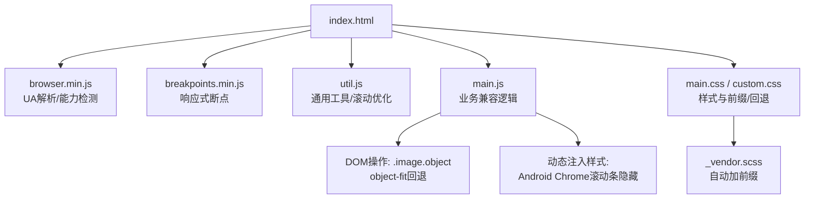
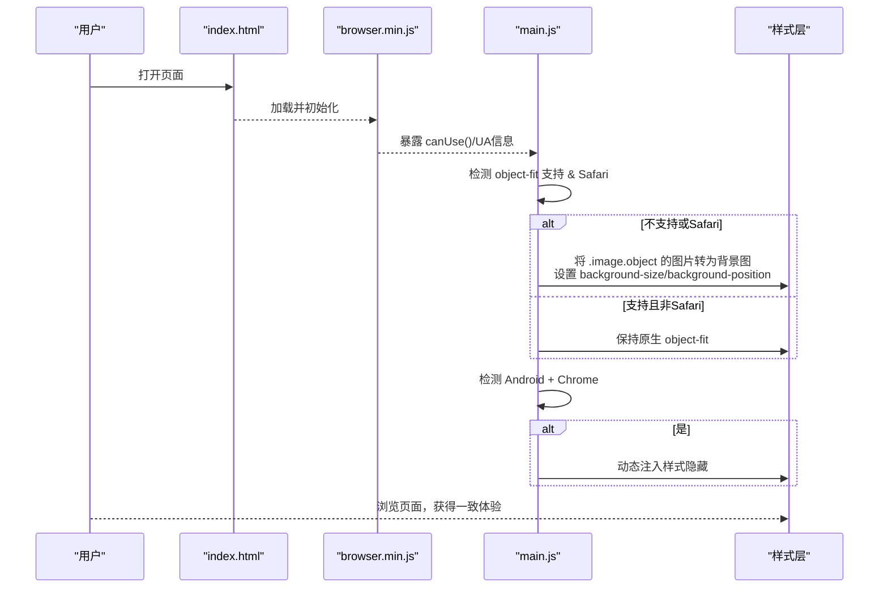
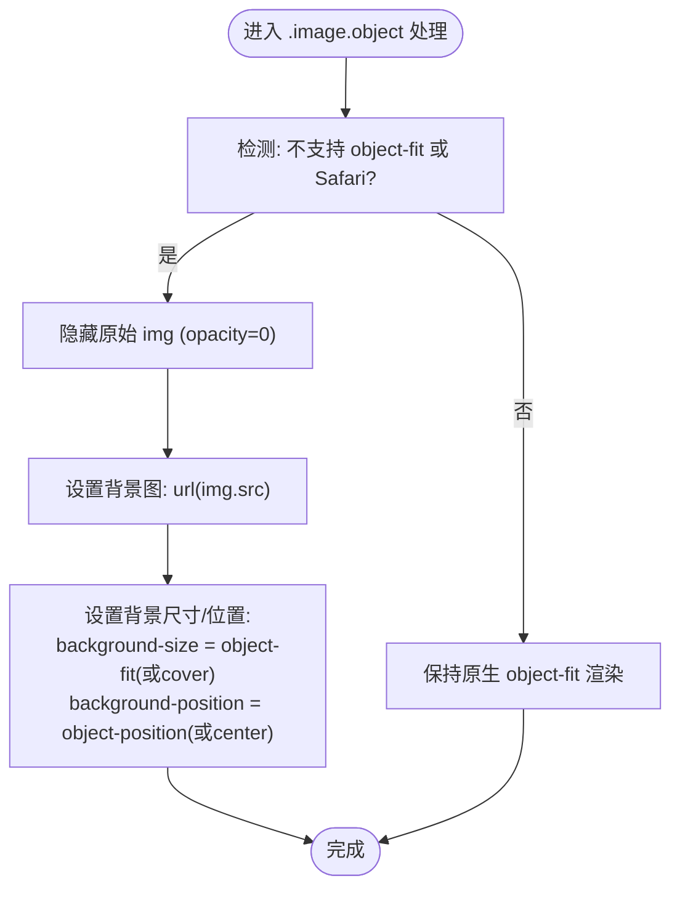
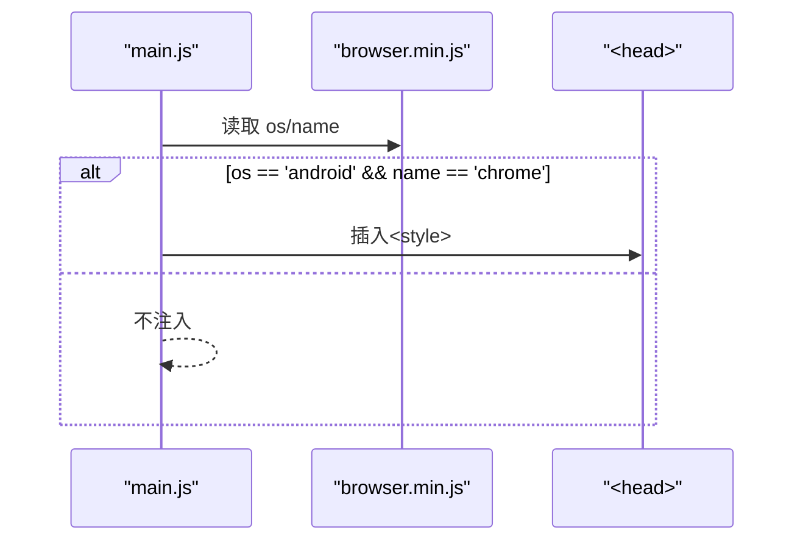
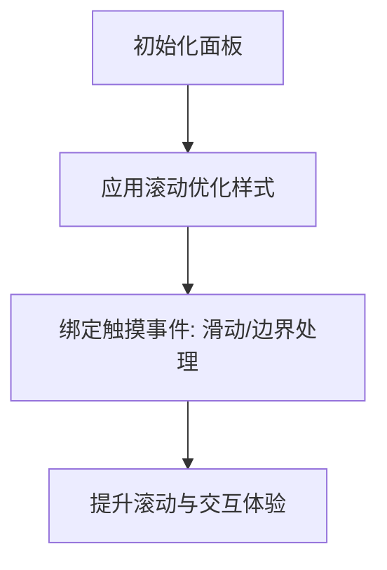
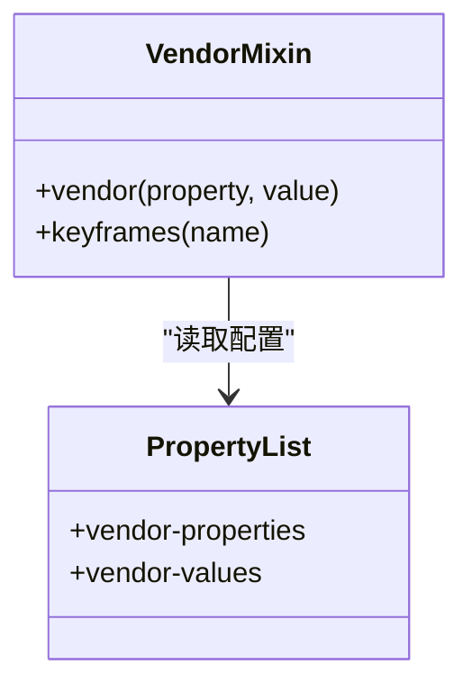
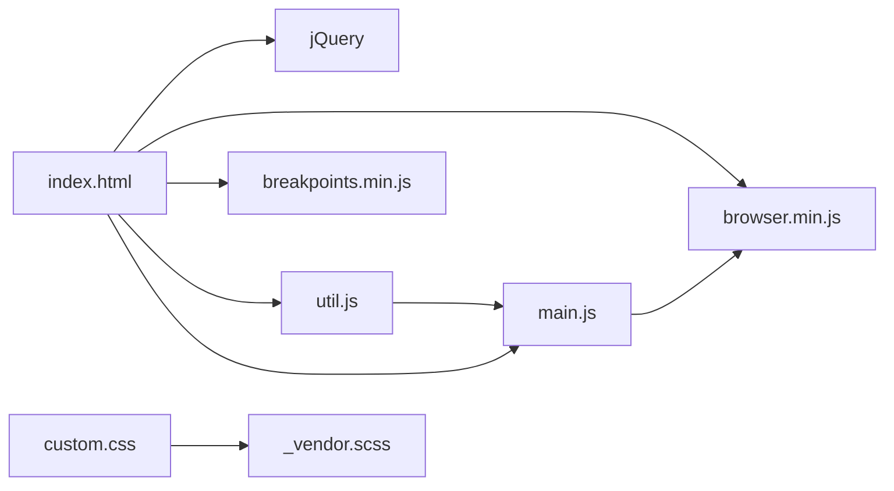

# 浏览器兼容性处理

<cite>
**本文引用的文件**
- [assets/js/browser.min.js](file://assets/js/browser.min.js)
- [assets/js/main.js](file://assets/js/main.js)
- [assets/js/util.js](file://assets/js/util.js)
- [assets/css/custom.css](file://assets/css/custom.css)
- [assets/sass/libs/_vendor.scss](file://assets/sass/libs/_vendor.scss)
- [assets/sass/components/_image.scss](file://assets/sass/components/_image.scss)
- [index.html](file://index.html)
</cite>

## 目录
1. [简介](#简介)
2. [项目结构](#项目结构)
3. [核心组件](#核心组件)
4. [架构总览](#架构总览)
5. [详细组件分析](#详细组件分析)
6. [依赖关系分析](#依赖关系分析)
7. [性能考虑](#性能考虑)
8. [故障排查指南](#故障排查指南)
9. [结论](#结论)
10. [附录：新增浏览器支持与兼容性测试](#附录新增浏览器支持与兼容性测试)

## 简介
本文件系统性梳理本项目在浏览器兼容性方面的实现与策略，重点覆盖：
- 特性检测与降级方案（以 object-fit 为核心）
- Android Chrome 滚动条问题的修复
- 条件判断的使用模式与能力检测方法
- 新浏览器支持的添加指南与兼容性测试方法
- 性能与用户体验优化建议

目标是帮助开发者在不牺牲现代体验的前提下，为更多浏览器提供一致、稳定的表现。

## 项目结构
本项目采用“JS 能力检测 + CSS 前缀/回退 + 运行时降级”的组合方式：
- JS 层通过 browser.min.js 进行 UA 解析与能力检测；main.js 中基于检测结果执行降级逻辑（如 object-fit 回退、Android Chrome 滚动条样式注入）。
- CSS/SASS 层通过 vendor.scss 统一生成厂商前缀，custom.css 中对滚动条等细节做跨浏览器适配。
- HTML 入口引入必要的脚本与样式，确保按顺序加载。

图表来源
- [index.html:120-125](file://index.html#L120-L125)
- [assets/js/browser.min.js:1-3](file://assets/js/browser.min.js#L1-L3)
- [assets/js/main.js:51-89](file://assets/js/main.js#L51-L89)
- [assets/sass/libs/_vendor.scss:1-376](file://assets/sass/libs/_vendor.scss#L1-L376)

章节来源
- [index.html:120-125](file://index.html#L120-L125)
- [assets/js/browser.min.js:1-3](file://assets/js/browser.min.js#L1-L3)
- [assets/js/main.js:51-89](file://assets/js/main.js#L51-L89)
- [assets/sass/libs/_vendor.scss:1-376](file://assets/sass/libs/_vendor.scss#L1-L376)

## 核心组件
- 浏览器能力检测器（browser.min.js）
  - 暴露 name/version/os/osVersion/touch/mobile 等属性
  - 提供 canUse(prop) 用于检测 DOM 元素 style 上是否支持某属性（含常见厂商前缀）
- 主逻辑（main.js）
  - 使用 breakpoints 控制侧边栏状态
  - 针对不支持 object-fit 或 Safari 的场景，将图片转为背景图并设置 background-size/background-position 作为降级
  - 针对 Android + Chrome 的滚动条问题，动态注入样式隐藏滚动条
- 工具库（util.js）
  - 对面板滚动行为进行优化（-webkit-overflow-scrolling、-ms-overflow-style）
  - 提供 placeholder polyfill、触摸事件处理等
- 样式层（custom.css、_vendor.scss）
  - _vendor.scss 集中管理需要加前缀的属性与值，并通过 mixin 输出多前缀
  - custom.css 对滚动条、布局等进行细化适配

章节来源
- [assets/js/browser.min.js:1-3](file://assets/js/browser.min.js#L1-L3)
- [assets/js/main.js:51-89](file://assets/js/main.js#L51-L89)
- [assets/js/util.js:138-141](file://assets/js/util.js#L138-L141)
- [assets/sass/libs/_vendor.scss:122-124](file://assets/sass/libs/_vendor.scss#L122-L124)
- [assets/sass/libs/_vendor.scss:335-376](file://assets/sass/libs/_vendor.scss#L335-L376)
- [assets/css/custom.css:249-273](file://assets/css/custom.css#L249-L273)

## 架构总览
下图展示了从页面加载到兼容性处理的调用链与数据流：

图表来源
- [assets/js/browser.min.js:1-3](file://assets/js/browser.min.js#L1-L3)
- [assets/js/main.js:51-89](file://assets/js/main.js#L51-L89)

## 详细组件分析

### 组件A：object-fit 兼容性与背景图替代
- 触发条件
  - 当浏览器不支持 object-fit，或当前浏览器为 Safari 时，启用降级
- 降级策略
  - 隐藏原始 img（透明度置零）
  - 将 img.src 设置为容器的 background-image
  - 根据原对象设置的 object-fit/object-position 映射为 background-size/background-position
- 适用场景
  - 头像、横幅图等需要保持比例填充的区域
- 注意事项
  - 若未显式设置 object-fit/object-position，则使用 cover/center 作为默认值
  - 该方案避免在旧浏览器中出现图片拉伸或留白

图表来源
- [assets/js/main.js:53-70](file://assets/js/main.js#L53-L70)

章节来源
- [assets/js/main.js:53-70](file://assets/js/main.js#L53-L70)
- [assets/sass/components/_image.scss:9-74](file://assets/sass/components/_image.scss#L9-L74)
- [assets/css/custom.css:29-46](file://assets/css/custom.css#L29-L46)

### 组件B：Android Chrome 滚动条问题修复
- 触发条件
  - 当操作系统为 Android 且浏览器为 Chrome 时
- 修复手段
  - 动态向 <head> 注入样式，隐藏 #sidebar .inner 的 WebKit 滚动条
- 目的
  - 解决特定环境下滚动条显示异常导致的布局抖动或遮挡问题

图表来源
- [assets/js/main.js:85-89](file://assets/js/main.js#L85-L89)
- [assets/js/browser.min.js:1-3](file://assets/js/browser.min.js#L1-L3)

章节来源
- [assets/js/main.js:85-89](file://assets/js/main.js#L85-L89)
- [assets/js/browser.min.js:1-3](file://assets/js/browser.min.js#L1-L3)

### 组件C：滚动与触摸体验优化（util.js）
- 滚动优化
  - 为面板容器设置 -webkit-overflow-scrolling: touch 提升移动端滚动流畅度
  - 设置 -ms-overflow-style: -ms-autohiding-scrollbar 改善 IE/Edge 滚动条体验
- 触摸交互
  - 提供滑动关闭面板、阻止越界滚动等交互增强
- 表单占位符 Polyfill
  - 在不支持 placeholder 的浏览器中模拟占位提示

图表来源
- [assets/js/util.js:138-141](file://assets/js/util.js#L138-L141)
- [assets/js/util.js:180-250](file://assets/js/util.js#L180-L250)

章节来源
- [assets/js/util.js:138-141](file://assets/js/util.js#L138-L141)
- [assets/js/util.js:180-250](file://assets/js/util.js#L180-L250)

### 组件D：CSS 厂商前缀与属性扩展（_vendor.scss）
- 统一管理需要加前缀的属性与值
- 通过 mixin 批量输出多前缀声明，减少重复代码
- 包含 object-fit/object-position 等属性的前缀支持列表

图表来源
- [assets/sass/libs/_vendor.scss:17-193](file://assets/sass/libs/_vendor.scss#L17-L193)
- [assets/sass/libs/_vendor.scss:324-376](file://assets/sass/libs/_vendor.scss#L324-L376)

章节来源
- [assets/sass/libs/_vendor.scss:17-193](file://assets/sass/libs/_vendor.scss#L17-L193)
- [assets/sass/libs/_vendor.scss:324-376](file://assets/sass/libs/_vendor.scss#L324-L376)

## 依赖关系分析
- index.html 按序引入 jQuery、browser.min.js、breakpoints.min.js、util.js、main.js
- main.js 依赖 browser.min.js 的能力检测与 UA 信息
- util.js 提供通用工具，被 main.js 间接使用（如面板相关）
- 样式层通过 _vendor.scss 生成带前缀的 CSS，custom.css 补充具体适配

图表来源
- [index.html:120-125](file://index.html#L120-L125)
- [assets/js/main.js:51-89](file://assets/js/main.js#L51-L89)
- [assets/sass/libs/_vendor.scss:1-376](file://assets/sass/libs/_vendor.scss#L1-L376)

章节来源
- [index.html:120-125](file://index.html#L120-L125)
- [assets/js/main.js:51-89](file://assets/js/main.js#L51-L89)
- [assets/sass/libs/_vendor.scss:1-376](file://assets/sass/libs/_vendor.scss#L1-L376)

## 性能考虑
- 特性检测优先
  - 使用 canUse('object-fit') 快速判断，避免不必要的 DOM 操作
- 最小化重排重绘
  - 仅在必要时修改样式（如隐藏 img、设置背景），避免频繁计算
- 滚动优化
  - 使用 -webkit-overflow-scrolling: touch 提升滚动性能
- 资源加载
  - 将脚本放在页面底部并按需加载，减少首屏阻塞
- 渐进增强
  - 现代浏览器直接使用 object-fit，旧浏览器走轻量降级路径

[本节为通用指导，无需引用具体文件]

## 故障排查指南
- 图片未按预期填充
  - 检查是否命中降级分支（不支持 object-fit 或 Safari）
  - 确认 .image.object 容器存在且包含 img
  - 参考：[assets/js/main.js:53-70](file://assets/js/main.js#L53-L70)
- Android Chrome 滚动条异常
  - 确认已注入隐藏滚动条的样式
  - 检查选择器是否正确匹配 #sidebar .inner
  - 参考：[assets/js/main.js:85-89](file://assets/js/main.js#L85-L89)
- 滚动卡顿或不跟手
  - 检查 util.js 中的滚动优化是否生效
  - 参考：[assets/js/util.js:138-141](file://assets/js/util.js#L138-L141)
- 样式前缀缺失
  - 确认编译流程正确引入 _vendor.scss
  - 参考：[assets/sass/libs/_vendor.scss:335-376](file://assets/sass/libs/_vendor.scss#L335-L376)

章节来源
- [assets/js/main.js:53-70](file://assets/js/main.js#L53-L70)
- [assets/js/main.js:85-89](file://assets/js/main.js#L85-L89)
- [assets/js/util.js:138-141](file://assets/js/util.js#L138-L141)
- [assets/sass/libs/_vendor.scss:335-376](file://assets/sass/libs/_vendor.scss#L335-L376)

## 结论
本项目通过“能力检测 + 运行时降级 + 样式前缀”三位一体的策略，在保证现代浏览器最佳体验的同时，为旧版或特殊浏览器提供了稳定一致的呈现。object-fit 的背景图替代方案与 Android Chrome 滚动条修复是两大关键兼容点；配合滚动优化与前缀自动化，整体兼容性与性能达到良好平衡。

[本节为总结性内容，无需引用具体文件]

## 附录：新增浏览器支持与兼容性测试

### 新增浏览器支持的步骤
- 更新 UA 识别
  - 在 browser.min.js 中添加新的 UA 正则与版本提取逻辑
  - 确保 name/version/os/osVersion 能正确识别新浏览器
  - 参考：[assets/js/browser.min.js:1-3](file://assets/js/browser.min.js#L1-L3)
- 添加特性检测
  - 如需检测新属性，可在 canUse 基础上扩展或使用标准能力检测
  - 在 main.js 中增加条件分支，为新浏览器提供专属逻辑或跳过降级
  - 参考：[assets/js/main.js:51-89](file://assets/js/main.js#L51-L89)
- 样式适配
  - 若新浏览器需要特定前缀或行为，更新 _vendor.scss 的属性/值列表
  - 在 custom.css 中补充针对性样式
  - 参考：[assets/sass/libs/_vendor.scss:17-193](file://assets/sass/libs/_vendor.scss#L17-L193)
  - 参考：[assets/css/custom.css:249-273](file://assets/css/custom.css#L249-L273)

### 兼容性测试方法
- 功能验证
  - 在不同浏览器/版本下验证 object-fit 降级是否生效
  - 验证 Android Chrome 滚动条是否被正确隐藏
  - 参考：[assets/js/main.js:53-70](file://assets/js/main.js#L53-L70)
  - 参考：[assets/js/main.js:85-89](file://assets/js/main.js#L85-L89)
- 性能验证
  - 使用浏览器性能面板观察重排/重绘次数与滚动帧率
  - 对比开启/关闭滚动优化的差异
  - 参考：[assets/js/util.js:138-141](file://assets/js/util.js#L138-L141)
- 回归测试
  - 确保新增逻辑不影响现有功能（如侧边栏切换、菜单交互）
  - 参考：[assets/js/main.js:72-164](file://assets/js/main.js#L72-L164)

章节来源
- [assets/js/browser.min.js:1-3](file://assets/js/browser.min.js#L1-L3)
- [assets/js/main.js:51-89](file://assets/js/main.js#L51-L89)
- [assets/sass/libs/_vendor.scss:17-193](file://assets/sass/libs/_vendor.scss#L17-L193)
- [assets/css/custom.css:249-273](file://assets/css/custom.css#L249-L273)
- [assets/js/util.js:138-141](file://assets/js/util.js#L138-L141)
- [assets/js/main.js:72-164](file://assets/js/main.js#L72-L164)