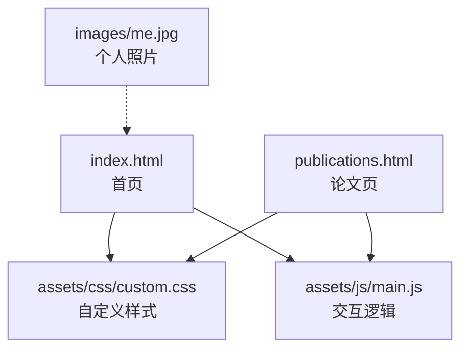
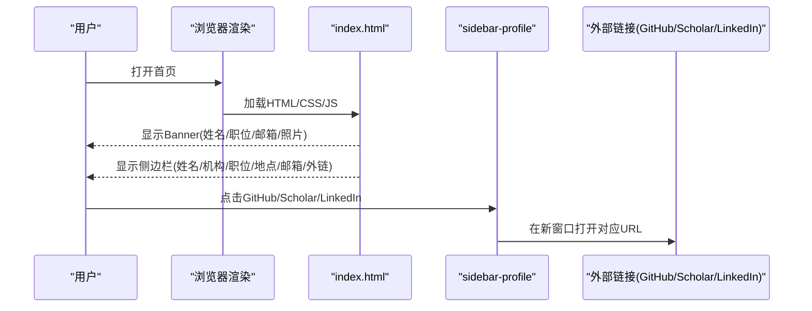
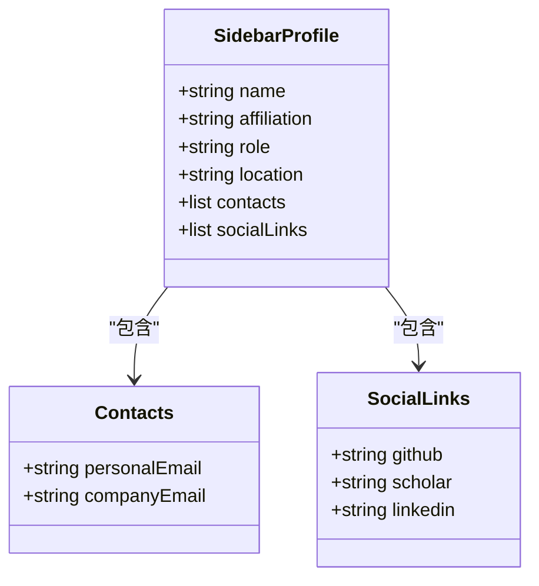
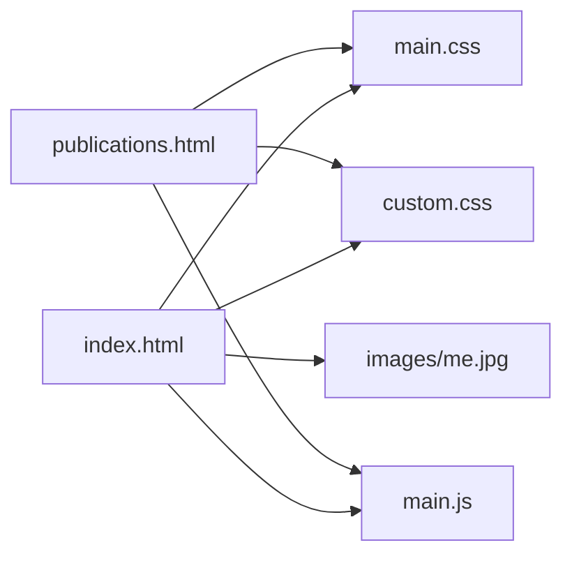

# 个人信息管理

<cite>
**本文引用的文件**
- [index.html](file://index.html)
- [publications.html](file://publications.html)
- [assets/css/custom.css](file://assets/css/custom.css)
- [assets/js/main.js](file://assets/js/main.js)
- [README.md](file://README.md)
</cite>

## 目录
1. [简介](#简介)
2. [项目结构](#项目结构)
3. [核心组件](#核心组件)
4. [架构总览](#架构总览)
5. [详细组件分析](#详细组件分析)
6. [依赖关系分析](#依赖关系分析)
7. [性能与可访问性](#性能与可访问性)
8. [故障排查指南](#故障排查指南)
9. [结论](#结论)
10. [附录：操作指南](#附录操作指南)

## 简介
本文件面向个人主页的维护者，系统化说明“个人信息”的组织方式与更新方法。重点覆盖：
- 个人简介、职位信息、联系方式、教育背景（以新闻/服务等形式呈现）的管理结构
- 侧边栏个人资料卡片的组成部分及配置方法（姓名、机构、职位、地理位置、邮箱、GitHub、Google Scholar、LinkedIn 等外部链接）
- 个人照片更新、联系信息维护、学术平台链接管理的操作步骤
- 隐私保护与可访问性优化建议

## 项目结构
该站点为静态 HTML + CSS + JS 的个人主页，主要页面包括首页与论文页；样式集中在 assets/css，交互脚本在 assets/js。个人信息分布在两个位置：
- 顶部横幅区（Banner）：展示姓名、当前职位、邮箱等基础信息以及个人照片
- 侧边栏（Sidebar）：个人资料卡片，包含姓名、机构、职位、地理位置、邮箱、GitHub、Google Scholar、LinkedIn 等

图表来源
- [index.html:26-41](file://index.html#L26-L41)
- [index.html:87-119](file://index.html#L87-L119)
- [publications.html:130-162](file://publications.html#L130-L162)
- [assets/css/custom.css:29-115](file://assets/css/custom.css#L29-L115)
- [assets/js/main.js:72-164](file://assets/js/main.js#L72-L164)

章节来源
- [index.html:1-150](file://index.html#L1-L150)
- [publications.html:1-185](file://publications.html#L1-L185)
- [assets/css/custom.css:1-400](file://assets/css/custom.css#L1-L400)
- [assets/js/main.js:1-262](file://assets/js/main.js#L1-L262)
- [README.md:1-10](file://README.md#L1-L10)

## 核心组件
- 顶部横幅（Banner）
  - 内容：姓名、当前职位、个人邮箱与公司邮箱、个人照片
  - 作用：快速建立身份认知与基本联系渠道
- 侧边栏个人资料卡片（Sidebar Profile）
  - 内容：姓名、机构、职位、地理位置、邮箱、GitHub、Google Scholar、LinkedIn
  - 作用：提供稳定的导航与社交/学术入口
- 正文区域
  - 个人简介（Biography）：研究兴趣、工作方向、招生/合作信息
  - 新闻（News）：动态与重要事件（含教育背景里程碑）
  - 学术服务（Academic Service）：审稿经历等
- 论文页（Publications）
  - 按年份组织论文列表，并附带 Google Scholar 入口

章节来源
- [index.html:26-48](file://index.html#L26-L48)
- [index.html:50-83](file://index.html#L50-L83)
- [index.html:87-119](file://index.html#L87-L119)
- [publications.html:26-125](file://publications.html#L26-L125)
- [publications.html:130-162](file://publications.html#L130-L162)

## 架构总览
个人信息在页面中的分布遵循“头部+侧边栏+正文”的经典布局：
- 头部 Banner 负责“我是谁 + 怎么联系我”
- 侧边栏负责“稳定入口 + 社交/学术链接”
- 正文负责“详细介绍 + 动态 + 成果”

图表来源
- [index.html:26-41](file://index.html#L26-L41)
- [index.html:87-119](file://index.html#L87-L119)
- [assets/js/main.js:107-140](file://assets/js/main.js#L107-L140)

## 详细组件分析

### 顶部横幅（Banner）
- 组成
  - 姓名与中文姓名
  - 当前职位（公司/高校）
  - 个人邮箱与公司邮箱
  - 个人照片（images/me.jpg）
- 更新要点
  - 修改姓名、职位、邮箱：编辑 index.html 中 Banner 段落
  - 更换照片：替换 images/me.jpg 或调整 img src
  - 响应式适配：CSS 已处理不同屏幕下的图片尺寸与布局

章节来源
- [index.html:26-41](file://index.html#L26-L41)
- [assets/css/custom.css:29-115](file://assets/css/custom.css#L29-L115)

### 侧边栏个人资料卡片（Sidebar Profile）
- 组成
  - 姓名（h3）
  - 机构（profile-affiliation）
  - 职位（profile-role）
  - 地理位置（带地图标记图标）
  - 邮箱（个人/公司）
  - 外部链接：GitHub、Google Scholar、LinkedIn
- 更新要点
  - 修改文本：直接编辑对应 li/p 标签
  - 新增/删除链接：增删 profile-links 下的 li 项
  - 图标：使用 Font Awesome 图标类名（如 fa-github、fa-graduation-cap、fa-linkedin）
  - 外链行为：默认在新窗口打开（target="_blank"），由 main.js 统一处理移动端折叠与跳转

图表来源
- [index.html:100-113](file://index.html#L100-L113)
- [publications.html:143-156](file://publications.html#L143-L156)
- [assets/css/custom.css:161-210](file://assets/css/custom.css#L161-L210)
- [assets/js/main.js:107-140](file://assets/js/main.js#L107-L140)

章节来源
- [index.html:87-119](file://index.html#L87-L119)
- [publications.html:130-162](file://publications.html#L130-L162)
- [assets/css/custom.css:155-210](file://assets/css/custom.css#L155-L210)
- [assets/js/main.js:72-164](file://assets/js/main.js#L72-L164)

### 个人简介（Biography）
- 内容：研究方向、当前工作、实习/合作招募信息
- 更新要点：直接在 Biography 段落中维护文本；如需强调某条信息可使用加粗或独立段落

章节来源
- [index.html:43-48](file://index.html#L43-L48)

### 新闻（News）
- 内容：录用通知、入职/毕业里程碑、项目进展等
- 更新要点：在 news-list 中添加新的 li 条目；年份与主题通过 span 分类

章节来源
- [index.html:50-74](file://index.html#L50-L74)
- [assets/css/custom.css:258-318](file://assets/css/custom.css#L258-L318)

### 学术服务（Academic Service）
- 内容：会议/期刊审稿经历
- 更新要点：维护 ul/li 列表即可

章节来源
- [index.html:76-83](file://index.html#L76-L83)

### 论文页（Publications）
- 内容：按年份组织的论文列表，支持代码/数据集/论文链接
- 更新要点：在对应年份下添加 li 条目；作者高亮使用 me 类；突出论文使用 pub-highlight 类

章节来源
- [publications.html:26-125](file://publications.html#L26-L125)
- [assets/css/custom.css:320-399](file://assets/css/custom.css#L320-L399)

## 依赖关系分析
- 页面与资源
  - index.html/publications.html 引入 assets/css/main.css、assets/css/custom.css
  - 图片资源 images/me.jpg 被 Banner 引用
  - 交互逻辑 assets/js/main.js 控制侧边栏折叠、外链在新窗口打开等行为
- 样式与组件
  - custom.css 定义了侧边栏资料卡、Banner 图片、新闻与论文列表样式
  - main.js 基于断点控制侧边栏激活状态与滚动锁定

图表来源
- [index.html:4-9](file://index.html#L4-L9)
- [publications.html:4-9](file://publications.html#L4-L9)
- [assets/js/main.js:72-164](file://assets/js/main.js#L72-L164)
- [assets/css/custom.css:155-210](file://assets/css/custom.css#L155-L210)

章节来源
- [index.html:1-150](file://index.html#L1-L150)
- [publications.html:1-185](file://publications.html#L1-L185)
- [assets/css/custom.css:1-400](file://assets/css/custom.css#L1-L400)
- [assets/js/main.js:1-262](file://assets/js/main.js#L1-L262)

## 性能与可访问性
- 性能
  - 图片优化：确保 images/me.jpg 为合适尺寸与压缩格式，避免过大影响首屏加载
  - 样式与脚本：仅引入必要资源；保持 CSS/JS 精简
- 可访问性
  - 语义化：使用 h2/h3 标题层级清晰；为图片添加 alt 描述（当前为空，建议补充）
  - 对比度与颜色：链接与文字颜色已在 custom.css 中定义，保持可读性
  - 键盘导航：外链 target="_blank" 便于新窗口访问；侧边栏在小屏可折叠，提升可用性
  - 响应式：Banner 图片在不同视口自适应尺寸，保证移动端体验

[本节为通用指导，不直接分析具体文件]

## 故障排查指南
- 侧边栏外链无法在新窗口打开
  - 检查是否设置 target="_blank"；确认 main.js 未拦截跳转
  - 参考：外链点击处理逻辑
- 侧边栏在小屏不可见或遮挡内容
  - 检查 main.js 的断点与 inactive 类切换逻辑
  - 参考：侧边栏折叠与滚动锁定
- 图片显示异常或变形
  - 检查 images/me.jpg 是否存在与路径正确
  - 检查 custom.css 中 Banner 图片尺寸与 object-fit 设置
- 链接样式不符合预期
  - 检查 custom.css 中对 a:hover 与 profile-links 的样式覆盖

章节来源
- [assets/js/main.js:107-164](file://assets/js/main.js#L107-L164)
- [assets/css/custom.css:29-115](file://assets/css/custom.css#L29-L115)
- [assets/css/custom.css:134-141](file://assets/css/custom.css#L134-L141)

## 结论
本项目的个人信息管理采用“静态 HTML + 定制样式 + 轻量交互”的模式，结构清晰、易于维护。通过集中更新 Banner 与侧边栏资料卡片，即可高效完成基本信息、联系方式与学术平台链接的维护。配合合理的图片优化与可访问性实践，可进一步提升用户体验与传播效果。

[本节为总结性内容，不直接分析具体文件]

## 附录：操作指南

- 更新个人简介
  - 定位 index.html 中 Biography 段落，修改研究兴趣、工作方向与招募信息
  - 如需强调，可使用加粗或独立段落
  - 章节来源
    - [index.html:43-48](file://index.html#L43-L48)

- 更新职位信息与联系方式
  - 在 Banner 段落中更新当前职位、个人邮箱与公司邮箱
  - 在侧边栏资料卡片中同步更新机构、职位、邮箱
  - 章节来源
    - [index.html:26-41](file://index.html#L26-L41)
    - [index.html:100-113](file://index.html#L100-L113)

- 更新教育背景
  - 在 News 列表中增加里程碑条目（如获得博士学位、加入机构等）
  - 章节来源
    - [index.html:50-74](file://index.html#L50-L74)

- 更新个人照片
  - 将新照片命名为 me.jpg 并放入 images 目录，或直接修改 img src
  - 注意图片尺寸与压缩，确保加载速度与显示质量
  - 章节来源
    - [index.html:38-40](file://index.html#L38-L40)
    - [assets/css/custom.css:29-115](file://assets/css/custom.css#L29-L115)

- 维护学术平台链接（GitHub、Google Scholar、LinkedIn）
  - 在侧边栏资料卡片的 profile-links 中增删或修改 li 项
  - 确保外链 target="_blank" 以便新窗口打开
  - 章节来源
    - [index.html:105-112](file://index.html#L105-L112)
    - [publications.html:148-155](file://publications.html#L148-L155)
    - [assets/js/main.js:107-140](file://assets/js/main.js#L107-L140)

- 隐私保护建议
  - 谨慎公开个人邮箱：建议使用公司邮箱作为主联系渠道，或将个人邮箱隐藏于表单/二维码
  - 限制敏感信息：不在公开页面展示身份证号、家庭住址等敏感数据
  - 外链安全：所有外链均使用 https，并开启新窗口打开，降低钓鱼风险
  - 图片隐私：避免在照片中泄露背景中的敏感信息

- 可访问性优化建议
  - 为图片添加有意义的 alt 文本，提升读屏器体验
  - 保持标题层级清晰（h2/h3），便于导航与索引
  - 链接文本明确：如“GitHub”“Google Scholar”“LinkedIn”，避免模糊文案
  - 颜色对比度：保持链接与背景色对比度足够，便于弱视用户阅读

[本节为操作与最佳实践，不直接分析具体文件]