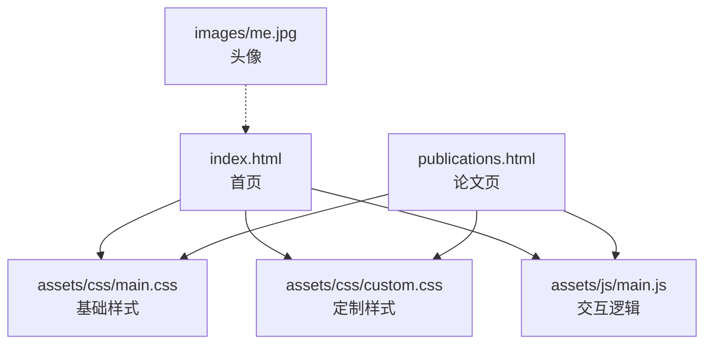
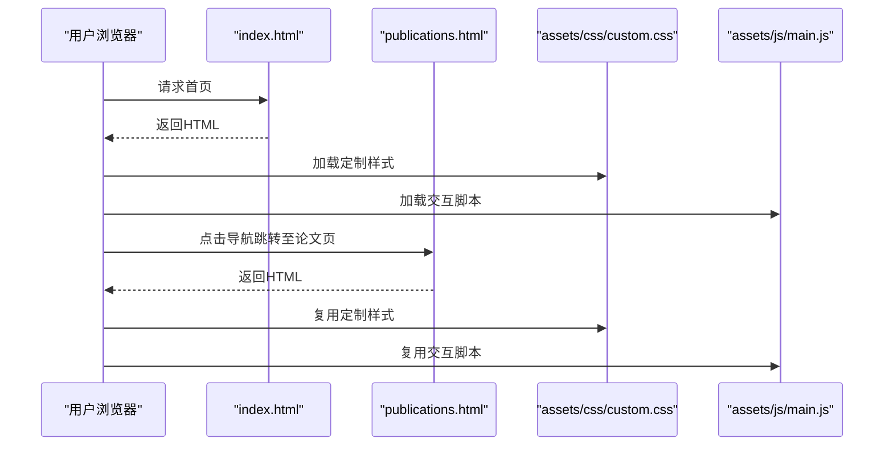
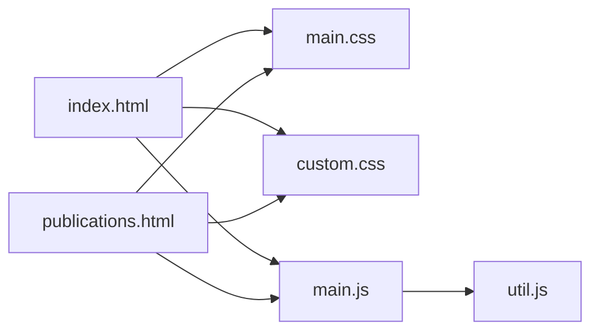

# 内容管理

<cite>
**本文引用的文件**
- [README.md](file://README.md)
- [index.html](file://index.html)
- [publications.html](file://publications.html)
- [assets/css/custom.css](file://assets/css/custom.css)
- [assets/css/main.css](file://assets/css/main.css)
- [assets/js/main.js](file://assets/js/main.js)
- [assets/js/util.js](file://assets/js/util.js)
</cite>

## 目录
1. [简介](#简介)
2. [项目结构](#项目结构)
3. [核心组件](#核心组件)
4. [架构总览](#架构总览)
5. [详细组件分析](#详细组件分析)
6. [依赖关系分析](#依赖关系分析)
7. [性能考虑](#性能考虑)
8. [故障排查指南](#故障排查指南)
9. [结论](#结论)
10. [附录](#附录)

## 简介
本仓库是一个静态个人主页与论文列表站点，采用 HTML + CSS + JavaScript 的纯前端实现。内容以“首页（含新闻、学术服务、个人信息）+ 论文页”的双页面组织，样式基于模板并辅以自定义样式，交互由 jQuery 驱动。文档面向内容维护者，提供：
- 新闻条目格式规范与更新流程
- 论文列表结构与年份分类方法
- 学术服务信息组织方式
- 高亮显示、年份标签与排序的实现机制
- 内容维护最佳实践与版本管理建议
- SEO 优化与可访问性指导

## 项目结构
- 根目录包含两个主要页面：首页 index.html 与论文页 publications.html
- 样式位于 assets/css/，其中 main.css 为模板基础样式，custom.css 为站点定制样式
- 脚本位于 assets/js/，main.js 负责响应式侧边栏与滚动锁定等交互，util.js 提供通用工具
- 图片资源位于 images/（如头像 me.jpg）
- README.md 说明模板来源与站点地址

图表来源
- [index.html:1-128](file://index.html#L1-L128)
- [publications.html:1-173](file://publications.html#L1-L173)
- [assets/css/main.css:1-200](file://assets/css/main.css#L1-L200)
- [assets/css/custom.css:1-378](file://assets/css/custom.css#L1-L378)
- [assets/js/main.js:1-262](file://assets/js/main.js#L1-L262)

章节来源
- [README.md:1-10](file://README.md#L1-L10)
- [index.html:1-128](file://index.html#L1-L128)
- [publications.html:1-173](file://publications.html#L1-L173)

## 核心组件
- 首页（index.html）
  - 头部导航：链接到首页与论文页
  - 横幅区：展示姓名、当前职位与邮箱
  - 传记区：研究兴趣与方向简述
  - 新闻区：按时间倒序排列的新闻条目列表，支持图标、年份标签与主题标注
  - 学术服务区：会议与期刊审稿经历
  - 侧边栏：菜单、个人信息卡片、版权信息
- 论文页（publications.html）
  - 标题与外部链接（Google Scholar）
  - 作者贡献说明（同等贡献、通讯作者标记）
  - 按年份分组的论文列表，支持高亮重要成果
  - 侧边栏与首页一致

章节来源
- [index.html:20-81](file://index.html#L20-L81)
- [publications.html:26-125](file://publications.html#L26-L125)

## 架构总览
该站点为静态双页面结构，遵循“内容即模板”的方式：所有数据直接嵌入 HTML，通过 CSS 控制视觉呈现，JS 处理交互与响应式行为。

图表来源
- [index.html:1-128](file://index.html#L1-L128)
- [publications.html:1-173](file://publications.html#L1-L173)
- [assets/css/custom.css:1-378](file://assets/css/custom.css#L1-L378)
- [assets/js/main.js:1-262](file://assets/js/main.js#L1-L262)

## 详细组件分析

### 新闻条目格式与更新流程
- 数据结构
  - 使用无序列表 ul.news-list 承载新闻条目
  - 每个 li 代表一条新闻，包含：
    - 图标 span.news-icon（表情符号或图标占位）
    - 年份标签 span.news-year（用于年份分类与筛选）
    - 主要内容 span.news-main（加粗显示）
    - 可选主题 span.news-topic（灰色小字）
  - 重要新闻可使用类名 news-feature 进行高亮（字体放大、颜色加深）
- 更新流程
  - 在 index.html 的 News 区块内新增 li 节点
  - 将最新条目置于列表顶部，保持时间倒序
  - 如需高亮，添加类名 news-feature
  - 确保年份标签与实际发布时间一致
- 示例路径参考
  - 新闻列表容器与条目：[index.html:49-72](file://index.html#L49-L72)
  - 高亮新闻条目类名：[index.html:52](file://index.html#L52)

章节来源
- [index.html:49-72](file://index.html#L49-L72)

### 论文列表结构与年份分类
- 数据结构
  - 使用 h3 作为年份分组标题（如 2026、2025、2024、2023 & Earlier）
  - 每个年份下使用 ul.pub-list 承载论文条目
  - 每条论文 li 包含：
    - 标题 div.pub-title（包含会议/期刊名称与年份，以及可选代码、数据集、论文链接）
    - 作者列表 div.pub-authors（本人姓名用 .me 高亮；同等贡献与通讯作者使用特殊标记）
  - 重要论文可使用类名 pub-highlight 进行背景渐变与边框高亮
- 更新流程
  - 在对应年份分组下新增 li 节点
  - 若为重要成果，添加类名 pub-highlight
  - 作者列表中本人姓名包裹在 <b class="me"> 中
  - 保持年份分组顺序从新到旧
- 示例路径参考
  - 年份分组与列表：[publications.html:38-124](file://publications.html#L38-L124)
  - 高亮论文条目类名：[publications.html:40](file://publications.html#L40)

章节来源
- [publications.html:38-124](file://publications.html#L38-L124)

### 学术服务信息的组织方法
- 使用无序列表列出会议与期刊审稿经历
- 通过加粗区分类别（如“Reviewer of Conference”、“Reviewer of Journal”）
- 更新时直接在对应区块追加 li 项
- 示例路径参考
  - 学术服务区块：[index.html:75-81](file://index.html#L75-L81)

章节来源
- [index.html:75-81](file://index.html#L75-L81)

### 个人信息与侧边栏
- 侧边栏包含：
  - 菜单导航（首页、论文页）
  - 个人信息卡片：姓名、单位、职位、地点、邮箱、GitHub、Google Scholar、LinkedIn
- 更新流程
  - 修改侧边栏 section.sidebar-profile 中的文本与链接
  - 保持语义化标签与链接目标正确
- 示例路径参考
  - 侧边栏与个人信息：[index.html:85-116](file://index.html#L85-L116), [publications.html:130-161](file://publications.html#L130-L161)

章节来源
- [index.html:85-116](file://index.html#L85-L116)
- [publications.html:130-161](file://publications.html#L130-L161)

### 高亮显示、年份分类与内容排序的实现机制
- 高亮显示
  - 新闻高亮：news-feature 类使主标题更大更醒目
  - 论文高亮：pub-highlight 类提供渐变背景、金色边框与阴影
  - 本人姓名高亮：.me 类加粗深色字体
- 年份分类
  - 新闻：span.news-year 提供年份标签，便于快速识别
  - 论文：h3 年份标题分组，清晰划分不同年份
- 内容排序
  - 新闻与论文均按时间倒序排列（最新在前）
  - 通过手动调整 DOM 顺序实现，无需复杂脚本
- 样式实现参考
  - 新闻列表与高亮：[assets/css/custom.css:249-378](file://assets/css/custom.css#L249-L378)
  - 论文列表与高亮：[assets/css/custom.css:311-370](file://assets/css/custom.css#L311-L370)

章节来源
- [assets/css/custom.css:249-378](file://assets/css/custom.css#L249-L378)

### 交互与响应式行为
- 侧边栏折叠与滚动锁定
  - 在小屏幕下侧边栏默认隐藏，可通过切换按钮展开
  - 在大屏下侧边栏固定定位，随页面滚动自动吸附
- 断点适配
  - 使用 breakpoints 配置多端尺寸策略
  - 媒体查询调整布局与字号
- 参考实现
  - 断点与侧边栏逻辑：[assets/js/main.js:13-23, 72-164, 166-235:13-23](file://assets/js/main.js#L13-L23)
  - 工具函数（面板、滚动等）：[assets/js/util.js:42-295](file://assets/js/util.js#L42-L295)

章节来源
- [assets/js/main.js:13-23](file://assets/js/main.js#L13-L23)
- [assets/js/main.js:72-164](file://assets/js/main.js#L72-L164)
- [assets/js/main.js:166-235](file://assets/js/main.js#L166-L235)
- [assets/js/util.js:42-295](file://assets/js/util.js#L42-L295)

## 依赖关系分析
- 页面依赖
  - index.html 与 publications.html 均引入 main.css 与 custom.css
  - 两者均引入 main.js 与 util.js（通过 CDN 或本地库）
- 样式依赖
  - main.css 提供基础排版与组件样式
  - custom.css 覆盖与扩展，实现站点特有风格
- 脚本依赖
  - main.js 依赖 jQuery 与 breakpoints 插件
  - util.js 提供通用工具函数，被 main.js 间接使用

图表来源
- [index.html:1-128](file://index.html#L1-L128)
- [publications.html:1-173](file://publications.html#L1-L173)
- [assets/css/main.css:1-200](file://assets/css/main.css#L1-L200)
- [assets/css/custom.css:1-378](file://assets/css/custom.css#L1-L378)
- [assets/js/main.js:1-262](file://assets/js/main.js#L1-L262)
- [assets/js/util.js:1-587](file://assets/js/util.js#L1-L587)

章节来源
- [index.html:1-128](file://index.html#L1-L128)
- [publications.html:1-173](file://publications.html#L1-L173)
- [assets/css/main.css:1-200](file://assets/css/main.css#L1-L200)
- [assets/css/custom.css:1-378](file://assets/css/custom.css#L1-L378)
- [assets/js/main.js:1-262](file://assets/js/main.js#L1-L262)
- [assets/js/util.js:1-587](file://assets/js/util.js#L1-L587)

## 性能考虑
- 静态资源最小化：CSS/JS 已压缩，避免重复加载
- 图片优化：头像使用合适尺寸与格式，避免过大影响加载
- 响应式优化：通过媒体查询与断点减少不必要重排
- 滚动性能：侧边栏滚动锁定仅在合适断点启用，降低计算开销

## 故障排查指南
- 新闻或论文未显示高亮
  - 检查是否添加了正确的类名（news-feature 或 pub-highlight）
  - 确认 custom.css 未被覆盖或缓存问题
  - 参考样式定义位置：[assets/css/custom.css:355-378](file://assets/css/custom.css#L355-L378)
- 年份标签错位或样式异常
  - 检查 span.news-year 是否正确包裹年份
  - 确认父级 ul.news-list 结构完整
  - 参考结构位置：[index.html:51-71](file://index.html#L51-L71)
- 侧边栏在小屏不显示或无法关闭
  - 检查 main.js 的断点与事件绑定是否正常
  - 确认 jQuery 与 breakpoints 已正确加载
  - 参考交互逻辑：[assets/js/main.js:72-164](file://assets/js/main.js#L72-L164)

章节来源
- [assets/css/custom.css:355-378](file://assets/css/custom.css#L355-L378)
- [index.html:51-71](file://index.html#L51-L71)
- [assets/js/main.js:72-164](file://assets/js/main.js#L72-L164)

## 结论
该站点采用简洁的静态页面结构，通过明确的 HTML 结构与定制样式实现新闻、论文与学术服务的清晰组织。维护者只需按照既定格式与流程更新内容，即可保证站点的一致性与可读性。结合 SEO 与可访问性建议，可进一步提升站点的可见性与用户体验。

## 附录

### 内容模板与数据格式规范
- 新闻条目模板
  - 容器：ul.news-list
  - 条目：li，包含 icon、year、main、topic
  - 高亮：添加类名 news-feature
  - 参考路径：[index.html:49-72](file://index.html#L49-L72)
- 论文条目模板
  - 分组：h3 年份标题
  - 容器：ul.pub-list
  - 条目：li，包含 title、authors
  - 高亮：添加类名 pub-highlight
  - 本人姓名：使用 <b class="me">
  - 参考路径：[publications.html:38-124](file://publications.html#L38-L124)
- 学术服务模板
  - 容器：ul，分类加粗标题
  - 参考路径：[index.html:75-81](file://index.html#L75-L81)

### 更新流程（步骤清单）
- 添加新闻
  - 在 index.html 的 News 区块新增 li，置于顶部
  - 填写图标、年份、主要内容与可选主题
  - 如需高亮，添加类名 news-feature
  - 保存并验证样式与链接
- 添加论文
  - 在 publications.html 对应年份分组新增 li
  - 填写标题、作者与链接
  - 如需高亮，添加类名 pub-highlight
  - 本人姓名使用 <b class="me">
  - 保存并验证分组与样式
- 更新个人信息
  - 修改侧边栏 section.sidebar-profile 中的文本与链接
  - 确保链接有效且目标正确
  - 保存并验证跨设备显示

### 高亮显示与年份分类机制
- 高亮
  - 新闻：news-feature 提升视觉权重
  - 论文：pub-highlight 提供渐变背景与边框
  - 本人姓名：.me 加粗强调
- 年份分类
  - 新闻：span.news-year 明确年份
  - 论文：h3 年份标题分组
- 参考样式：[assets/css/custom.css:249-378](file://assets/css/custom.css#L249-L378)

### 内容维护最佳实践
- 保持一致的命名与结构，避免混用类名
- 按时间倒序更新，确保最新内容靠前
- 使用语义化标签，增强可访问性
- 定期清理过期内容与无效链接
- 在提交前进行多设备预览与链接校验

### 版本管理建议
- 使用 Git 进行版本控制，每次更新创建独立分支
- 提交信息描述具体变更（如“新增2026年Nature Medicine论文”）
- 合并前进行代码审查与样式测试
- 发布前备份关键文件，确保可回滚

### SEO 优化指导
- 标题与元信息
  - 为每个页面设置唯一且描述性的 title
  - 补充 meta description（可在 head 中添加）
  - 使用语义化标签（header、section、nav、footer）
- 链接与锚点
  - 外部链接使用 target="_blank" 并添加 rel="noopener noreferrer"
  - 内部链接确保路径正确，避免死链
- 结构化数据（可选）
  - 为论文与人物信息添加 JSON-LD 结构化数据
  - 提高搜索引擎对内容的理解与展示效果

### 内容可访问性指导
- 图像替代文本
  - 为图片添加 alt 属性，描述图像内容
  - 装饰性图片可留空 alt
- 键盘导航
  - 确保所有交互元素可通过键盘操作
  - 焦点状态清晰可见
- 对比度与字体
  - 保持足够的颜色对比度，便于阅读
  - 使用相对单位与可缩放字体
- 语义化与ARIA
  - 使用合适的 HTML 语义标签
  - 必要时添加 ARIA 属性增强辅助技术支持