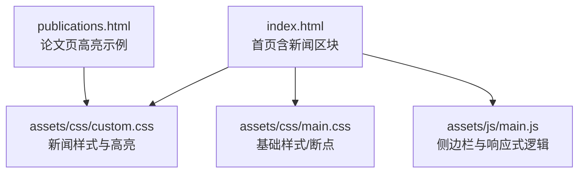
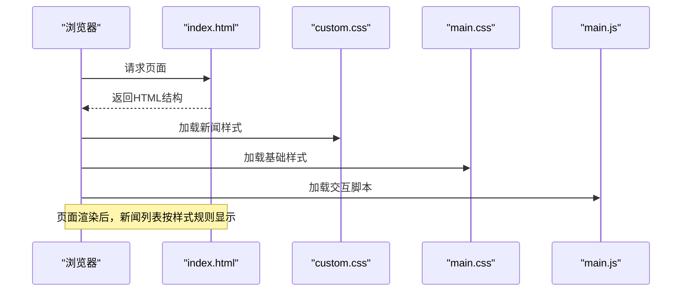
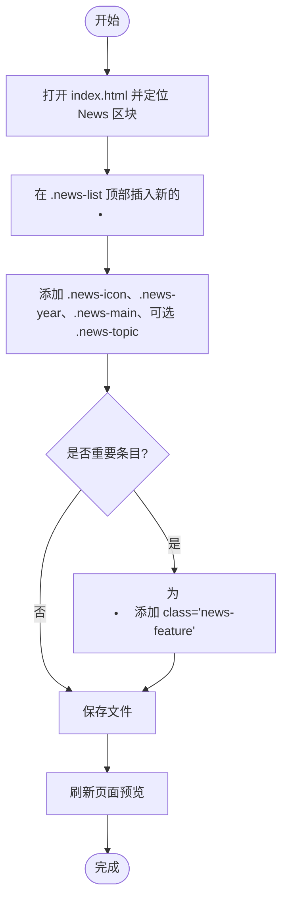
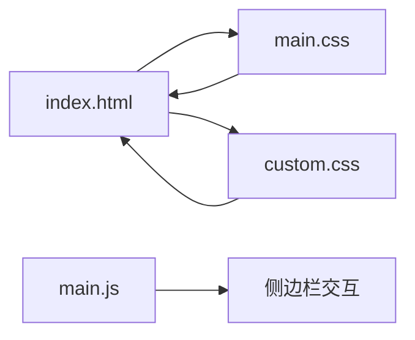

# 新闻管理

<cite>
**本文引用的文件**
- [index.html](file://index.html)
- [publications.html](file://publications.html)
- [assets/css/main.css](file://assets/css/main.css)
- [assets/css/custom.css](file://assets/css/custom.css)
- [assets/js/main.js](file://assets/js/main.js)
- [README.md](file://README.md)
</cite>

## 目录
1. [简介](#简介)
2. [项目结构](#项目结构)
3. [核心组件](#核心组件)
4. [架构总览](#架构总览)
5. [详细组件分析](#详细组件分析)
6. [依赖分析](#依赖分析)
7. [性能考虑](#性能考虑)
8. [故障排查指南](#故障排查指南)
9. [结论](#结论)
10. [附录](#附录)

## 简介
本页面为个人主页中的“新闻”模块，用于集中展示学术成果录用通知、职业进展与重要事件。系统采用纯静态 HTML + CSS 实现，通过结构化列表与样式类名组织新闻条目，支持按年份分组、图标分类、高亮显示与响应式适配。新增或维护新闻条目时，只需在指定位置插入符合规范的列表项即可。

## 项目结构
- 入口页面 index.html 包含“新闻”区块，使用无序列表承载新闻条目。
- publications.html 为论文列表页，提供高亮论文样式参考（与新闻高亮机制类似）。
- assets/css/custom.css 定义了新闻列表的布局、滚动条、年份标签、主题说明等样式。
- assets/css/main.css 提供基础排版、断点与通用样式。
- assets/js/main.js 负责侧边栏交互与响应式行为，不直接操作新闻列表。
- README.md 记录模板来源与站点信息。

图表来源
- [index.html:49-72](file://index.html#L49-L72)
- [assets/css/custom.css:249-391](file://assets/css/custom.css#L249-L391)
- [assets/css/main.css:1-120](file://assets/css/main.css#L1-L120)
- [assets/js/main.js:13-23](file://assets/js/main.js#L13-L23)
- [publications.html:38-56](file://publications.html#L38-L56)

章节来源
- [index.html:49-72](file://index.html#L49-L72)
- [assets/css/custom.css:249-391](file://assets/css/custom.css#L249-L391)
- [assets/css/main.css:1-120](file://assets/css/main.css#L1-L120)
- [assets/js/main.js:13-23](file://assets/js/main.js#L13-L23)
- [publications.html:38-56](file://publications.html#L38-L56)

## 核心组件
- 新闻容器：无序列表 .news-list，具备固定最大高度与垂直滚动条，便于在有限空间内浏览多条新闻。
- 新闻条目：每个 <li> 代表一条新闻，内部由四个语义化 span 组成：
  - .news-icon：分类图标（如 📄、🧱、🎓、🎆），用于快速识别类型。
  - .news-year：年份标记，以胶囊样式呈现，便于按年检索。
  - .news-main：主要内容，加粗显示，突出关键信息。
  - .news-topic：可选的主题说明，置于括号中，字体略小且颜色较浅。
- 高亮条目：为特别重要的新闻添加 .news-feature 类，使其背景、边框、字号与字重增强，形成视觉焦点。

章节来源
- [index.html:49-72](file://index.html#L49-L72)
- [assets/css/custom.css:249-391](file://assets/css/custom.css#L249-L391)

## 架构总览
新闻模块遵循“数据即结构”的静态站点模式：HTML 定义结构与内容，CSS 控制外观与交互，JS 仅处理全局交互（如侧边栏）。新闻列表通过类名驱动样式，无需脚本渲染，保证可维护性与加载性能。

图表来源
- [index.html:49-72](file://index.html#L49-L72)
- [assets/css/custom.css:249-391](file://assets/css/custom.css#L249-L391)
- [assets/css/main.css:1-120](file://assets/css/main.css#L1-L120)
- [assets/js/main.js:13-23](file://assets/js/main.js#L13-L23)

## 详细组件分析

### 新闻条目格式规范
- 外层容器：使用 <ul class="news-list"> 包裹所有条目。
- 单条结构：
  - <li>
    - 分类图标
    - 年份
    - 主要内容
    - (可选主题说明)
  - </li>
- 高亮条目：在需要强调的 <li> 上增加 class="news-feature"。

章节来源
- [index.html:49-72](file://index.html#L49-L72)
- [assets/css/custom.css:249-391](file://assets/css/custom.css#L249-L391)

### 新闻列表的结构组织
- 图标：.news-icon 固定宽度并居中对齐，确保多行对齐一致。
- 年份：.news-year 使用圆角胶囊样式，背景浅色、文字深色，便于扫描。
- 主要内容：.news-main 加粗显示，提升可读性。
- 主题说明：.news-topic 使用较小字号与中性色，作为补充信息。
- 列表容器：.news-list 设置最大高度与滚动条，避免长列表撑满页面。

章节来源
- [assets/css/custom.css:249-391](file://assets/css/custom.css#L249-L391)

### 高亮显示的实现方式
- 普通条目：默认样式，简洁清晰。
- 高亮条目：.news-feature 通过背景渐变、左侧边框、更大字号与更强字重，形成醒目效果；同时调整主题说明的颜色与字重，保持层次一致。
- 对比参考：publications.html 中的 .pub-highlight 展示了类似的“重点条目”高亮思路，可用于跨页面的统一风格。

章节来源
- [assets/css/custom.css:372-391](file://assets/css/custom.css#L372-L391)
- [publications.html:38-56](file://publications.html#L38-L56)

### 新闻分类系统与自定义选项
- 内置分类图标建议：
  - 📄 论文录用：用于会议/期刊录用通知。
  - 🧱 职业变动：用于入职、转岗、实习等职业进展。
  - 🎓 学位获得：用于毕业、获学位等里程碑。
  - 🎆 重大成就：用于顶级成果或重要事件，可配合 .news-feature 高亮。
- 自定义扩展：
  - 可在 custom.css 中新增 .news-category-* 类，定义不同图标的颜色或背景。
  - 若需更多图标，可直接在 .news-icon 中使用 Unicode 表情或引入图标库。
  - 可通过修改 .news-year 的配色方案统一品牌风格。

章节来源
- [index.html:49-72](file://index.html#L49-L72)
- [assets/css/custom.css:249-391](file://assets/css/custom.css#L249-L391)

### 排序规则与维护建议
- 排序规则：当前列表按时间倒序排列（最新在前），便于读者快速看到最新动态。
- 维护建议：
  - 新增条目始终插入到列表顶部，保持倒序。
  - 每条新闻必须包含 .news-icon、.news-year、.news-main，可选 .news-topic。
  - 重要条目添加 .news-feature 以增强可见性。
  - 年份字段保持一致格式（四位数字），便于阅读与潜在筛选。

章节来源
- [index.html:49-72](file://index.html#L49-L72)

### 响应式适配
- 列表容器：.news-list 使用 max-height 与 overflow-y 自动滚动，在小屏设备上仍保持良好可用性。
- 断点与缩放：main.css 提供全局断点与字体缩放策略，确保在不同屏幕尺寸下可读性。
- 侧边栏交互：main.js 处理侧边栏折叠与滚动锁定，不影响新闻列表的展示。

章节来源
- [assets/css/custom.css:249-274](file://assets/css/custom.css#L249-L274)
- [assets/css/main.css:100-108](file://assets/css/main.css#L100-L108)
- [assets/js/main.js:13-23](file://assets/js/main.js#L13-L23)

### 添加新新闻条目的步骤
- 定位：打开 index.html，找到“News”区块的 <ul class="news-list">。
- 插入：在列表顶部插入新的 <li>，包含 .news-icon、.news.year、.news.main、可选 .news.topic。
- 高亮：如需强调，为 <li> 添加 class="news-feature"。
- 保存并预览：刷新页面确认样式与滚动表现正常。

章节来源
- [index.html:49-72](file://index.html#L49-L72)
- [assets/css/custom.css:249-391](file://assets/css/custom.css#L249-L391)

### 流程图：新增新闻条目

图表来源
- [index.html:49-72](file://index.html#L49-L72)
- [assets/css/custom.css:249-391](file://assets/css/custom.css#L249-L391)

## 依赖分析
- HTML 结构依赖 CSS 类名进行样式绑定，无 JavaScript 动态渲染。
- 样式层：
  - main.css：提供基础排版、断点与通用组件样式。
  - custom.css：定义新闻列表、滚动条、年份标签、高亮等定制样式。
- 交互层：
  - main.js：处理侧边栏折叠、滚动锁定与断点切换，不直接操作新闻列表。

图表来源
- [index.html:49-72](file://index.html#L49-L72)
- [assets/css/main.css:1-120](file://assets/css/main.css#L1-L120)
- [assets/css/custom.css:249-391](file://assets/css/custom.css#L249-L391)
- [assets/js/main.js:13-23](file://assets/js/main.js#L13-L23)

章节来源
- [assets/css/main.css:1-120](file://assets/css/main.css#L1-L120)
- [assets/css/custom.css:249-391](file://assets/css/custom.css#L249-L391)
- [assets/js/main.js:13-23](file://assets/js/main.js#L13-L23)

## 性能考虑
- 静态渲染：新闻列表由 HTML 直接输出，无运行时计算，首屏加载快。
- 样式开销：仅使用少量类名与基础选择器，避免复杂动画与重绘。
- 滚动优化：列表容器使用固定最大高度与原生滚动条，减少布局抖动。
- 资源加载：CSS 与 JS 按需引入，未对新闻模块造成额外负担。

[本节为通用指导，不直接分析具体文件]

## 故障排查指南
- 问题：新闻条目未显示年份或图标错位
  - 检查是否在 <li> 中正确添加了 .news-icon 与 .news.year 的 span 元素。
  - 确认 custom.css 未被覆盖或禁用。
- 问题：高亮条目无效
  - 确认 <li> 已添加 class="news-feature"，并检查是否有其他样式覆盖。
- 问题：滚动条不可见或异常
  - 检查 .news-list 的 max-height 与 overflow-y 设置是否正确。
  - 在不同浏览器下验证滚动条样式兼容性。
- 问题：移动端显示拥挤
  - 利用 main.css 的断点与 custom.css 的紧凑间距，检查是否被第三方样式干扰。

章节来源
- [assets/css/custom.css:249-391](file://assets/css/custom.css#L249-L391)
- [assets/css/main.css:100-108](file://assets/css/main.css#L100-L108)

## 结论
该新闻管理系统以极简的静态结构实现高效的可维护性与良好的用户体验。通过统一的类名约定与清晰的样式分层，新增与维护新闻条目简单直观。高亮机制与响应式适配确保了在不同设备上的可读性与重点信息的突出展示。建议遵循本文档的格式规范与维护流程，以保持站点的一致性与稳定性。

[本节为总结性内容，不直接分析具体文件]

## 附录
- 模板来源与站点信息参见 README.md。
- 如需扩展分类图标或高亮样式，建议在 custom.css 中新增对应类名，并在 index.html 中引用。

章节来源
- [README.md:1-10](file://README.md#L1-L10)