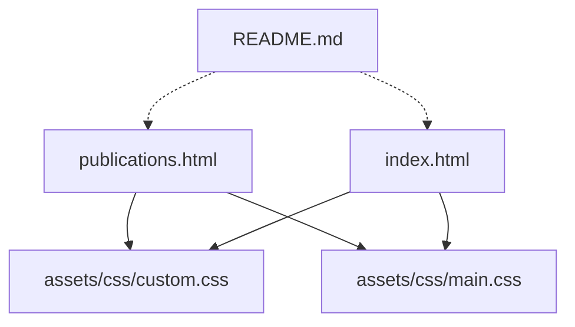
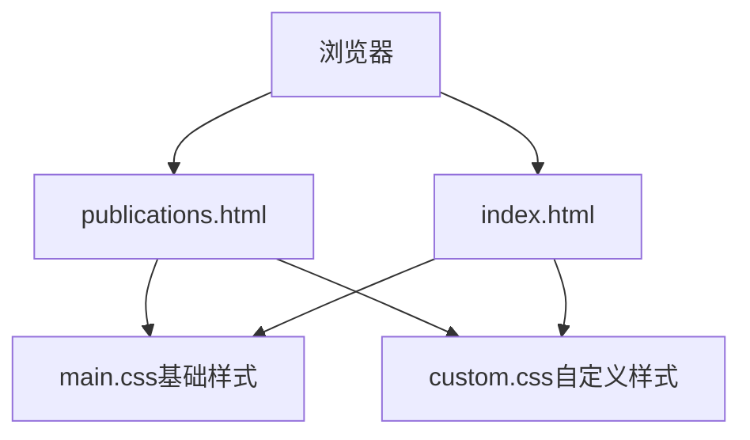
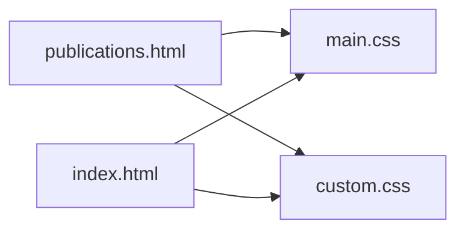
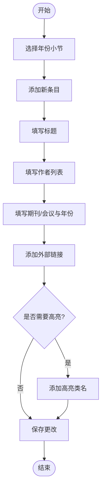

# 论文管理

<cite>
**本文引用的文件**
- [publications.html](file://publications.html)
- [index.html](file://index.html)
- [custom.css](file://assets/css/custom.css)
- [main.css](file://assets/css/main.css)
- [README.md](file://README.md)
</cite>

## 目录
1. [简介](#简介)
2. [项目结构](#项目结构)
3. [核心组件](#核心组件)
4. [架构总览](#架构总览)
5. [详细组件分析](#详细组件分析)
6. [依赖关系分析](#依赖关系分析)
7. [性能考虑](#性能考虑)
8. [故障排查指南](#故障排查指南)
9. [结论](#结论)
10. [附录](#附录)

## 简介
本系统是一个静态个人主页与论文展示页面，采用 HTML + CSS 的纯前端实现。论文列表以“按年份分组”的方式呈现，每条论文条目包含标题、作者列表、期刊/会议信息、发表年份以及外部链接（如代码仓库、论文PDF、数据集、项目页面等）。该系统便于维护与扩展，适合个人学术主页使用。

## 项目结构
- 根目录包含两个主要页面：首页 index.html 与论文页 publications.html。
- 样式资源位于 assets/css，其中 custom.css 用于个性化定制（包括论文列表样式），main.css 为模板基础样式。
- README.md 提供站点与模板来源说明。

图表来源
- [publications.html:1-184](file://publications.html#L1-L184)
- [index.html:1-147](file://index.html#L1-L147)
- [custom.css:311-391](file://assets/css/custom.css#L311-L391)
- [main.css:1-200](file://assets/css/main.css#L1-L200)
- [README.md:1-10](file://README.md#L1-L10)

章节来源
- [publications.html:1-184](file://publications.html#L1-L184)
- [index.html:1-147](file://index.html#L1-L147)
- [custom.css:311-391](file://assets/css/custom.css#L311-L391)
- [main.css:1-200](file://assets/css/main.css#L1-L200)
- [README.md:1-10](file://README.md#L1-L10)

## 核心组件
- 论文展示页（publications.html）：按年份分节组织论文条目，每个条目包含标题、作者、期刊/会议、年份和外部链接。
- 首页（index.html）：展示个人信息、新闻与学术服务，同时提供到论文页的导航。
- 样式层（custom.css、main.css）：定义论文列表、高亮条目、侧边栏、响应式布局等视觉表现。

章节来源
- [publications.html:27-125](file://publications.html#L27-L125)
- [index.html:21-81](file://index.html#L21-L81)
- [custom.css:311-391](file://assets/css/custom.css#L311-L391)
- [main.css:1-200](file://assets/css/main.css#L1-L200)

## 架构总览
该网站为静态站点，无后端逻辑。浏览器加载 HTML 后，通过引入 main.css 与 custom.css 渲染页面结构与样式。论文页通过语义化标签与类名组织内容，便于维护与SEO。

图表来源
- [publications.html:1-184](file://publications.html#L1-L184)
- [index.html:1-147](file://index.html#L1-L147)
- [main.css:1-200](file://assets/css/main.css#L1-L200)
- [custom.css:311-391](file://assets/css/custom.css#L311-L391)

## 详细组件分析

### 论文条目标准格式规范
- 标题：使用段落或标题元素包裹论文题目，突出显示。
- 作者列表：列出全部作者，本人姓名可加粗或使用特定类名进行强调；贡献标注使用符号（如等贡献、通讯作者）。
- 期刊/会议信息与年份：在标题行末尾或单独位置标明期刊/会议名称与年份。
- 外部链接：支持多种类型链接，包括论文PDF、代码仓库、数据集、项目页面等。

示例参考路径
- [publications.html:38-124](file://publications.html#L38-L124)

章节来源
- [publications.html:38-124](file://publications.html#L38-L124)

### 按年份分类的论文展示系统
- 使用年份作为小节标题（如“2026”、“2025”、“2024”、“2023 & Earlier”），将论文条目按时间倒序排列。
- 每个年份下使用列表容器承载条目，便于统一样式与交互。

示例参考路径
- [publications.html:38-124](file://publications.html#L38-L124)

章节来源
- [publications.html:38-124](file://publications.html#L38-L124)

### 如何添加新的发表论文
步骤建议：
1. 打开 publications.html。
2. 找到对应年份的小节标题（若无则新增一个年份小节）。
3. 在该年份下的列表中添加一个新的列表项，包含标题、作者、期刊/会议、年份与外部链接。
4. 如需高亮重要论文，可为列表项添加高亮类名。
5. 保存并部署更新。

示例参考路径
- [publications.html:38-124](file://publications.html#L38-L124)

章节来源
- [publications.html:38-124](file://publications.html#L38-L124)

### 论文类型标识与重要性标注方法
- 论文类型标识：在标题中直接注明期刊/会议名称（如 Nature Medicine、ACM MM、ICLR、TPAMI 等），或在标题末尾标注“arXiv preprint”表示预印本。
- 重要性标注：为重要条目添加高亮类名，使其背景与边框颜色更醒目，提升可读性与注意力。
- 作者贡献标注：使用符号标记等贡献与通讯作者，并在页面顶部提供图例说明。

示例参考路径
- [publications.html:34-36](file://publications.html#L34-L36)
- [publications.html:40-55](file://publications.html#L40-L55)
- [custom.css:355-370](file://assets/css/custom.css#L355-L370)

章节来源
- [publications.html:34-36](file://publications.html#L34-L36)
- [publications.html:40-55](file://publications.html#L40-L55)
- [custom.css:355-370](file://assets/css/custom.css#L355-L370)

### 外部链接集成（PDF下载、代码仓库、项目页面）
- 链接类型：
  - 论文PDF：指向期刊官网或 arXiv 的论文页面。
  - 代码仓库：指向 GitHub 或其他代码托管平台。
  - 数据集：指向数据下载页面。
  - 项目页面：指向项目主页或演示页面。
- 实现方式：在每个条目标题行内嵌入超链接，使用简洁文本标签（如“Paper”、“Code”、“Dataset”）提高可读性。

示例参考路径
- [publications.html:45-95](file://publications.html#L45-L95)

章节来源
- [publications.html:45-95](file://publications.html#L45-L95)

### 论文信息维护与版本管理最佳实践
- 版本管理：建议使用 Git 对站点源码进行版本控制，每次新增或修改论文条目提交一次变更，便于回溯与协作。
- 命名规范：保持年份小节顺序为倒序（最新在前），条目内部字段顺序一致（标题、作者、期刊/会议、年份、链接）。
- 一致性检查：确保所有链接有效、作者名单完整、期刊/会议名称准确、年份正确。
- 备份策略：定期推送至远程仓库，避免本地丢失。

章节来源
- [README.md:1-10](file://README.md#L1-L10)

### SEO优化最佳实践
- 语义化HTML：使用合适的标题层级（h2/h3）、列表与段落，增强可读性与搜索引擎抓取效果。
- 元信息：在页面头部设置合适的 title 与 meta 描述（当前已包含基本 meta）。
- 链接质量：为论文条目提供权威来源链接（期刊官网、arXiv、GitHub），提升可信度与索引质量。
- 结构化数据（可选）：未来可引入 JSON-LD 等结构化数据标记，进一步提升搜索展示效果。

章节来源
- [publications.html:4-9](file://publications.html#L4-L9)
- [index.html:4-9](file://index.html#L4-L9)

## 依赖关系分析
- 页面依赖样式：
  - publications.html 依赖 main.css 与 custom.css。
  - index.html 同样依赖 main.css 与 custom.css。
- 样式职责划分：
  - main.css 提供基础排版、字体、颜色、响应式规则。
  - custom.css 提供个性化样式，包括论文列表、高亮条目、侧边栏与新闻列表样式。

图表来源
- [publications.html:1-184](file://publications.html#L1-L184)
- [index.html:1-147](file://index.html#L1-L147)
- [main.css:1-200](file://assets/css/main.css#L1-L200)
- [custom.css:311-391](file://assets/css/custom.css#L311-L391)

章节来源
- [publications.html:1-184](file://publications.html#L1-L184)
- [index.html:1-147](file://index.html#L1-L147)
- [main.css:1-200](file://assets/css/main.css#L1-L200)
- [custom.css:311-391](file://assets/css/custom.css#L311-L391)

## 性能考虑
- 静态资源最小化：CSS 已压缩，无需额外构建流程。
- 图片优化：头像与图片应合理压缩尺寸，减少加载时间。
- 外链数量控制：每个条目外链不宜过多，避免影响首屏渲染速度。
- 缓存策略：利用浏览器缓存静态资源，提升重复访问体验。

[本节为通用指导，不直接分析具体文件]

## 故障排查指南
- 论文列表未显示：
  - 检查 publications.html 中对应年份小节是否存在且包含列表项。
  - 确认 custom.css 中的 .pub-list 相关样式未被覆盖或禁用。
- 高亮条目无效：
  - 确认列表项是否添加了高亮类名。
  - 检查 custom.css 中高亮样式是否正确应用。
- 链接无法打开：
  - 验证链接地址是否正确，是否为有效URL。
  - 检查目标服务器是否允许跨域访问（部分期刊站点可能限制）。
- 样式错乱：
  - 确认 main.css 与 custom.css 均被正确引入。
  - 检查浏览器开发者工具中的样式冲突。

章节来源
- [publications.html:38-124](file://publications.html#L38-L124)
- [custom.css:311-391](file://assets/css/custom.css#L311-L391)

## 结论
本论文管理系统基于静态 HTML/CSS 实现，结构简单、易于维护。通过按年份分组的论文列表、标准化的条目格式与灵活的外部链接集成，满足个人学术主页的基本需求。结合版本管理与SEO优化实践，可进一步提升内容的可发现性与长期可维护性。

[本节为总结性内容，不直接分析具体文件]

## 附录

### 论文条目结构流程图

[此图为概念流程图，不直接映射具体代码文件]