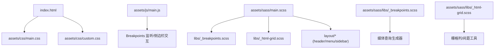
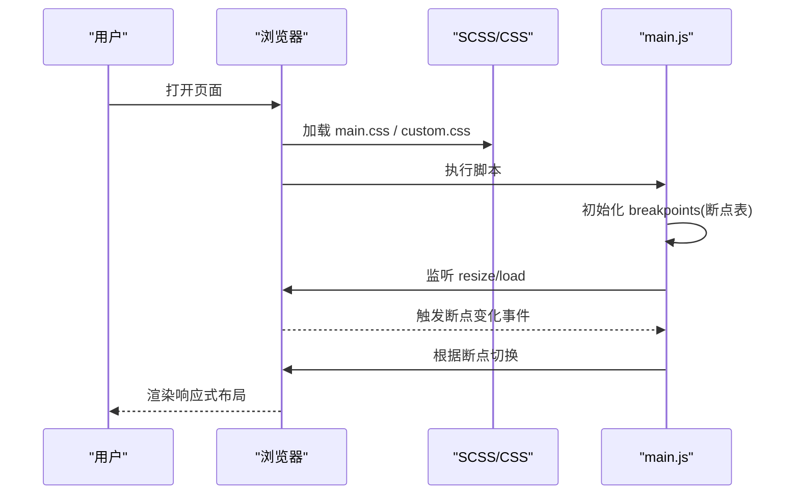
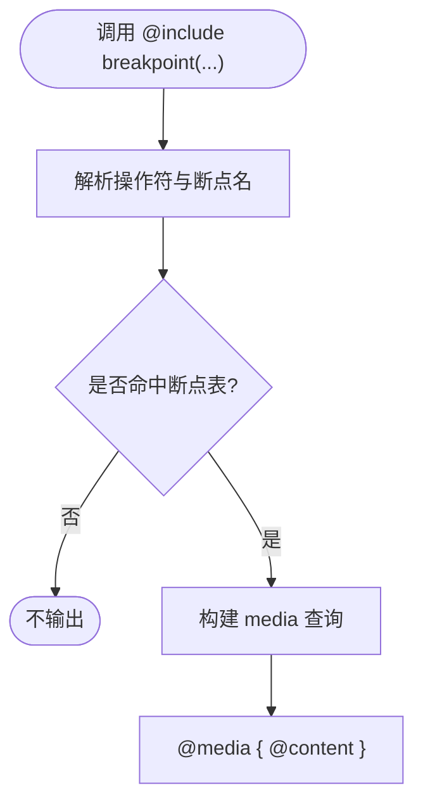
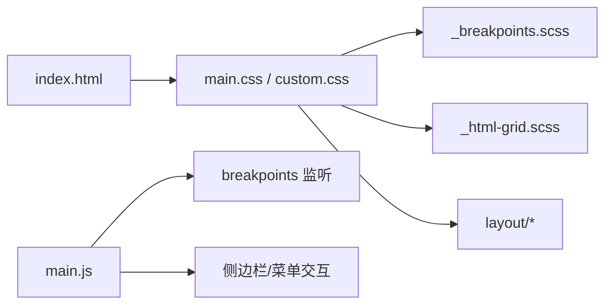

# 响应式设计

<cite>
**本文引用的文件**
- [assets/sass/main.scss](file://assets/sass/main.scss)
- [assets/sass/libs/_breakpoints.scss](file://assets/sass/libs/_breakpoints.scss)
- [assets/sass/libs/_html-grid.scss](file://assets/sass/libs/_html-grid.scss)
- [assets/sass/layout/_header.scss](file://assets/sass/layout/_header.scss)
- [assets/sass/layout/_menu.scss](file://assets/sass/layout/_menu.scss)
- [assets/sass/layout/_sidebar.scss](file://assets/sass/layout/_sidebar.scss)
- [assets/css/main.css](file://assets/css/main.css)
- [assets/css/custom.css](file://assets/css/custom.css)
- [index.html](file://index.html)
- [assets/js/main.js](file://assets/js/main.js)
</cite>

## 目录
1. [简介](#简介)
2. [项目结构](#项目结构)
3. [核心组件](#核心组件)
4. [架构总览](#架构总览)
5. [详细组件分析](#详细组件分析)
6. [依赖关系分析](#依赖关系分析)
7. [性能考量](#性能考量)
8. [故障排查指南](#故障排查指南)
9. [结论](#结论)
10. [附录](#附录)

## 简介
本文件面向跨设备适配的响应式设计，系统阐述该网站的断点策略、媒体查询使用与移动优先原则；说明不同屏幕尺寸下的布局调整、导航适配与性能优化；补充移动端交互优化（触摸手势）、可访问性考虑；并提供具体的断点配置与样式适配示例、测试方法与调试技巧。

## 项目结构
该项目采用 SCSS 模块化组织，通过主入口引入基础库、组件与布局，编译后输出 main.css；自定义样式在 custom.css 中叠加；JS 负责断点监听、侧边栏交互与滚动锁定等运行时行为；HTML 提供视口元信息与页面骨架。

图表来源
- [assets/sass/main.scss:1-62](file://assets/sass/main.scss#L1-L62)
- [assets/sass/libs/_breakpoints.scss:13-223](file://assets/sass/libs/_breakpoints.scss#L13-L223)
- [assets/sass/libs/_html-grid.scss:5-149](file://assets/sass/libs/_html-grid.scss#L5-L149)
- [assets/sass/layout/_header.scss:31-51](file://assets/sass/layout/_header.scss#L31-L51)
- [assets/sass/layout/_menu.scss:1-98](file://assets/sass/layout/_menu.scss#L1-L98)
- [assets/sass/layout/_sidebar.scss:121-223](file://assets/sass/layout/_sidebar.scss#L121-L223)
- [assets/css/main.css:70-108](file://assets/css/main.css#L70-L108)
- [assets/css/custom.css:48-101](file://assets/css/custom.css#L48-L101)
- [index.html:7-9](file://index.html#L7-L9)
- [assets/js/main.js:13-23](file://assets/js/main.js#L13-L23)

章节来源
- [assets/sass/main.scss:1-62](file://assets/sass/main.scss#L1-L62)
- [index.html:7-9](file://index.html#L7-L9)

## 核心组件
- 断点系统：基于 mixins 将命名断点映射为 @media 查询，支持 >=、<=、>、<、! 等操作符与范围断点。
- 栅格系统：基于 Flexbox 的 12 列网格，提供列宽、偏移、对齐与间距工具类，按断点生成对应后缀类名。
- 布局模块：Header、Menu、Sidebar 分别在不同断点切换显示模式（固定侧栏/抽屉式）。
- 运行时 JS：初始化断点监听、处理侧边栏开关、点击关闭、滚动锁定与对象图片兼容回退。
- 自定义样式：Banner 区域在横竖屏与窄屏下自适应排版，新闻列表与出版物列表增强可读性与视觉层次。

章节来源
- [assets/sass/libs/_breakpoints.scss:13-223](file://assets/sass/libs/_breakpoints.scss#L13-L223)
- [assets/sass/libs/_html-grid.scss:5-149](file://assets/sass/libs/_html-grid.scss#L5-L149)
- [assets/sass/layout/_header.scss:31-51](file://assets/sass/layout/_header.scss#L31-L51)
- [assets/sass/layout/_sidebar.scss:121-223](file://assets/sass/layout/_sidebar.scss#L121-L223)
- [assets/js/main.js:13-23](file://assets/js/main.js#L13-L23)
- [assets/css/custom.css:48-101](file://assets/css/custom.css#L48-L101)

## 架构总览
网站遵循“移动优先”的样式演进路径：默认样式针对小屏，逐步在大屏上扩展布局与内容密度；同时通过 JS 在 <=large 时启用抽屉式侧边栏，在大屏恢复固定侧栏。

图表来源
- [assets/js/main.js:13-23](file://assets/js/main.js#L13-L23)
- [assets/js/main.js:72-164](file://assets/js/main.js#L72-L164)
- [assets/sass/layout/_sidebar.scss:154-196](file://assets/sass/layout/_sidebar.scss#L154-L196)
- [assets/css/main.css:70-108](file://assets/css/main.css#L70-L108)

## 详细组件分析

### 断点策略与媒体查询
- 断点定义：在 main.scss 中集中声明 xlarge、large、medium、small、xsmall、xxsmall 及两个组合断点。
- 媒体查询生成：_breakpoints.scss 提供 breakpoint() mixin，支持操作符与范围，自动拼接 min-width/max-width 或完整查询字符串。
- 应用方式：在布局与组件中使用 @include breakpoint('<=small') 等形式按需覆盖样式。

图表来源
- [assets/sass/libs/_breakpoints.scss:13-223](file://assets/sass/libs/_breakpoints.scss#L13-L223)
- [assets/sass/main.scss:18-27](file://assets/sass/main.scss#L18-L27)

章节来源
- [assets/sass/main.scss:18-27](file://assets/sass/main.scss#L18-L27)
- [assets/sass/libs/_breakpoints.scss:13-223](file://assets/sass/libs/_breakpoints.scss#L13-L223)

### 栅格系统与布局
- 栅格能力：Flex 容器 + 12 列宽度、偏移、对齐、间距工具类，按断点生成 -xlarge/-large/-medium/-small 等后缀类名。
- 响应式列：在小屏默认全宽，随断点递增逐步多列并排，保证信息密度与可读性平衡。
- 使用建议：以 col-* 控制列宽，gtr-* 控制间距，aln-* 控制对齐，配合断点后缀实现渐进式布局。

章节来源
- [assets/sass/libs/_html-grid.scss:5-149](file://assets/sass/libs/_html-grid.scss#L5-L149)
- [assets/css/main.css:233-800](file://assets/css/main.css#L233-L800)

### Header 与 Banner 的响应式
- Header：在小屏增加顶部内边距，Logo 字号放大，图标区绝对定位避免挤压。
- Banner：自定义样式在横屏/竖屏与窄屏下调整图片位置与尺寸，确保信息层级清晰。

章节来源
- [assets/sass/layout/_header.scss:31-51](file://assets/sass/layout/_header.scss#L31-L51)
- [assets/css/custom.css:48-101](file://assets/css/custom.css#L48-L101)

### 导航与侧边栏（菜单）
- 桌面端：侧边栏固定展示，内容区与侧栏并排。
- 平板及以下：侧边栏变为抽屉式，默认隐藏，通过 Toggle 按钮展开；点击链接或点击主体区域收起。
- 菜单交互：子菜单通过 opener 切换展开/收起，并在高度变化时重新计算滚动锁定。

章节来源
- [assets/sass/layout/_sidebar.scss:121-223](file://assets/sass/layout/_sidebar.scss#L121-L223)
- [assets/sass/layout/_menu.scss:1-98](file://assets/sass/layout/_menu.scss#L1-L98)
- [assets/js/main.js:72-164](file://assets/js/main.js#L72-L164)
- [assets/js/main.js:237-260](file://assets/js/main.js#L237-L260)

### 移动端交互优化与触摸手势
- 触摸高亮：菜单项与 Toggle 禁用默认高亮色，提升触控体验。
- 事件处理：侧边栏拦截 touchstart/touchmove/touchend 防止穿透；点击主体区域关闭抽屉。
- 滚动锁定：大屏侧栏内容滚动时进行固定定位与 top 值计算，保持视觉稳定。
- 兼容性：对不支持 object-fit 的浏览器，用背景图模拟封面效果。

章节来源
- [assets/sass/layout/_menu.scss:33-37](file://assets/sass/layout/_menu.scss#L33-L37)
- [assets/sass/layout/_sidebar.scss:167-171](file://assets/sass/layout/_sidebar.scss#L167-L171)
- [assets/js/main.js:85-89](file://assets/js/main.js#L85-L89)
- [assets/js/main.js:105-164](file://assets/js/main.js#L105-L164)
- [assets/js/main.js:166-235](file://assets/js/main.js#L166-L235)
- [assets/js/main.js:51-70](file://assets/js/main.js#L51-L70)

### 可访问性考虑
- 语义化 HTML：使用 header、nav、section、footer 等语义标签，利于辅助技术识别。
- 视口设置：viewport 禁止缩放但允许设备宽度自适应，保障移动端布局正确。
- 焦点与键盘：链接具备可聚焦状态，Hover/Focus 颜色对比度良好；侧边栏在小屏通过按钮切换，便于键盘操作。
- 文本可读性：标题与正文字号随断点递减，行高与字重保证阅读舒适度。

章节来源
- [index.html:7-9](file://index.html#L7-L9)
- [assets/css/main.css:93-108](file://assets/css/main.css#L93-L108)
- [assets/sass/layout/_menu.scss:21-31](file://assets/sass/layout/_menu.scss#L21-L31)

### 具体断点配置与样式适配示例
- 断点表（命名与范围）：
  - xlarge: 1281px–1680px
  - large: 981px–1280px
  - medium: 737px–980px
  - small: 481px–736px
  - xsmall: 361px–480px
  - xxsmall: ≤360px
  - 组合：xlarge-to-max、small-to-xlarge
- 媒体查询示例（示意）：
  - 在小屏限制最小宽度，避免过窄导致溢出
  - 在大屏逐步减小字体以提升信息密度
  - 在特定断点切换 Banner 方向与图片尺寸
- 栅格示例（示意）：
  - 小屏使用全宽列，中屏起使用两列/三列布局
  - 通过 gtr-* 控制间距，aln-* 控制对齐

章节来源
- [assets/sass/main.scss:18-27](file://assets/sass/main.scss#L18-L27)
- [assets/css/main.css:70-108](file://assets/css/main.css#L70-L108)
- [assets/css/custom.css:48-101](file://assets/css/custom.css#L48-L101)
- [assets/sass/libs/_html-grid.scss:5-149](file://assets/sass/libs/_html-grid.scss#L5-L149)

## 依赖关系分析
- 样式层：main.scss 聚合 libs、components、layout；编译产物 main.css 被 index.html 引用；custom.css 作为主题定制层叠加。
- 脚本层：main.js 依赖 jQuery 与 breakpoints 逻辑，负责运行时交互与断点监听。
- 组件耦合：Header/Sidebar/Menu 通过 CSS 类与 JS 事件协作；栅格与断点解耦，便于复用。

图表来源
- [assets/sass/main.scss:1-62](file://assets/sass/main.scss#L1-L62)
- [assets/js/main.js:13-23](file://assets/js/main.js#L13-L23)
- [assets/sass/libs/_breakpoints.scss:13-223](file://assets/sass/libs/_breakpoints.scss#L13-L223)
- [assets/sass/libs/_html-grid.scss:5-149](file://assets/sass/libs/_html-grid.scss#L5-L149)

章节来源
- [assets/sass/main.scss:1-62](file://assets/sass/main.scss#L1-L62)
- [assets/js/main.js:13-23](file://assets/js/main.js#L13-L23)

## 性能考量
- 资源体积：CSS 已压缩，字体与图标按需加载；图片使用 object-fit 与背景图回退减少重绘。
- 渲染性能：Resize 事件节流，避免频繁重排；侧边栏滚动锁定仅在 >large 生效，降低小屏开销。
- 兼容性回退：object-fit 不可用时以背景图替代，确保视觉一致且无额外布局抖动。
- 动画与过渡：页面预加载阶段禁用动画，提升首屏感知速度。

章节来源
- [assets/js/main.js:25-49](file://assets/js/main.js#L25-L49)
- [assets/js/main.js:51-70](file://assets/js/main.js#L51-L70)
- [assets/js/main.js:166-235](file://assets/js/main.js#L166-L235)

## 故障排查指南
- 侧边栏未隐藏/无法展开：
  - 检查 breakpoints 是否正确初始化，确认当前断点是否满足条件
  - 查看 #sidebar.inactive 类是否被正确添加/移除
  - 确认 toggle 按钮绑定事件未被其他脚本阻止冒泡
- Banner 图片错位：
  - 检查自定义媒体查询是否覆盖了默认布局
  - 确认 object-fit 回退逻辑是否生效
- 滚动锁定异常：
  - 确认仅在 >large 断点下启用
  - 若动态修改了侧栏高度，需触发 resize.sidebar-lock 事件同步计算

章节来源
- [assets/js/main.js:72-164](file://assets/js/main.js#L72-L164)
- [assets/js/main.js:166-235](file://assets/js/main.js#L166-L235)
- [assets/css/custom.css:48-101](file://assets/css/custom.css#L48-L101)

## 结论
本项目以移动优先为原则，通过统一的断点系统与栅格工具，结合组件化的布局样式与轻量级 JS 交互，实现了从手机到桌面的平滑适配。侧边栏在小屏转为抽屉式，Banner 与内容区在不同方向与尺寸下均保持良好的可读性与视觉层次。整体方案兼顾性能与可维护性，便于后续扩展与主题定制。

## 附录
- 测试方法
  - 使用浏览器开发者工具的“设备仿真”切换常见分辨率与像素比，验证断点切换与交互
  - 在真实设备上测试触摸手势（点击、滑动、长按），确认事件拦截与反馈
  - 使用 Lighthouse 评估可访问性与性能指标，关注字体加载与图片优化
- 调试技巧
  - 在控制台打印 breakpoints.active(...) 判断当前断点
  - 通过元素面板检查 .inactive 类与媒体查询生效情况
  - 对滚动锁定问题，手动触发 resize.sidebar-lock 观察布局同步

[本节为通用指导，不直接分析具体文件]