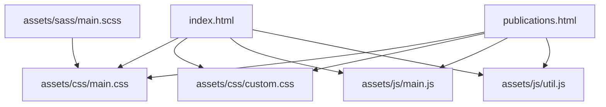
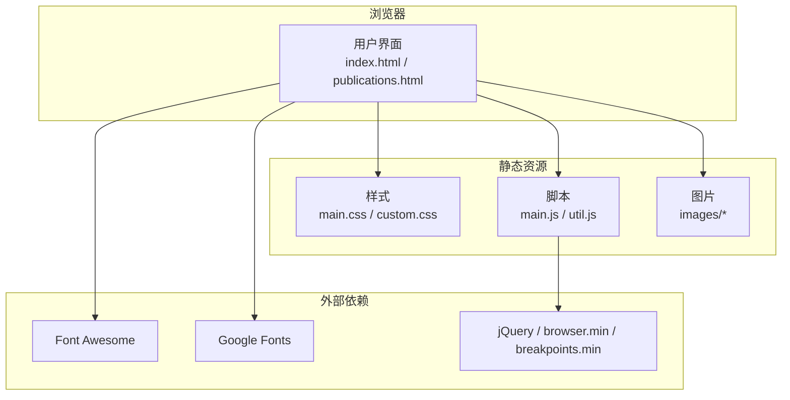
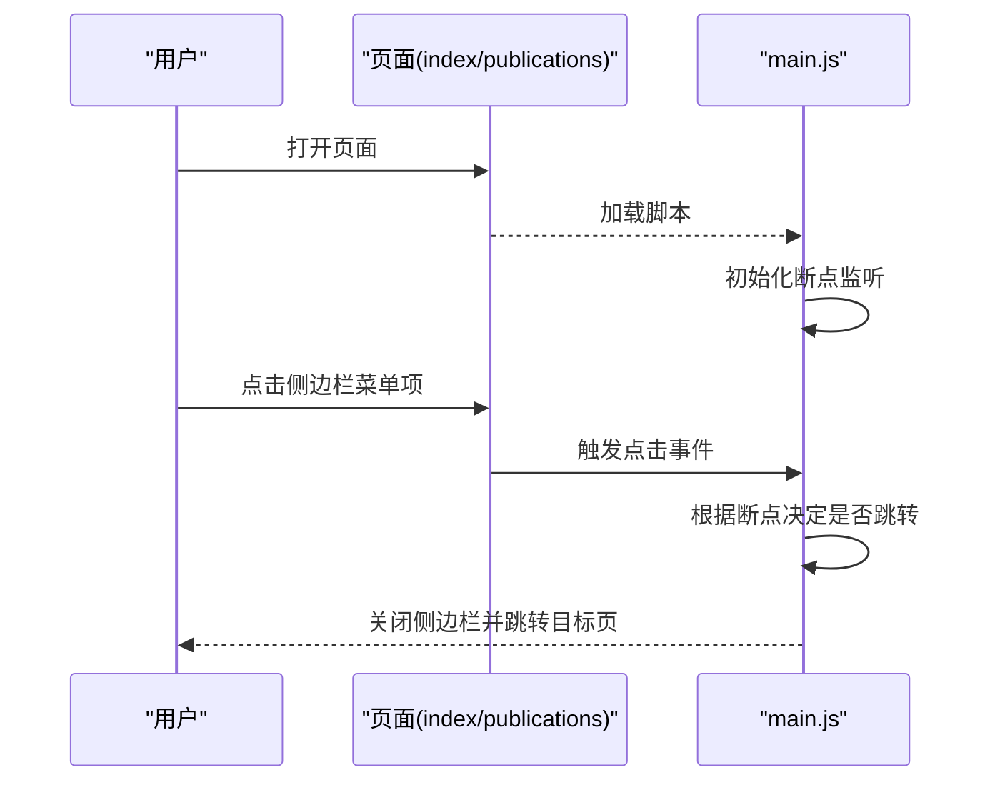
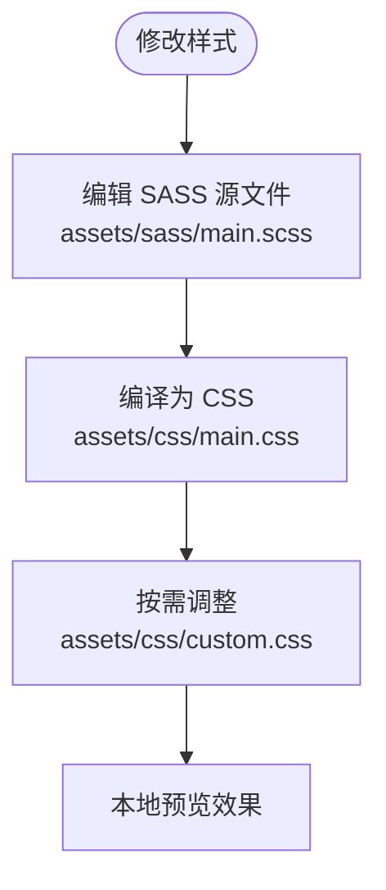
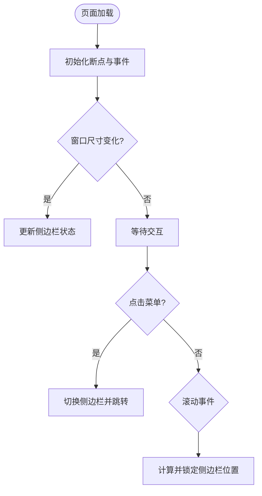
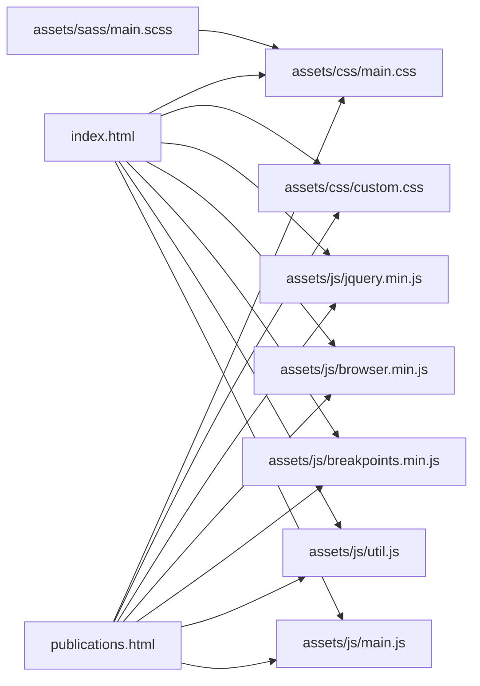

# 快速开始

<cite>
**本文引用的文件**
- [README.md](file://README.md)
- [.gitignore](file://.gitignore)
- [index.html](file://index.html)
- [publications.html](file://publications.html)
- [assets/sass/main.scss](file://assets/sass/main.scss)
- [assets/css/custom.css](file://assets/css/custom.css)
- [assets/js/main.js](file://assets/js/main.js)
- [assets/js/util.js](file://assets/js/util.js)
</cite>

## 目录
1. [简介](#简介)
2. [项目结构](#项目结构)
3. [核心组件](#核心组件)
4. [架构总览](#架构总览)
5. [详细组件分析](#详细组件分析)
6. [依赖关系分析](#依赖关系分析)
7. [性能与兼容性](#性能与兼容性)
8. [常见问题与故障排除](#常见问题与故障排除)
9. [结论](#结论)
10. [附录：完整命令行流程](#附录完整命令行流程)

## 简介
本项目是一个基于 HTML/CSS/JS 的静态个人主页，采用 GitHub Pages 托管。模板来源于 HTML5 UP 的 Editorial 主题。站点包含“首页”和“论文列表”两个页面，使用响应式布局、侧边栏菜单与滚动锁定等交互效果。无需后端服务，可直接在浏览器中预览并部署到 GitHub Pages。

## 项目结构
- 根目录包含两个入口页面 index.html（首页）与 publications.html（论文页）。
- assets 目录下组织样式与脚本：
  - css：编译后的主样式 main.css 与自定义样式 custom.css。
  - js：交互逻辑 main.js、工具库 util.js 以及第三方库（如 jQuery、browser.min、breakpoints.min）。
  - sass：源码样式，按 base/components/layout/libs 分层组织，入口为 main.scss。
- images：存放图片资源（例如头像 me.jpg）。
- .gitignore：忽略 macOS/Windows/Linux 系统产生的临时文件。

图表来源
- [index.html:1-147](file://index.html#L1-L147)
- [publications.html:1-184](file://publications.html#L1-L184)
- [assets/sass/main.scss:1-62](file://assets/sass/main.scss#L1-L62)

章节来源
- [README.md:1-10](file://README.md#L1-L10)
- [index.html:1-147](file://index.html#L1-L147)
- [publications.html:1-184](file://publications.html#L1-L184)
- [assets/sass/main.scss:1-62](file://assets/sass/main.scss#L1-L62)

## 核心组件
- 页面入口
  - 首页：index.html，展示个人信息、新闻与学术服务。
  - 论文页：publications.html，按年份列出论文条目，支持链接跳转。
- 样式体系
  - 主样式由 SASS 编译生成 assets/css/main.css，入口为 assets/sass/main.scss。
  - 自定义样式 assets/css/custom.css 覆盖布局、配色、侧边栏与列表样式。
- 交互脚本
  - assets/js/main.js 实现断点切换、侧边栏折叠/展开、滚动锁定、对象适配等。
  - assets/js/util.js 提供面板、占位符兼容、元素优先级等工具方法。
- 资源与字体
  - 引入 Font Awesome 图标与 Google Fonts 字体。
  - 图片资源位于 images 目录。

章节来源
- [assets/sass/main.scss:1-62](file://assets/sass/main.scss#L1-L62)
- [assets/css/custom.css:1-378](file://assets/css/custom.css#L1-L378)
- [assets/js/main.js:1-262](file://assets/js/main.js#L1-L262)
- [assets/js/util.js:1-587](file://assets/js/util.js#L1-L587)
- [index.html:1-147](file://index.html#L1-L147)
- [publications.html:1-184](file://publications.html#L1-L184)

## 架构总览
站点采用纯前端静态架构：HTML 负责结构与内容，CSS/SASS 负责样式与响应式，JavaScript 负责交互与兼容性处理。GitHub Pages 直接托管这些静态资源，无需服务器端渲染或构建步骤。

图表来源
- [index.html:1-147](file://index.html#L1-L147)
- [publications.html:1-184](file://publications.html#L1-L184)
- [assets/sass/main.scss:1-62](file://assets/sass/main.scss#L1-L62)

## 详细组件分析

### 页面与导航
- 顶部导航与侧边栏菜单在两个页面保持一致，便于在“首页”和“论文页”之间切换。
- 侧边栏在小屏设备上默认隐藏，可通过点击切换显示；在大屏上常驻显示。

图表来源
- [index.html:1-147](file://index.html#L1-L147)
- [publications.html:1-184](file://publications.html#L1-L184)
- [assets/js/main.js:72-164](file://assets/js/main.js#L72-L164)

章节来源
- [index.html:20-24](file://index.html#L20-L24)
- [publications.html:20-24](file://publications.html#L20-L24)
- [assets/js/main.js:72-164](file://assets/js/main.js#L72-L164)

### 样式与主题定制
- 通过 assets/sass/main.scss 统一引入基础、组件与布局样式，并定义断点策略。
- assets/css/custom.css 对头部、横幅、侧边栏、新闻与论文列表进行视觉定制，包括颜色、间距、滚动条样式与高亮规则。

图表来源
- [assets/sass/main.scss:1-62](file://assets/sass/main.scss#L1-L62)
- [assets/css/custom.css:1-378](file://assets/css/custom.css#L1-L378)

章节来源
- [assets/sass/main.scss:1-62](file://assets/sass/main.scss#L1-L62)
- [assets/css/custom.css:1-378](file://assets/css/custom.css#L1-L378)

### 交互与兼容性
- main.js 负责：
  - 断点监听与侧边栏状态切换。
  - 移动端点击菜单后自动关闭侧边栏并跳转。
  - 滚动时侧边栏固定位置以优化阅读体验。
  - 针对不支持 object-fit 的浏览器回退为背景图方案。
- util.js 提供通用工具函数，增强表单与面板行为。

图表来源
- [assets/js/main.js:13-23](file://assets/js/main.js#L13-L23)
- [assets/js/main.js:72-164](file://assets/js/main.js#L72-L164)
- [assets/js/main.js:166-233](file://assets/js/main.js#L166-L233)

章节来源
- [assets/js/main.js:13-23](file://assets/js/main.js#L13-L23)
- [assets/js/main.js:72-164](file://assets/js/main.js#L72-L164)
- [assets/js/main.js:166-233](file://assets/js/main.js#L166-L233)
- [assets/js/util.js:1-587](file://assets/js/util.js#L1-L587)

## 依赖关系分析
- 页面通过 <link> 引入 main.css 与 custom.css。
- 页面通过 <script> 引入 jQuery、browser.min、breakpoints.min、util.js、main.js。
- SASS 入口 main.scss 引入字体图标与 Google Fonts，并按模块组织样式。

图表来源
- [index.html:1-147](file://index.html#L1-L147)
- [publications.html:1-184](file://publications.html#L1-L184)
- [assets/sass/main.scss:1-62](file://assets/sass/main.scss#L1-L62)

章节来源
- [index.html:1-147](file://index.html#L1-L147)
- [publications.html:1-184](file://publications.html#L1-L184)
- [assets/sass/main.scss:1-62](file://assets/sass/main.scss#L1-L62)

## 性能与兼容性
- 现代浏览器即可运行，建议使用最新版本的 Chrome、Firefox、Edge、Safari。
- 站点已内置 object-fit 兼容回退逻辑，确保在不支持的浏览器下仍正确显示图片。
- 建议保持图片体积合理，避免影响首屏加载速度。
- 如需进一步优化，可考虑合并与压缩 CSS/JS 资源（当前已使用 min 版本库）。

[本节为通用指导，不直接分析具体文件]

## 常见问题与故障排除
- 本地无法看到样式或脚本
  - 检查 index.html/publications.html 是否正确引用 assets/css/main.css、custom.css 与 assets/js/*.js。
  - 确认路径大小写与实际文件名一致。
- 图片不显示
  - 确认 images 目录下的图片存在且路径正确。
  - 检查浏览器控制台是否有 404 错误。
- 侧边栏在小屏不出现
  - 这是预期行为，点击页面任意处或菜单项可触发显示/隐藏逻辑。
- 样式未生效
  - 若仅修改了 SASS，需先编译为 CSS；或直接修改 assets/css/custom.css 即时生效。
- 部署后样式错乱
  - 确认 GitHub Pages 分支与仓库根目录设置正确，静态资源未被 .gitignore 忽略。

章节来源
- [index.html:1-147](file://index.html#L1-L147)
- [publications.html:1-184](file://publications.html#L1-L184)
- [assets/sass/main.scss:1-62](file://assets/sass/main.scss#L1-L62)
- [.gitignore:1-21](file://.gitignore#L1-L21)

## 结论
本项目结构简单清晰，适合快速搭建个人主页。通过本地直接打开 HTML 即可预览，修改内容与样式后即可提交到 GitHub 并通过 GitHub Pages 发布。对于需要更复杂样式的场景，可使用 SASS 管理样式并编译输出。

[本节为总结性内容，不直接分析具体文件]

## 附录：完整命令行流程
以下为从零开始的完整操作步骤，涵盖克隆、查看、修改与部署上线。

- 环境要求
  - 现代浏览器（Chrome/Firefox/Edge/Safari 最新版）
  - Git 客户端（用于克隆与提交）
  - 可选：Node.js + Sass 编译器（如需从 SASS 生成 CSS）

- 克隆仓库
  - 打开终端，进入工作目录。
  - 执行 git clone 命令获取仓库。
  - 进入项目根目录。

- 查看页面
  - 直接在浏览器中打开 index.html 与 publications.html 预览效果。
  - 或使用本地 HTTP 服务器（如 python -m http.server）以获得更好的资源加载体验。

- 修改内容
  - 修改文本：编辑 index.html 与 publications.html 中的文字与链接。
  - 修改样式：
    - 直接编辑 assets/css/custom.css 即时生效。
    - 或编辑 assets/sass/main.scss 并通过 Sass 编译为 assets/css/main.css。
  - 替换图片：将新图片放入 images 目录并更新 HTML 引用。

- 提交与推送
  - 使用 git add 添加变更，git commit 提交说明，git push 推送到远程仓库。

- 部署到 GitHub Pages
  - 在 GitHub 仓库设置中启用 Pages，选择分支（通常为 main 或 gh-pages）。
  - 等待构建完成，访问 https://<用户名>.github.io/<仓库名> 查看在线站点。

- .gitignore 的作用与忽略规则
  - 该文件用于告诉 Git 忽略不需要纳入版本控制的文件与目录。
  - 本项目忽略 macOS、Windows、Linux 系统生成的临时文件，避免污染仓库。
  - 常见被忽略项包括系统缓存、缩略图、编辑器临时文件等。

章节来源
- [README.md:1-10](file://README.md#L1-L10)
- [.gitignore:1-21](file://.gitignore#L1-L21)
- [index.html:1-147](file://index.html#L1-L147)
- [publications.html:1-184](file://publications.html#L1-L184)
- [assets/sass/main.scss:1-62](file://assets/sass/main.scss#L1-L62)