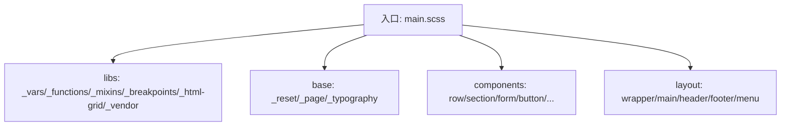
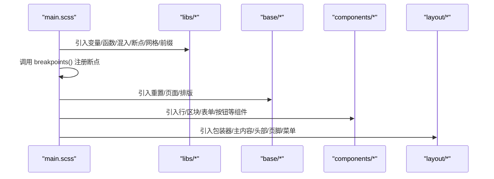
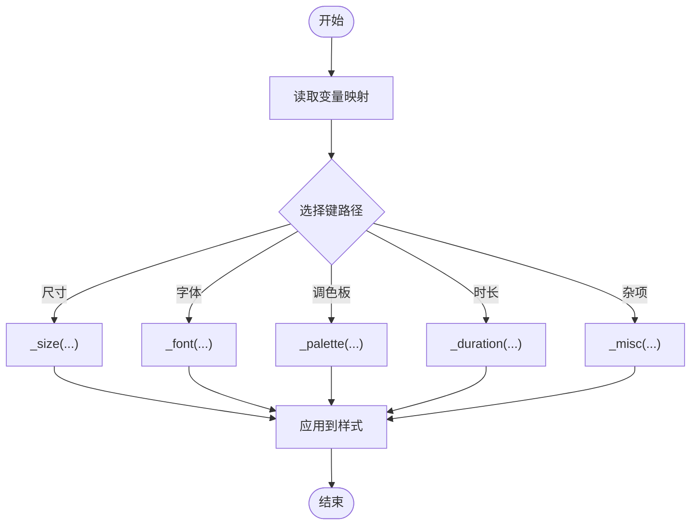
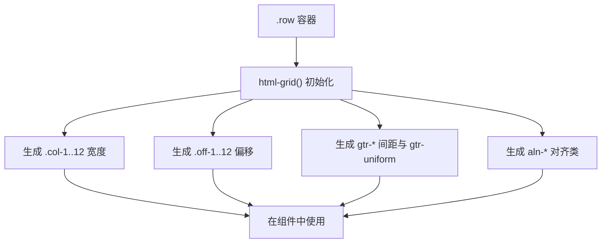
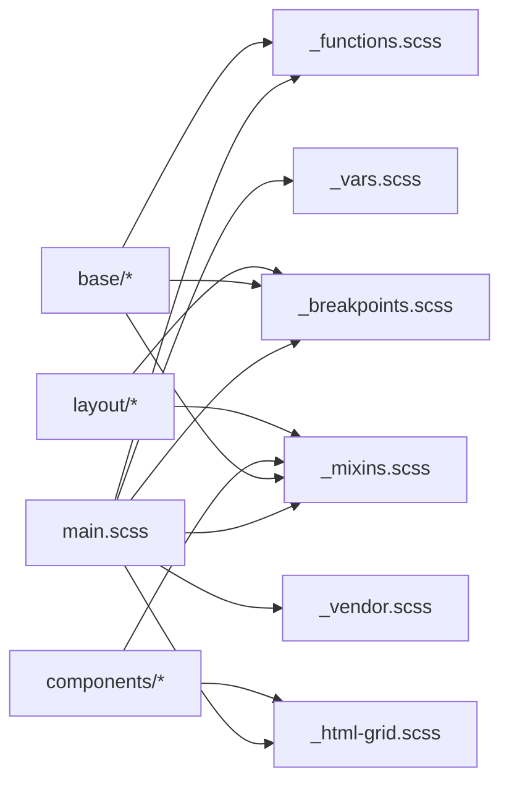

# Sass架构设计

<cite>
**本文引用的文件**
- [assets/sass/main.scss](file://assets/sass/main.scss)
- [assets/sass/libs/_vars.scss](file://assets/sass/libs/_vars.scss)
- [assets/sass/libs/_functions.scss](file://assets/sass/libs/_functions.scss)
- [assets/sass/libs/_mixins.scss](file://assets/sass/libs/_mixins.scss)
- [assets/sass/libs/_breakpoints.scss](file://assets/sass/libs/_breakpoints.scss)
- [assets/sass/libs/_html-grid.scss](file://assets/sass/libs/_html-grid.scss)
- [assets/sass/libs/_vendor.scss](file://assets/sass/libs/_vendor.scss)
- [assets/sass/base/_reset.scss](file://assets/sass/base/_reset.scss)
- [assets/sass/base/_typography.scss](file://assets/sass/base/_typography.scss)
- [assets/sass/components/_row.scss](file://assets/sass/components/_row.scss)
- [assets/sass/components/_section.scss](file://assets/sass/components/_section.scss)
- [assets/sass/components/_form.scss](file://assets/sass/components/_form.scss)
- [assets/sass/components/_button.scss](file://assets/sass/components/_button.scss)
- [assets/sass/layout/_wrapper.scss](file://assets/sass/layout/_wrapper.scss)
- [assets/sass/layout/_main.scss](file://assets/sass/layout/_main.scss)
- [assets/sass/layout/_header.scss](file://assets/sass/layout/_header.scss)
- [assets/sass/layout/_footer.scss](file://assets/sass/layout/_footer.scss)
</cite>

## 目录
1. [简介](#简介)
2. [项目结构](#项目结构)
3. [核心组件](#核心组件)
4. [架构总览](#架构总览)
5. [详细组件分析](#详细组件分析)
6. [依赖关系分析](#依赖关系分析)
7. [性能考量](#性能考量)
8. [故障排查指南](#故障排查指南)
9. [结论](#结论)
10. [附录：扩展与新增模块实践](#附录：扩展与新增模块实践)

## 简介
本文件面向基于 HTML5 UP Editorial 模板的样式系统，系统化阐述其 Sass 架构设计与实现。文档覆盖模块化组织（libs、base、components、layout）、变量管理、混入与函数、断点与响应式工具、网格系统等关键技术点，并提供扩展现有功能与新增样式模块的实践指引。目标是帮助开发者在不深入源码细节的前提下，快速理解并高效扩展该样式体系。

## 项目结构
样式工程采用清晰的目录分层：
- libs：基础能力层，包含变量、函数、混入、断点、HTML 网格、浏览器前缀等通用能力
- base：基础样式层，负责重置、页面容器、排版等全局基础
- components：组件样式层，封装可复用的 UI 组件（表单、按钮、行/区块等）
- layout：布局样式层，定义页面骨架与区域（包装器、主内容区、头部、页脚等）
- main.scss：入口文件，统一导入顺序与断点配置

图表来源
- [assets/sass/main.scss:1-62](file://assets/sass/main.scss#L1-L62)

章节来源
- [assets/sass/main.scss:1-62](file://assets/sass/main.scss#L1-L62)

## 核心组件
- 变量系统（_vars.scss）
  - 集中管理尺寸、字体、调色板、时长、杂项等设计令牌
  - 通过命名空间 map 组织，便于按域访问与扩展
- 函数层（_functions.scss）
  - 提供 val 及 _size/_font/_palette/_duration/_misc 等便捷取值函数
  - 支持多级键访问与列表操作，提升变量读取的可读性与复用性
- 混入层（_mixins.scss）
  - icon：为伪元素注入图标，支持不同图标集与位置
  - padding：智能计算内边距，考虑元素间距与单位差异
  - svg-url：对 SVG data URL 进行编码以兼容 IE
- 断点系统（_breakpoints.scss）
  - 通过 breakpoints() 注册断点映射，breakpoint() 生成媒体查询
  - 支持 >=、<=、>、<、! 等操作符与范围断点
- HTML 网格（_html-grid.scss）
  - html-grid() 生成 12 列栅格、偏移、间距与对齐类
  - 支持多后缀与多种间距倍数，配合断点切换
- 浏览器前缀（_vendor.scss）
  - vendor() 自动为属性或值添加厂商前缀
  - keyframes() 输出多厂商关键帧

章节来源
- [assets/sass/libs/_vars.scss:1-44](file://assets/sass/libs/_vars.scss#L1-L44)
- [assets/sass/libs/_functions.scss:1-90](file://assets/sass/libs/_functions.scss#L1-L90)
- [assets/sass/libs/_mixins.scss:1-78](file://assets/sass/libs/_mixins.scss#L1-L78)
- [assets/sass/libs/_breakpoints.scss:1-223](file://assets/sass/libs/_breakpoints.scss#L1-L223)
- [assets/sass/libs/_html-grid.scss:1-149](file://assets/sass/libs/_html-grid.scss#L1-L149)
- [assets/sass/libs/_vendor.scss:1-376](file://assets/sass/libs/_vendor.scss#L1-L376)

## 架构总览
入口文件 main.scss 定义了编译顺序与全局断点，随后依次引入基础、组件与布局样式，形成“能力→基础→组件→布局”的分层架构。断点配置在入口处集中声明，确保全项目一致。

图表来源
- [assets/sass/main.scss:1-62](file://assets/sass/main.scss#L1-L62)

章节来源
- [assets/sass/main.scss:1-62](file://assets/sass/main.scss#L1-L62)

## 详细组件分析

### 变量管理系统（颜色、字体、间距等）
- 设计令牌分类
  - 尺寸：圆角、元素高度、元素外边距、侧栏宽度、栅格间距
  - 字体：字族、字号权重、标题字重、字偶距
  - 调色板：背景、前景、强调色、边框及其透明变体
  - 时长：导航过渡、通用过渡
  - 杂项：层级基准 z-index
- 使用方式
  - 通过 _size/_font/_palette/_duration/_misc 等函数按路径取值
  - 在组件与布局中引用，保证视觉一致性

图表来源
- [assets/sass/libs/_vars.scss:1-44](file://assets/sass/libs/_vars.scss#L1-L44)
- [assets/sass/libs/_functions.scss:38-90](file://assets/sass/libs/_functions.scss#L38-L90)

章节来源
- [assets/sass/libs/_vars.scss:1-44](file://assets/sass/libs/_vars.scss#L1-L44)
- [assets/sass/libs/_functions.scss:1-90](file://assets/sass/libs/_functions.scss#L1-L90)

### 混入函数（mixins）的实现原理与扩展
- icon
  - 为 :before/:after 注入图标，支持 brands/solid/regular 三类图标集
  - 通过 @mixin icon($content, $category, $where) 控制内容与位置
- padding
  - 根据当前元素外边距与单位自动计算上下左右内边距
  - 支持额外 pad 列表与 !important 开关
- svg-url
  - 将 SVG 字符串转义为 data URL，解决 IE 兼容问题
- 扩展建议
  - 新增业务混入时，遵循现有命名与参数约定
  - 优先复用 _size/_font/_palette 等函数，保持设计令牌一致

章节来源
- [assets/sass/libs/_mixins.scss:1-78](file://assets/sass/libs/_mixins.scss#L1-L78)

### 断点配置与响应式工具
- 断点注册
  - 在 main.scss 中通过 breakpoints() 定义 xlarge/large/medium/small/xsmall/xxsmall 等区间
  - 支持自定义媒体查询字符串（如 xlarge-to-max、small-to-xlarge）
- 断点使用
  - 通过 breakpoint() 包裹样式块，支持 >=、<=、>、<、! 等操作符
  - 示例：在排版与布局中按断点调整字号与内边距
- 响应式策略
  - 移动端优先或桌面优先均可，通过断点组合灵活适配
  - 结合 html-grid 的多后缀机制，在不同断点切换栅格行为

章节来源
- [assets/sass/main.scss:16-27](file://assets/sass/main.scss#L16-L27)
- [assets/sass/libs/_breakpoints.scss:1-223](file://assets/sass/libs/_breakpoints.scss#L1-L223)
- [assets/sass/base/_typography.scss:16-26](file://assets/sass/base/_typography.scss#L16-L26)
- [assets/sass/layout/_header.scss:31-50](file://assets/sass/layout/_header.scss#L31-L50)

### 网格系统的技术实现
- 核心机制
  - html-grid() 初始化 Flex 容器，生成 12 列宽度与偏移类
  - 支持 gtr-* 间距倍数与 gtr-uniform 均匀间距
  - 支持 aln-* 对齐类（水平/垂直）
- 断点适配
  - 在 components/_row.scss 中按断点切换 html-grid 的后缀，实现响应式栅格
- 使用建议
  - 通过 .row 与 .col-* 构建布局，必要时配合 .off-* 偏移
  - 使用 gtr-* 调整间距，gtr-uniform 统一首尾间距

图表来源
- [assets/sass/libs/_html-grid.scss:5-149](file://assets/sass/libs/_html-grid.scss#L5-L149)
- [assets/sass/components/_row.scss:9-31](file://assets/sass/components/_row.scss#L9-L31)

章节来源
- [assets/sass/libs/_html-grid.scss:1-149](file://assets/sass/libs/_html-grid.scss#L1-L149)
- [assets/sass/components/_row.scss:1-31](file://assets/sass/components/_row.scss#L1-L31)

### 基础样式（base）
- 重置（_reset.scss）
  - 标准化盒模型、列表、表格、表单控件外观
  - 移除默认 margin/padding/border，统一基线
- 排版（_typography.scss）
  - 基于 _font/_palette/_size 设置全局文本样式
  - 使用 breakpoint() 在不同断点下调整字号与行高
  - 代码块、引用、分割线等语义化样式

章节来源
- [assets/sass/base/_reset.scss:1-76](file://assets/sass/base/_reset.scss#L1-L76)
- [assets/sass/base/_typography.scss:1-187](file://assets/sass/base/_typography.scss#L1-L187)

### 组件样式（components）
- 行与区块（_row.scss、_section.scss）
  - 行：基于 html-grid 的响应式栅格
  - 区块：标题、副标题、分割线等排版增强
- 表单（_form.scss）
  - 输入框、下拉、文本域、单选/复选的统一样式
  - 使用 svg-url 定制下拉箭头，focus 状态强调色
- 按钮（_button.scss）
  - 轮廓/实心/禁用/尺寸变体
  - 使用 _duration/_palette/_font 保持一致动效与视觉

章节来源
- [assets/sass/components/_row.scss:1-31](file://assets/sass/components/_row.scss#L1-L31)
- [assets/sass/components/_section.scss:1-39](file://assets/sass/components/_section.scss#L1-L39)
- [assets/sass/components/_form.scss:1-179](file://assets/sass/components/_form.scss#L1-L179)
- [assets/sass/components/_button.scss:1-85](file://assets/sass/components/_button.scss#L1-L85)

### 布局样式（layout）
- 包装器（_wrapper.scss）
  - 使用 flex 反向排列，为主内容与侧边栏布局提供容器
- 主内容（_main.scss）
  - 内边距随断点变化，区块顶部边框分隔
- 头部（_header.scss）
  - 底部强调色条，logo 与图标区域布局，小屏优化
- 页脚（_footer.scss）
  - 版权信息浅色文字，链接继承色

章节来源
- [assets/sass/layout/_wrapper.scss:1-13](file://assets/sass/layout/_wrapper.scss#L1-L13)
- [assets/sass/layout/_main.scss:1-58](file://assets/sass/layout/_main.scss#L1-L58)
- [assets/sass/layout/_header.scss:1-51](file://assets/sass/layout/_header.scss#L1-L51)
- [assets/sass/layout/_footer.scss:1-18](file://assets/sass/layout/_footer.scss#L1-L18)

## 依赖关系分析
- 入口依赖
  - main.scss 依赖 libs 提供的变量、函数、混入、断点、网格与前缀能力
  - base/components/layout 均依赖 libs 的能力，不直接相互耦合
- 组件与布局
  - 组件通过 libs 的 grid/mixins/functions 实现，布局通过 mixins/vendor 实现
- 潜在循环
  - 当前结构无循环依赖；所有业务样式仅单向依赖 libs

图表来源
- [assets/sass/main.scss:1-62](file://assets/sass/main.scss#L1-L62)
- [assets/sass/libs/_functions.scss:1-90](file://assets/sass/libs/_functions.scss#L1-L90)
- [assets/sass/libs/_mixins.scss:1-78](file://assets/sass/libs/_mixins.scss#L1-L78)
- [assets/sass/libs/_breakpoints.scss:1-223](file://assets/sass/libs/_breakpoints.scss#L1-L223)
- [assets/sass/libs/_html-grid.scss:1-149](file://assets/sass/libs/_html-grid.scss#L1-L149)
- [assets/sass/libs/_vendor.scss:1-376](file://assets/sass/libs/_vendor.scss#L1-L376)

章节来源
- [assets/sass/main.scss:1-62](file://assets/sass/main.scss#L1-L62)

## 性能考量
- 编译产物体积
  - 合理拆分模块，避免重复引入；main.scss 已按序引入，减少冗余
- 运行时性能
  - 合理使用断点与媒体查询，避免过深嵌套
  - 使用 CSS 变量或现代特性时需评估兼容性，必要时保留 vendor 前缀
- 可维护性
  - 通过变量与混入统一管理样式逻辑，降低重复与不一致风险

[本节为通用指导，无需特定文件来源]

## 故障排查指南
- 断点未生效
  - 检查是否在 main.scss 中正确调用 breakpoints() 注册断点
  - 确认 breakpoint() 使用的键名与操作符是否正确
- 栅格错位
  - 检查是否在同一 .row 内使用 .col-*，并确保未与其他布局冲突
  - 如需调整间距，使用 gtr-* 或自定义 html-grid 参数
- 表单样式异常
  - 确认已引入 base/reset 与 components/form
  - 下拉箭头依赖 svg-url，若被覆盖需检查优先级
- 图标不显示
  - 确认已引入 fontawesome-all.min.css
  - 使用 icon() 混入时注意 category 与 content 参数

章节来源
- [assets/sass/main.scss:16-27](file://assets/sass/main.scss#L16-L27)
- [assets/sass/libs/_breakpoints.scss:11-223](file://assets/sass/libs/_breakpoints.scss#L11-L223)
- [assets/sass/libs/_html-grid.scss:5-149](file://assets/sass/libs/_html-grid.scss#L5-L149)
- [assets/sass/components/_form.scss:51-74](file://assets/sass/components/_form.scss#L51-L74)
- [assets/sass/libs/_mixins.scss:1-38](file://assets/sass/libs/_mixins.scss#L1-L38)

## 结论
该样式系统以 libs 为基础能力层，base 提供全局基础，components 封装可复用 UI，layout 组织页面骨架。通过统一的变量、函数与混入，以及灵活的断点与网格系统，实现了高内聚、低耦合的模块化架构。遵循本文档的组织与扩展规范，可高效迭代与维护样式体系。

[本节为总结性内容，无需特定文件来源]

## 附录：扩展与新增模块实践
- 扩展现有变量
  - 在 _vars.scss 中新增键值对，并通过对应 _xxx() 函数在任意位置引用
  - 示例路径参考：[_vars.scss:12-44](file://assets/sass/libs/_vars.scss#L12-L44)、[_functions.scss:57-90](file://assets/sass/libs/_functions.scss#L57-L90)
- 新增断点
  - 在 main.scss 的 breakpoints() 中添加新断点键与区间
  - 在组件或布局中使用 breakpoint('<=new') 或相应操作符
  - 示例路径参考：[main.scss:16-27](file://assets/sass/main.scss#L16-L27)、[_breakpoints.scss:11-223](file://assets/sass/libs/_breakpoints.scss#L11-L223)
- 新增组件
  - 在 components/ 下创建 _your-component.scss，复用 _size/_font/_palette/_mixins
  - 在 main.scss 中按顺序引入新组件
  - 示例路径参考：[main.scss:35-52](file://assets/sass/main.scss#L35-L52)、[_button.scss:1-85](file://assets/sass/components/_button.scss#L1-L85)
- 新增布局区域
  - 在 layout/ 下创建 _your-layout.scss，使用 mixin 与断点适配
  - 在 main.scss 中引入并按需组合
  - 示例路径参考：[main.scss:54-62](file://assets/sass/main.scss#L54-L62)、[_main.scss:9-58](file://assets/sass/layout/_main.scss#L9-L58)
- 使用网格与对齐
  - 在组件或布局中通过 .row 与 .col-* 构建栅格，必要时使用 gtr-* 与 aln-*
  - 示例路径参考：[_html-grid.scss:5-149](file://assets/sass/libs/_html-grid.scss#L5-L149)、[_row.scss:9-31](file://assets/sass/components/_row.scss#L9-L31)
- 浏览器兼容与前缀
  - 使用 vendor() 混入自动添加前缀，或使用 keyframes() 输出多厂商关键帧
  - 示例路径参考：[_vendor.scss:322-376](file://assets/sass/libs/_vendor.scss#L322-L376)

章节来源
- [assets/sass/libs/_vars.scss:12-44](file://assets/sass/libs/_vars.scss#L12-L44)
- [assets/sass/libs/_functions.scss:57-90](file://assets/sass/libs/_functions.scss#L57-L90)
- [assets/sass/main.scss:16-62](file://assets/sass/main.scss#L16-L62)
- [assets/sass/libs/_breakpoints.scss:11-223](file://assets/sass/libs/_breakpoints.scss#L11-L223)
- [assets/sass/components/_button.scss:1-85](file://assets/sass/components/_button.scss#L1-L85)
- [assets/sass/layout/_main.scss:9-58](file://assets/sass/layout/_main.scss#L9-L58)
- [assets/sass/libs/_html-grid.scss:5-149](file://assets/sass/libs/_html-grid.scss#L5-L149)
- [assets/sass/components/_row.scss:9-31](file://assets/sass/components/_row.scss#L9-L31)
- [assets/sass/libs/_vendor.scss:322-376](file://assets/sass/libs/_vendor.scss#L322-L376)