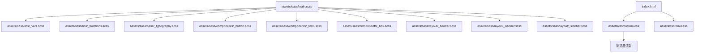
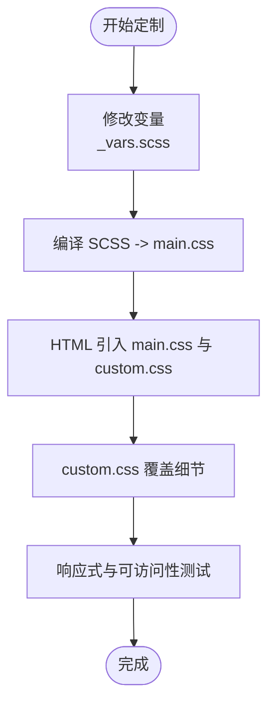
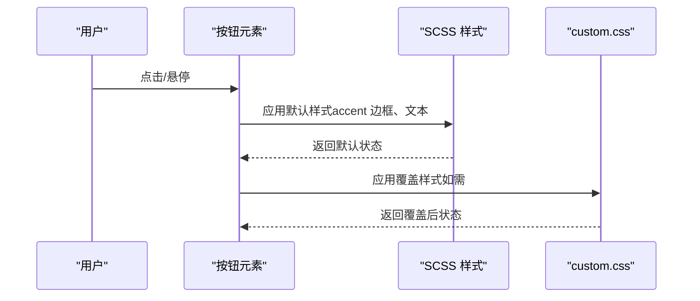
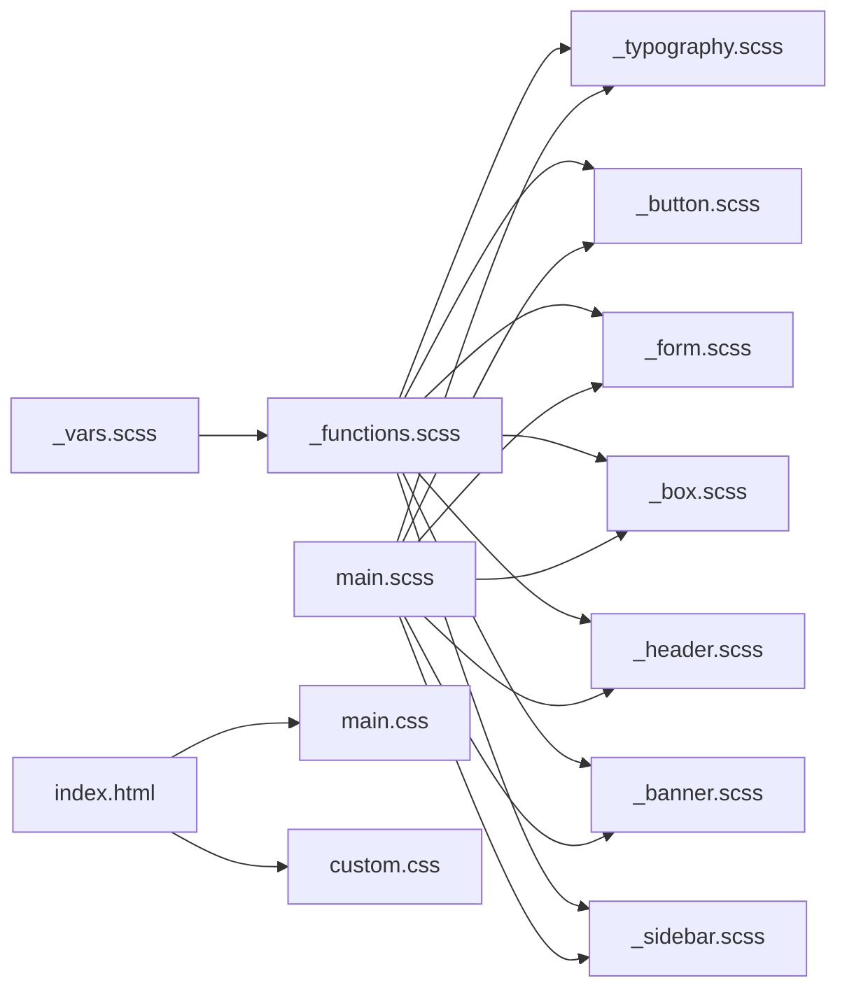

# 主题定制

<cite>
**本文引用的文件**
- [assets/sass/main.scss](file://assets/sass/main.scss)
- [assets/sass/libs/_vars.scss](file://assets/sass/libs/_vars.scss)
- [assets/sass/libs/_functions.scss](file://assets/sass/libs/_functions.scss)
- [assets/sass/base/_typography.scss](file://assets/sass/base/_typography.scss)
- [assets/sass/components/_button.scss](file://assets/sass/components/_button.scss)
- [assets/sass/components/_form.scss](file://assets/sass/components/_form.scss)
- [assets/sass/components/_box.scss](file://assets/sass/components/_box.scss)
- [assets/sass/layout/_header.scss](file://assets/sass/layout/_header.scss)
- [assets/sass/layout/_banner.scss](file://assets/sass/layout/_banner.scss)
- [assets/sass/layout/_sidebar.scss](file://assets/sass/layout/_sidebar.scss)
- [assets/css/custom.css](file://assets/css/custom.css)
- [index.html](file://index.html)
</cite>

## 目录
1. [简介](#简介)
2. [项目结构](#项目结构)
3. [核心组件](#核心组件)
4. [架构总览](#架构总览)
5. [详细组件分析](#详细组件分析)
6. [依赖关系分析](#依赖关系分析)
7. [性能与可访问性](#性能与可访问性)
8. [故障排查指南](#故障排查指南)
9. [结论](#结论)
10. [附录：完整定制示例](#附录完整定制示例)

## 简介
本指南面向希望个性化网站外观与风格的开发者，提供从颜色变量、字体系统到组件样式覆盖的完整方法。你将学会如何修改主色调、辅助色与语义化颜色；如何集成 Google Fonts 或使用本地字体；如何覆盖按钮、表单、卡片等组件样式；以及如何实现深色模式、品牌色彩方案与排版调整。同时涵盖 CSS 优先级管理、BEM 命名规范的使用与样式冲突解决方案，确保定制后的样式保持响应式与可访问性。

## 项目结构
本项目基于 SCSS 构建，采用模块化组织：
- 入口与编译入口：assets/sass/main.scss 负责引入基础库、断点、基础样式、组件与布局模块，并加载字体与图标资源。
- 变量与函数：assets/sass/libs/_vars.scss 集中定义尺寸、字体、调色板等全局变量；assets/sass/libs/_functions.scss 提供 _palette、_font、_size 等取值函数。
- 基础样式：assets/sass/base/ 包含重置、页面与排版。
- 组件样式：assets/sass/components/ 包含按钮、表单、卡片、特性列表等。
- 布局样式：assets/sass/layout/ 包含头部、横幅、侧边栏、页脚等。
- 自定义样式：assets/css/custom.css 用于覆盖默认样式，避免直接修改框架源码。
- HTML 入口：index.html 引入 main.css 与 custom.css，确保自定义样式在框架之后生效。

图表来源
- [assets/sass/main.scss:1-62](file://assets/sass/main.scss#L1-L62)
- [assets/sass/libs/_vars.scss:1-44](file://assets/sass/libs/_vars.scss#L1-L44)
- [assets/sass/libs/_functions.scss:1-90](file://assets/sass/libs/_functions.scss#L1-L90)
- [assets/sass/base/_typography.scss:1-187](file://assets/sass/base/_typography.scss#L1-L187)
- [assets/sass/components/_button.scss:1-85](file://assets/sass/components/_button.scss#L1-L85)
- [assets/sass/components/_form.scss:1-179](file://assets/sass/components/_form.scss#L1-L179)
- [assets/sass/components/_box.scss:1-26](file://assets/sass/components/_box.scss#L1-L26)
- [assets/sass/layout/_header.scss:1-51](file://assets/sass/layout/_header.scss#L1-L51)
- [assets/sass/layout/_banner.scss:1-75](file://assets/sass/layout/_banner.scss#L1-L75)
- [assets/sass/layout/_sidebar.scss:1-223](file://assets/sass/layout/_sidebar.scss#L1-L223)
- [assets/css/custom.css:1-391](file://assets/css/custom.css#L1-L391)
- [index.html:1-147](file://index.html#L1-L147)

章节来源
- [assets/sass/main.scss:1-62](file://assets/sass/main.scss#L1-L62)
- [index.html:1-147](file://index.html#L1-L147)

## 核心组件
- 颜色系统：通过 _vars.scss 中的 $palette 统一管理背景、前景、边框、强调色等；通过 _functions.scss 的 _palette() 在各处引用。
- 字体系统：通过 $font 配置主字体、标题字体、固定宽度字体及字重；main.scss 中通过 Google Fonts 链接引入 Open Sans 与 Roboto Slab。
- 组件样式：按钮、表单、卡片等组件均使用 _palette() 和 _font()、_size() 等函数，便于统一主题化。
- 布局样式：头部、横幅、侧边栏等布局模块同样依赖变量与函数，保证整体一致性。

章节来源
- [assets/sass/libs/_vars.scss:1-44](file://assets/sass/libs/_vars.scss#L1-L44)
- [assets/sass/libs/_functions.scss:1-90](file://assets/sass/libs/_functions.scss#L1-L90)
- [assets/sass/main.scss:1-62](file://assets/sass/main.scss#L1-L62)
- [assets/sass/components/_button.scss:1-85](file://assets/sass/components/_button.scss#L1-L85)
- [assets/sass/components/_form.scss:1-179](file://assets/sass/components/_form.scss#L1-L179)
- [assets/sass/components/_box.scss:1-26](file://assets/sass/components/_box.scss#L1-L26)

## 架构总览
主题定制的核心在于“变量驱动 + 组件复用”。所有颜色、字体、尺寸都集中在 libs 层，组件与布局通过函数读取变量，从而实现一处修改、全局生效。custom.css 作为最终覆盖层，在不破坏框架源码的前提下进行精细化调整。

图表来源
- [assets/sass/main.scss:1-62](file://assets/sass/main.scss#L1-L62)
- [assets/sass/libs/_vars.scss:1-44](file://assets/sass/libs/_vars.scss#L1-L44)
- [assets/css/custom.css:1-391](file://assets/css/custom.css#L1-L391)
- [index.html:1-147](file://index.html#L1-L147)

## 详细组件分析

### 颜色变量与语义化配色
- 变量位置：assets/sass/libs/_vars.scss 中的 $palette 定义了 bg、bg-alt、fg、fg-bold、fg-light、border、border-bg、accent 等键。
- 引用方式：通过 _palette(key) 在组件与布局中使用，例如按钮边框、焦点态、悬停态等。
- 修改建议：
  - 主色调：调整 accent（强调色），影响按钮边框、链接、焦点高亮等。
  - 背景与前景：调整 bg、bg-alt、fg、fg-bold，控制页面底色与文字对比度。
  - 边框与透明：调整 border、border-bg，控制分割线与半透明背景。
- 语义化扩展：可在 $palette 中新增语义键（如 success、warning、error），并在组件中引用以保持一致性。

章节来源
- [assets/sass/libs/_vars.scss:34-44](file://assets/sass/libs/_vars.scss#L34-L44)
- [assets/sass/components/_button.scss:13-85](file://assets/sass/components/_button.scss#L13-L85)
- [assets/sass/components/_form.scss:21-49](file://assets/sass/components/_form.scss#L21-L49)
- [assets/sass/base/_typography.scss:29-46](file://assets/sass/base/_typography.scss#L29-L46)

### 字体系统与 Google Fonts 集成
- 变量位置：assets/sass/libs/_vars.scss 中的 $font 定义了 family、family-heading、family-fixed 及字重。
- 外部字体：assets/sass/main.scss 通过 @import url(...) 引入 Google Fonts（Open Sans 与 Roboto Slab）。
- 本地字体替代：
  - 将 Google Fonts 链接替换为本地字体文件路径。
  - 在 $font.family 与 $font.family-heading 中指定本地字体族名。
  - 确保字体文件已放置在 assets/webfonts 或相应目录，并在项目中正确引用。
- 字号与行高：base/_typography.scss 根据断点调整 body 与标题字号，适配不同屏幕。

章节来源
- [assets/sass/libs/_vars.scss:22-32](file://assets/sass/libs/_vars.scss#L22-L32)
- [assets/sass/main.scss:8-8](file://assets/sass/main.scss#L8-L8)
- [assets/sass/base/_typography.scss:9-27](file://assets/sass/base/_typography.scss#L9-L27)

### 按钮样式覆盖技巧
- 默认行为：按钮使用 _palette(accent) 作为边框与文本色，hover/active 态通过 transparentize 调整透明度。
- 主要类：.primary 将背景设为 accent，文本改为背景色；.icon 支持图标前缀；.fit/.small/.large 控制尺寸与布局。
- 覆盖策略：
  - 在 custom.css 中针对 .button、input[type="submit"] 等选择器进行覆盖。
  - 若需改变强调色，优先修改 $palette.accent，或在 custom.css 中用更高优先级覆盖。
  - 注意保持 hover/active 态的可访问性与对比度。

图表来源
- [assets/sass/components/_button.scss:13-85](file://assets/sass/components/_button.scss#L13-L85)
- [assets/css/custom.css:1-391](file://assets/css/custom.css#L1-L391)

章节来源
- [assets/sass/components/_button.scss:13-85](file://assets/sass/components/_button.scss#L13-L85)
- [assets/css/custom.css:1-391](file://assets/css/custom.css#L1-L391)

### 表单样式覆盖技巧
- 默认行为：输入框、下拉框、文本域使用 _palette(bg)、_palette(border)，focus 态使用 _palette(accent)。
- 覆盖策略：
  - 在 custom.css 中针对 input、select、textarea 的 focus、placeholder 进行覆盖。
  - 如需统一圆角、边框宽度、内边距，可在 custom.css 中集中设置。
  - 注意 placeholder 在不同浏览器的兼容写法。

章节来源
- [assets/sass/components/_form.scss:21-49](file://assets/sass/components/_form.scss#L21-L49)
- [assets/sass/components/_form.scss:161-179](file://assets/sass/components/_form.scss#L161-L179)
- [assets/css/custom.css:1-391](file://assets/css/custom.css#L1-L391)

### 卡片（Box）样式覆盖技巧
- 默认行为：.box 使用 _palette(border) 边框、_size(border-radius) 圆角、_size(element-margin) 外边距。
- 覆盖策略：
  - 在 custom.css 中为 .box 添加阴影、渐变背景、更柔和的边框色。
  - 可通过 .alt 变体去除边框与内边距，适合特殊场景。
  - 结合媒体查询在不同屏幕下调整卡片间距与内边距。

章节来源
- [assets/sass/components/_box.scss:9-26](file://assets/sass/components/_box.scss#L9-L26)
- [assets/css/custom.css:1-391](file://assets/css/custom.css#L1-L391)

### 布局组件（头部、横幅、侧边栏）
- 头部：使用 _palette(accent) 作为底部强调线；logo 使用标题字体。
- 横幅：flex 布局，内容区与图片各占 50%；横屏/竖屏有自适应逻辑。
- 侧边栏：背景使用 _palette(bg-alt)，分隔线使用 _palette(border)；在小屏下切换为固定定位与遮罩。
- 覆盖策略：
  - 在 custom.css 中调整 #header、#banner、#sidebar 的内边距、背景色、分隔线颜色。
  - 利用媒体查询与方向检测优化移动端体验。

章节来源
- [assets/sass/layout/_header.scss:9-25](file://assets/sass/layout/_header.scss#L9-L25)
- [assets/sass/layout/_banner.scss:9-42](file://assets/sass/layout/_banner.scss#L9-L42)
- [assets/sass/layout/_sidebar.scss:37-83](file://assets/sass/layout/_sidebar.scss#L37-L83)
- [assets/css/custom.css:4-101](file://assets/css/custom.css#L4-L101)

## 依赖关系分析
- main.scss 是编译入口，按顺序引入 libs、base、components、layout。
- _vars.scss 提供全局变量，_functions.scss 提供取值函数，被 base、components、layout 广泛引用。
- custom.css 在 HTML 中位于 main.css 之后，具备更高优先级，用于最终覆盖。

图表来源
- [assets/sass/main.scss:1-62](file://assets/sass/main.scss#L1-L62)
- [assets/sass/libs/_vars.scss:1-44](file://assets/sass/libs/_vars.scss#L1-L44)
- [assets/sass/libs/_functions.scss:1-90](file://assets/sass/libs/_functions.scss#L1-L90)
- [assets/sass/base/_typography.scss:1-187](file://assets/sass/base/_typography.scss#L1-L187)
- [assets/sass/components/_button.scss:1-85](file://assets/sass/components/_button.scss#L1-L85)
- [assets/sass/components/_form.scss:1-179](file://assets/sass/components/_form.scss#L1-L179)
- [assets/sass/components/_box.scss:1-26](file://assets/sass/components/_box.scss#L1-L26)
- [assets/sass/layout/_header.scss:1-51](file://assets/sass/layout/_header.scss#L1-L51)
- [assets/sass/layout/_banner.scss:1-75](file://assets/sass/layout/_banner.scss#L1-L75)
- [assets/sass/layout/_sidebar.scss:1-223](file://assets/sass/layout/_sidebar.scss#L1-L223)
- [index.html:1-147](file://index.html#L1-L147)

章节来源
- [assets/sass/main.scss:1-62](file://assets/sass/main.scss#L1-L62)
- [index.html:1-147](file://index.html#L1-L147)

## 性能与可访问性
- 性能
  - 尽量通过变量与函数统一样式，减少重复代码与冗余选择器。
  - 将覆盖规则集中在 custom.css，避免分散修改导致维护成本上升。
  - 合理使用媒体查询，避免过多嵌套与复杂计算。
- 可访问性
  - 确保颜色对比度符合 WCAG 标准，尤其是链接、按钮与表单焦点态。
  - 为交互元素提供清晰的焦点指示（如 outline、box-shadow）。
  - 在 custom.css 中避免使用 !important 滥用，必要时仅在确实需要时谨慎使用。

[本节为通用指导，不直接分析具体文件]

## 故障排查指南
- 样式未生效
  - 检查 custom.css 是否在 main.css 之后引入（index.html 中顺序）。
  - 确认选择器优先级是否足够，必要时提高特异性而非滥用 !important。
- 颜色不一致
  - 检查是否多处硬编码颜色，应统一使用 _palette()。
  - 在 custom.css 中覆盖时，确保目标选择器准确。
- 字体未加载
  - 确认 Google Fonts 链接有效或本地字体路径正确。
  - 检查 $font.family 与 $font.family-heading 是否与字体族名一致。
- 响应式异常
  - 检查媒体查询断点是否与 main.scss 中定义的断点一致。
  - 在 custom.css 中使用相同断点进行覆盖，避免错位。

章节来源
- [index.html:1-147](file://index.html#L1-L147)
- [assets/sass/main.scss:16-27](file://assets/sass/main.scss#L16-L27)
- [assets/sass/libs/_vars.scss:1-44](file://assets/sass/libs/_vars.scss#L1-L44)
- [assets/css/custom.css:1-391](file://assets/css/custom.css#L1-L391)

## 结论
通过集中化的变量与函数体系，本项目实现了高度可定制的主题系统。建议在开发过程中遵循“变量优先、组件复用、覆盖收敛”的原则，使用 custom.css 进行最终样式微调，并保持响应式与可访问性。对于复杂定制需求，可在 $palette 中扩展语义化颜色，在 $font 中管理字体族与字重，从而确保全站风格一致且易于维护。

[本节为总结，不直接分析具体文件]

## 附录：完整定制示例

### 示例一：深色模式
- 步骤
  - 在 _vars.scss 中新增深色调色板键（如 bg-dark、fg-dark、accent-dark）。
  - 在 main.scss 中引入一个深色主题块（或通过媒体查询/数据属性切换）。
  - 在 custom.css 中为 body[data-theme="dark"] 下的组件应用深色变量。
  - 确保对比度与焦点态在深色模式下依然清晰。
- 参考位置
  - 变量定义：assets/sass/libs/_vars.scss
  - 组件引用：assets/sass/components/_button.scss、assets/sass/components/_form.scss
  - 覆盖层：assets/css/custom.css

章节来源
- [assets/sass/libs/_vars.scss:34-44](file://assets/sass/libs/_vars.scss#L34-L44)
- [assets/sass/components/_button.scss:13-85](file://assets/sass/components/_button.scss#L13-L85)
- [assets/sass/components/_form.scss:21-49](file://assets/sass/components/_form.scss#L21-L49)
- [assets/css/custom.css:1-391](file://assets/css/custom.css#L1-L391)

### 示例二：品牌色彩方案
- 步骤
  - 在 _vars.scss 的 $palette 中设置品牌主色（accent）、背景与前景色。
  - 更新按钮、链接、焦点态的颜色，确保品牌一致性。
  - 在 custom.css 中对特定区域（如侧边栏、新闻列表）进行品牌化微调。
- 参考位置
  - 变量定义：assets/sass/libs/_vars.scss
  - 组件引用：assets/sass/components/_button.scss、assets/sass/base/_typography.scss
  - 覆盖层：assets/css/custom.css

章节来源
- [assets/sass/libs/_vars.scss:34-44](file://assets/sass/libs/_vars.scss#L34-L44)
- [assets/sass/components/_button.scss:13-85](file://assets/sass/components/_button.scss#L13-L85)
- [assets/sass/base/_typography.scss:29-46](file://assets/sass/base/_typography.scss#L29-L46)
- [assets/css/custom.css:124-247](file://assets/css/custom.css#L124-L247)

### 示例三：排版调整
- 步骤
  - 在 _vars.scss 的 $font 中调整字体族与字重。
  - 在 main.scss 中更换 Google Fonts 链接或替换为本地字体。
  - 在 base/_typography.scss 中调整正文与标题字号、行高、段间距。
  - 在 custom.css 中对特定区块（如侧边栏、新闻列表）进行排版微调。
- 参考位置
  - 字体变量：assets/sass/libs/_vars.scss
  - 字体引入：assets/sass/main.scss
  - 排版基础：assets/sass/base/_typography.scss
  - 覆盖层：assets/css/custom.css

章节来源
- [assets/sass/libs/_vars.scss:22-32](file://assets/sass/libs/_vars.scss#L22-L32)
- [assets/sass/main.scss:8-8](file://assets/sass/main.scss#L8-L8)
- [assets/sass/base/_typography.scss:9-27](file://assets/sass/base/_typography.scss#L9-L27)
- [assets/css/custom.css:103-144](file://assets/css/custom.css#L103-L144)

### CSS 优先级管理与 BEM 命名规范
- 优先级管理
  - 优先通过变量与函数统一样式，减少选择器复杂度。
  - 在 custom.css 中使用明确的选择器，避免过度嵌套。
  - 必要时提升选择器特异性，但尽量避免 !important。
- BEM 命名规范
  - 为自定义组件使用 BEM 命名（如 .news-list、.news-feature、.pub-list），便于维护与扩展。
  - 在 custom.css 中已有部分 BEM 实践（如 news-list、news-icon、news-year、news-main、news-topic）。
- 样式冲突解决
  - 若出现冲突，先检查引入顺序（main.css 在前，custom.css 在后）。
  - 使用浏览器开发者工具定位冲突规则，逐步缩小范围。
  - 将通用覆盖放入 custom.css，将局部覆盖放入对应页面的样式文件中。

章节来源
- [assets/css/custom.css:249-391](file://assets/css/custom.css#L249-L391)
- [index.html:1-147](file://index.html#L1-L147)