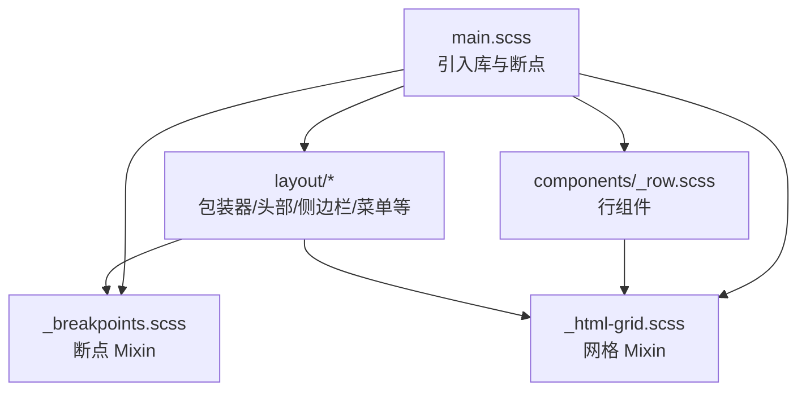
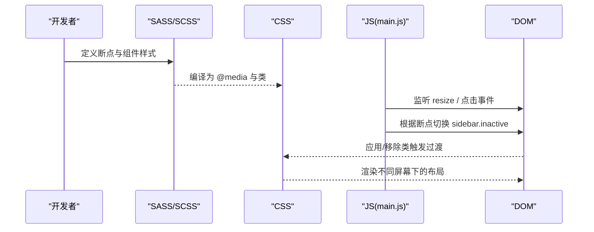
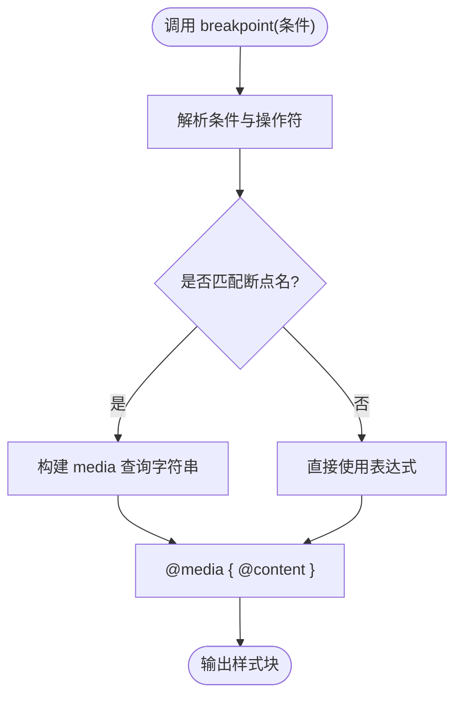
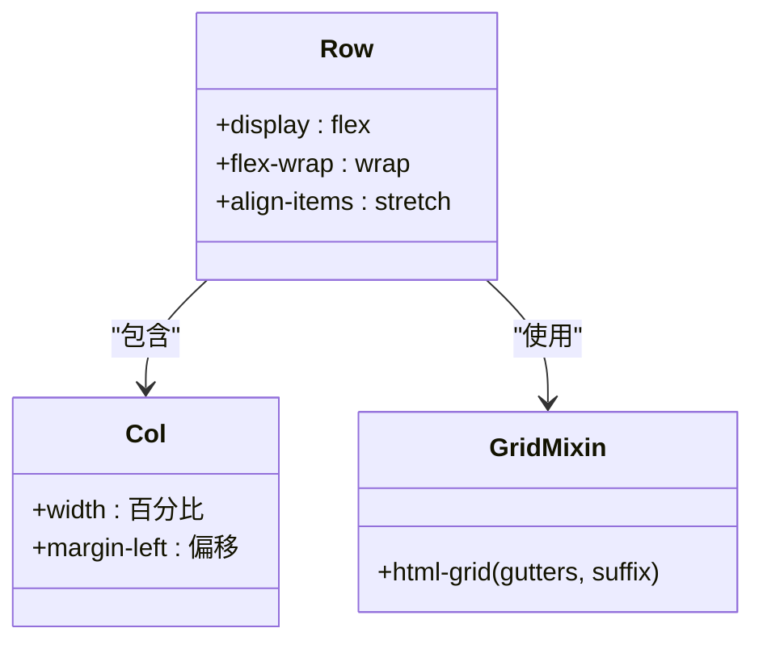
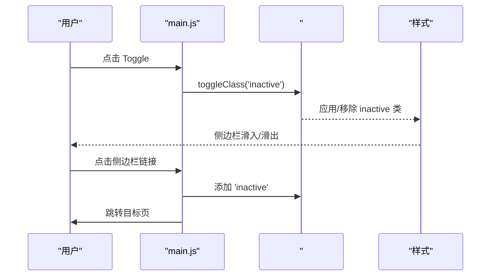
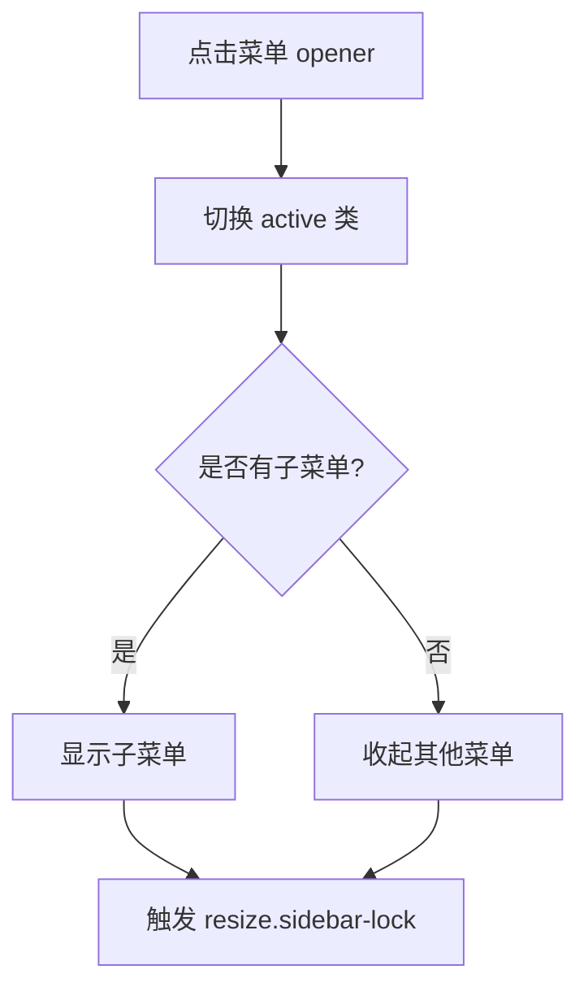
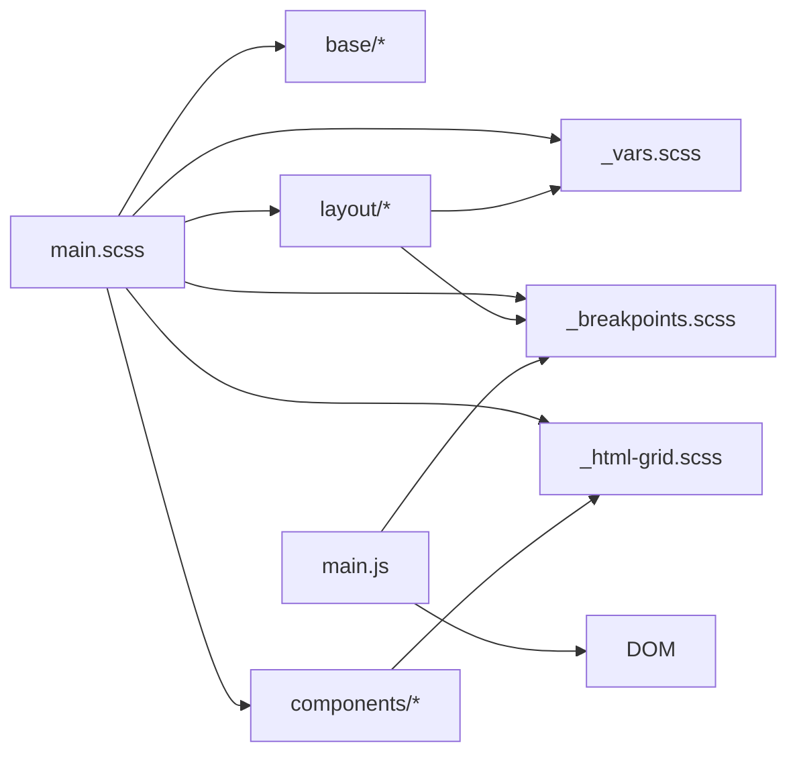

# 响应式设计

<cite>
**本文引用的文件**
- [assets/sass/main.scss](file://assets/sass/main.scss)
- [assets/sass/libs/_breakpoints.scss](file://assets/sass/libs/_breakpoints.scss)
- [assets/sass/libs/_html-grid.scss](file://assets/sass/libs/_html-grid.scss)
- [assets/sass/components/_row.scss](file://assets/sass/components/_row.scss)
- [assets/sass/layout/_wrapper.scss](file://assets/sass/layout/_wrapper.scss)
- [assets/sass/layout/_sidebar.scss](file://assets/sass/layout/_sidebar.scss)
- [assets/sass/layout/_header.scss](file://assets/sass/layout/_header.scss)
- [assets/sass/layout/_menu.scss](file://assets/sass/layout/_menu.scss)
- [assets/sass/libs/_vars.scss](file://assets/sass/libs/_vars.scss)
- [assets/css/main.css](file://assets/css/main.css)
- [assets/css/custom.css](file://assets/css/custom.css)
- [index.html](file://index.html)
- [assets/js/main.js](file://assets/js/main.js)
</cite>

## 目录
1. [简介](#简介)
2. [项目结构](#项目结构)
3. [核心组件](#核心组件)
4. [架构总览](#架构总览)
5. [详细组件分析](#详细组件分析)
6. [依赖关系分析](#依赖关系分析)
7. [性能考虑](#性能考虑)
8. [故障排查指南](#故障排查指南)
9. [结论](#结论)
10. [附录](#附录)

## 简介
本文件面向移动端与多端适配的响应式设计与实现，围绕媒体查询与断点系统、HTML 网格系统的响应式行为、移动优先理念与实践、常见响应式需求（侧边栏折叠、导航菜单适配、内容重排）以及性能优化与兼容性处理进行系统化说明。文档基于仓库中的 SASS/SCSS 源码与编译后的 CSS 进行分析，确保所有结论均可追溯到具体代码位置。

## 项目结构
本项目采用模块化 SCSS 组织样式：基础层（base）、组件层（components）、布局层（layout）与库层（libs）。断点与网格由 libs 提供，页面布局通过 layout 组合，组件样式在 components 中定义。入口样式 main.scss 统一引入并声明全局断点。

图表来源
- [assets/sass/main.scss:1-27](file://assets/sass/main.scss#L1-L27)
- [assets/sass/libs/_breakpoints.scss:1-223](file://assets/sass/libs/_breakpoints.scss#L1-L223)
- [assets/sass/libs/_html-grid.scss:1-149](file://assets/sass/libs/_html-grid.scss#L1-L149)
- [assets/sass/components/_row.scss:1-31](file://assets/sass/components/_row.scss#L1-L31)

章节来源
- [assets/sass/main.scss:1-27](file://assets/sass/main.scss#L1-L27)

## 核心组件
- 断点系统：通过 mixins 将命名断点转换为 @media 查询，支持范围、比较操作符与方向判断。
- HTML 网格：基于 Flexbox 的 12 列栅格，提供列宽、偏移、间距与对齐能力，并按断点生成对应类名。
- 布局组件：Wrapper 使用反向 flex 排列主内容与侧边栏；Header/Sidebar/Menu 在不同断点下切换为固定定位、可折叠面板与滚动锁定等行为。
- 变量与主题：集中管理尺寸、字体、调色板等，便于一致性与扩展。

章节来源
- [assets/sass/libs/_breakpoints.scss:1-223](file://assets/sass/libs/_breakpoints.scss#L1-L223)
- [assets/sass/libs/_html-grid.scss:1-149](file://assets/sass/libs/_html-grid.scss#L1-L149)
- [assets/sass/layout/_wrapper.scss:1-13](file://assets/sass/layout/_wrapper.scss#L1-L13)
- [assets/sass/libs/_vars.scss:1-44](file://assets/sass/libs/_vars.scss#L1-L44)

## 架构总览
整体响应式架构由“断点 + 网格 + 布局”三层构成：
- 断点层：在 main.scss 中声明 xlarge、large、medium、small、xsmall、xxsmall 等断点，配合 breakpoint mixin 输出 @media。
- 网格层：row 组件在每个断点下注入对应的 col-* 与 off-* 类，用于控制列宽与偏移。
- 布局层：根据断点调整 Header、Sidebar、Banner 等布局行为，如 Sidebar 在小屏变为固定面板并可折叠。

图表来源
- [assets/sass/main.scss:16-27](file://assets/sass/main.scss#L16-L27)
- [assets/sass/libs/_breakpoints.scss:25-223](file://assets/sass/libs/_breakpoints.scss#L25-L223)
- [assets/sass/components/_row.scss:9-31](file://assets/sass/components/_row.scss#L9-L31)
- [assets/sass/layout/_sidebar.scss:121-223](file://assets/sass/layout/_sidebar.scss#L121-L223)
- [assets/js/main.js:14-23](file://assets/js/main.js#L14-L23)
- [assets/js/main.js:72-164](file://assets/js/main.js#L72-L164)

## 详细组件分析

### 断点系统与媒体查询
- 断点定义：在 main.scss 中以 map 形式声明各断点的区间，包括 xxsmall 到 xlarge 及两个自定义范围断点。
- 媒体查询生成：breakpoint mixin 解析传入的断点名称或表达式，结合操作符（>=、<=、>、<、!）生成标准 @media 规则。
- 使用方式：在组件样式中通过 @include breakpoint(...) 包裹特定断点下的样式，保证样式按断点生效。

图表来源
- [assets/sass/libs/_breakpoints.scss:25-223](file://assets/sass/libs/_breakpoints.scss#L25-L223)
- [assets/sass/main.scss:16-27](file://assets/sass/main.scss#L16-L27)

章节来源
- [assets/sass/main.scss:16-27](file://assets/sass/main.scss#L16-L27)
- [assets/sass/libs/_breakpoints.scss:1-223](file://assets/sass/libs/_breakpoints.scss#L1-L223)

### HTML 网格系统的响应式行为
- 网格容器：.row 使用 flex 布局，子元素自动换行，支持对齐与均匀间距。
- 列与偏移：每个断点下生成 .col-N-{breakpoint} 与 .off-N-{breakpoint} 类，宽度按 12 列均分，偏移以百分比计算。
- 间距控制：通过 gtr-* 类调整列间间距，gtr-uniform 使最后一项底部外边距归零。
- 断点覆盖：_row.scss 在每个断点处重新注入 html-grid mixin，确保小屏时列全宽、大屏时多列并排。

图表来源
- [assets/sass/libs/_html-grid.scss:5-149](file://assets/sass/libs/_html-grid.scss#L5-L149)
- [assets/sass/components/_row.scss:9-31](file://assets/sass/components/_row.scss#L9-L31)

章节来源
- [assets/sass/libs/_html-grid.scss:1-149](file://assets/sass/libs/_html-grid.scss#L1-L149)
- [assets/sass/components/_row.scss:1-31](file://assets/sass/components/_row.scss#L1-L31)

### 侧边栏折叠与固定定位
- 默认布局：Wrapper 使用反向 flex，主内容在前、侧边栏在后；侧边栏固定宽度，带内边距与分隔线。
- 小屏适配：在 <=large 断点下，侧边栏切换为 fixed 定位，全屏高度，内部可滚动；添加 toggle 按钮控制显示/隐藏。
- 交互逻辑：JS 在 <=large 时默认 inactive，点击 toggle 切换 inactive 类；点击链接后自动收起；body 点击关闭面板；滚动锁只在 >large 时启用。
- 视觉细节：inactive 状态通过 margin-left 负值移出视口；阴影与过渡提升体验。

图表来源
- [assets/sass/layout/_sidebar.scss:121-223](file://assets/sass/layout/_sidebar.scss#L121-L223)
- [assets/js/main.js:72-164](file://assets/js/main.js#L72-L164)

章节来源
- [assets/sass/layout/_sidebar.scss:1-223](file://assets/sass/layout/_sidebar.scss#L1-L223)
- [assets/js/main.js:72-164](file://assets/js/main.js#L72-L164)

### 导航菜单适配
- 菜单结构：#menu 使用无列表样式与大写文本，层级菜单默认隐藏，点击 opener 展开/收起。
- 交互逻辑：JS 为 opener 绑定点击事件，切换 active 类，同时触发 sidebar 滚动锁的重算。
- 样式细节：箭头图标旋转指示展开状态；子菜单缩进与字号区分层级。

图表来源
- [assets/sass/layout/_menu.scss:1-98](file://assets/sass/layout/_menu.scss#L1-L98)
- [assets/js/main.js:237-260](file://assets/js/main.js#L237-L260)

章节来源
- [assets/sass/layout/_menu.scss:1-98](file://assets/sass/layout/_menu.scss#L1-L98)
- [assets/js/main.js:237-260](file://assets/js/main.js#L237-L260)

### 头部与横幅的响应式行为
- 头部：在 <=small 断点下增加顶部 padding，logo 字号增大，社交图标绝对定位至右上角。
- 横幅：custom.css 中针对横竖屏与小屏调整图片与文字布局，确保肖像图在窄屏居中且比例合适。

章节来源
- [assets/sass/layout/_header.scss:1-51](file://assets/sass/layout/_header.scss#L1-L51)
- [assets/css/custom.css:1-101](file://assets/css/custom.css#L1-L101)

### 移动优先的设计理念与实践
- 先写基础样式：在 main.css 中定义了基础排版、颜色与最小宽度限制，确保小屏可用。
- 渐进增强：通过 breakpoint mixin 在大屏上逐步叠加更多特性（如多列网格、侧边栏固定）。
- 交互降级：在旧浏览器或不支持 object-fit 的情况下，JS 回退为 background-image 方案。
- 可访问性：避免过度动画，使用 transition 与 transform 提升流畅度；焦点与键盘交互保持可用。

章节来源
- [assets/css/main.css:63-108](file://assets/css/main.css#L63-L108)
- [assets/js/main.js:51-70](file://assets/js/main.js#L51-L70)

## 依赖关系分析
- main.scss 作为入口，引入 vars、functions、mixins、vendor、breakpoints、html-grid 与字体资源，再依次引入 base、components、layout。
- _row.scss 依赖 _html-grid.scss 在每个断点下注入网格类。
- layout/* 依赖 _breakpoints.scss 与 _vars.scss，使用断点与变量控制布局。
- JS main.js 依赖 jQuery 与 breakpoints 工具，负责运行时交互与断点监听。

图表来源
- [assets/sass/main.scss:1-27](file://assets/sass/main.scss#L1-L27)
- [assets/sass/components/_row.scss:9-31](file://assets/sass/components/_row.scss#L9-L31)
- [assets/sass/layout/_sidebar.scss:121-223](file://assets/sass/layout/_sidebar.scss#L121-L223)
- [assets/js/main.js:14-23](file://assets/js/main.js#L14-L23)

章节来源
- [assets/sass/main.scss:1-27](file://assets/sass/main.scss#L1-L27)
- [assets/sass/components/_row.scss:1-31](file://assets/sass/components/_row.scss#L1-L31)
- [assets/sass/layout/_sidebar.scss:1-223](file://assets/sass/layout/_sidebar.scss#L1-L223)
- [assets/js/main.js:1-262](file://assets/js/main.js#L1-L262)

## 性能考虑
- 减少重绘与回流：使用 transform 与 opacity 做动画；transition 时长控制在合理范围（如 0.2s/0.5s）。
- 按需加载：仅在需要时插入样式（如 Android Chrome 滚动条兼容），避免全局污染。
- 图片优化：使用 object-fit 与背景图回退，避免重复绘制；在小屏降低图片尺寸与分辨率。
- 事件节流：resize 事件使用延时清理 is-resizing 类，避免频繁计算。
- 滚动锁：仅在 >large 时启用，减少不必要的 scroll 监听与计算。

章节来源
- [assets/sass/libs/_vars.scss:6-10](file://assets/sass/libs/_vars.scss#L6-L10)
- [assets/js/main.js:35-49](file://assets/js/main.js#L35-L49)
- [assets/js/main.js:51-70](file://assets/js/main.js#L51-L70)
- [assets/js/main.js:166-235](file://assets/js/main.js#L166-L235)

## 故障排查指南
- 侧边栏在小屏不显示：检查 body 是否带有 is-preload 类未移除；确认 breakpoint 监听是否正确添加 inactive。
- 链接点击后未收起：确认 JS 中对 a 的 click 事件是否阻止默认行为并在超时后跳转；检查 breakpoints.active 判断。
- 网格列错位：检查是否在对应断点使用了正确的 col-N-{breakpoint} 类；确认 row 的 gtr-* 间距设置是否影响布局。
- 图片适配异常：在不支持 object-fit 的浏览器中，确认 JS 已回退为 background-image；检查图片容器尺寸与 overflow。

章节来源
- [assets/js/main.js:27-32](file://assets/js/main.js#L27-L32)
- [assets/js/main.js:72-164](file://assets/js/main.js#L72-L164)
- [assets/sass/components/_row.scss:9-31](file://assets/sass/components/_row.scss#L9-L31)
- [assets/js/main.js:51-70](file://assets/js/main.js#L51-L70)

## 结论
本项目通过统一的断点系统与灵活的网格组件，实现了从桌面到移动端的平滑适配。侧边栏在小屏下转为可折叠面板，导航菜单具备层级展开能力，横幅与头部在不同屏幕下保持良好的可读性与可用性。结合移动优先策略与性能优化手段，整体体验稳定可靠。建议在新增功能时遵循现有断点命名与网格规范，保持样式与交互的一致性。

## 附录

### 断点定义与使用场景
- xlarge：1281px–1680px，适合超大屏显示器，常用于展示更宽的网格与更大的留白。
- large：981px–1280px，典型笔记本与桌面显示器，适合双列或多列布局。
- medium：737px–980px，平板设备，适合单列为主、局部双列的布局。
- small：481px–736px，小屏手机，适合单列、可折叠导航与侧边栏。
- xsmall：361px–480px，超小屏手机，进一步缩小字号与间距。
- xxsmall：≤360px，极小屏，最小化元素尺寸与间距，确保基本可读性。

章节来源
- [assets/sass/main.scss:16-27](file://assets/sass/main.scss#L16-L27)
- [assets/js/main.js:14-23](file://assets/js/main.js#L14-L23)

### 网格类参考
- 列宽：.col-1 至 .col-12，按 12 列均分宽度。
- 偏移：.off-1 至 .off-12，以百分比左移。
- 间距：.gtr-0、.gtr-25、.gtr-50、.gtr-150、.gtr-200 控制列间距。
- 对齐：.aln-left、.aln-center、.aln-right、.aln-top、.aln-middle、.aln-bottom 控制主轴与交叉轴对齐。
- 断点后缀：在 _row.scss 中为每个断点注入对应类名，如 .col-6-medium、.col-12-small 等。

章节来源
- [assets/sass/libs/_html-grid.scss:42-149](file://assets/sass/libs/_html-grid.scss#L42-L149)
- [assets/sass/components/_row.scss:9-31](file://assets/sass/components/_row.scss#L9-L31)

### 常见响应式需求示例
- 侧边栏折叠：在 <=large 断点下，侧边栏固定定位并可通过 toggle 按钮切换显示；点击链接后自动收起。
- 导航菜单适配：opener 点击展开/收起子菜单，箭头图标旋转指示状态；在移动端占用空间更小。
- 内容重排：banner 在竖屏时图片在上、文字在下并居中；新闻列表在小屏下纵向滚动，避免溢出。

章节来源
- [assets/sass/layout/_sidebar.scss:154-223](file://assets/sass/layout/_sidebar.scss#L154-L223)
- [assets/sass/layout/_menu.scss:1-98](file://assets/sass/layout/_menu.scss#L1-L98)
- [assets/css/custom.css:48-101](file://assets/css/custom.css#L48-L101)

### 兼容性处理方案
- object-fit 回退：在不支持或 Safari 环境下，使用 background-image 模拟对象适配。
- 滚动条兼容：Android Chrome 下隐藏侧边栏滚动条以避免位置错乱。
- 最小宽度：在极小屏下设置 html/body 最小宽度，防止布局崩溃。

章节来源
- [assets/js/main.js:51-70](file://assets/js/main.js#L51-L70)
- [assets/js/main.js:85-89](file://assets/js/main.js#L85-L89)
- [assets/css/main.css:63-72](file://assets/css/main.css#L63-L72)