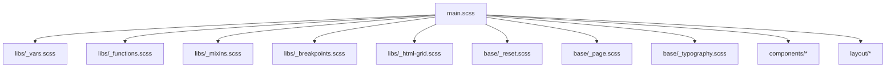
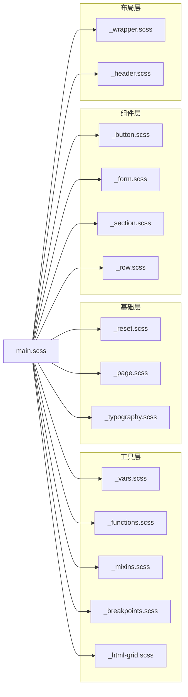
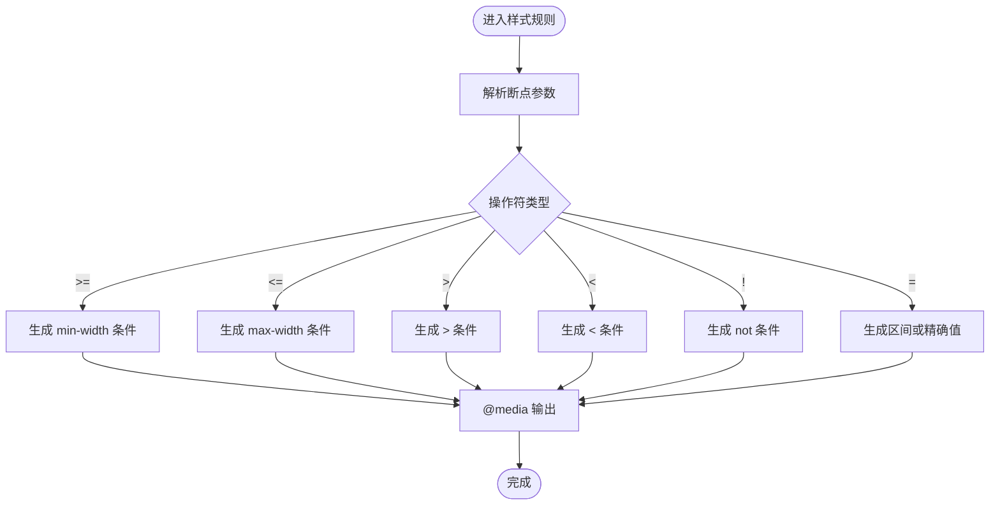
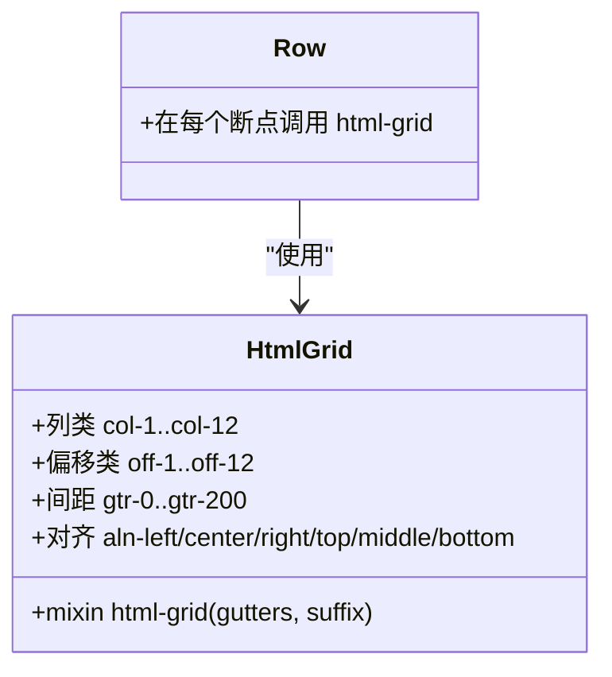
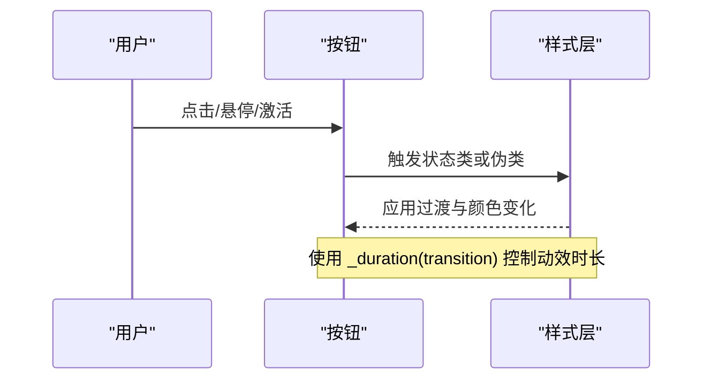
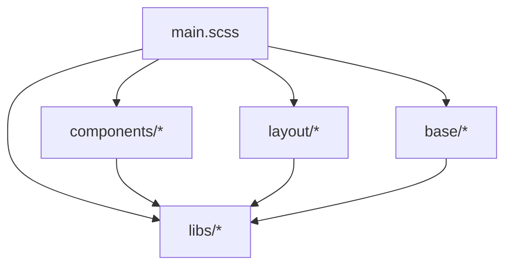

# 样式系统

<cite>
**本文引用的文件**
- [assets/sass/main.scss](file://assets/sass/main.scss)
- [assets/sass/libs/_vars.scss](file://assets/sass/libs/_vars.scss)
- [assets/sass/libs/_functions.scss](file://assets/sass/libs/_functions.scss)
- [assets/sass/libs/_mixins.scss](file://assets/sass/libs/_mixins.scss)
- [assets/sass/libs/_breakpoints.scss](file://assets/sass/libs/_breakpoints.scss)
- [assets/sass/libs/_html-grid.scss](file://assets/sass/libs/_html-grid.scss)
- [assets/sass/base/_reset.scss](file://assets/sass/base/_reset.scss)
- [assets/sass/base/_page.scss](file://assets/sass/base/_page.scss)
- [assets/sass/base/_typography.scss](file://assets/sass/base/_typography.scss)
- [assets/sass/components/_button.scss](file://assets/sass/components/_button.scss)
- [assets/sass/components/_form.scss](file://assets/sass/components/_form.scss)
- [assets/sass/components/_section.scss](file://assets/sass/components/_section.scss)
- [assets/sass/components/_row.scss](file://assets/sass/components/_row.scss)
- [assets/sass/layout/_header.scss](file://assets/sass/layout/_header.scss)
- [assets/sass/layout/_wrapper.scss](file://assets/sass/layout/_wrapper.scss)
</cite>

## 目录
1. [简介](#简介)
2. [项目结构](#项目结构)
3. [核心组件](#核心组件)
4. [架构总览](#架构总览)
5. [详细组件分析](#详细组件分析)
6. [依赖关系分析](#依赖关系分析)
7. [性能考量](#性能考量)
8. [故障排查指南](#故障排查指南)
9. [结论](#结论)
10. [附录](#附录)

## 简介
本样式系统基于 Sass 构建，采用模块化组织方式，将基础样式、组件样式、布局样式与工具库清晰分离。通过统一的变量、混入与函数体系，实现颜色主题、字体系统与布局系统的集中定制；借助响应式断点机制，确保多设备适配。文档旨在帮助读者理解该样式系统的架构设计、实现原理与最佳实践，并提供可操作的自定义指导。

## 项目结构
样式源码位于 assets/sass 目录，入口为 main.scss，按职责划分为：
- libs：工具层，包含变量、函数、混入、断点、网格等基础设施
- base：基础层，包含重置、页面基础、排版等全局样式
- components：组件层，按钮、表单、区块、行等可复用 UI 单元
- layout：布局层，包装器、头部、主体、侧边栏、页脚、菜单等页面骨架

图表来源
- [assets/sass/main.scss:1-62](file://assets/sass/main.scss#L1-L62)

章节来源
- [assets/sass/main.scss:1-62](file://assets/sass/main.scss#L1-L62)

## 核心组件
- 变量与主题（_vars.scss）
  - 集中管理尺寸、字体、调色板、时长与杂项配置，便于统一换肤与主题定制
- 函数与取值（_functions.scss）
  - 提供从 map 中安全取值的通用函数，以及便捷访问 _size、_font、_palette、_duration 的封装
- 混入与工具（_mixins.scss）
  - 图标混入、间距计算、SVG 数据 URL 编码等常用能力
- 响应式断点（_breakpoints.scss）
  - 定义断点集合与 breakpoint/ orientation 混入，支持 >=、<=、>、<、! 等操作符
- 栅格系统（_html-grid.scss）
  - 基于 Flexbox 的 12 列栅格，支持列宽、偏移、间距缩放与对齐控制
- 基础样式（base）
  - 重置浏览器默认样式、设置 border-box、最小宽度与加载态动画冻结
  - 排版：字号、字重、行高、标题层级、引用、代码块、分割线等
- 组件（components）
  - 按钮、表单、区块、行等，统一使用变量与混入，保证风格一致
- 布局（layout）
  - 页面容器、头部、主体、侧边栏、页脚、菜单等区域布局

章节来源
- [assets/sass/libs/_vars.scss:1-44](file://assets/sass/libs/_vars.scss#L1-L44)
- [assets/sass/libs/_functions.scss:1-90](file://assets/sass/libs/_functions.scss#L1-L90)
- [assets/sass/libs/_mixins.scss:1-78](file://assets/sass/libs/_mixins.scss#L1-L78)
- [assets/sass/libs/_breakpoints.scss:1-223](file://assets/sass/libs/_breakpoints.scss#L1-L223)
- [assets/sass/libs/_html-grid.scss:1-149](file://assets/sass/libs/_html-grid.scss#L1-L149)
- [assets/sass/base/_reset.scss:1-76](file://assets/sass/base/_reset.scss#L1-L76)
- [assets/sass/base/_page.scss:1-48](file://assets/sass/base/_page.scss#L1-L48)
- [assets/sass/base/_typography.scss:1-187](file://assets/sass/base/_typography.scss#L1-L187)
- [assets/sass/components/_button.scss:1-85](file://assets/sass/components/_button.scss#L1-L85)
- [assets/sass/components/_form.scss:1-179](file://assets/sass/components/_form.scss#L1-L179)
- [assets/sass/components/_section.scss:1-39](file://assets/sass/components/_section.scss#L1-L39)
- [assets/sass/components/_row.scss:1-31](file://assets/sass/components/_row.scss#L1-L31)
- [assets/sass/layout/_header.scss:1-51](file://assets/sass/layout/_header.scss#L1-L51)
- [assets/sass/layout/_wrapper.scss:1-13](file://assets/sass/layout/_wrapper.scss#L1-L13)

## 架构总览
样式编译入口 main.scss 依次引入工具层、基础层、组件层与布局层，形成清晰的依赖链。工具层提供变量、函数、混入与断点；基础层建立全局基线与排版；组件层以原子化方式组合；布局层负责页面级结构。

图表来源
- [assets/sass/main.scss:1-62](file://assets/sass/main.scss#L1-L62)

章节来源
- [assets/sass/main.scss:1-62](file://assets/sass/main.scss#L1-L62)

## 详细组件分析

### 变量与主题（颜色、字体、尺寸）
- 颜色主题：通过调色板 map 统一管理背景、前景、强调色、边框等，便于一键换肤
- 字体系统：集中定义主字体、标题字体、等宽字体及字重、字距等，配合排版模块使用
- 尺寸系统：统一圆角、元素高度、外边距、侧边栏宽度、栅格间距等，保证视觉一致性

章节来源
- [assets/sass/libs/_vars.scss:1-44](file://assets/sass/libs/_vars.scss#L1-L44)
- [assets/sass/base/_typography.scss:9-27](file://assets/sass/base/_typography.scss#L9-L27)
- [assets/sass/components/_button.scss:13-36](file://assets/sass/components/_button.scss#L13-L36)

### 响应式断点与媒体查询
- 断点定义：在入口中声明 xlarge、large、medium、small、xsmall、xxsmall 等断点范围
- 使用方式：通过 breakpoint 混入包裹样式，支持 >=、<=、>、<、! 等操作符
- 典型应用：正文字号、标题字号、头部内边距在不同断点下的自适应调整

图表来源
- [assets/sass/libs/_breakpoints.scss:13-223](file://assets/sass/libs/_breakpoints.scss#L13-L223)
- [assets/sass/main.scss:18-27](file://assets/sass/main.scss#L18-L27)

章节来源
- [assets/sass/main.scss:18-27](file://assets/sass/main.scss#L18-L27)
- [assets/sass/libs/_breakpoints.scss:13-223](file://assets/sass/libs/_breakpoints.scss#L13-L223)
- [assets/sass/base/_typography.scss:16-26](file://assets/sass/base/_typography.scss#L16-L26)
- [assets/sass/layout/_header.scss:31-50](file://assets/sass/layout/_header.scss#L31-L50)

### 栅格系统与布局
- 栅格初始化：通过 html-grid 混入启用 flex 布局与 12 列系统
- 列与偏移：col-n 控制宽度，off-n 控制左偏移，gtr-* 控制间距缩放
- 对齐与均匀：aln-* 控制主轴对齐，gtr-uniform 消除最后一列底部多余间距
- 组件集成：行组件 row 在各断点下调用 html-grid，实现响应式列布局

图表来源
- [assets/sass/libs/_html-grid.scss:5-149](file://assets/sass/libs/_html-grid.scss#L5-L149)
- [assets/sass/components/_row.scss:9-31](file://assets/sass/components/_row.scss#L9-L31)

章节来源
- [assets/sass/libs/_html-grid.scss:5-149](file://assets/sass/libs/_html-grid.scss#L5-L149)
- [assets/sass/components/_row.scss:9-31](file://assets/sass/components/_row.scss#L9-L31)

### 基础样式与排版
- 重置：统一盒模型、移除默认列表样式、处理表单外观与滚动条兼容
- 页面基础：设置 border-box、最小宽度、加载与缩放时冻结动画
- 排版：正文、链接、标题、引用、代码、分割线等，结合断点实现字号与间距自适应

章节来源
- [assets/sass/base/_reset.scss:10-76](file://assets/sass/base/_reset.scss#L10-L76)
- [assets/sass/base/_page.scss:19-48](file://assets/sass/base/_page.scss#L19-L48)
- [assets/sass/base/_typography.scss:9-187](file://assets/sass/base/_typography.scss#L9-L187)

### 组件：按钮与表单
- 按钮：统一圆角、边框、字号、字重、过渡效果；支持 primary、icon、fit、small、large 等变体；禁用态降低透明度并禁止交互
- 表单：输入框、选择框、文本域、复选框与单选框的统一样式；聚焦态高亮强调色；下拉箭头使用 SVG 数据 URL；占位符颜色统一

图表来源
- [assets/sass/components/_button.scss:13-85](file://assets/sass/components/_button.scss#L13-L85)
- [assets/sass/libs/_functions.scss:57-62](file://assets/sass/libs/_functions.scss#L57-L62)

章节来源
- [assets/sass/components/_button.scss:13-85](file://assets/sass/components/_button.scss#L13-L85)
- [assets/sass/components/_form.scss:9-179](file://assets/sass/components/_form.scss#L9-L179)
- [assets/sass/libs/_mixins.scss:61-78](file://assets/sass/libs/_mixins.scss#L61-L78)

### 组件：区块与行
- 区块：支持特殊对齐与标题修饰（major/main），用于内容分块与强调
- 行：在各断点下切换栅格间距，保持响应式布局一致性

章节来源
- [assets/sass/components/_section.scss:9-39](file://assets/sass/components/_section.scss#L9-L39)
- [assets/sass/components/_row.scss:9-31](file://assets/sass/components/_row.scss#L9-L31)

### 布局：包装器与头部
- 包装器：flex 反向排列，保证主内容与侧边栏顺序与视觉层次
- 头部：flex 布局，强调色底边框，logo 与图标区；在小屏下调整内边距与图标定位

章节来源
- [assets/sass/layout/_wrapper.scss:9-13](file://assets/sass/layout/_wrapper.scss#L9-L13)
- [assets/sass/layout/_header.scss:9-51](file://assets/sass/layout/_header.scss#L9-L51)

## 依赖关系分析
- 入口依赖：main.scss 按顺序引入 libs、base、components、layout，形成单向依赖
- 工具依赖：组件与布局均依赖 _vars、_functions、_mixins、_breakpoints、_html-grid
- 组件间耦合：组件尽量独立，通过变量与混入共享样式语义，避免直接相互引用
- 布局与组件：布局通过组件拼装页面，组件不感知具体布局位置

图表来源
- [assets/sass/main.scss:1-62](file://assets/sass/main.scss#L1-L62)

章节来源
- [assets/sass/main.scss:1-62](file://assets/sass/main.scss#L1-L62)

## 性能考量
- 减少重复：通过变量与混入集中管理样式，避免硬编码导致的冗余
- 合理作用域：仅在需要的断点与组件中引入必要样式，避免全局污染
- 优化选择器：优先使用语义化类名，减少深层嵌套与复杂选择器
- 资源加载：字体与图标按需引入，避免未使用资源带来的体积开销
- 动画与过渡：使用统一的时长变量，避免过度动画影响渲染性能

[本节为通用指导，无需特定文件来源]

## 故障排查指南
- 样式覆盖冲突
  - 现象：组件样式被意外覆盖
  - 排查：检查引入顺序与作用域，确认是否使用了 !important 或过深选择器
  - 参考：按钮与表单中对强调色的使用与焦点态样式
- 断点不生效
  - 现象：响应式样式未按预期触发
  - 排查：确认断点定义与 breakpoint 混入的使用是否正确，检查操作符与范围
  - 参考：断点定义与媒体查询生成逻辑
- 栅格错位
  - 现象：列宽或间距异常
  - 排查：检查 html-grid 的参数与 row 在各断点的调用，确认是否误用偏移或间距类
- 表单样式异常
  - 现象：下拉箭头或占位符显示不正确
  - 排查：检查 SVG 数据 URL 编码与占位符伪类兼容性

章节来源
- [assets/sass/components/_button.scss:13-85](file://assets/sass/components/_button.scss#L13-L85)
- [assets/sass/components/_form.scss:51-74](file://assets/sass/components/_form.scss#L51-L74)
- [assets/sass/components/_form.scss:161-179](file://assets/sass/components/_form.scss#L161-L179)
- [assets/sass/libs/_breakpoints.scss:13-223](file://assets/sass/libs/_breakpoints.scss#L13-L223)
- [assets/sass/libs/_html-grid.scss:5-149](file://assets/sass/libs/_html-grid.scss#L5-L149)

## 结论
该样式系统通过清晰的模块化分层与统一的工具层，实现了可维护、可扩展且响应友好的前端样式架构。变量、函数与混入提供了强大的定制能力；断点与栅格确保了跨设备的一致性体验。遵循本文的最佳实践，可在现有基础上高效扩展主题与组件，同时保持代码整洁与性能优良。

[本节为总结性内容，无需特定文件来源]

## 附录

### 自定义示例与最佳实践
- 更换主题色
  - 修改调色板中的强调色与背景/前景色，即可全局更新按钮、链接与边框等元素
  - 参考：调色板变量与按钮/链接对强调色的使用
- 调整字体系统
  - 在主变量中替换字体族与字重，排版会自动继承新字体设置
  - 参考：字体变量与排版模块对字体的引用
- 新增断点
  - 在入口中扩展断点映射，并在组件中使用 breakpoint 混入适配新断点
  - 参考：断点定义与媒体查询混入
- 扩展栅格
  - 通过 html-grid 的间距与对齐参数，快速创建新的布局模式
  - 参考：栅格混入与行组件在各断点的调用
- 命名规范建议
  - 采用 BEM 风格命名（如 .component__element--modifier），提升可读性与可维护性
  - 在组件文件中按功能拆分，避免单文件过大
- 优先级管理
  - 尽量避免 !important，必要时仅用于覆盖第三方样式或紧急修复
  - 通过合理的引入顺序与作用域控制优先级

章节来源
- [assets/sass/libs/_vars.scss:34-44](file://assets/sass/libs/_vars.scss#L34-L44)
- [assets/sass/components/_button.scss:13-85](file://assets/sass/components/_button.scss#L13-L85)
- [assets/sass/base/_typography.scss:9-27](file://assets/sass/base/_typography.scss#L9-L27)
- [assets/sass/main.scss:18-27](file://assets/sass/main.scss#L18-L27)
- [assets/sass/libs/_breakpoints.scss:13-223](file://assets/sass/libs/_breakpoints.scss#L13-L223)
- [assets/sass/libs/_html-grid.scss:5-149](file://assets/sass/libs/_html-grid.scss#L5-L149)
- [assets/sass/components/_row.scss:9-31](file://assets/sass/components/_row.scss#L9-L31)