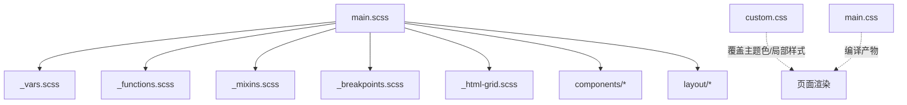
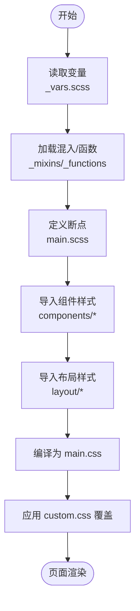
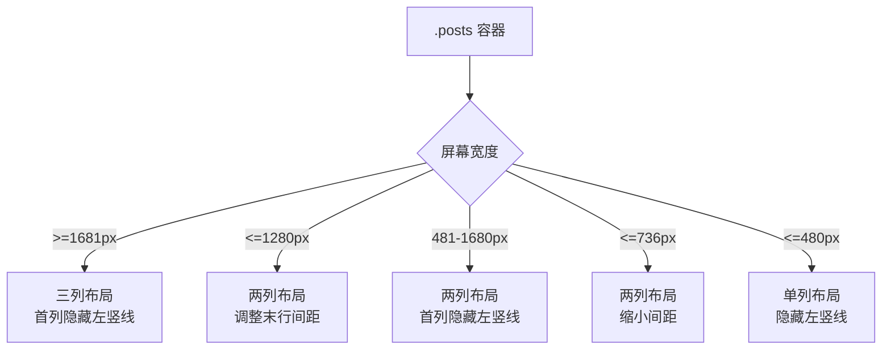
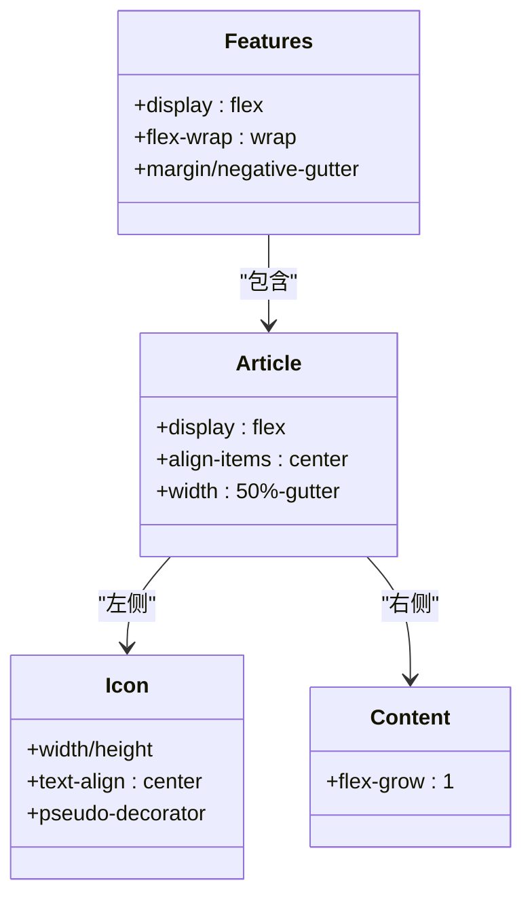
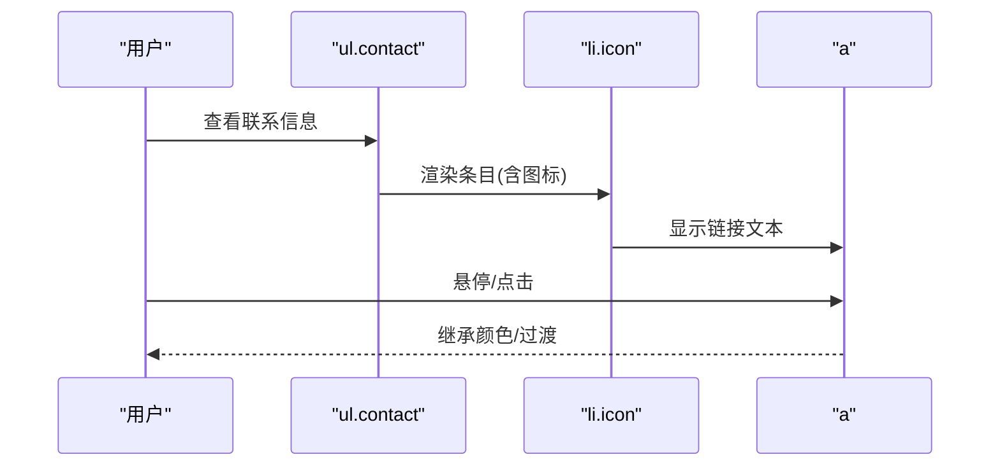
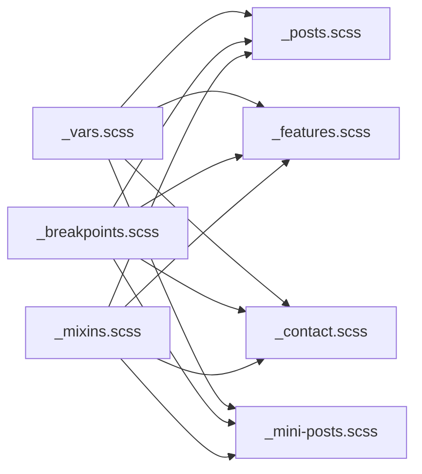

# 组件样式

<cite>
**本文引用的文件**
- [assets/sass/components/_posts.scss](file://assets/sass/components/_posts.scss)
- [assets/sass/components/_features.scss](file://assets/sass/components/_features.scss)
- [assets/sass/components/_contact.scss](file://assets/sass/components/_contact.scss)
- [assets/sass/components/_mini-posts.scss](file://assets/sass/components/_mini-posts.scss)
- [assets/sass/main.scss](file://assets/sass/main.scss)
- [assets/sass/libs/_vars.scss](file://assets/sass/libs/_vars.scss)
- [assets/css/main.css](file://assets/css/main.css)
- [assets/css/custom.css](file://assets/css/custom.css)
</cite>

## 目录
1. [简介](#简介)
2. [项目结构](#项目结构)
3. [核心组件](#核心组件)
4. [架构总览](#架构总览)
5. [详细组件分析](#详细组件分析)
6. [依赖关系分析](#依赖关系分析)
7. [性能与可访问性](#性能与可访问性)
8. [故障排查指南](#故障排查指南)
9. [结论](#结论)
10. [附录：定制示例](#附录：定制示例)

## 简介
本文件面向希望统一、可扩展地定制站点 UI 的开发者与内容编辑者，聚焦四个常用组件的样式实现与定制方法：帖子（posts）、特性（features）、联系（contact）与迷你帖子（mini-posts）。文档将说明各组件的视觉层次、间距系统、交互状态（悬停/激活等）、响应式行为与跨设备表现，并提供颜色修改、布局调整与动画效果的定制指引，同时兼顾可访问性与浏览器兼容性。

## 项目结构
样式采用 SCSS 模块化组织，通过主入口文件按“基础 → 组件 → 布局”的顺序引入，最终编译为 main.css；custom.css 用于覆盖默认主题色与局部布局微调。

图表来源
- [assets/sass/main.scss:1-62](file://assets/sass/main.scss#L1-L62)
- [assets/sass/libs/_vars.scss:1-44](file://assets/sass/libs/_vars.scss#L1-L44)

章节来源
- [assets/sass/main.scss:1-62](file://assets/sass/main.scss#L1-L62)
- [assets/sass/libs/_vars.scss:1-44](file://assets/sass/libs/_vars.scss#L1-L44)

## 核心组件
- 帖子（posts）：三列网格卡片列表，使用伪元素绘制分隔线，具备多断点响应式布局。
- 特性（features）：图标+内容的双栏卡片，支持中等及以下屏幕堆叠展示。
- 联系（contact）：带图标的联系信息列表，首项无顶边框与上边距。
- 迷你帖子（mini-posts）：简洁的条目列表，首项无边框与顶部内边距。

章节来源
- [assets/sass/components/_posts.scss:9-179](file://assets/sass/components/_posts.scss#L9-L179)
- [assets/sass/components/_features.scss:9-156](file://assets/sass/components/_features.scss#L9-L156)
- [assets/sass/components/_contact.scss:9-47](file://assets/sass/components/_contact.scss#L9-L47)
- [assets/sass/components/_mini-posts.scss:9-31](file://assets/sass/components/_mini-posts.scss#L9-L31)

## 架构总览
组件样式基于统一的变量与混入系统：
- 变量：颜色、尺寸、字体、断点等集中管理于 _vars.scss。
- 混入：vendor 前缀、过渡、断点封装在 mixins 中。
- 断点：在 main.scss 中定义 xlarge、large、medium、small、xsmall 等断点，并在各组件中使用 @include breakpoint(...) 进行适配。
- 组件顺序：在 main.scss 中按 row/section/form/box/icon/image/list/actions/icons/contact/pagination/table/button/mini-posts/features/posts 顺序引入，确保层叠优先级一致。

图表来源
- [assets/sass/main.scss:1-62](file://assets/sass/main.scss#L1-L62)
- [assets/sass/libs/_vars.scss:1-44](file://assets/sass/libs/_vars.scss#L1-L44)

章节来源
- [assets/sass/main.scss:1-62](file://assets/sass/main.scss#L1-L62)
- [assets/sass/libs/_vars.scss:1-44](file://assets/sass/libs/_vars.scss#L1-L44)

## 详细组件分析

### 帖子（posts）
- 结构与类名
  - 容器：.posts（flex 容器，wrap，负外边距抵消子项 padding）
  - 卡片：article（固定宽度比例，相对定位以绘制伪元素分割线）
  - 图片：.image > img（块级，全宽）
- 视觉层次与间距
  - 使用 _size(gutter) 派生间距，保证一致的栅格节奏。
  - 每个 article 左侧和底部通过伪元素绘制细线，形成网格分隔。
- 交互状态
  - 未定义 hover/active 特殊态，可通过 .button 或链接继承全局过渡。
- 响应式行为
  - xlarge-to-max：每行三列，首列隐藏左侧竖线，末三行底部横线处理。
  - <=xlarge：两列布局，调整末行间距。
  - small-to-xlarge：两列布局，首列隐藏竖线，末两行处理。
  - <=small：缩小 gutter，保持两列。
  - <=xsmall：单列，隐藏左侧竖线，仅保留底部横线，末项去除底横线。
- 定制要点
  - 修改 _size(gutter) 或 _size(element-margin) 可全局调整间距。
  - 通过 _palette(border) 调整分隔线颜色。
  - 如需添加悬停效果，可在 article 上增加 transition 与背景变化。

图表来源
- [assets/sass/components/_posts.scss:61-179](file://assets/sass/components/_posts.scss#L61-L179)

章节来源
- [assets/sass/components/_posts.scss:9-179](file://assets/sass/components/_posts.scss#L9-L179)

### 特性（features）
- 结构与类名
  - 容器：.features（flex 容器，wrap，负外边距）
  - 卡片：article（flex 行，图标与内容并排）
  - 图标：.icon（固定宽高，居中，旋转伪元素装饰）
  - 内容：.content（flex-grow 自适应）
- 视觉层次与间距
  - 图标区域高度随断点缩放，装饰边框由伪元素生成。
  - 奇偶列通过 margin-right/left 微调对齐。
- 交互状态
  - 未定义 hover/active 特殊态，可叠加按钮或链接的全局过渡。
- 响应式行为
  - <=medium：改为单列，图标尺寸缩小。
  - <=xsmall：进一步缩小图标与字号，方向切换为纵向排列。
- 定制要点
  - 通过 _palette(accent) 控制图标颜色与装饰边框。
  - 调整 .icon 宽高与伪元素尺寸可改变视觉比重。
  - 在小屏下若需恢复横向布局，可覆盖 flex-direction。

图表来源
- [assets/sass/components/_features.scss:9-78](file://assets/sass/components/_features.scss#L9-L78)

章节来源
- [assets/sass/components/_features.scss:9-156](file://assets/sass/components/_features.scss#L9-L156)

### 联系（contact）
- 结构与类名
  - 列表：ul.contact（去列表样式，零内边距）
  - 条目：li（使用 icon 混入，顶部边框，左侧图标占位）
  - 链接：a（颜色继承）
- 视觉层次与间距
  - 首项 li:first-child 移除顶边框与多余间距，图标 top 归零。
  - 图标通过绝对定位置于左侧，颜色来自 _palette(accent)。
- 交互状态
  - 未定义 hover/active 特殊态，可结合全局 a:hover 过渡。
- 响应式行为
  - 无特定断点，天然流式布局。
- 定制要点
  - 修改 _palette(accent) 可统一图标颜色。
  - 调整 li 的 padding-left 与图标宽度可改变图文间距。
  - 如需点击反馈，可为 li 或 a 添加 transition 与背景变化。

图表来源
- [assets/sass/components/_contact.scss:9-47](file://assets/sass/components/_contact.scss#L9-L47)

章节来源
- [assets/sass/components/_contact.scss:9-47](file://assets/sass/components/_contact.scss#L9-L47)

### 迷你帖子（mini-posts）
- 结构与类名
  - 容器：.mini-posts
  - 条目：article（顶部边框与上边距）
  - 图片：.image > img（块级，全宽）
- 视觉层次与间距
  - 首项 article 移除顶边框与上边距，避免重复分割线。
  - 图片与内容之间使用 _size(element-margin)*0.75 的紧凑间距。
- 交互状态
  - 未定义 hover/active 特殊态，可叠加全局过渡。
- 响应式行为
  - 无特定断点，图片全宽自适应。
- 定制要点
  - 通过 _palette(border) 调整分割线颜色。
  - 调整图片上下间距可改变密度。
  - 如需卡片化，可包裹 .box 并使用 .alt 变体。

章节来源
- [assets/sass/components/_mini-posts.scss:9-31](file://assets/sass/components/_mini-posts.scss#L9-L31)

## 依赖关系分析
- 变量依赖
  - 所有组件通过 _palette()、_size()、_font() 等函数引用统一变量，便于全局主题切换。
- 断点依赖
  - 组件通过 @include breakpoint(...) 复用 main.scss 中定义的断点集合，确保响应式一致性。
- 混入依赖
  - vendor 前缀、过渡、图标等通过 mixins 封装，减少重复代码。
- 外部资源
  - FontAwesome 图标库与 Google Fonts 字体在主入口引入。

图表来源
- [assets/sass/libs/_vars.scss:1-44](file://assets/sass/libs/_vars.scss#L1-L44)
- [assets/sass/main.scss:18-27](file://assets/sass/main.scss#L18-L27)

章节来源
- [assets/sass/libs/_vars.scss:1-44](file://assets/sass/libs/_vars.scss#L1-L44)
- [assets/sass/main.scss:18-27](file://assets/sass/main.scss#L18-L27)

## 性能与可访问性
- 性能
  - 使用 CSS Flexbox 与伪元素绘制分隔线，避免额外 DOM 节点，提升渲染效率。
  - 过渡与动画仅在必要时启用，且时长较短（约 0.2s），减少重绘开销。
- 可访问性
  - 链接与按钮遵循语义化标签，颜色对比度由主题变量控制，建议自定义时保持足够的对比度。
  - 图标作为装饰性元素，不承载关键信息；重要操作应提供文本或 aria-label。
- 浏览器兼容
  - 通过 vendor 前缀与 fallback 策略兼容主流浏览器。
  - 小屏下禁用动画以提升低端设备体验（如 body.is-preload 类）。

章节来源
- [assets/css/main.css:82-90](file://assets/css/main.css#L82-L90)
- [assets/sass/components/_button.scss:15-18](file://assets/sass/components/_button.scss#L15-L18)

## 故障排查指南
- 问题：分隔线错位或重叠
  - 检查是否误改 _size(gutter) 或组件内的负 margin 计算。
  - 确认 article 的伪元素 left/bottom 值与 gutter 保持一致。
- 问题：小屏布局错乱
  - 核对断点媒体查询是否被其他样式覆盖。
  - 检查父容器是否意外设置了 overflow 或 fixed width。
- 问题：图标颜色不一致
  - 确认是否覆盖了 _palette(accent)。
  - 检查是否在 custom.css 中对 .icon 或 li:before 做了局部覆盖。
- 问题：链接悬停无效
  - 检查是否被 custom.css 中的 a:hover 规则覆盖。
  - 确认按钮或链接未被设置为 pointer-events: none。

章节来源
- [assets/sass/components/_posts.scss:24-44](file://assets/sass/components/_posts.scss#L24-L44)
- [assets/sass/components/_contact.scss:20-41](file://assets/sass/components/_contact.scss#L20-L41)
- [assets/css/custom.css:134-141](file://assets/css/custom.css#L134-L141)

## 结论
本项目通过变量与混入实现了高度一致的组件样式体系。posts、features、contact、mini-posts 均具备良好的响应式能力与清晰的视觉层次。借助 _vars.scss 与 custom.css，可快速完成主题定制与局部覆盖。建议在扩展时优先复用现有断点与间距系统，以保持整体一致性。

## 附录：定制示例
以下为常见定制场景与对应参考位置（不直接粘贴代码，仅提供路径以便查阅）：
- 修改主题色
  - 入口变量：[assets/sass/libs/_vars.scss:35-44](file://assets/sass/libs/_vars.scss#L35-L44)
  - 链接与强调色覆盖：[assets/css/custom.css:134-141](file://assets/css/custom.css#L134-L141)
- 调整全局间距
  - 元素间距与栅格间距：[assets/sass/libs/_vars.scss:13-20](file://assets/sass/libs/_vars.scss#L13-L20)
  - 组件内使用 _size(element-margin) 与 _size(gutter) 的位置：
    - posts：[assets/sass/components/_posts.scss:10-15](file://assets/sass/components/_posts.scss#L10-L15)
    - features：[assets/sass/components/_features.scss:10-15](file://assets/sass/components/_features.scss#L10-L15)
    - mini-posts：[assets/sass/components/_mini-posts.scss:11-13](file://assets/sass/components/_mini-posts.scss#L11-L13)
- 添加悬停/激活动画
  - 按钮过渡与状态：[assets/sass/components/_button.scss:15-44](file://assets/sass/components/_button.scss#L15-L44)
  - 为文章卡片添加过渡：参考 posts 的 article 选择器位置：[assets/sass/components/_posts.scss:17-59](file://assets/sass/components/_posts.scss#L17-L59)
- 调整图标大小与颜色
  - features 图标尺寸与颜色：[assets/sass/components/_features.scss:37-67](file://assets/sass/components/_features.scss#L37-L67)
  - contact 图标颜色与定位：[assets/sass/components/_contact.scss:20-31](file://assets/sass/components/_contact.scss#L20-L31)
- 响应式断点覆盖
  - 断点定义：[assets/sass/main.scss:18-27](file://assets/sass/main.scss#L18-L27)
  - 各组件断点覆盖位置：
    - posts：[assets/sass/components/_posts.scss:61-179](file://assets/sass/components/_posts.scss#L61-L179)
    - features：[assets/sass/components/_features.scss:80-156](file://assets/sass/components/_features.scss#L80-L156)