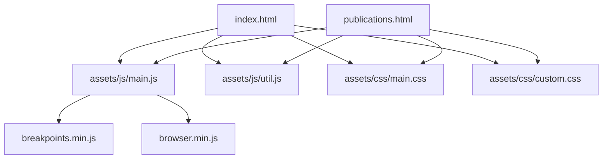
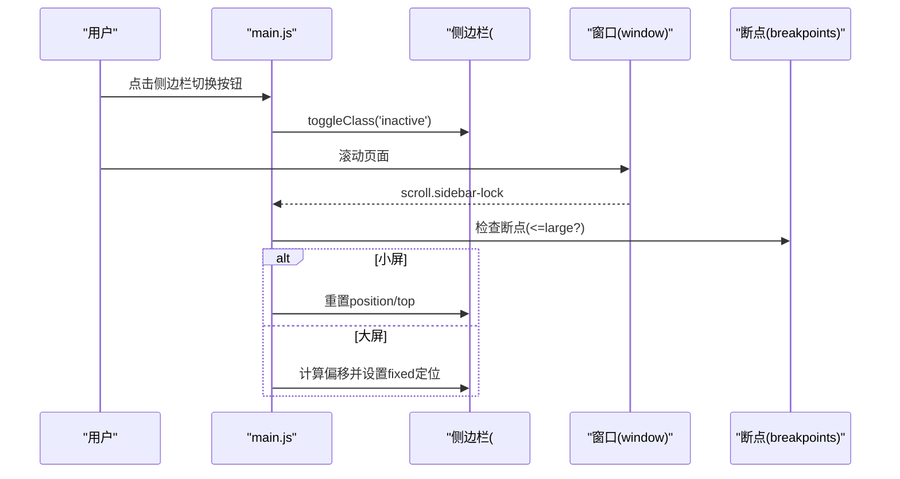
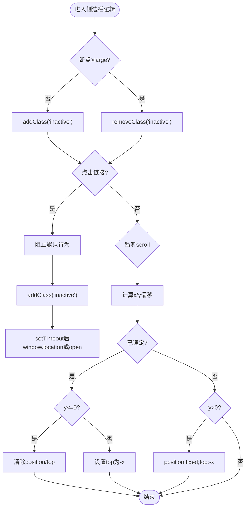
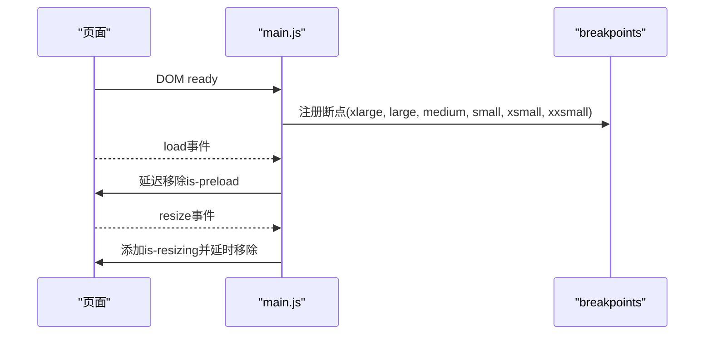
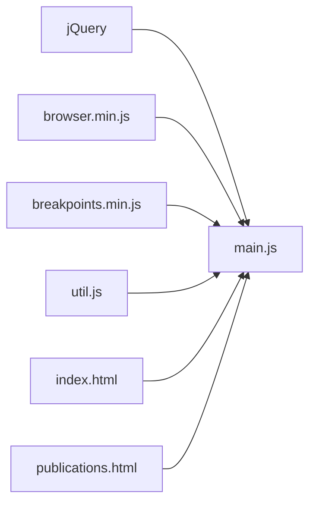

# JavaScript扩展

<cite>
**本文引用的文件**
- [assets/js/main.js](file://assets/js/main.js)
- [assets/js/util.js](file://assets/js/util.js)
- [index.html](file://index.html)
- [publications.html](file://publications.html)
- [assets/css/custom.css](file://assets/css/custom.css)
- [assets/css/main.css](file://assets/css/main.css)
- [README.md](file://README.md)
</cite>

## 目录
1. [简介](#简介)
2. [项目结构](#项目结构)
3. [核心组件](#核心组件)
4. [架构总览](#架构总览)
5. [详细组件分析](#详细组件分析)
6. [依赖关系分析](#依赖关系分析)
7. [性能考虑](#性能考虑)
8. [故障排查指南](#故障排查指南)
9. [结论](#结论)
10. [附录](#附录)

## 简介
本指南面向希望在现有站点基础上添加新交互功能与动态效果的开发者。基于当前代码库，我们将从脚本模块分析、事件处理机制扩展、DOM操作优化、侧边栏增强、响应式行为定制、动画效果实现方案、调试与错误处理、性能监控、第三方插件集成与兼容性测试等方面，提供可操作的实践建议与最佳实践。

## 项目结构
本项目采用“页面 + 样式 + 脚本”的清晰分层：
- 页面入口：index.html、publications.html
- 样式：assets/css/main.css（主题）、assets/css/custom.css（个性化）
- 脚本：assets/js/main.js（业务逻辑）、assets/js/util.js（通用工具）、assets/js/browser.min.js、assets/js/breakpoints.min.js（浏览器特性与断点）

图表来源
- [index.html:123-128](file://index.html#L123-L128)
- [publications.html:166-171](file://publications.html#L166-L171)
- [assets/js/main.js:1-23](file://assets/js/main.js#L1-L23)

章节来源
- [index.html:1-150](file://index.html#L1-L150)
- [publications.html:1-185](file://publications.html#L1-L185)
- [assets/css/main.css:1-200](file://assets/css/main.css#L1-L200)
- [assets/css/custom.css:1-400](file://assets/css/custom.css#L1-L400)
- [assets/js/main.js:1-262](file://assets/js/main.js#L1-L262)
- [assets/js/util.js:1-587](file://assets/js/util.js#L1-L587)

## 核心组件
- 响应式断点系统：通过断点配置控制不同屏幕尺寸下的行为切换（如侧边栏激活/非激活）。
- 侧边栏交互：包含切换按钮、链接点击导航、滚动锁定、移动端触摸事件等。
- 菜单展开/折叠：支持多级菜单项的展开与收起，并在状态变化时触发重排。
- 通用工具方法：面板化封装、占位符兼容、元素优先级移动等。

章节来源
- [assets/js/main.js:13-23](file://assets/js/main.js#L13-L23)
- [assets/js/main.js:72-235](file://assets/js/main.js#L72-L235)
- [assets/js/main.js:237-260](file://assets/js/main.js#L237-L260)
- [assets/js/util.js:42-297](file://assets/js/util.js#L42-L297)
- [assets/js/util.js:303-519](file://assets/js/util.js#L303-L519)
- [assets/js/util.js:526-585](file://assets/js/util.js#L526-L585)

## 架构总览
整体交互由main.js驱动，结合util.js提供的工具方法，在HTML结构中通过类名和属性进行状态管理。CSS负责视觉呈现与过渡动画，断点系统协调不同设备上的表现。

图表来源
- [assets/js/main.js:91-103](file://assets/js/main.js#L91-L103)
- [assets/js/main.js:166-235](file://assets/js/main.js#L166-L235)
- [assets/js/main.js:13-23](file://assets/js/main.js#L13-L23)

## 详细组件分析

### 侧边栏功能增强
- 默认状态与断点联动：在小于等于large时默认inactive；大于large时移除inactive。
- 切换按钮：动态创建并插入到侧边栏，点击时阻止默认行为并切换inactive类。
- 链接点击导航：在小屏下拦截链接点击，先关闭侧边栏再跳转；支持target="_blank"在新标签页打开。
- 事件冒泡控制：防止侧边栏内部事件冒泡至body导致误关闭。
- 滚动锁定：在大屏下根据滚动位置将侧边栏内容固定并计算top偏移，保持内容始终可见。

图表来源
- [assets/js/main.js:72-164](file://assets/js/main.js#L72-L164)
- [assets/js/main.js:166-235](file://assets/js/main.js#L166-L235)

章节来源
- [assets/js/main.js:72-235](file://assets/js/main.js#L72-L235)

### 响应式行为的定制
- 断点定义：在初始化阶段声明多档断点范围，便于后续按条件执行逻辑。
- 加载与缩放状态：页面加载完成后移除is-preload以启用动画；窗口resize期间添加is-resizing以暂停动画，避免抖动。
- 图片适配：在不支持object-fit或特定浏览器下，使用背景图模拟object-fit效果。

图表来源
- [assets/js/main.js:13-23](file://assets/js/main.js#L13-L23)
- [assets/js/main.js:25-49](file://assets/js/main.js#L25-L49)
- [assets/js/main.js:51-70](file://assets/js/main.js#L51-L70)

章节来源
- [assets/js/main.js:13-70](file://assets/js/main.js#L13-L70)

### 动画效果的实现方案
- 过渡与动画控制：通过is-preload与is-resizing类名全局禁用或恢复动画，确保首屏体验与缩放稳定性。
- 平滑滚动与固定定位：侧边栏滚动锁定时通过position: fixed与top偏移实现内容跟随。
- 自定义样式：custom.css中定义了新闻列表、出版物列表、侧边栏配色与排版，配合CSS transition实现悬停与高亮效果。

章节来源
- [assets/js/main.js:25-49](file://assets/js/main.js#L25-L49)
- [assets/js/main.js:166-235](file://assets/js/main.js#L166-L235)
- [assets/css/custom.css:155-256](file://assets/css/custom.css#L155-L256)
- [assets/css/custom.css:258-400](file://assets/css/custom.css#L258-L400)

### 事件处理机制的扩展方法
- 委托绑定：对侧边栏内的a标签使用事件委托，减少重复绑定，提升性能。
- 条件分支：依据断点判断是否允许事件生效，保证移动端与大屏的不同交互策略。
- 事件防抖：resize事件中使用定时器合并多次触发，降低重排压力。
- 工具方法复用：利用util.js中的panel、placeholder、prioritize等方法快速实现面板、表单与布局调整。

章节来源
- [assets/js/main.js:105-164](file://assets/js/main.js#L105-L164)
- [assets/js/main.js:35-49](file://assets/js/main.js#L35-L49)
- [assets/js/util.js:42-297](file://assets/js/util.js#L42-L297)
- [assets/js/util.js:303-519](file://assets/js/util.js#L303-L519)
- [assets/js/util.js:526-585](file://assets/js/util.js#L526-L585)

### DOM操作的优化技巧
- 最小化重绘重排：批量修改样式与类名，避免频繁访问布局属性。
- 使用数据缓存：在侧边栏滚动锁定中通过data存储锁定状态，减少DOM查询。
- 事件委托：对动态生成的切换按钮与侧边栏链接使用委托，提高事件处理效率。
- 按需注入样式：仅在需要时插入<style>标签修复滚动条问题，避免污染全局样式。

章节来源
- [assets/js/main.js:85-89](file://assets/js/main.js#L85-L89)
- [assets/js/main.js:105-164](file://assets/js/main.js#L105-L164)
- [assets/js/main.js:166-235](file://assets/js/main.js#L166-L235)

### 菜单展开/折叠
- 菜单项展开：点击.opener时切换active类，并触发侧边栏滚动锁定的重新计算。
- 统一行为：所有菜单项共享同一套展开逻辑，保证一致性。

章节来源
- [assets/js/main.js:237-260](file://assets/js/main.js#L237-L260)

### 通用工具方法
- 面板化：$.fn.panel提供可配置的侧滑面板能力，支持点击隐藏、ESC隐藏、滑动隐藏、滚动复位、表单复位等。
- 占位符兼容：$.fn.placeholder在非原生支持环境下模拟placeholder行为，包括密码框的特殊处理。
- 元素优先级移动：$.prioritize可将元素移动到父容器顶部或还原原位，常用于响应式布局调整。

章节来源
- [assets/js/util.js:42-297](file://assets/js/util.js#L42-L297)
- [assets/js/util.js:303-519](file://assets/js/util.js#L303-L519)
- [assets/js/util.js:526-585](file://assets/js/util.js#L526-L585)

## 依赖关系分析
- main.js依赖jQuery、browser.min.js、breakpoints.min.js，用于浏览器特性检测与断点管理。
- util.js同样依赖jQuery，提供扩展方法供main.js或其他脚本复用。
- HTML页面引入顺序确保依赖先于业务逻辑加载。

图表来源
- [index.html:123-128](file://index.html#L123-L128)
- [publications.html:166-171](file://publications.html#L166-L171)
- [assets/js/main.js:1-23](file://assets/js/main.js#L1-L23)

章节来源
- [index.html:123-128](file://index.html#L123-L128)
- [publications.html:166-171](file://publications.html#L166-L171)
- [assets/js/main.js:1-23](file://assets/js/main.js#L1-L23)

## 性能考虑
- 首屏动画控制：通过is-preload与is-resizing类名控制动画启停，避免阻塞渲染。
- 事件节流：resize事件使用定时器合并触发，减少频繁计算。
- 样式注入：仅在必要时动态插入样式，避免不必要的DOM操作。
- 滚动锁定：在大屏下使用固定定位与偏移计算，避免长列表滚动时的重排开销。
- 图片兼容：在不支持object-fit的环境下使用背景图替代，减少重绘。

章节来源
- [assets/js/main.js:25-49](file://assets/js/main.js#L25-L49)
- [assets/js/main.js:51-70](file://assets/js/main.js#L51-L70)
- [assets/js/main.js:166-235](file://assets/js/main.js#L166-L235)

## 故障排查指南
- 侧边栏未正确显示/隐藏：
  - 检查断点配置是否正确，确认inactive类是否在预期条件下添加/移除。
  - 确认切换按钮是否成功插入并绑定click事件。
- 链接点击无效：
  - 检查href是否为空或为#，确认preventDefault与setTimeout逻辑。
  - 确认target属性是否影响跳转行为。
- 滚动锁定异常：
  - 检查断点条件是否阻止了逻辑执行。
  - 确认$window高度与侧边栏内容高度计算是否正确。
- 表单placeholder不生效：
  - 使用util.js的placeholder方法进行兼容处理。
- 面板无法关闭：
  - 检查panel配置项hideOnClick、hideOnEscape、hideOnSwipe是否启用。
  - 确认body点击事件是否被阻止冒泡。

章节来源
- [assets/js/main.js:91-164](file://assets/js/main.js#L91-L164)
- [assets/js/main.js:166-235](file://assets/js/main.js#L166-L235)
- [assets/js/util.js:42-297](file://assets/js/util.js#L42-L297)
- [assets/js/util.js:303-519](file://assets/js/util.js#L303-L519)

## 结论
本项目通过清晰的脚本分层与工具方法封装，提供了可扩展的交互基础。借助断点系统与事件委托，可以在不同设备上实现一致的体验。遵循本文的扩展方法与最佳实践，可以安全地添加新功能、优化性能并提升用户体验。

## 附录

### 如何添加新的交互功能
- 在main.js中新增模块化的函数，并通过事件委托绑定到目标元素。
- 使用断点系统控制功能的启用/禁用，确保跨设备一致性。
- 如需复杂面板，优先复用util.js中的panel方法，减少重复开发。

章节来源
- [assets/js/main.js:105-164](file://assets/js/main.js#L105-L164)
- [assets/js/util.js:42-297](file://assets/js/util.js#L42-L297)

### 如何扩展事件处理机制
- 使用事件委托减少绑定成本，例如对侧边栏内链接统一处理。
- 在事件回调中依据断点与状态进行条件分支，避免不必要操作。
- 对高频事件（如resize、scroll）进行节流或防抖处理。

章节来源
- [assets/js/main.js:35-49](file://assets/js/main.js#L35-L49)
- [assets/js/main.js:105-164](file://assets/js/main.js#L105-L164)

### DOM操作优化清单
- 批量更新样式与类名，避免多次读取布局属性。
- 使用data缓存状态，减少DOM查询。
- 仅在必要时注入样式或脚本，控制资源加载。

章节来源
- [assets/js/main.js:85-89](file://assets/js/main.js#L85-L89)
- [assets/js/main.js:166-235](file://assets/js/main.js#L166-L235)

### 侧边栏增强建议
- 增加键盘导航支持（如Enter键打开链接）。
- 提供无障碍ARIA属性，改善屏幕阅读器体验。
- 在移动端增加手势提示（如滑动关闭）。

章节来源
- [assets/js/main.js:91-164](file://assets/js/main.js#L91-L164)

### 响应式行为定制
- 扩展断点范围以满足新设备需求。
- 针对不同断点调整布局与交互策略。
- 使用CSS媒体查询与JS断点联动，确保一致体验。

章节来源
- [assets/js/main.js:13-23](file://assets/js/main.js#L13-L23)
- [assets/css/custom.css:48-101](file://assets/css/custom.css#L48-L101)

### 动画效果实现方案
- 使用CSS transition与transform实现轻量动画。
- 通过类名控制动画启停，避免性能问题。
- 在首屏与缩放期间暂停动画，提升流畅度。

章节来源
- [assets/js/main.js:25-49](file://assets/js/main.js#L25-L49)
- [assets/css/custom.css:133-145](file://assets/css/custom.css#L133-L145)

### 调试工具与错误处理
- 使用浏览器开发者工具的Console与Network面板检查脚本加载与错误。
- 在关键路径添加try/catch与日志输出，定位异常。
- 利用断点调试事件流与状态变化。

章节来源
- [assets/js/main.js:91-164](file://assets/js/main.js#L91-L164)
- [assets/js/main.js:166-235](file://assets/js/main.js#L166-L235)

### 性能监控方法
- 使用Performance面板记录关键指标（如首屏时间、交互延迟）。
- 监控resize与scroll事件频率，评估节流效果。
- 观察内存占用与重绘次数，识别潜在瓶颈。

章节来源
- [assets/js/main.js:35-49](file://assets/js/main.js#L35-L49)
- [assets/js/main.js:166-235](file://assets/js/main.js#L166-L235)

### 第三方插件集成指南
- 确保插件脚本在main.js之前加载，避免依赖冲突。
- 在插件初始化前检查浏览器特性与断点状态。
- 为插件提供必要的DOM结构与类名，遵循其API约定。

章节来源
- [index.html:123-128](file://index.html#L123-L128)
- [publications.html:166-171](file://publications.html#L166-L171)

### 兼容性测试流程
- 覆盖主流浏览器与移动端设备，验证侧边栏、菜单、表单等功能。
- 针对不支持的特性（如object-fit）进行降级处理测试。
- 在不同断点下进行UI与交互回归测试。

章节来源
- [assets/js/main.js:51-70](file://assets/js/main.js#L51-L70)
- [assets/css/custom.css:48-101](file://assets/css/custom.css#L48-L101)