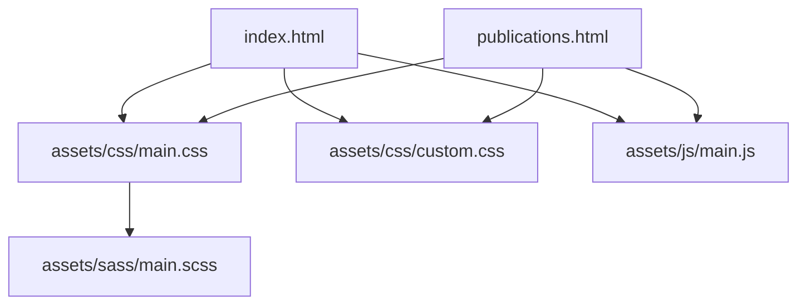
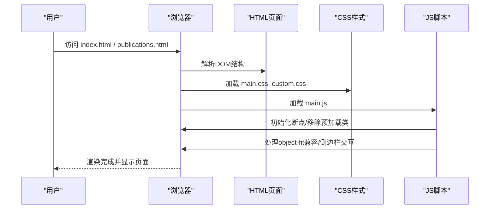
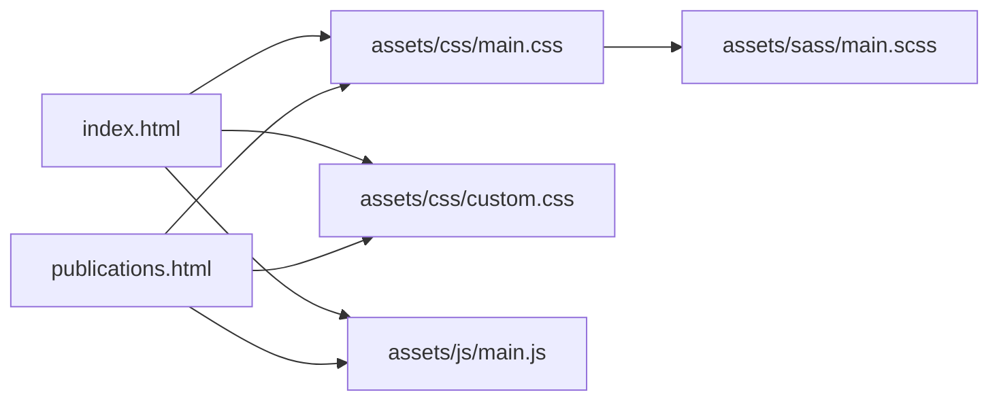

# 内容维护

<cite>
**本文引用的文件**
- [index.html](file://index.html)
- [publications.html](file://publications.html)
- [assets/css/main.css](file://assets/css/main.css)
- [assets/css/custom.css](file://assets/css/custom.css)
- [assets/sass/main.scss](file://assets/sass/main.scss)
- [assets/js/main.js](file://assets/js/main.js)
- [README.md](file://README.md)
</cite>

## 目录
1. [简介](#简介)
2. [项目结构](#项目结构)
3. [核心组件](#核心组件)
4. [架构总览](#架构总览)
5. [详细组件分析](#详细组件分析)
6. [依赖关系分析](#依赖关系分析)
7. [性能与兼容性](#性能与兼容性)
8. [故障排查指南](#故障排查指南)
9. [结论](#结论)
10. [附录：发布前质量检查清单](#附录发布前质量检查清单)

## 简介
本指南面向个人主页与论文发表页面的内容维护者，提供从新闻条目增删改、论文信息更新、联系方式维护到HTML/CSS编辑规范、图片资源替换流程、SEO优化建议、跨浏览器兼容性检查、版本控制与备份策略、以及发布前质量检查的完整操作手册。所有步骤均基于仓库现有结构与实现进行说明，确保可执行性与一致性。

## 项目结构
本项目为静态站点，采用双页布局（首页与论文页），样式由主样式与自定义样式共同构成，交互逻辑由JavaScript处理。关键路径如下：
- 页面入口：index.html（首页）、publications.html（论文页）
- 样式：assets/css/main.css（主题样式）、assets/css/custom.css（个性化样式）；Sass源文件 assets/sass/main.scss 用于组织样式模块
- 脚本：assets/js/main.js（响应式侧边栏、滚动锁定、对象适配等）
- 图片资源：images/（当前为空目录，需按需添加）
- 说明：README.md（模板来源与站点地址）

图表来源
- [index.html:1-128](file://index.html#L1-L128)
- [publications.html:1-173](file://publications.html#L1-L173)
- [assets/css/main.css:1-120](file://assets/css/main.css#L1-L120)
- [assets/css/custom.css:1-120](file://assets/css/custom.css#L1-L120)
- [assets/sass/main.scss:1-62](file://assets/sass/main.scss#L1-L62)
- [assets/js/main.js:1-60](file://assets/js/main.js#L1-L60)

章节来源
- [index.html:1-128](file://index.html#L1-L128)
- [publications.html:1-173](file://publications.html#L1-L173)
- [assets/css/main.css:1-120](file://assets/css/main.css#L1-L120)
- [assets/css/custom.css:1-120](file://assets/css/custom.css#L1-L120)
- [assets/sass/main.scss:1-62](file://assets/sass/main.scss#L1-L62)
- [assets/js/main.js:1-60](file://assets/js/main.js#L1-L60)
- [README.md:1-10](file://README.md#L1-L10)

## 核心组件
- 首页（index.html）
  - 头部导航：包含“Homepage”和“Publications”链接
  - Banner区域：展示姓名、当前职位、邮箱与头像
  - 传记段落：Biography
  - 新闻列表：News，使用 .news-list 容器与 .news-feature 高亮条目
  - 学术服务：Academic Service
  - 侧边栏：菜单、个人信息卡片（机构、职位、联系方式）
- 论文页（publications.html）
  - 标题与Google Scholar链接
  - 按年份分组的论文列表：.pub-list，支持高亮条目 .pub-highlight
  - 作者标注：.me 标记本人，* 表示通讯作者，† 表示共同第一作者
- 样式系统
  - main.css：基础排版、颜色、网格、组件样式
  - custom.css：个性化配色、布局微调、新闻与论文列表样式、侧边栏样式
- 交互脚本
  - main.js：断点管理、加载动画移除、object-fit兼容处理、侧边栏折叠与滚动锁定、移动端点击行为

章节来源
- [index.html:20-116](file://index.html#L20-L116)
- [publications.html:26-160](file://publications.html#L26-L160)
- [assets/css/custom.css:146-248](file://assets/css/custom.css#L146-L248)
- [assets/css/custom.css:249-391](file://assets/css/custom.css#L249-L391)
- [assets/js/main.js:13-32](file://assets/js/main.js#L13-L32)
- [assets/js/main.js:51-70](file://assets/js/main.js#L51-L70)
- [assets/js/main.js:72-164](file://assets/js/main.js#L72-L164)

## 架构总览
页面通过HTML结构组织内容，CSS负责视觉呈现，JS增强交互与兼容性。整体遵循“内容-样式-脚本”分层，便于独立维护。

图表来源
- [index.html:1-128](file://index.html#L1-L128)
- [publications.html:1-173](file://publications.html#L1-L173)
- [assets/css/main.css:1-120](file://assets/css/main.css#L1-L120)
- [assets/css/custom.css:1-120](file://assets/css/custom.css#L1-L120)
- [assets/js/main.js:13-32](file://assets/js/main.js#L13-L32)

## 详细组件分析

### 首页内容维护（index.html）
- 更新个人基本信息
  - 在Banner区域修改姓名、当前职位与邮箱文本
  - 头像图片路径位于 images/me.jpg，替换时保持文件名不变或同步更新路径
- 维护新闻条目
  - 新增/修改条目：在 .news-list 中添加 <li>，使用 .news-icon、.news-year、.news-main、.news-topic 四个子元素
  - 高亮重要新闻：为 <li> 添加 class="news-feature"
  - 图标建议使用Unicode表情或内联SVG，避免额外字体依赖
- 维护学术服务
  - 在 Academic Service 列表中更新会议与期刊审稿信息
- 侧边栏联系方式
  - 机构名称、职位、邮箱、GitHub、Google Scholar、LinkedIn链接均在侧边栏 .sidebar-profile 中维护
  - 邮箱使用 mailto: 协议，外部链接使用 target="_blank"

章节来源
- [index.html:27-46](file://index.html#L27-L46)
- [index.html:49-81](file://index.html#L49-L81)
- [index.html:98-110](file://index.html#L98-L110)

### 论文发表页面维护（publications.html）
- 新增论文
  - 在对应年份分组下，向 .pub-list 添加 <li>，包含 .pub-title 与 .pub-authors
  - 如需高亮重要论文，为 <li> 添加 class="pub-highlight"
  - 作者标注：本人用 class="me"，通讯作者用 *，共同一作可用 &dagger;
  - 链接：可在标题后追加 [Code]、[Dataset]、[Paper] 等锚点链接
- 更新已有论文
  - 修改标题、作者、年份、链接等信息，保持结构一致
- 排序与分组
  - 按年份从高到低排列，便于读者浏览

章节来源
- [publications.html:26-125](file://publications.html#L26-L125)

### HTML结构编辑规范
- 语义化标签
  - 使用 <section>、<header>、<nav>、<ul>/<li> 等语义标签组织内容
- 列表结构
  - 新闻列表：.news-list > li > .news-icon + .news-year + .news-main + .news-topic
  - 论文列表：.pub-list > li > .pub-title + .pub-authors
- 链接与目标
  - 外部链接统一使用 target="_blank"，内部导航使用相对路径
- 图片与替代文本
  - 所有图片需提供 alt 属性，提升可访问性与SEO

章节来源
- [index.html:49-81](file://index.html#L49-L81)
- [publications.html:38-125](file://publications.html#L38-L125)

### CSS样式调整方法
- 主题色与链接颜色
  - 在 custom.css 中覆盖 a 的颜色与悬停效果，保持品牌一致性
- 布局与间距
  - 通过 #banner、#main > .inner > section 等选择器调整内边距与行高
- 新闻与论文列表样式
  - .news-list 与 .pub-list 已定义滚动、背景、边框与高亮样式，可按需扩展
- 侧边栏样式
  - #sidebar 背景、菜单项颜色、版权文字颜色均可在 custom.css 中调整
- Sass源文件
  - assets/sass/main.scss 组织基础、组件与布局模块，便于后续编译与扩展

章节来源
- [assets/css/custom.css:124-248](file://assets/css/custom.css#L124-L248)
- [assets/css/custom.css:249-391](file://assets/css/custom.css#L249-L391)
- [assets/sass/main.scss:1-62](file://assets/sass/main.scss#L1-L62)

### 图片资源替换流程
- 头像图片
  - 路径：images/me.jpg
  - 替换步骤：准备新图片（建议尺寸约185x185px），覆盖同名文件或更新  路径
  - 注意：custom.css 对 .image 设置了固定宽高与 object-fit，确保图片比例协调
- 其他图片
  - 若新增图片，请放入 images/ 目录，并在HTML中引用
  - 为图片添加合适的 alt 文本，提升可访问性

章节来源
- [index.html:37-39](file://index.html#L37-L39)
- [assets/css/custom.css:29-46](file://assets/css/custom.css#L29-L46)

### 内容格式标准
- 新闻条目
  - 结构：图标 + 年份 + 主要事件 + 主题（可选）
  - 高亮：仅用于重大成果，使用 .news-feature
- 论文条目
  - 结构：标题（含会议/期刊名加粗）+ 作者列表（本人加粗，通讯作者标注*）
  - 链接：代码、数据集、论文PDF或arXiv链接
- 联系方式
  - 邮箱使用 mailto: 协议，外部链接使用 https 并 target="_blank"

章节来源
- [index.html:49-81](file://index.html#L49-L81)
- [publications.html:38-125](file://publications.html#L38-L125)
- [index.html:98-110](file://index.html#L98-L110)

### SEO优化建议
- 页面标题与描述
  - 在 <head> 中设置有意义的 title 与 meta description（当前未包含description，可酌情添加）
- 语义化与结构化数据
  - 使用 <h1>-<h6> 层级清晰，避免跳过级别
  - 可为论文条目添加结构化数据（如JSON-LD），但非必需
- 图片优化
  - 压缩图片体积，使用合适格式（JPEG/PNG/WebP），添加 alt 文本
- 链接质量
  - 外链使用 https，内部链接使用相对路径，减少死链

章节来源
- [index.html:4-10](file://index.html#L4-L10)
- [publications.html:4-10](file://publications.html#L4-L10)

### 跨浏览器兼容性检查方法
- 对象适配
  - main.js 检测 object-fit 支持，在不支持的浏览器中将图片转为背景图模式
- 滚动与侧边栏
  - 移动端侧边栏折叠与滚动锁定由 main.js 处理，建议在手机与平板上测试
- 样式回退
  - 自定义样式尽量使用现代CSS特性，同时保留回退方案（如背景图）

章节来源
- [assets/js/main.js:51-70](file://assets/js/main.js#L51-L70)
- [assets/js/main.js:72-164](file://assets/js/main.js#L72-L164)

## 依赖关系分析
- 页面依赖样式与脚本
  - index.html 与 publications.html 均引入 main.css、custom.css 与 main.js
- 样式模块化
  - main.scss 组织基础、组件与布局模块，最终编译为 main.css
- 交互逻辑
  - main.js 依赖 jQuery（通过 assets/js/jquery.min.js 引入），处理响应式与兼容性

图表来源
- [index.html:1-128](file://index.html#L1-L128)
- [publications.html:1-173](file://publications.html#L1-L173)
- [assets/sass/main.scss:1-62](file://assets/sass/main.scss#L1-L62)

章节来源
- [index.html:1-128](file://index.html#L1-L128)
- [publications.html:1-173](file://publications.html#L1-L173)
- [assets/sass/main.scss:1-62](file://assets/sass/main.scss#L1-L62)

## 性能与兼容性
- 性能
  - 图片压缩与懒加载：建议对大图进行压缩，必要时实现懒加载以提升首屏速度
  - 样式与脚本最小化：生产环境可使用构建工具压缩CSS/JS（当前为静态站点，可直接使用min版本）
- 兼容性
  - 使用 main.js 提供的 object-fit 兼容处理
  - 在Chrome、Firefox、Safari、Edge及移动端设备上测试页面布局与交互

章节来源
- [assets/js/main.js:51-70](file://assets/js/main.js#L51-L70)

## 故障排查指南
- 图片不显示或变形
  - 检查 images/ 目录下是否存在对应图片，确认  路径正确
  - 查看 custom.css 中 .image 的宽高与 object-fit 设置是否合理
- 新闻列表滚动异常
  - 检查 .news-list 的 max-height 与 overflow-y 设置，确保内容不会溢出
- 侧边栏折叠失效
  - 确认 main.js 已加载，检查控制台是否有jQuery相关错误
- 链接无法跳转
  - 检查 href 路径是否正确，外部链接是否使用 https 且 target="_blank"

章节来源
- [assets/css/custom.css:249-391](file://assets/css/custom.css#L249-L391)
- [assets/js/main.js:72-164](file://assets/js/main.js#L72-L164)

## 结论
本指南提供了个人主页与论文发表页面的内容维护全流程，涵盖HTML/CSS编辑规范、图片替换、SEO优化、兼容性检查、版本控制与发布前检查。遵循本文档的操作步骤，可确保内容更新的准确性、一致性与可维护性。

## 附录：发布前质量检查清单
- 内容准确性
  - 新闻条目日期、标题、主题无误
  - 论文条目标题、作者、年份、链接正确
  - 联系方式（邮箱、社交链接）有效
- 结构与样式
  - HTML语义化标签使用正确
  - 列表结构符合规范（.news-list、.pub-list）
  - 高亮条目（.news-feature、.pub-highlight）仅用于重要内容
- 图片与资源
  - 图片路径正确，alt 文本完整
  - 图片尺寸与比例适配良好
- 交互与兼容性
  - 侧边栏折叠与滚动正常
  - 在不同浏览器与设备上测试通过
- SEO与可访问性
  - 页面标题有意义，meta description 可选添加
  - 链接无死链，外部链接使用 https
- 版本控制与备份
  - 提交前创建分支，提交信息清晰
  - 推送前本地预览验证，保留历史版本以便回滚