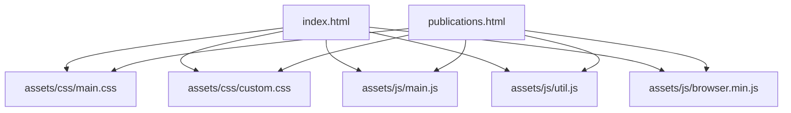
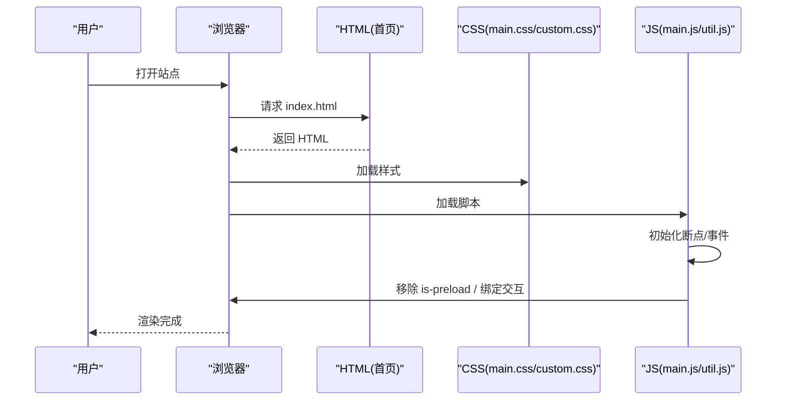
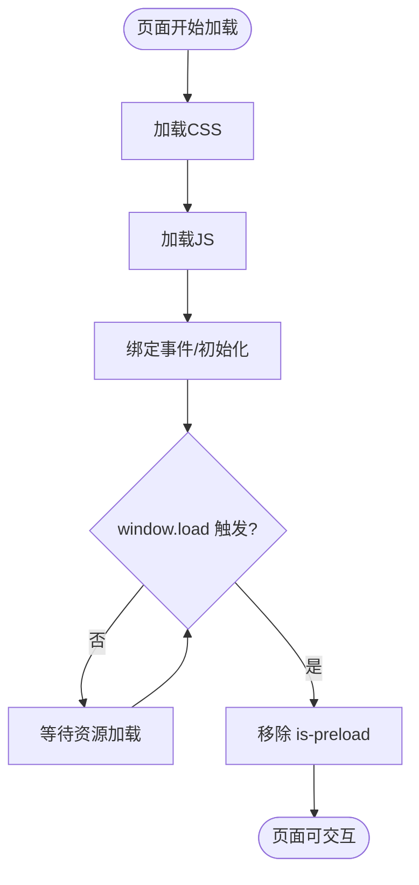
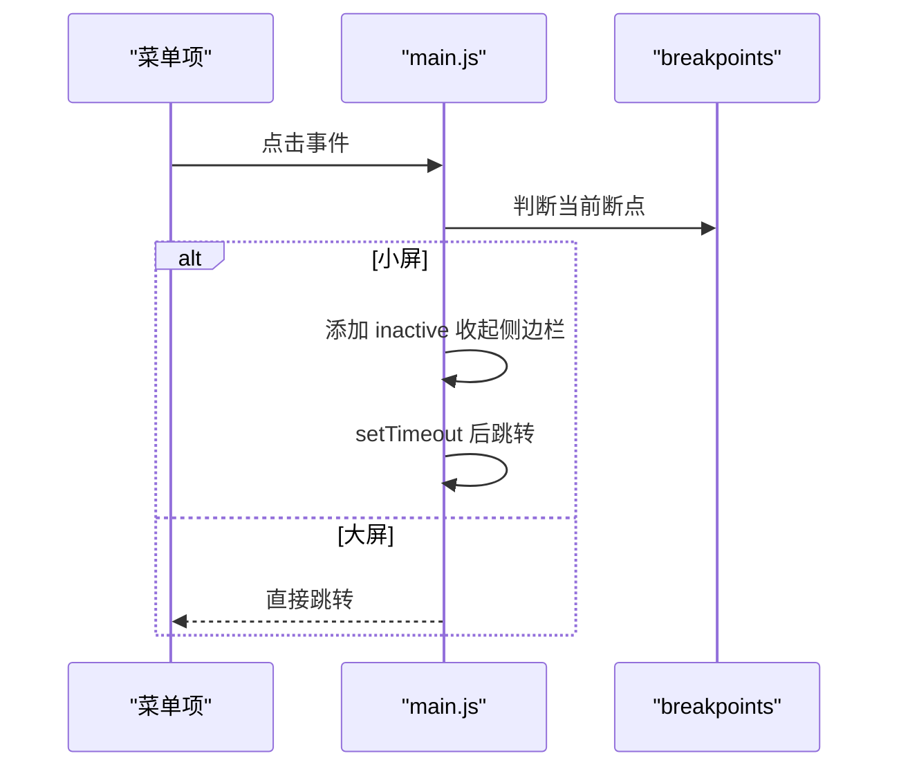
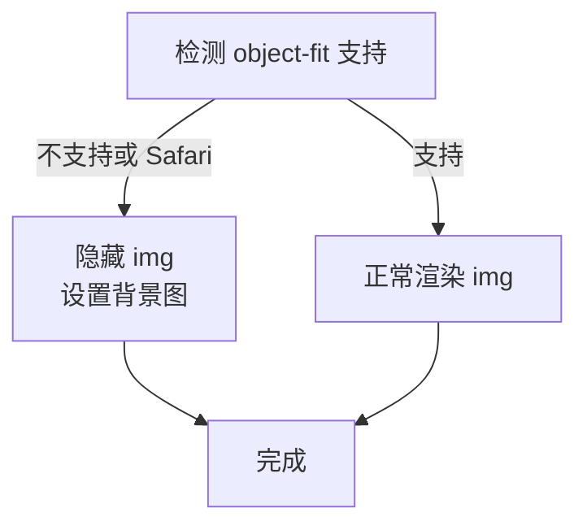
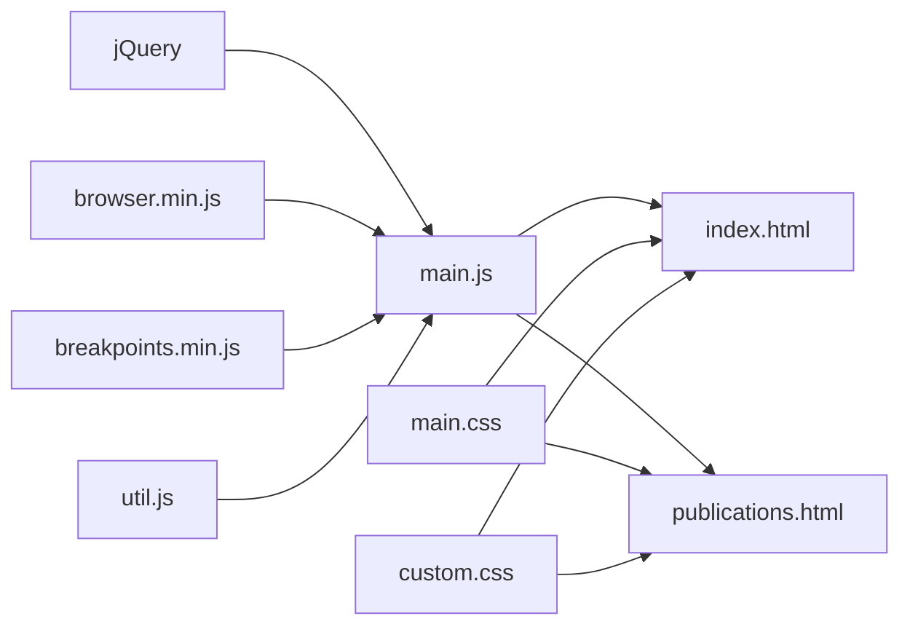

# 故障排除

<cite>
**本文引用的文件**
- [index.html](file://index.html)
- [publications.html](file://publications.html)
- [assets/js/main.js](file://assets/js/main.js)
- [assets/js/util.js](file://assets/js/util.js)
- [assets/css/main.css](file://assets/css/main.css)
- [assets/css/custom.css](file://assets/css/custom.css)
- [README.md](file://README.md)
</cite>

## 目录
1. [简介](#简介)
2. [项目结构](#项目结构)
3. [核心组件](#核心组件)
4. [架构总览](#架构总览)
5. [详细组件分析](#详细组件分析)
6. [依赖关系分析](#依赖关系分析)
7. [性能注意事项](#性能注意事项)
8. [故障排除指南](#故障排除指南)
9. [结论](#结论)
10. [附录](#附录)

## 简介
本手册面向站点维护者与开发者，提供针对页面加载异常、样式显示问题、JavaScript 功能失效、浏览器兼容性、移动端适配、第三方资源加载失败等常见问题的系统化排查与修复方法。同时包含性能分析工具使用、错误日志查看、网络请求调试技巧，以及紧急恢复与数据备份恢复的操作指南。

## 项目结构
本项目为静态个人主页，基于 HTML5 UP Editorial 模板，主要资源位于 assets 目录下：
- assets/css：样式文件（main.css、custom.css）
- assets/js：交互脚本（main.js、util.js）及浏览器特性检测（browser.min.js）
- images：图片资源
- index.html、publications.html：页面入口

图表来源
- [index.html:1-130](file://index.html#L1-L130)
- [publications.html:1-175](file://publications.html#L1-L175)

章节来源
- [index.html:1-130](file://index.html#L1-L130)
- [publications.html:1-175](file://publications.html#L1-L175)
- [assets/css/main.css:1-200](file://assets/css/main.css#L1-L200)
- [assets/css/custom.css:1-400](file://assets/css/custom.css#L1-L400)
- [assets/js/main.js:1-262](file://assets/js/main.js#L1-L262)
- [assets/js/util.js:1-587](file://assets/js/util.js#L1-L587)

## 核心组件
- 页面骨架与资源引用：两个 HTML 页面统一引入 main.css、custom.css 以及 jQuery、browser.min.js、breakpoints.min.js、util.js、main.js。
- 交互逻辑：main.js 负责断点切换、侧边栏行为、滚动锁定、图片兼容处理；util.js 提供面板、占位符填充、元素优先级等通用工具。
- 样式体系：main.css 定义基础排版与响应式规则；custom.css 覆盖主题色、布局间距、新闻/论文列表样式等。

章节来源
- [index.html:1-130](file://index.html#L1-L130)
- [publications.html:1-175](file://publications.html#L1-L175)
- [assets/js/main.js:1-262](file://assets/js/main.js#L1-L262)
- [assets/js/util.js:1-587](file://assets/js/util.js#L1-L587)
- [assets/css/main.css:1-200](file://assets/css/main.css#L1-L200)
- [assets/css/custom.css:1-400](file://assets/css/custom.css#L1-L400)

## 架构总览
站点采用“HTML + CSS + JS”的静态架构，无后端服务。关键流程如下：
- 页面加载时，浏览器解析 HTML，按顺序加载 CSS 与 JS。
- main.js 在窗口 load 后移除 is-preload 类以结束预加载动画；监听 resize 并控制 is-resizing 类。
- 通过 breakpoints 库在不同视口下切换侧边栏状态与布局。
- util.js 提供的工具函数被 main.js 或页面扩展逻辑调用（如面板、表单占位符）。

图表来源
- [index.html:1-130](file://index.html#L1-L130)
- [assets/js/main.js:25-49](file://assets/js/main.js#L25-L49)

## 详细组件分析

### 页面加载与预加载
- 现象：页面进入时有遮罩或内容闪烁，结束后恢复正常。
- 机制：body 初始带有 is-preload 类，main.js 在 window.load 后延迟移除该类，从而触发过渡效果。
- 常见问题：
  - 若外部资源（字体、图片）阻塞导致 load 迟迟不触发，预加载状态会延长。
  - 若 main.js 未正确执行，is-preload 不会被移除，页面可能一直呈现“加载中”。

图表来源
- [assets/js/main.js:25-32](file://assets/js/main.js#L25-L32)
- [index.html:1-130](file://index.html#L1-L130)

章节来源
- [assets/js/main.js:25-49](file://assets/js/main.js#L25-L49)
- [index.html:1-130](file://index.html#L1-L130)

### 侧边栏与菜单交互
- 行为：
  - 在小屏（<=large）默认 inactive，点击 Toggle 展开/收起。
  - 点击菜单链接后自动收起并在延时后跳转。
  - 在大屏下禁用折叠逻辑。
  - 滚动锁：大屏下根据滚动位置固定侧边栏内容。
- 常见问题：
  - 小屏点击无效：检查 breakpoints 是否生效、是否误删 .inactive 类。
  - 点击链接不跳转：检查 href 是否为空或 #，以及事件阻止冒泡逻辑。
  - 滚动错位：检查是否触发了 resize.sidebar-lock 事件。

图表来源
- [assets/js/main.js:72-164](file://assets/js/main.js#L72-L164)
- [assets/js/main.js:237-260](file://assets/js/main.js#L237-L260)

章节来源
- [assets/js/main.js:72-164](file://assets/js/main.js#L72-L164)
- [assets/js/main.js:237-260](file://assets/js/main.js#L237-L260)

### 图片兼容与对象适配
- 机制：当浏览器不支持 object-fit 或为 Safari 时，将图片隐藏并以背景图方式模拟 cover 效果。
- 常见问题：
  - 图片不显示：检查 .image.object 容器是否存在，图片 src 是否正确。
  - 背景图错位：检查 background-size/background-position 计算是否符合预期。

图表来源
- [assets/js/main.js:51-70](file://assets/js/main.js#L51-L70)

章节来源
- [assets/js/main.js:51-70](file://assets/js/main.js#L51-L70)

### 表单占位符与面板工具
- 工具能力：
  - placeholder polyfill：在不支持原生 placeholder 的浏览器中模拟占位提示。
  - panel：实现侧滑面板、触摸滑动关闭、ESC 关闭等。
  - prioritize：动态调整 DOM 元素顺序（常用于移动端重排）。
- 常见问题：
  - 占位符不消失：检查 focus/blur 事件是否被其他脚本拦截。
  - 面板无法关闭：检查 visibleClass 配置与事件绑定。

章节来源
- [assets/js/util.js:303-519](file://assets/js/util.js#L303-L519)
- [assets/js/util.js:42-297](file://assets/js/util.js#L42-L297)
- [assets/js/util.js:521-587](file://assets/js/util.js#L521-L587)

### 样式与主题覆盖
- main.css：基础重置、排版、响应式断点、全局颜色与字体。
- custom.css：品牌色、布局间距、新闻与论文列表样式、侧边栏配色等。
- 常见问题：
  - 颜色不一致：确认 custom.css 是否覆盖了 main.css 中的 a/h1-h6 等选择器。
  - 列表样式错乱：检查 .news-list/.pub-list 的父级结构与类名是否匹配。

章节来源
- [assets/css/main.css:1-200](file://assets/css/main.css#L1-L200)
- [assets/css/custom.css:1-400](file://assets/css/custom.css#L1-L400)

## 依赖关系分析
- 脚本依赖：
  - main.js 依赖 jQuery、breakpoints.min.js、browser.min.js、util.js。
  - 页面通过 script 标签顺序引入这些资源。
- 样式依赖：
  - main.css 导入 fontawesome-all.min.css 与 Google Fonts。
  - custom.css 覆盖 main.css 的主题与布局。

图表来源
- [index.html:123-128](file://index.html#L123-L128)
- [publications.html:166-171](file://publications.html#L166-L171)
- [assets/css/main.css:1-2](file://assets/css/main.css#L1-L2)

章节来源
- [index.html:123-128](file://index.html#L123-L128)
- [publications.html:166-171](file://publications.html#L166-L171)
- [assets/css/main.css:1-2](file://assets/css/main.css#L1-L2)

## 性能注意事项
- 资源体积：确保 jQuery、browser.min.js、breakpoints.min.js 已压缩；避免重复引入。
- 字体与图标：Google Fonts 与 Font Awesome 为外部资源，建议缓存或本地化以提升首屏速度。
- 图片优化：banner 图片建议使用合适尺寸与格式，启用懒加载（如需）。
- 动画与过渡：减少不必要的 transition/animation，避免在 is-preload 期间触发复杂动画。
- 滚动性能：侧边栏滚动锁定仅在大屏启用，注意避免频繁 reflow。

[本节为通用指导，无需特定文件来源]

## 故障排除指南

### 一、页面加载问题
- 症状：白屏、长时间 loading、内容闪烁。
- 排查步骤：
  1) 打开浏览器开发者工具 -> Network，检查所有资源是否 200 成功加载，关注 404/超时。
  2) 检查 HTML 中 script 顺序与路径是否正确，确保 jQuery 先于 main.js 加载。
  3) 检查 body.is-preload 是否在加载完成后被移除（控制台搜索 is-preload）。
  4) 若字体/图标来自 CDN，确认网络可达；必要时替换为本地资源。
  5) 若图片过大，压缩或更换尺寸，观察 load 事件触发时间。
- 相关代码位置
  - 预加载移除逻辑：[assets/js/main.js:25-32](file://assets/js/main.js#L25-L32)
  - 脚本引入顺序：[index.html:123-128](file://index.html#L123-L128)、[publications.html:166-171](file://publications.html#L166-L171)

章节来源
- [assets/js/main.js:25-32](file://assets/js/main.js#L25-L32)
- [index.html:123-128](file://index.html#L123-L128)
- [publications.html:166-171](file://publications.html#L166-L171)

### 二、样式显示异常
- 症状：颜色不对、布局错乱、列表样式丢失。
- 排查步骤：
  1) 确认 main.css 与 custom.css 均被加载（Network 面板）。
  2) 使用 Elements 面板检查目标元素的 computed styles，定位覆盖冲突。
  3) 检查 .news-list/.pub-list 的父级结构与类名是否与 custom.css 匹配。
  4) 检查字体是否加载成功（Fonts 面板），Font Awesome 图标是否正常。
  5) 若自定义样式未生效，检查选择器优先级与 !important 的使用。
- 相关代码位置
  - 基础样式：[assets/css/main.css:1-200](file://assets/css/main.css#L1-L200)
  - 自定义样式：[assets/css/custom.css:1-400](file://assets/css/custom.css#L1-L400)

章节来源
- [assets/css/main.css:1-200](file://assets/css/main.css#L1-L200)
- [assets/css/custom.css:1-400](file://assets/css/custom.css#L1-L400)

### 三、JavaScript 功能失效
- 症状：侧边栏无法折叠、链接点击无反应、图片不显示。
- 排查步骤：
  1) 打开 Console，查看是否有 JS 报错（如 jQuery 未定义、方法不存在）。
  2) 检查 main.js 是否执行（Sources 面板打断点或在 console 打印日志）。
  3) 对于图片兼容问题，检查 .image.object 是否存在且图片路径正确。
  4) 对于侧边栏，检查 breakpoints 是否生效（断点切换时观察 class 变化）。
  5) 若使用了 util.js 的面板/占位符，检查配置参数与事件绑定。
- 相关代码位置
  - 侧边栏与菜单：[assets/js/main.js:72-164](file://assets/js/main.js#L72-L164)、[assets/js/main.js:237-260](file://assets/js/main.js#L237-L260)
  - 图片兼容：[assets/js/main.js:51-70](file://assets/js/main.js#L51-L70)
  - 工具函数：[assets/js/util.js:42-297](file://assets/js/util.js#L42-L297)、[assets/js/util.js:303-519](file://assets/js/util.js#L303-L519)

章节来源
- [assets/js/main.js:51-70](file://assets/js/main.js#L51-L70)
- [assets/js/main.js:72-164](file://assets/js/main.js#L72-L164)
- [assets/js/main.js:237-260](file://assets/js/main.js#L237-L260)
- [assets/js/util.js:42-297](file://assets/js/util.js#L42-L297)
- [assets/js/util.js:303-519](file://assets/js/util.js#L303-L519)

### 四、浏览器兼容性问题
- 症状：某些浏览器中布局/功能异常。
- 排查步骤：
  1) 使用多浏览器测试（Chrome、Firefox、Safari、Edge、移动端浏览器）。
  2) 检查 browser.min.js 的检测逻辑是否生效（如 object-fit 兼容）。
  3) 对不支持的特性（如 object-fit）使用 polyfill 或降级方案。
  4) 检查 vendor prefix 与 CSS 兼容性（Can I Use 查询）。
- 相关代码位置
  - 特性检测与兼容：[assets/js/main.js:51-70](file://assets/js/main.js#L51-L70)

章节来源
- [assets/js/main.js:51-70](file://assets/js/main.js#L51-L70)

### 五、移动端适配问题
- 症状：小屏下侧边栏不可用、布局拥挤、滚动异常。
- 排查步骤：
  1) 使用设备模拟器切换断点，验证 <=large 与 >large 的行为差异。
  2) 检查 .inactive 类是否正确切换，Toggle 按钮是否可见。
  3) 检查 custom.css 中的媒体查询是否覆盖到目标断点。
  4) 若出现滚动抖动，检查是否频繁触发 resize 事件。
- 相关代码位置
  - 断点与侧边栏：[assets/js/main.js:13-23](file://assets/js/main.js#L13-L23)、[assets/js/main.js:72-164](file://assets/js/main.js#L72-L164)
  - 移动端样式：[assets/css/custom.css:48-101](file://assets/css/custom.css#L48-L101)

章节来源
- [assets/js/main.js:13-23](file://assets/js/main.js#L13-L23)
- [assets/js/main.js:72-164](file://assets/js/main.js#L72-L164)
- [assets/css/custom.css:48-101](file://assets/css/custom.css#L48-L101)

### 六、第三方资源加载失败
- 症状：字体不显示、图标缺失、CDN 资源 404。
- 排查步骤：
  1) Network 面板筛选 XHR/Fetch/CSS/JS，查找失败请求。
  2) 检查 main.css 中 @import 的字体与图标 URL 是否可达。
  3) 若 CDN 不可用，下载资源至本地并修改引用路径。
  4) 考虑使用内联关键 CSS/字体以减少外部依赖。
- 相关代码位置
  - 字体与图标引入：[assets/css/main.css:1-2](file://assets/css/main.css#L1-L2)

章节来源
- [assets/css/main.css:1-2](file://assets/css/main.css#L1-L2)

### 七、性能问题分析
- 工具与方法：
  - Lighthouse：评估性能、可访问性、SEO 与最佳实践。
  - Performance 面板：录制页面加载与交互，识别长任务与重排。
  - Memory 面板：检查内存泄漏与大图占用。
  - Network Throttling：模拟弱网环境，定位慢资源。
- 优化建议：
  - 压缩与合并资源，启用缓存策略。
  - 延迟加载非关键脚本与图片。
  - 减少主线程阻塞任务，拆分大脚本。

[本节为通用指导，无需特定文件来源]

### 八、错误日志查看方法
- 前端错误：
  - Console 面板：查看 JS 报错与警告。
  - Sources 面板：设置断点与单步调试。
  - Network 面板：查看请求状态码与响应体。
- 日志记录：
  - 可在 main.js 中添加 try/catch 与 console.error 捕获异常。
  - 对关键交互（如链接跳转、侧边栏切换）添加日志标记。

[本节为通用指导，无需特定文件来源]

### 九、网络请求调试技巧
- 步骤：
  1) 打开 Network，勾选 Preserve log，刷新页面。
  2) 筛选失败请求，查看 Headers 与 Response。
  3) 检查跨域、CORS、缓存头（Cache-Control、ETag）。
  4) 对慢请求进行 Waterfall 分析，定位瓶颈。
- 常见问题：
  - 相对路径错误导致 404。
  - CDN 域名变更或未备案导致阻断。
  - 浏览器缓存导致旧资源未更新（强制刷新或清除缓存）。

[本节为通用指导，无需特定文件来源]

### 十、紧急恢复程序
- 目标：快速恢复站点可用状态。
- 步骤：
  1) 回滚到最近稳定版本（Git revert/tag）。
  2) 临时禁用可疑改动（注释新增脚本/样式）。
  3) 切换到备用 CDN 或本地资源。
  4) 清理浏览器缓存与服务器缓存。
  5) 验证关键页面（首页、论文页）是否正常。

[本节为通用指导，无需特定文件来源]

### 十一、数据备份与恢复
- 备份范围：
  - 源代码（GitHub 仓库）、静态资源（images、assets）、配置文件。
- 备份策略：
  - 定期推送至远程仓库，开启分支保护与提交签名。
  - 重要资源（如图片）额外备份至云存储。
- 恢复步骤：
  1) 从远程仓库拉取最新代码。
  2) 校验资源完整性（文件大小/哈希）。
  3) 重新部署并验证站点。
  4) 如有数据库或外部数据，按对应流程恢复。

[本节为通用指导，无需特定文件来源]

## 结论
本手册围绕页面加载、样式、脚本、兼容性、移动端、第三方资源、性能与日志等方面提供了系统化的排查与修复方法。结合项目实际代码位置，读者可快速定位问题根因并采取相应措施。建议在发布前进行多端多浏览器测试，并结合 Lighthouse 与 Performance 面板持续优化用户体验。

## 附录
- 模板来源说明：项目基于 HTML5 UP Editorial 模板，详见 README。
- 参考文件
  - [README.md:1-10](file://README.md#L1-L10)

章节来源
- [README.md:1-10](file://README.md#L1-L10)