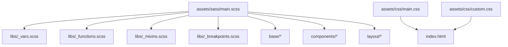
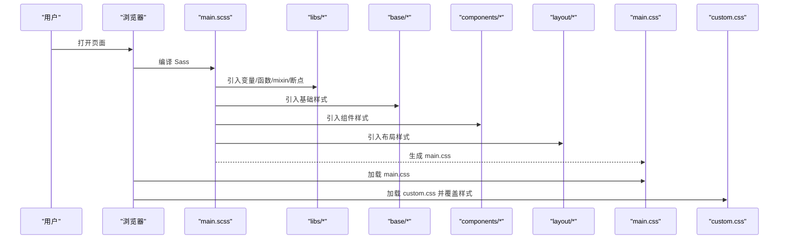
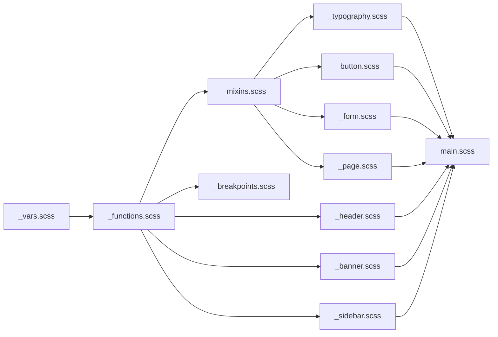

# 样式定制

<cite>
**本文引用的文件**
- [assets/sass/main.scss](file://assets/sass/main.scss)
- [assets/sass/libs/_vars.scss](file://assets/sass/libs/_vars.scss)
- [assets/sass/libs/_functions.scss](file://assets/sass/libs/_functions.scss)
- [assets/sass/libs/_mixins.scss](file://assets/sass/libs/_mixins.scss)
- [assets/sass/libs/_breakpoints.scss](file://assets/sass/libs/_breakpoints.scss)
- [assets/sass/base/_page.scss](file://assets/sass/base/_page.scss)
- [assets/sass/base/_typography.scss](file://assets/sass/base/_typography.scss)
- [assets/sass/components/_button.scss](file://assets/sass/components/_button.scss)
- [assets/sass/components/_form.scss](file://assets/sass/components/_form.scss)
- [assets/sass/components/_section.scss](file://assets/sass/components/_section.scss)
- [assets/sass/layout/_header.scss](file://assets/sass/layout/_header.scss)
- [assets/sass/layout/_banner.scss](file://assets/sass/layout/_banner.scss)
- [assets/sass/layout/_sidebar.scss](file://assets/sass/layout/_sidebar.scss)
- [assets/sass/layout/_wrapper.scss](file://assets/sass/layout/_wrapper.scss)
- [assets/css/custom.css](file://assets/css/custom.css)
- [index.html](file://index.html)
</cite>

## 目录
1. [简介](#简介)
2. [项目结构](#项目结构)
3. [核心组件](#核心组件)
4. [架构总览](#架构总览)
5. [详细组件分析](#详细组件分析)
6. [依赖关系分析](#依赖关系分析)
7. [性能考量](#性能考量)
8. [故障排查指南](#故障排查指南)
9. [结论](#结论)
10. [附录](#附录)

## 简介
本指南面向希望定制网站外观与主题的用户，系统说明 Sass 文件组织、颜色变量修改、字体与布局调整、响应式断点配置、移动端适配优化、第三方库集成、样式调试工具使用、性能优化最佳实践以及浏览器兼容性处理方案。同时提供自定义组件开发指南与样式冲突解决方法，帮助你在不破坏原有结构的前提下高效完成主题化改造。

## 项目结构
本项目采用基于 HTML5 UP 的 Editorial 模板，Sass 源码按“基础/组件/布局/库”分层组织，并通过主入口文件统一引入。编译后的 CSS 由 main.css 输出，custom.css 用于覆盖默认样式。HTML 页面通过 link 标签引入 main.css 与 custom.css，确保自定义样式优先级更高。

图表来源
- [assets/sass/main.scss:1-62](file://assets/sass/main.scss#L1-L62)
- [index.html:8-9](file://index.html#L8-L9)

章节来源
- [assets/sass/main.scss:1-62](file://assets/sass/main.scss#L1-L62)
- [index.html:8-9](file://index.html#L8-L9)

## 核心组件
- 变量与函数（libs）
  - _vars.scss：集中定义尺寸、字体、调色板等设计令牌。
  - _functions.scss：提供 _palette、_font、_size、_duration 等取值函数，便于在样式中引用变量。
  - _mixins.scss：封装图标、间距等常用样式逻辑。
  - _breakpoints.scss：提供断点 mixin，支持 >=、<=、>、<、! 等操作符。
- 基础样式（base）
  - _page.scss：全局 box-sizing、最小宽度、加载态动画控制等。
  - _typography.scss：字体族、字号、行高、标题层级、代码块、引用块等排版规则。
- 组件（components）
  - _button.scss：按钮样式、主次变体、禁用态、尺寸变体。
  - _form.scss：表单控件、下拉箭头 SVG、焦点态、占位符兼容。
  - _section.scss：区块与头部修饰样式。
- 布局（layout）
  - _wrapper.scss：整体 Flex 反向布局，使侧边栏在右侧显示。
  - _header.scss：顶部导航区域样式与小屏适配。
  - _banner.scss：首屏横幅的双栏布局与竖屏切换。
  - _sidebar.scss：侧边栏宽度、滚动、小屏固定定位与遮罩交互。

章节来源
- [assets/sass/libs/_vars.scss:1-44](file://assets/sass/libs/_vars.scss#L1-L44)
- [assets/sass/libs/_functions.scss:43-90](file://assets/sass/libs/_functions.scss#L43-L90)
- [assets/sass/libs/_mixins.scss:1-78](file://assets/sass/libs/_mixins.scss#L1-L78)
- [assets/sass/libs/_breakpoints.scss:13-223](file://assets/sass/libs/_breakpoints.scss#L13-L223)
- [assets/sass/base/_page.scss:1-48](file://assets/sass/base/_page.scss#L1-L48)
- [assets/sass/base/_typography.scss:9-187](file://assets/sass/base/_typography.scss#L9-L187)
- [assets/sass/components/_button.scss:9-85](file://assets/sass/components/_button.scss#L9-L85)
- [assets/sass/components/_form.scss:9-179](file://assets/sass/components/_form.scss#L9-L179)
- [assets/sass/components/_section.scss:9-39](file://assets/sass/components/_section.scss#L9-L39)
- [assets/sass/layout/_wrapper.scss:9-13](file://assets/sass/layout/_wrapper.scss#L9-L13)
- [assets/sass/layout/_header.scss:9-51](file://assets/sass/layout/_header.scss#L9-L51)
- [assets/sass/layout/_banner.scss:9-75](file://assets/sass/layout/_banner.scss#L9-L75)
- [assets/sass/layout/_sidebar.scss:37-223](file://assets/sass/layout/_sidebar.scss#L37-L223)

## 架构总览
样式编译与加载流程如下：main.scss 作为入口，依次引入 libs 中的变量、函数、mixin、断点与网格；随后引入 base、components、layout 各层样式；最终生成 main.css。页面 index.html 先加载 main.css，再加载 custom.css，后者可安全覆盖默认样式。

图表来源
- [assets/sass/main.scss:1-62](file://assets/sass/main.scss#L1-L62)
- [index.html:8-9](file://index.html#L8-L9)

## 详细组件分析

### 颜色与主题定制
- 调色板位置：所有主题色集中在 _vars.scss 的 $palette 映射中，包含背景、前景、强调色等。
- 引用方式：通过 _functions.scss 提供的 _palette() 函数在各处读取，如链接、边框、按钮强调色等。
- 修改建议：
  - 更改强调色以统一全站主题色（影响链接、按钮、分割线等）。
  - 调整背景与前景对比度，保证可读性。
  - 如需新增品牌色，可在 $palette 中添加键值并在组件中引用。

章节来源
- [assets/sass/libs/_vars.scss:34-44](file://assets/sass/libs/_vars.scss#L34-L44)
- [assets/sass/libs/_functions.scss:78-83](file://assets/sass/libs/_functions.scss#L78-L83)
- [assets/sass/base/_typography.scss:29-46](file://assets/sass/base/_typography.scss#L29-L46)
- [assets/sass/components/_button.scss:19-78](file://assets/sass/components/_button.scss#L19-L78)

### 字体与排版
- 字体族与字重：在 _vars.scss 的 $font 中定义正文、标题、等宽字体及对应字重。
- 字号与行高：_typography.scss 定义了 body、h1-h6、p、code、pre 等元素的字号与行高，并使用断点在不同屏幕下缩放。
- 修改建议：
  - 更换字体族时，优先更新 $font.family 与 $font.family-heading。
  - 调整标题层级字号与行高，保持视觉层次清晰。
  - 代码块与预格式化文本使用等宽字体，提升可读性。

章节来源
- [assets/sass/libs/_vars.scss:22-32](file://assets/sass/libs/_vars.scss#L22-L32)
- [assets/sass/base/_typography.scss:9-187](file://assets/sass/base/_typography.scss#L9-L187)

### 布局与栅格
- 整体布局：_wrapper.scss 使用 Flex 反向排列，将侧边栏置于右侧。
- 头部与横幅：_header.scss 与 _banner.scss 分别定义顶部导航与首屏双栏布局，横幅在竖屏时自动切换为单列。
- 侧边栏：_sidebar.scss 定义宽度、内边距、滚动行为与小屏下的固定定位与遮罩交互。
- 修改建议：
  - 调整侧边栏宽度或内容区比例，需同步考虑小屏下的固定定位与滚动。
  - 横幅图片在竖屏时高度限制，避免遮挡过多内容。
  - 头部在小屏下增大内边距与图标区域，确保触控友好。

章节来源
- [assets/sass/layout/_wrapper.scss:9-13](file://assets/sass/layout/_wrapper.scss#L9-L13)
- [assets/sass/layout/_header.scss:9-51](file://assets/sass/layout/_header.scss#L9-L51)
- [assets/sass/layout/_banner.scss:9-75](file://assets/sass/layout/_banner.scss#L9-L75)
- [assets/sass/layout/_sidebar.scss:37-223](file://assets/sass/layout/_sidebar.scss#L37-L223)

### 响应式断点与移动端适配
- 断点定义：在 main.scss 中通过 @include breakpoints(...) 声明 xlarge、large、medium、small、xsmall、xxsmall 等断点范围。
- 断点使用：在各组件中使用 @include breakpoint('<=...') 或 orientation(portrait) 进行条件样式注入。
- 移动端优化：
  - 侧边栏在小屏下固定定位并带阴影，内部可滚动。
  - 横幅在竖屏时切换为纵向布局，图片高度受限。
  - 正文与标题字号随断点缩小，保障可读性。
- 修改建议：
  - 新增或调整断点范围时，注意与现有组件的媒体查询保持一致。
  - 针对超小屏（xxsmall）设置最小宽度，避免布局崩溃。

章节来源
- [assets/sass/main.scss:16-27](file://assets/sass/main.scss#L16-L27)
- [assets/sass/libs/_breakpoints.scss:13-223](file://assets/sass/libs/_breakpoints.scss#L13-L223)
- [assets/sass/base/_page.scss:19-24](file://assets/sass/base/_page.scss#L19-L24)
- [assets/sass/layout/_sidebar.scss:154-223](file://assets/sass/layout/_sidebar.scss#L154-L223)
- [assets/sass/layout/_banner.scss:44-75](file://assets/sass/layout/_banner.scss#L44-L75)
- [assets/sass/base/_typography.scss:16-27](file://assets/sass/base/_typography.scss#L16-L27)

### 第三方库集成
- Font Awesome：通过 main.scss 引入 fontawesome-all.min.css，并在 mixins 中提供 icon mixin 以统一图标样式。
- Google Fonts：在 main.scss 中引入 Open Sans 与 Roboto Slab 字体资源。
- 修改建议：
  - 若替换图标库，需在 mixins 中更新图标字体族与权重。
  - 若更换字体，需在 _vars.scss 中更新字体族，并确保加载顺序正确。

章节来源
- [assets/sass/main.scss:7-8](file://assets/sass/main.scss#L7-L8)
- [assets/sass/libs/_mixins.scss:1-38](file://assets/sass/libs/_mixins.scss#L1-L38)

### 自定义组件开发
- 推荐做法：
  - 在 components/ 下新建独立 .scss 文件，遵循命名约定（如 _my-component.scss）。
  - 使用 _palette、_font、_size、_duration 等函数引用设计令牌，保持风格一致。
  - 通过 @include breakpoint(...) 添加响应式规则。
  - 在 main.scss 中引入新组件文件，确保编译顺序正确。
- 示例路径参考：
  - 组件样式：[assets/sass/components/_button.scss](file://assets/sass/components/_button.scss)
  - 表单控件：[assets/sass/components/_form.scss](file://assets/sass/components/_form.scss)
  - 区块头部：[assets/sass/components/_section.scss](file://assets/sass/components/_section.scss)

章节来源
- [assets/sass/main.scss:35-52](file://assets/sass/main.scss#L35-L52)
- [assets/sass/components/_button.scss:9-85](file://assets/sass/components/_button.scss#L9-L85)
- [assets/sass/components/_form.scss:9-179](file://assets/sass/components/_form.scss#L9-L179)
- [assets/sass/components/_section.scss:9-39](file://assets/sass/components/_section.scss#L9-L39)

### 样式冲突解决
- 优先级策略：custom.css 在 main.css 之后加载，适合覆盖默认样式。
- 选择器增强：必要时提高选择器特异性或使用 !important（谨慎使用）。
- 作用域隔离：为自定义组件添加唯一类名或数据属性，避免污染全局。
- 常见冲突点：
  - 链接颜色与悬停态：在 _typography.scss 中定义，可通过 custom.css 覆盖。
  - 按钮强调色：在 _button.scss 中引用 _palette(accent)，修改变量即可全局生效。
  - 侧边栏背景与分隔线：在 _sidebar.scss 中定义，custom.css 可局部覆盖。

章节来源
- [index.html:8-9](file://index.html#L8-L9)
- [assets/sass/base/_typography.scss:29-46](file://assets/sass/base/_typography.scss#L29-L46)
- [assets/sass/components/_button.scss:19-78](file://assets/sass/components/_button.scss#L19-L78)
- [assets/sass/layout/_sidebar.scss:37-83](file://assets/sass/layout/_sidebar.scss#L37-L83)

## 依赖关系分析
样式模块之间的依赖关系如下：main.scss 依赖 libs 层的基础能力，再组合 base、components、layout 三层。组件与布局通过函数与 mixin 复用变量与逻辑，形成松耦合、高内聚的结构。

图表来源
- [assets/sass/main.scss:1-62](file://assets/sass/main.scss#L1-L62)
- [assets/sass/libs/_vars.scss:1-44](file://assets/sass/libs/_vars.scss#L1-L44)
- [assets/sass/libs/_functions.scss:43-90](file://assets/sass/libs/_functions.scss#L43-L90)
- [assets/sass/libs/_mixins.scss:1-78](file://assets/sass/libs/_mixins.scss#L1-L78)
- [assets/sass/libs/_breakpoints.scss:13-223](file://assets/sass/libs/_breakpoints.scss#L13-L223)
- [assets/sass/base/_page.scss:1-48](file://assets/sass/base/_page.scss#L1-L48)
- [assets/sass/base/_typography.scss:9-187](file://assets/sass/base/_typography.scss#L9-L187)
- [assets/sass/components/_button.scss:9-85](file://assets/sass/components/_button.scss#L9-L85)
- [assets/sass/components/_form.scss:9-179](file://assets/sass/components/_form.scss#L9-L179)
- [assets/sass/layout/_header.scss:9-51](file://assets/sass/layout/_header.scss#L9-L51)
- [assets/sass/layout/_banner.scss:9-75](file://assets/sass/layout/_banner.scss#L9-L75)
- [assets/sass/layout/_sidebar.scss:37-223](file://assets/sass/layout/_sidebar.scss#L37-L223)

章节来源
- [assets/sass/main.scss:1-62](file://assets/sass/main.scss#L1-L62)

## 性能考量
- 减少重复计算：尽量使用 _palette、_font、_size 等函数，避免硬编码数值。
- 控制媒体查询数量：合并相近断点的样式，减少渲染开销。
- 图片与字体：
  - 横幅图片使用 object-fit 与合理尺寸，避免大图阻塞。
  - 字体仅加载必要字重与字形，减少网络请求。
- 动画与过渡：
  - 仅在必要时启用 transition/animation，避免在 is-preload/is-resizing 状态下触发。
- 构建优化：
  - 压缩 CSS、移除未使用的样式片段。
  - 按需引入第三方库，避免全量引入。

[本节为通用指导，无需具体文件来源]

## 故障排查指南
- 样式未生效
  - 检查 custom.css 是否在 main.css 之后加载。
  - 确认选择器特异性是否足够，必要时提高优先级。
- 断点不生效
  - 核对 main.scss 中 breakpoints 定义是否与组件中使用的一致。
  - 使用浏览器开发者工具查看 computed styles 与 media queries。
- 移动端布局异常
  - 检查侧边栏在小屏下的固定定位与滚动容器是否正确。
  - 验证横幅在竖屏时的方向与高度限制。
- 图标显示问题
  - 确认 Font Awesome 已正确引入。
  - 检查 icon mixin 的 category 参数是否匹配图标集。

章节来源
- [index.html:8-9](file://index.html#L8-L9)
- [assets/sass/main.scss:16-27](file://assets/sass/main.scss#L16-L27)
- [assets/sass/layout/_sidebar.scss:154-223](file://assets/sass/layout/_sidebar.scss#L154-L223)
- [assets/sass/layout/_banner.scss:44-75](file://assets/sass/layout/_banner.scss#L44-L75)
- [assets/sass/libs/_mixins.scss:1-38](file://assets/sass/libs/_mixins.scss#L1-L38)

## 结论
通过统一的变量与函数体系、清晰的模块分层与灵活的断点机制，本项目提供了强大的样式定制能力。建议在主题化过程中优先修改 _vars.scss 中的设计令牌，结合 custom.css 进行局部覆盖，并遵循响应式与性能最佳实践，确保跨设备一致性与良好体验。

[本节为总结性内容，无需具体文件来源]

## 附录

### 快速定制清单
- 更换主题色：编辑 _vars.scss 的 $palette，重点关注 accent、bg、fg。
- 更换字体：更新 _vars.scss 的 $font，并在 main.scss 中确认字体资源加载。
- 调整布局：修改 layout 层文件，关注 wrapper、header、banner、sidebar。
- 扩展组件：在 components/ 新增 .scss 文件，并在 main.scss 引入。
- 覆盖样式：在 custom.css 中编写覆盖规则，确保加载顺序正确。

章节来源
- [assets/sass/libs/_vars.scss:1-44](file://assets/sass/libs/_vars.scss#L1-L44)
- [assets/sass/main.scss:1-62](file://assets/sass/main.scss#L1-L62)
- [assets/sass/layout/_wrapper.scss:9-13](file://assets/sass/layout/_wrapper.scss#L9-L13)
- [assets/sass/layout/_header.scss:9-51](file://assets/sass/layout/_header.scss#L9-L51)
- [assets/sass/layout/_banner.scss:9-75](file://assets/sass/layout/_banner.scss#L9-L75)
- [assets/sass/layout/_sidebar.scss:37-223](file://assets/sass/layout/_sidebar.scss#L37-L223)
- [assets/css/custom.css:1-391](file://assets/css/custom.css#L1-L391)