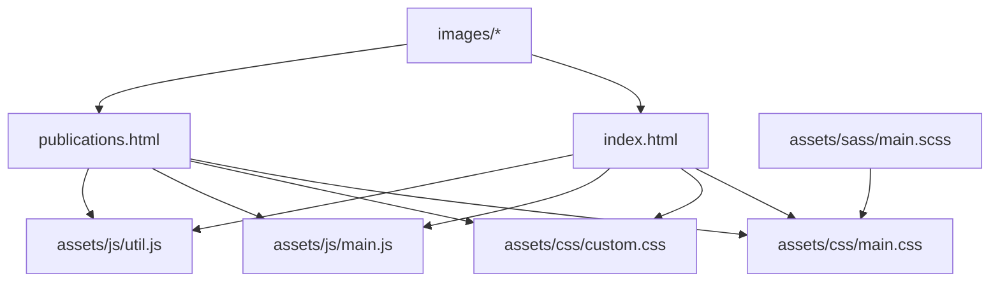
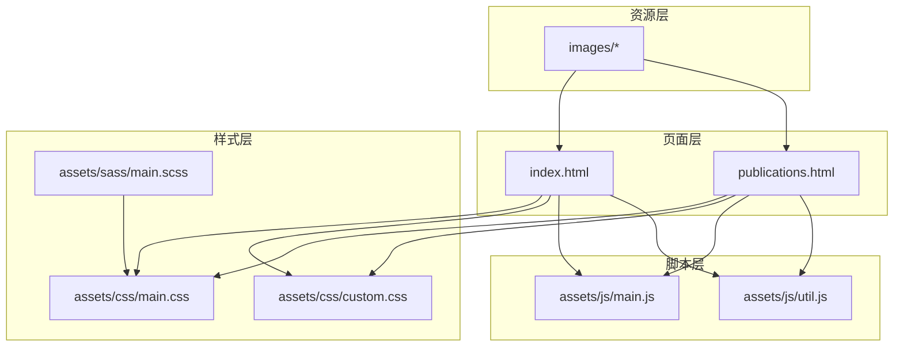
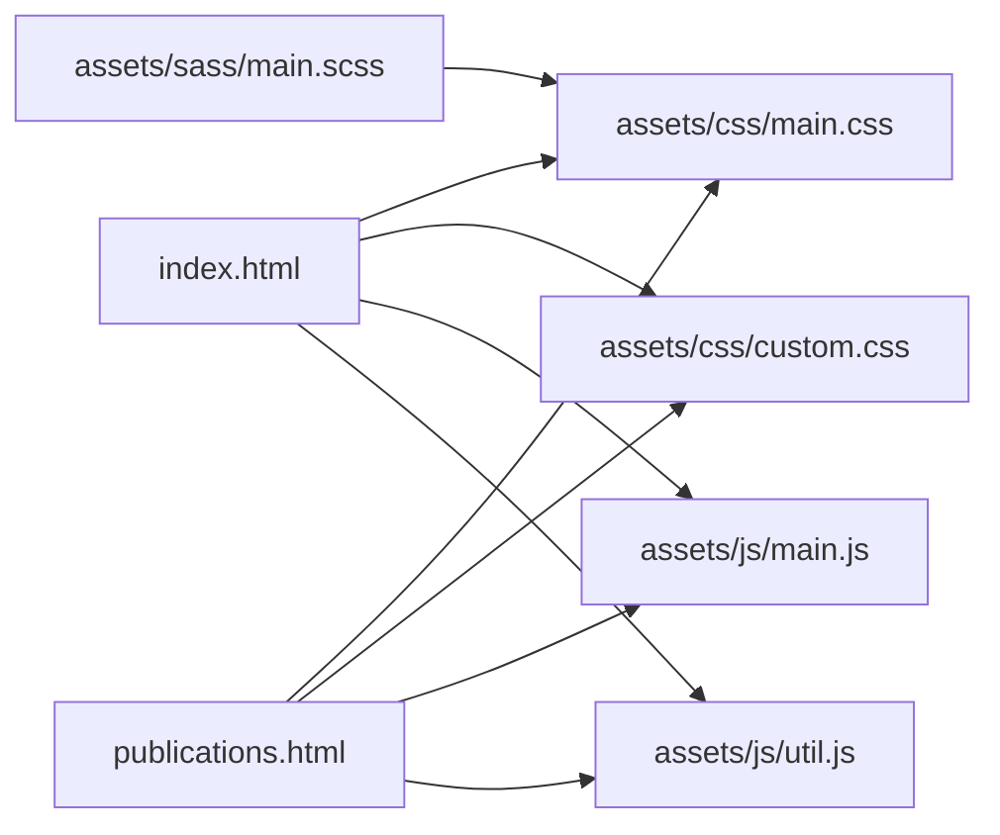

# 维护指南

<cite>
**本文引用的文件**
- [README.md](file://README.md)
- [index.html](file://index.html)
- [publications.html](file://publications.html)
- [.gitignore](file://.gitignore)
- [assets/css/main.css](file://assets/css/main.css)
- [assets/css/custom.css](file://assets/css/custom.css)
- [assets/sass/main.scss](file://assets/sass/main.scss)
- [assets/js/main.js](file://assets/js/main.js)
- [assets/js/util.js](file://assets/js/util.js)
</cite>

## 目录
1. [简介](#简介)
2. [项目结构](#项目结构)
3. [核心组件](#核心组件)
4. [架构总览](#架构总览)
5. [详细组件分析](#详细组件分析)
6. [依赖关系分析](#依赖关系分析)
7. [性能考虑](#性能考虑)
8. [故障排除指南](#故障排除指南)
9. [结论](#结论)
10. [附录](#附录)

## 简介
本指南面向该静态个人主页网站的日常维护与更新，覆盖内容更新、样式修改、脚本扩展、版本管理、备份策略、部署流程、常见问题诊断、性能监控、错误日志分析、安全维护建议、第三方依赖管理与升级策略、故障排除手册与紧急恢复程序，以及团队协作开发与代码审查最佳实践。网站基于 HTML5 UP Editorial 模板构建，采用纯静态资源（HTML/CSS/JS/SASS），通过 GitHub Pages 托管。

## 项目结构
仓库为典型的静态站点结构：
- 页面入口：index.html（首页）、publications.html（论文列表）
- 样式：assets/css/main.css（编译后的主样式）、assets/css/custom.css（自定义样式）、assets/sass/main.scss（SASS 源码入口）
- 脚本：assets/js/main.js（交互逻辑）、assets/js/util.js（工具函数）
- 媒体：images/（图片资源）
- 配置与说明：README.md、.gitignore

图表来源
- [index.html:1-128](file://index.html#L1-L128)
- [publications.html:1-173](file://publications.html#L1-L173)
- [assets/css/main.css:1-800](file://assets/css/main.css#L1-L800)
- [assets/css/custom.css:1-391](file://assets/css/custom.css#L1-L391)
- [assets/sass/main.scss:1-62](file://assets/sass/main.scss#L1-L62)
- [assets/js/main.js:1-262](file://assets/js/main.js#L1-L262)
- [assets/js/util.js:1-587](file://assets/js/util.js#L1-L587)

章节来源
- [README.md:1-10](file://README.md#L1-L10)
- [index.html:1-128](file://index.html#L1-L128)
- [publications.html:1-173](file://publications.html#L1-L173)
- [assets/sass/main.scss:1-62](file://assets/sass/main.scss#L1-L62)
- [assets/css/main.css:1-800](file://assets/css/main.css#L1-L800)
- [assets/css/custom.css:1-391](file://assets/css/custom.css#L1-L391)
- [assets/js/main.js:1-262](file://assets/js/main.js#L1-L262)
- [assets/js/util.js:1-587](file://assets/js/util.js#L1-L587)

## 核心组件
- 页面结构：两个 HTML 页面共享相同的头部、侧边栏和脚本引用，便于统一维护。
- 样式体系：以 SASS 源码组织，编译输出 main.css；custom.css 用于个性化定制，避免污染框架样式。
- 交互脚本：main.js 负责响应式断点、侧边栏折叠、滚动锁定等；util.js 提供面板、占位符等通用工具。
- 资源管理：图片等资源位于 images/，通过相对路径引用。

章节来源
- [index.html:1-128](file://index.html#L1-L128)
- [publications.html:1-173](file://publications.html#L1-L173)
- [assets/sass/main.scss:1-62](file://assets/sass/main.scss#L1-L62)
- [assets/css/custom.css:1-391](file://assets/css/custom.css#L1-L391)
- [assets/js/main.js:1-262](file://assets/js/main.js#L1-L262)
- [assets/js/util.js:1-587](file://assets/js/util.js#L1-L587)

## 架构总览
网站采用“页面 + 样式 + 脚本”的静态分层架构，所有资源由浏览器直接加载渲染。SASS 作为开发期样式语言，编译为 CSS 后由页面引入；JS 在页面加载后执行，增强交互体验。GitHub Pages 作为托管平台，推送即部署。

图表来源
- [index.html:1-128](file://index.html#L1-L128)
- [publications.html:1-173](file://publications.html#L1-L173)
- [assets/sass/main.scss:1-62](file://assets/sass/main.scss#L1-L62)
- [assets/css/main.css:1-800](file://assets/css/main.css#L1-L800)
- [assets/css/custom.css:1-391](file://assets/css/custom.css#L1-L391)
- [assets/js/main.js:1-262](file://assets/js/main.js#L1-L262)
- [assets/js/util.js:1-587](file://assets/js/util.js#L1-L587)

## 详细组件分析

### 内容更新步骤（新闻与论文）
- 首页新闻更新
  - 打开 index.html，定位到新闻列表区域，按现有条目格式新增或修改新闻条目。
  - 注意年份、图标、标题与主题的语义化标签保持一致，确保样式生效。
- 论文列表更新
  - 打开 publications.html，找到对应年份区块，新增或修改论文条目，保持标题、作者、链接等字段完整。
  - 如需高亮重要论文，可沿用已有的高亮类名以保持视觉一致性。
- 个人信息与侧边栏
  - 在两个页面的侧边栏中同步更新姓名、单位、职位、联系方式与社交链接，保证一致性。

章节来源
- [index.html:42-81](file://index.html#L42-L81)
- [publications.html:26-125](file://publications.html#L26-L125)
- [index.html:85-115](file://index.html#L85-L115)
- [publications.html:130-161](file://publications.html#L130-L161)

### 样式修改方法（SASS 与 CSS）
- 推荐优先修改 assets/sass/main.scss 中的局部模块，或使用 assets/css/custom.css 进行覆盖式定制，避免直接改动 main.css。
- 颜色与主题
  - 在 custom.css 中调整链接色、标题色、侧边栏背景等，实现品牌化风格。
- 布局与间距
  - 使用 custom.css 中的媒体查询适配不同屏幕尺寸，确保移动端体验一致。
- 组件样式
  - 针对新闻列表与论文列表的样式已在 custom.css 中定义，可按需微调边框、阴影、字体大小等。

章节来源
- [assets/sass/main.scss:1-62](file://assets/sass/main.scss#L1-L62)
- [assets/css/custom.css:1-391](file://assets/css/custom.css#L1-L391)
- [assets/css/main.css:1-800](file://assets/css/main.css#L1-L800)

### 脚本扩展指南（交互与工具）
- 断点与响应式
  - main.js 中定义了多档断点，可在需要时新增断点或调整行为。
- 侧边栏交互
  - 支持折叠、点击导航跳转、滚动锁定等，扩展新功能时应遵循事件绑定与状态切换模式。
- 工具函数
  - util.js 提供面板、占位符填充、元素优先级移动等工具，可在需要时复用或扩展。
- 兼容性处理
  - 对不支持 object-fit 的浏览器进行降级处理，扩展新特性时需考虑兼容性与回退方案。

章节来源
- [assets/js/main.js:1-262](file://assets/js/main.js#L1-L262)
- [assets/js/util.js:1-587](file://assets/js/util.js#L1-L587)

### 版本管理、备份与部署流程
- 版本管理
  - 使用 Git 进行版本控制，提交前确保样式与脚本无语法错误，页面预览正常。
  - .gitignore 已忽略系统临时文件，避免无关文件进入仓库。
- 备份策略
  - 将仓库推送到远程（如 GitHub），并定期打 Tag 标记稳定版本。
  - 本地保留最近若干次提交的快照，以防误操作。
- 部署流程
  - 基于 GitHub Pages，推送分支至远端即可自动构建发布。
  - 发布前建议在本地预览页面，确认内容与样式无误。

章节来源
- [.gitignore:1-21](file://.gitignore#L1-L21)
- [README.md:1-10](file://README.md#L1-L10)

### 常见问题的诊断与解决方法
- 样式未生效
  - 检查是否引入了 main.css 与 custom.css，确认选择器优先级未被覆盖。
  - 若修改了 SASS，请重新编译生成 main.css 后再提交。
- 图片不显示
  - 确认 images/ 下的图片路径正确，且文件名大小写匹配。
- 侧边栏异常
  - 检查 main.js 是否正确加载，断点判断逻辑是否被意外修改。
- 移动端布局错乱
  - 使用浏览器开发者工具的响应式模式排查媒体查询与 Flexbox 布局问题。

章节来源
- [index.html:1-128](file://index.html#L1-L128)
- [publications.html:1-173](file://publications.html#L1-L173)
- [assets/css/main.css:1-800](file://assets/css/main.css#L1-L800)
- [assets/css/custom.css:1-391](file://assets/css/custom.css#L1-L391)
- [assets/js/main.js:1-262](file://assets/js/main.js#L1-L262)

### 性能监控、错误日志分析与安全维护建议
- 性能监控
  - 使用浏览器开发者工具的 Network 与 Performance 面板分析资源加载与渲染耗时。
  - 关注图片体积与数量，必要时进行压缩与懒加载优化。
- 错误日志分析
  - 由于是静态站点，主要依赖浏览器控制台报错信息定位 JS 错误。
  - 可通过 Lighthouse 进行前端性能与可访问性审计。
- 安全维护建议
  - 外链使用 target="_blank" 时建议添加 rel="noopener noreferrer" 提升安全性。
  - 避免在页面中嵌入不受信任的外部脚本或样式。
  - 定期检查第三方库（如 jQuery、FontAwesome）是否存在已知漏洞并及时升级。

[本节为通用指导，不直接分析具体文件]

### 第三方依赖的管理与升级策略
- 依赖清单
  - 页面中引用的外部库包括 jQuery、FontAwesome 与 Google Fonts。
- 升级策略
  - 优先升级小版本与补丁版本，测试兼容性后再合并。
  - 对于 CDN 引入的资源，评估稳定性与可用性，必要时下载至本地 assets/ 目录统一管理。
- 回滚机制
  - 每次升级前打 Tag，出现问题可快速回滚到上一稳定版本。

章节来源
- [index.html:120-125](file://index.html#L120-L125)
- [publications.html:165-170](file://publications.html#L165-L170)
- [assets/css/main.css:1-10](file://assets/css/main.css#L1-L10)

### 故障排除手册与紧急恢复程序
- 故障排除
  - 页面空白：检查 HTML 结构与脚本加载顺序，确认无致命 JS 错误。
  - 样式错乱：逐步禁用 custom.css 定位冲突规则。
  - 交互失效：检查事件绑定与 DOM 节点是否存在。
- 紧急恢复
  - 若新版本导致严重问题，立即回滚到上一个稳定 Tag。
  - 若 GitHub Pages 构建失败，检查分支与构建配置，必要时切换到备用分支并发布。

[本节为通用指导，不直接分析具体文件]

### 团队协作开发与代码审查最佳实践
- 分支策略
  - 使用功能分支进行开发，合并前通过 Pull Request 进行代码审查。
- 提交规范
  - 提交信息清晰描述变更内容，关联相关任务或问题编号。
- 审查要点
  - 样式变更是否影响整体布局与可访问性。
  - 脚本变更是否引入性能瓶颈或兼容性问题。
  - 内容更新是否准确、无敏感信息泄露。
- 自动化检查
  - 可使用 Lint 工具检查 JS/CSS 语法与风格，减少低级错误。

[本节为通用指导，不直接分析具体文件]

## 依赖关系分析
页面与资源之间的依赖关系如下：

图表来源
- [index.html:1-128](file://index.html#L1-L128)
- [publications.html:1-173](file://publications.html#L1-L173)
- [assets/sass/main.scss:1-62](file://assets/sass/main.scss#L1-L62)
- [assets/css/main.css:1-800](file://assets/css/main.css#L1-L800)
- [assets/css/custom.css:1-391](file://assets/css/custom.css#L1-L391)
- [assets/js/main.js:1-262](file://assets/js/main.js#L1-L262)
- [assets/js/util.js:1-587](file://assets/js/util.js#L1-L587)

章节来源
- [index.html:1-128](file://index.html#L1-L128)
- [publications.html:1-173](file://publications.html#L1-L173)
- [assets/sass/main.scss:1-62](file://assets/sass/main.scss#L1-L62)
- [assets/css/main.css:1-800](file://assets/css/main.css#L1-L800)
- [assets/css/custom.css:1-391](file://assets/css/custom.css#L1-L391)
- [assets/js/main.js:1-262](file://assets/js/main.js#L1-L262)
- [assets/js/util.js:1-587](file://assets/js/util.js#L1-L587)

## 性能考虑
- 资源体积
  - 图片建议使用现代格式（如 WebP）并进行压缩，减少首屏加载时间。
- 缓存策略
  - 利用浏览器缓存与 CDN 加速静态资源，提高重复访问速度。
- 渲染优化
  - 避免阻塞渲染的脚本与样式，合理拆分与延迟加载非关键资源。
- 可访问性
  - 确保文本对比度、键盘导航与屏幕阅读器友好。

[本节为通用指导，不直接分析具体文件]

## 故障排除指南
- 样式问题
  - 使用开发者工具检查计算样式与层叠顺序，定位覆盖冲突。
- 脚本问题
  - 检查控制台报错，确认 DOM 就绪后再绑定事件。
- 网络问题
  - 检查资源 404 或跨域限制，确保路径与域名配置正确。
- 移动端问题
  - 使用响应式模式调试，验证媒体查询与触摸事件。

章节来源
- [assets/js/main.js:1-262](file://assets/js/main.js#L1-L262)
- [assets/css/main.css:1-800](file://assets/css/main.css#L1-L800)
- [assets/css/custom.css:1-391](file://assets/css/custom.css#L1-L391)

## 结论
本维护指南围绕静态站点的日常更新、样式与脚本扩展、版本与部署、性能与安全、依赖管理、故障排除及团队协作等方面提供了系统化建议。遵循本文流程与最佳实践，可显著提升维护效率与站点稳定性。

[本节为总结性内容，不直接分析具体文件]

## 附录
- 常用命令
  - Git 提交与推送：commit、push、tag
  - 本地预览：使用任意静态服务器或 VS Code Live Server
- 参考文档
  - GitHub Pages 文档：了解托管与构建流程
  - 浏览器开发者工具：用于调试与性能分析

[本节为补充信息，不直接分析具体文件]