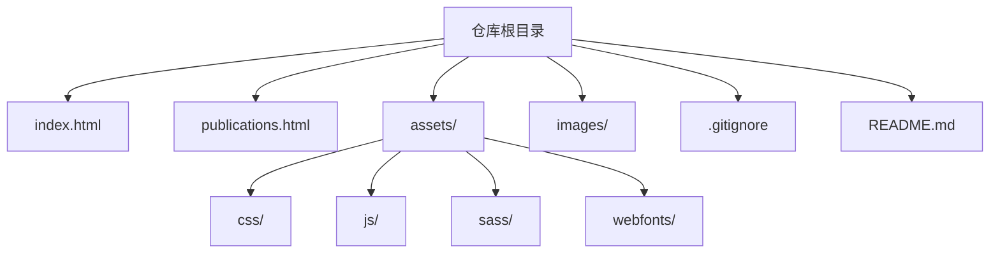
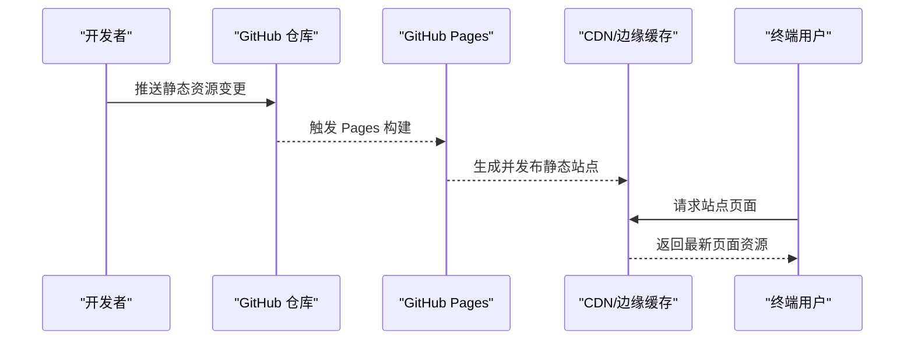
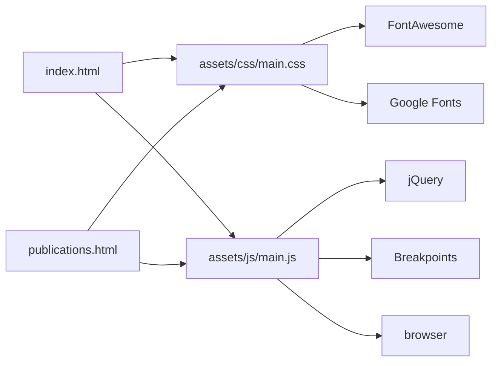

# 部署管理

<cite>
**本文引用的文件**
- [README.md](file://README.md)
- [.gitignore](file://.gitignore)
- [index.html](file://index.html)
- [publications.html](file://publications.html)
- [assets/css/main.css](file://assets/css/main.css)
- [assets/js/main.js](file://assets/js/main.js)
</cite>

## 目录
1. [简介](#简介)
2. [项目结构](#项目结构)
3. [核心组件](#核心组件)
4. [架构总览](#架构总览)
5. [详细组件分析](#详细组件分析)
6. [依赖分析](#依赖分析)
7. [性能考虑](#性能考虑)
8. [故障排查指南](#故障排查指南)
9. [结论](#结论)
10. [附录](#附录)

## 简介
本指南面向使用 GitHub Pages 静态站点托管的个人/学术主页项目，提供从本地开发、Git 工作流、分支与版本管理，到自动化部署、构建优化、生产发布、回滚策略、环境配置、依赖版本控制以及监控与错误追踪的完整方案。本项目为纯静态站点（HTML/CSS/JS），无后端服务与构建工具链，因此部署流程以“直接推送静态资源”为核心，并通过最佳实践提升可维护性与稳定性。

## 项目结构
仓库采用扁平化的静态站点组织方式：
- 根目录包含入口页面 index.html 与 publications.html
- assets 目录集中管理样式与脚本：
  - assets/css：主样式 main.css 与自定义样式 custom.css
  - assets/js：交互逻辑 main.js、util.js 及第三方库
  - assets/sass：SASS 源文件（编译产物未提交）
  - assets/webfonts：字体资源
- images：图片资源
- .gitignore：忽略系统临时文件
- README.md：站点说明与模板来源

图表来源
- [index.html:1-150](file://index.html#L1-L150)
- [publications.html:1-185](file://publications.html#L1-L185)
- [assets/css/main.css:1-200](file://assets/css/main.css#L1-L200)
- [assets/js/main.js:1-200](file://assets/js/main.js#L1-L200)

章节来源
- [README.md:1-10](file://README.md#L1-L10)
- [.gitignore:1-21](file://.gitignore#L1-L21)
- [index.html:1-150](file://index.html#L1-L150)
- [publications.html:1-185](file://publications.html#L1-L185)

## 核心组件
- 页面入口与内容
  - index.html：首页，包含个人简介、新闻、学术服务等模块
  - publications.html：论文列表页，按年份组织并附带链接
- 样式与主题
  - assets/css/main.css：基于 Editorial 模板的主样式，引入外部字体与图标库
  - assets/css/custom.css：自定义样式覆盖或扩展
- 交互与脚本
  - assets/js/main.js：响应式断点、侧边栏交互、加载状态等
  - assets/js/util.js：通用工具函数
- 资源与字体
  - assets/webfonts：字体文件
  - images：站点图片资源

章节来源
- [index.html:1-150](file://index.html#L1-L150)
- [publications.html:1-185](file://publications.html#L1-L185)
- [assets/css/main.css:1-200](file://assets/css/main.css#L1-L200)
- [assets/js/main.js:1-200](file://assets/js/main.js#L1-L200)

## 架构总览
GitHub Pages 将仓库中的静态资源直接作为网站内容发布。对于本仓库，典型流程如下：
- 开发者在本地修改 HTML/CSS/JS
- 通过 Git 提交变更到指定分支（通常为 main）
- GitHub 自动检测推送并触发 Pages 构建（无需额外 CI）
- 构建产物由 GitHub 托管，用户访问域名即可获取最新静态资源

图表来源
- [index.html:1-150](file://index.html#L1-L150)
- [publications.html:1-185](file://publications.html#L1-L185)

章节来源
- [README.md:1-10](file://README.md#L1-L10)

## 详细组件分析

### 本地开发环境搭建
- 基础要求
  - 安装 Git 用于版本控制
  - 可选：本地 HTTP 服务器（如 Python http.server 或 VS Code Live Server）以便预览相对路径资源
- 克隆与预览
  - 克隆仓库到本地
  - 打开 index.html 或通过本地服务器预览
- 样式与脚本
  - 如需编辑 SASS，需安装 Sass 编译器并将 assets/sass 编译为 assets/css（注意：当前仓库已提交编译后的 CSS）
- 资源管理
  - 图片放入 images 目录，确保路径正确引用
  - 字体与第三方库位于 assets/webfonts 与 assets/js

章节来源
- [assets/css/main.css:1-200](file://assets/css/main.css#L1-L200)
- [assets/js/main.js:1-200](file://assets/js/main.js#L1-L200)

### Git 工作流规范
- 分支策略
  - main：生产分支，仅接受经过测试的稳定变更
  - develop：集成分支，日常功能开发与合并
  - feature/*：功能分支，按任务命名，完成后合并至 develop
  - hotfix/*：紧急修复分支，直接从 main 切出，修复后合并回 main 与 develop
- 提交规范
  - 使用语义化提交信息（例如 feat、fix、docs、chore）
  - 每次提交聚焦单一变更，便于回滚与审计
- 代码审查
  - 通过 Pull Request 进行评审，至少一名成员批准后方可合并
- 标签与版本
  - 对重要发布打 Tag（如 v1.0.0），便于回滚与追踪

章节来源
- [.gitignore:1-21](file://.gitignore#L1-L21)

### 代码提交与分支管理最佳实践
- 小步快跑：频繁提交，减少单次变更范围
- 分支隔离：新功能与修复独立分支，避免污染主干
- 合并前检查：本地验证页面渲染与交互正常
- 清理工作区：合并后删除已合并分支，保持仓库整洁

章节来源
- [index.html:1-150](file://index.html#L1-L150)
- [publications.html:1-185](file://publications.html#L1-L185)

### 自动化部署配置方法
- 启用 GitHub Pages
  - 在仓库设置中开启 Pages，选择分支（推荐 main）与目录（根目录）
  - 首次启用后，GitHub 会自动构建并托管静态站点
- 自定义域名（可选）
  - 添加 CNAME 文件指向自有域名，并在 DNS 中配置记录
- 构建与缓存
  - GitHub Pages 默认缓存静态资源；可通过文件名或版本号控制缓存更新

章节来源
- [README.md:1-10](file://README.md#L1-L10)

### 构建过程的优化
- 资源压缩与合并
  - 当前仓库已提交压缩后的 CSS/JS，建议继续维持最小化资源
- 字体与图标
  - 按需引入字体与图标，避免冗余
- 图片优化
  - 使用合适格式与尺寸，必要时进行压缩
- 浏览器缓存
  - 利用文件名哈希或版本号强制刷新缓存（可在文件名中加入版本标识）

章节来源
- [assets/css/main.css:1-200](file://assets/css/main.css#L1-L200)
- [assets/js/main.js:1-200](file://assets/js/main.js#L1-L200)

### 生产环境的部署流程
- 标准发布流程
  - 在 feature 分支完成开发与自测
  - 合并至 develop 进行集成测试
  - 通过 PR 合并至 main 触发 Pages 构建
- 发布前检查清单
  - 页面渲染正常、链接有效、图片显示正确
  - 移动端适配良好、交互流畅
  - 无控制台错误或警告
- 发布后验证
  - 访问线上地址确认最新版本生效
  - 检查浏览器缓存是否按预期更新

章节来源
- [index.html:1-150](file://index.html#L1-L150)
- [publications.html:1-185](file://publications.html#L1-L185)

### 回滚策略
- 快速回滚
  - 使用 Git 标签标记稳定版本，回退至目标标签并重新推送
  - 若 Pages 仍缓存旧版本，可通过清除缓存或等待过期恢复
- 渐进回滚
  - 通过分支切换与 PR 逐步回退变更，降低风险
- 回滚验证
  - 回滚后立即验证关键页面与功能，确保业务不受影响

章节来源
- [.gitignore:1-21](file://.gitignore#L1-L21)

### 环境配置管理
- 静态站点的环境差异较小，通常通过以下方式管理：
  - 常量与配置：在 JS 中定义全局配置对象，便于切换不同环境参数
  - 资源路径：统一使用相对路径，避免硬编码绝对路径
  - 多语言/多主题：通过 CSS 变量或类名切换主题，JS 动态加载配置
- 敏感信息
  - 不将密钥或令牌提交至仓库；如需接入外部服务，建议使用环境变量或安全存储

章节来源
- [assets/js/main.js:1-200](file://assets/js/main.js#L1-L200)

### 依赖版本控制
- 第三方库
  - 将必要的 JS/CSS 文件纳入仓库（如 jQuery、Breakpoints、FontAwesome），锁定具体版本
  - 避免直接引用在线 CDN 的不稳定版本，保证离线可用性与一致性
- 字体与图标
  - 字体文件纳入仓库，避免网络依赖导致加载失败
- 更新策略
  - 定期评估依赖更新，先在 feature 分支测试兼容性后再合并

章节来源
- [assets/js/main.js:1-200](file://assets/js/main.js#L1-L200)
- [assets/css/main.css:1-200](file://assets/css/main.css#L1-L200)

### 部署监控、错误追踪与性能分析
- 监控与统计
  - 接入站点分析（如 Google Analytics 或自建埋点），收集访问量与用户行为
  - 配置健康检查接口（如有后端）或使用 Uptime Robot 监控可达性
- 错误追踪
  - 前端错误捕获：通过 window.onerror 或第三方 SDK 上报异常
  - 日志聚合：将错误日志发送至集中平台（如 Sentry）
- 性能分析
  - 使用 Lighthouse 或 WebPageTest 评估首屏加载、资源体积与缓存策略
  - 监控 Core Web Vitals（LCP、FID、CLS），持续优化用户体验

章节来源
- [assets/js/main.js:1-200](file://assets/js/main.js#L1-L200)

## 依赖分析
- 页面依赖
  - index.html 与 publications.html 引用 assets/css/main.css 与 assets/js/main.js
  - main.css 引入 FontAwesome 与 Google Fonts（字体与图标）
  - main.js 使用 jQuery、Breakpoints、browser 等库实现交互与响应式
- 资源依赖
  - images 目录下的图片被页面引用
  - webfonts 目录提供本地字体支持
- 耦合关系
  - 页面结构与样式解耦，便于维护与替换主题
  - 脚本与样式模块化，职责清晰

图表来源
- [index.html:1-150](file://index.html#L1-L150)
- [publications.html:1-185](file://publications.html#L1-L185)
- [assets/css/main.css:1-200](file://assets/css/main.css#L1-L200)
- [assets/js/main.js:1-200](file://assets/js/main.js#L1-L200)

章节来源
- [assets/css/main.css:1-200](file://assets/css/main.css#L1-L200)
- [assets/js/main.js:1-200](file://assets/js/main.js#L1-L200)

## 性能考虑
- 首屏加载
  - 优先加载关键 CSS 与必要 JS，延迟加载非关键脚本
  - 使用预连接与预加载提示（如 <link rel="preconnect">）
- 资源体积
  - 保持 CSS/JS 最小化，移除未使用的样式与脚本
  - 图片压缩与懒加载，减少带宽占用
- 缓存策略
  - 利用浏览器缓存与 CDN 缓存，合理设置 Cache-Control
  - 通过文件名哈希或版本号强制刷新缓存
- 可访问性与兼容性
  - 确保语义化 HTML，提升可访问性
  - 针对主流浏览器进行兼容测试

[本节为通用指导，不直接分析具体文件]

## 故障排查指南
- 常见问题定位
  - 页面空白：检查 HTML 结构完整性与资源路径是否正确
  - 样式错乱：确认 CSS 文件加载顺序与优先级，检查浏览器控制台错误
  - 交互失效：查看 JS 控制台报错，确认依赖库加载成功
- 调试步骤
  - 使用浏览器开发者工具检查网络请求与资源加载
  - 逐步禁用脚本与样式，定位问题来源
  - 对比本地与线上差异，确认是否为缓存或版本不一致导致
- 回滚与恢复
  - 若新版本出现问题，快速回滚至上一稳定版本
  - 清理缓存并重新验证，确保恢复效果

章节来源
- [index.html:1-150](file://index.html#L1-L150)
- [publications.html:1-185](file://publications.html#L1-L185)
- [assets/css/main.css:1-200](file://assets/css/main.css#L1-L200)
- [assets/js/main.js:1-200](file://assets/js/main.js#L1-L200)

## 结论
本指南围绕 GitHub Pages 静态站点提供了从本地开发到生产发布的完整流程，涵盖 Git 工作流、分支与版本管理、构建优化、回滚策略、环境配置与依赖控制，以及监控与错误追踪的实施建议。遵循这些实践可显著提升站点的可维护性、稳定性与用户体验。

[本节为总结性内容，不直接分析具体文件]

## 附录
- 常用命令参考
  - 克隆仓库：git clone <仓库地址>
  - 创建分支：git checkout -b feature/<功能名>
  - 提交变更：git add . && git commit -m "<提交信息>"
  - 推送分支：git push origin <分支名>
  - 创建标签：git tag -a v1.0.0 -m "发布版本"
  - 回滚版本：git reset --hard <commit-id>
- 相关资源
  - GitHub Pages 文档：了解 Pages 配置与自定义域名
  - Lighthouse 报告：评估性能与可访问性
  - 浏览器开发者工具：调试网络、DOM 与脚本

[本节为补充信息，不直接分析具体文件]