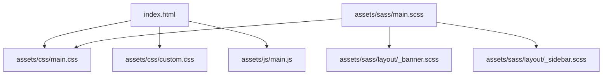
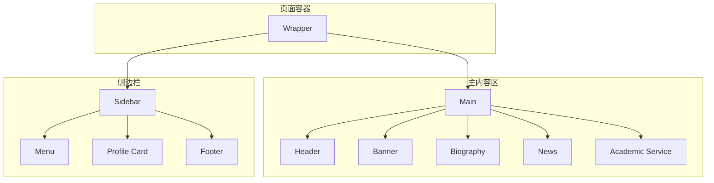
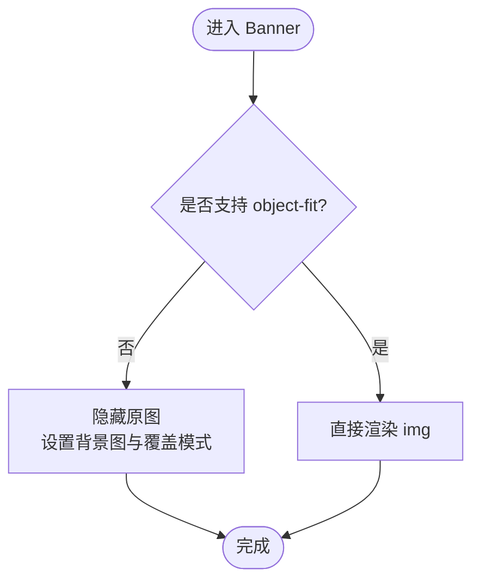
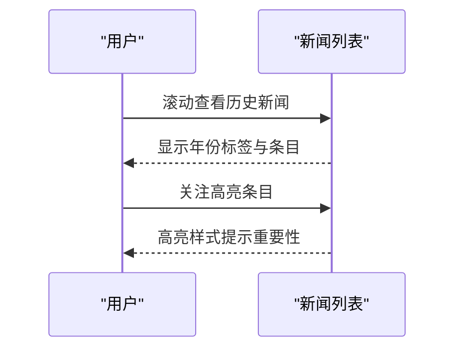
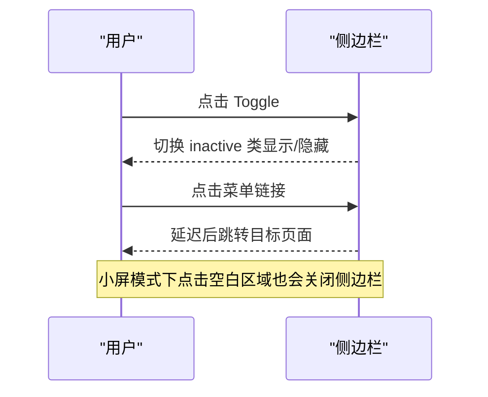
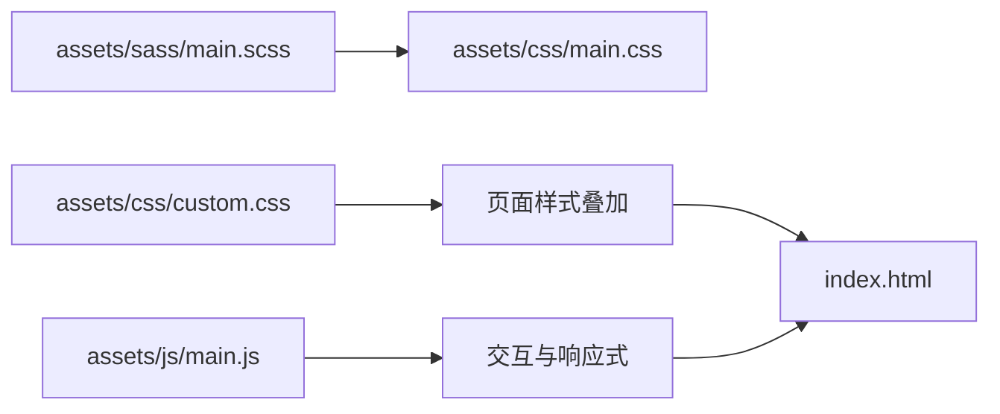

# 主页面组件

<cite>
**本文引用的文件**
- [index.html](file://index.html)
- [assets/css/main.css](file://assets/css/main.css)
- [assets/css/custom.css](file://assets/css/custom.css)
- [assets/js/main.js](file://assets/js/main.js)
- [assets/sass/main.scss](file://assets/sass/main.scss)
- [assets/sass/layout/_banner.scss](file://assets/sass/layout/_banner.scss)
- [assets/sass/layout/_sidebar.scss](file://assets/sass/layout/_sidebar.scss)
- [README.md](file://README.md)
</cite>

## 目录
1. [简介](#简介)
2. [项目结构](#项目结构)
3. [核心组件](#核心组件)
4. [架构总览](#架构总览)
5. [详细组件分析](#详细组件分析)
6. [依赖关系分析](#依赖关系分析)
7. [性能考虑](#性能考虑)
8. [故障排查指南](#故障排查指南)
9. [结论](#结论)
10. [附录：自定义与扩展方法](#附录自定义与扩展方法)

## 简介
本页面为个人主页的首页，采用响应式双栏布局（主内容区 + 侧边栏）。页面包含个人信息展示区域（Banner）、个人简介（Biography）、新闻列表（News）、学术服务（Academic Service）以及侧边栏的个人资料卡片（Profile）。整体基于 HTML5 UP Editorial 模板，通过 SCSS 编译后的 CSS 与少量 JavaScript 实现交互与响应式行为。

## 项目结构
- 入口文件 index.html 定义了页面骨架与主要区块。
- 样式层由 main.css（编译产物）与 custom.css（主题定制）组成；SCSS 源码位于 assets/sass，按 base、components、layout 分层组织。
- 交互逻辑集中在 assets/js/main.js，负责断点切换、侧边栏折叠/固定滚动等。

图表来源
- [index.html:1-128](file://index.html#L1-L128)
- [assets/sass/main.scss:1-62](file://assets/sass/main.scss#L1-L62)
- [assets/sass/layout/_banner.scss:1-75](file://assets/sass/layout/_banner.scss#L1-L75)
- [assets/sass/layout/_sidebar.scss:1-223](file://assets/sass/layout/_sidebar.scss#L1-L223)

章节来源
- [index.html:1-128](file://index.html#L1-L128)
- [assets/sass/main.scss:1-62](file://assets/sass/main.scss#L1-L62)
- [README.md:1-10](file://README.md#L1-L10)

## 核心组件
- 头部导航（Header）：提供站点内页跳转链接。
- Banner 个人信息区：姓名、当前职位、邮箱与头像，支持横竖屏自适应。
- Biography 个人简介：段落文本，行高与间距优化。
- News 新闻列表：年份标签、图标、标题与主题说明，支持置顶高亮条目。
- Academic Service 学术服务：会议与期刊审稿信息。
- Sidebar Profile 侧边栏个人资料：联系方式、社交链接与机构信息。

章节来源
- [index.html:20-116](file://index.html#L20-L116)
- [assets/css/custom.css:1-391](file://assets/css/custom.css#L1-L391)

## 架构总览
页面采用 Flexbox 双栏布局：左侧为主内容区（Main），右侧为侧边栏（Sidebar）。Banner 使用弹性布局将文字与图片并排显示，在竖屏时自动切换为上下堆叠。侧边栏在小屏设备下可折叠并通过 JS 控制显隐与滚动锁定。

图表来源
- [index.html:13-118](file://index.html#L13-L118)
- [assets/sass/layout/_banner.scss:9-75](file://assets/sass/layout/_banner.scss#L9-L75)
- [assets/sass/layout/_sidebar.scss:37-223](file://assets/sass/layout/_sidebar.scss#L37-L223)

## 详细组件分析

### Banner 个人信息展示区
- HTML 结构
  - 外层 section#banner 作为容器，内部 content 子元素包含姓名与简要信息列表，image 子元素承载头像。
- 样式与响应式
  - 基础布局使用 flex 将内容与图片左右排列；图片使用 object-fit/cover 保持比例填充。
  - 竖屏或窄屏时通过媒体查询切换为纵向堆叠，图片居中显示，尺寸随屏幕缩小而调整。
  - 自定义样式中进一步限定内容宽度、图片圆角与间距，确保紧凑且美观。
- 交互与兼容
  - 若浏览器不支持 object-fit，JS 会回退到背景图方式渲染图片，保证视觉一致性。

图表来源
- [assets/js/main.js:53-70](file://assets/js/main.js#L53-L70)
- [assets/sass/layout/_banner.scss:9-75](file://assets/sass/layout/_banner.scss#L9-L75)
- [assets/css/custom.css:9-101](file://assets/css/custom.css#L9-L101)

章节来源
- [index.html:26-40](file://index.html#L26-L40)
- [assets/sass/layout/_banner.scss:9-75](file://assets/sass/layout/_banner.scss#L9-L75)
- [assets/css/custom.css:9-101](file://assets/css/custom.css#L9-L101)
- [assets/js/main.js:53-70](file://assets/js/main.js#L53-L70)

### Biography 个人简介
- 文本组织：单段描述研究方向与当前职务，强调可读性。
- 样式定制：增大行高、去除多余外边距，使段落更舒展。
- 可扩展性：如需多段或列表，可在同一 section 内追加 p/ul 等语义化标签，沿用现有排版变量。

章节来源
- [index.html:42-46](file://index.html#L42-L46)
- [assets/css/custom.css:103-106](file://assets/css/custom.css#L103-L106)

### News 新闻列表系统
- 数据结构与语义
  - 每条新闻为一个 li，内部包含：
    - news-icon：事件类型图标（如论文、入职、毕业等）。
    - news-year：年份标签，用于时间维度分类。
    - news-main：新闻标题，加粗突出。
    - news-topic：可选的主题说明，用括号包裹。
  - 首条新闻使用 news-feature 类进行高亮展示。
- 年份分类显示
  - 通过独立的年份标签块呈现，便于快速浏览不同年份的成果。
  - 视觉上以胶囊形背景与强调色区分，不改变文档流顺序。
- 图标系统
  - 使用 Unicode 表情符号作为轻量图标，无需额外字体资源。
  - 可通过替换为 SVG/字体图标实现更丰富的视觉表达。
- 高亮功能
  - 对 .news-feature 条目应用背景、左边框与更大字号，形成“置顶/重点”效果。
  - 可通过添加/移除该类名动态控制高亮状态。
- 滚动与布局
  - 列表容器限制最大高度并启用垂直滚动，避免长列表占用过多空间。
  - 自定义滚动条样式提升体验。

图表来源
- [index.html:49-72](file://index.html#L49-L72)
- [assets/css/custom.css:249-391](file://assets/css/custom.css#L249-L391)

章节来源
- [index.html:49-72](file://index.html#L49-L72)
- [assets/css/custom.css:249-391](file://assets/css/custom.css#L249-L391)

### Academic Service 学术服务信息
- 展示逻辑：以有序/无序列表形式列出会议与期刊审稿经历，强调权威性与覆盖面。
- 样式：沿用默认列表样式，必要时可通过自定义类增强对齐与缩进。
- 扩展建议：可按会议/期刊分组或使用表格展示更多元数据（如年份、角色）。

章节来源
- [index.html:74-81](file://index.html#L74-L81)

### 侧边栏 Profile 卡片
- 结构与内容
  - 名称、所属机构与职位清晰展示。
  - 联系方式包括位置、邮箱、GitHub、Google Scholar、LinkedIn 等，均使用 Font Awesome 图标增强识别度。
- 样式定制
  - 侧边栏背景色与分隔线颜色统一主题风格。
  - 链接悬停高亮，图标与文字对齐一致。
- 交互与响应式
  - 小屏设备下侧边栏默认隐藏，点击 Toggle 按钮展开；点击空白处或链接后自动收起。
  - 大屏幕上侧边栏固定定位，滚动时根据内容高度计算偏移，实现“跟随滚动”的效果。

图表来源
- [assets/js/main.js:72-164](file://assets/js/main.js#L72-L164)
- [assets/sass/layout/_sidebar.scss:37-223](file://assets/sass/layout/_sidebar.scss#L37-L223)
- [index.html:85-116](file://index.html#L85-L116)

章节来源
- [index.html:85-116](file://index.html#L85-L116)
- [assets/js/main.js:72-164](file://assets/js/main.js#L72-L164)
- [assets/sass/layout/_sidebar.scss:37-223](file://assets/sass/layout/_sidebar.scss#L37-L223)

## 依赖关系分析
- 样式依赖
  - main.scss 引入基础、组件与布局模块，最终编译为 main.css。
  - custom.css 覆盖主题色、Banner 布局、新闻列表与侧边栏细节。
- 脚本依赖
  - main.js 依赖 jQuery、breakpoints 工具与浏览器特性检测，实现响应式与交互。
- 外部资源
  - 字体与图标来自 Google Fonts 与 FontAwesome CDN。

图表来源
- [assets/sass/main.scss:1-62](file://assets/sass/main.scss#L1-L62)
- [assets/css/main.css:1-10](file://assets/css/main.css#L1-L10)
- [assets/js/main.js:1-25](file://assets/js/main.js#L1-L25)

章节来源
- [assets/sass/main.scss:1-62](file://assets/sass/main.scss#L1-L62)
- [assets/css/main.css:1-10](file://assets/css/main.css#L1-L10)
- [assets/js/main.js:1-25](file://assets/js/main.js#L1-L25)

## 性能考虑
- 图片加载与兼容性：object-fit 回退机制减少重绘；头像尺寸适中，避免过大资源。
- 滚动性能：新闻列表使用固定最大高度与原生滚动，降低重排开销。
- 侧边栏滚动锁定：仅在大于 large 断点生效，移动端避免不必要的计算。
- 样式体积：SCSS 模块化组织，按需引入，减少冗余。

[本节为通用指导，不直接分析具体文件]

## 故障排查指南
- 图片未正确显示
  - 检查图片路径与命名；确认浏览器是否支持 object-fit；若不支持，确认 JS 回退逻辑是否执行。
  - 参考：[assets/js/main.js:53-70](file://assets/js/main.js#L53-L70)
- 侧边栏无法折叠/滚动异常
  - 确认 breakpoints 配置与 active 判断；检查是否触发了 resize.sidebar-lock。
  - 参考：[assets/js/main.js:72-164](file://assets/js/main.js#L72-L164)、[assets/js/main.js:170-235](file://assets/js/main.js#L170-L235)
- 新闻列表样式错乱
  - 检查 .news-list 容器高度与 overflow 设置；确认各子项 class 是否正确。
  - 参考：[assets/css/custom.css:249-391](file://assets/css/custom.css#L249-L391)
- 链接点击无响应
  - 确认 a 标签 href 有效；检查 JS 是否阻止了默认行为但未正确跳转。
  - 参考：[assets/js/main.js:107-140](file://assets/js/main.js#L107-L140)

章节来源
- [assets/js/main.js:53-70](file://assets/js/main.js#L53-L70)
- [assets/js/main.js:72-164](file://assets/js/main.js#L72-L164)
- [assets/js/main.js:170-235](file://assets/js/main.js#L170-L235)
- [assets/css/custom.css:249-391](file://assets/css/custom.css#L249-L391)

## 结论
该主页以简洁清晰的布局呈现个人学术信息，Banner 与侧边栏的响应式设计确保了跨设备的一致性体验。新闻列表通过结构化 class 与样式实现了年份分类与高亮展示，便于读者快速定位重要成果。整体代码组织合理，易于维护与扩展。

[本节为总结性内容，不直接分析具体文件]

## 附录：自定义与扩展方法
- 修改主题色与品牌色
  - 在 custom.css 中调整 a、h1-h6、strong 等全局颜色，保持对比度与可读性。
  - 参考：[assets/css/custom.css:124-144](file://assets/css/custom.css#L124-L144)
- 调整 Banner 布局与图片尺寸
  - 修改 #banner 的 padding、flex-direction 与图片宽高；针对不同断点设置媒体查询。
  - 参考：[assets/css/custom.css:9-101](file://assets/css/custom.css#L9-L101)、[assets/sass/layout/_banner.scss:9-75](file://assets/sass/layout/_banner.scss#L9-L75)
- 扩展新闻条目字段
  - 在 li 内增加新 span（如 venue、link），并在 custom.css 中定义对应样式。
  - 参考：[index.html:49-72](file://index.html#L49-L72)、[assets/css/custom.css:249-391](file://assets/css/custom.css#L249-L391)
- 集成更多社交媒体链接
  - 在侧边栏 profile-links 中添加新的 li 与 i 图标，确保 Font Awesome 可用。
  - 参考：[index.html:98-110](file://index.html#L98-L110)、[assets/css/custom.css:175-201](file://assets/css/custom.css#L175-L201)
- 优化侧边栏滚动与固定行为
  - 调整 breakpoints 与滚动锁定的触发条件，确保在不同设备上表现一致。
  - 参考：[assets/js/main.js:72-164](file://assets/js/main.js#L72-L164)、[assets/js/main.js:170-235](file://assets/js/main.js#L170-L235)

章节来源
- [assets/css/custom.css:9-101](file://assets/css/custom.css#L9-L101)
- [assets/css/custom.css:124-144](file://assets/css/custom.css#L124-L144)
- [assets/css/custom.css:175-201](file://assets/css/custom.css#L175-L201)
- [assets/css/custom.css:249-391](file://assets/css/custom.css#L249-L391)
- [assets/sass/layout/_banner.scss:9-75](file://assets/sass/layout/_banner.scss#L9-L75)
- [index.html:49-72](file://index.html#L49-L72)
- [index.html:98-110](file://index.html#L98-L110)
- [assets/js/main.js:72-164](file://assets/js/main.js#L72-L164)
- [assets/js/main.js:170-235](file://assets/js/main.js#L170-L235)