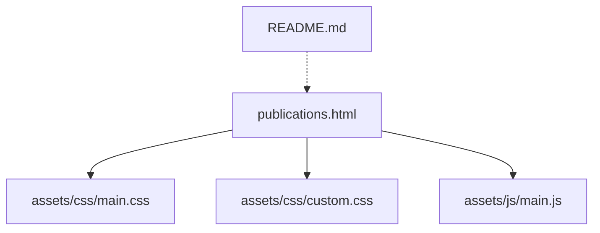
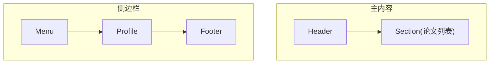
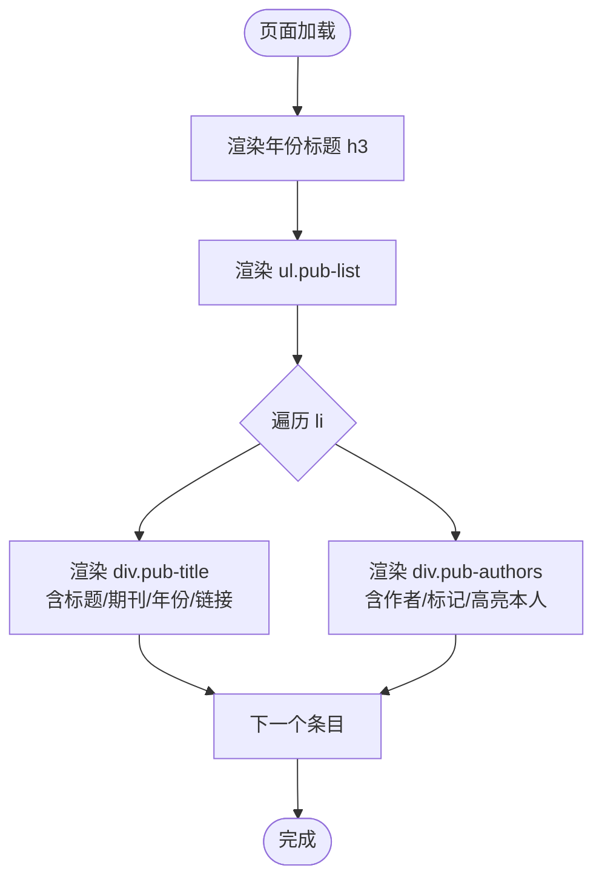
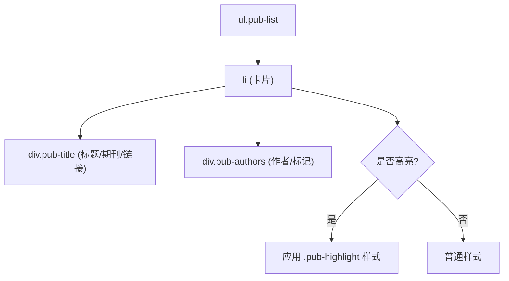
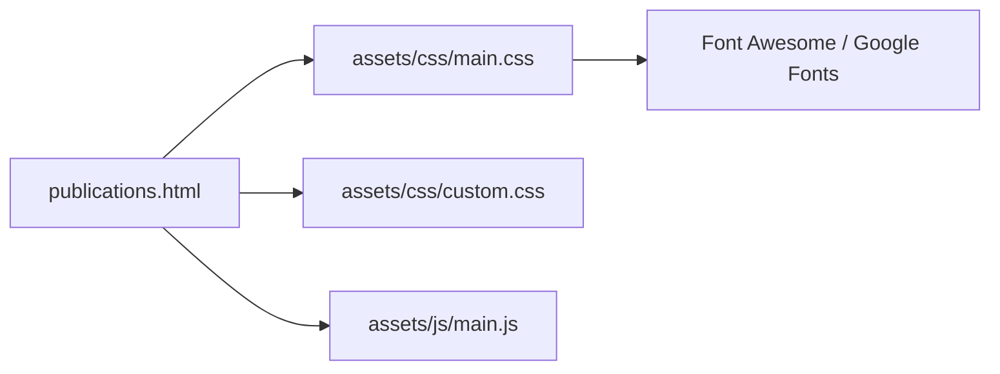

# 论文发表页面

<cite>
**本文引用的文件**
- [publications.html](file://publications.html)
- [assets/css/main.css](file://assets/css/main.css)
- [assets/css/custom.css](file://assets/css/custom.css)
- [assets/js/main.js](file://assets/js/main.js)
- [README.md](file://README.md)
</cite>

## 目录
1. [简介](#简介)
2. [项目结构](#项目结构)
3. [核心组件](#核心组件)
4. [架构总览](#架构总览)
5. [详细组件分析](#详细组件分析)
6. [依赖关系分析](#依赖关系分析)
7. [性能与可访问性](#性能与可访问性)
8. [故障排查指南](#故障排查指南)
9. [结论](#结论)
10. [附录：新增论文模板与最佳实践](#附录新增论文模板与最佳实践)

## 简介
本文件面向“论文发表页面”的实现与维护，聚焦 publications.html 的结构、论文展示系统、样式与交互、链接管理、高亮机制以及响应式适配。目标是帮助读者快速理解并安全地扩展该页面，确保在不同设备上获得一致的阅读体验。

## 项目结构
- 页面入口：publications.html
- 样式层：assets/css/main.css（主题基础样式）、assets/css/custom.css（站点定制样式）
- 脚本层：assets/js/main.js（布局、侧边栏、断点等交互）
- 资源说明：README.md（模板来源说明）

图表来源
- [publications.html:1-10](file://publications.html#L1-L10)
- [assets/css/main.css:1-10](file://assets/css/main.css#L1-L10)
- [assets/css/custom.css:1-10](file://assets/css/custom.css#L1-L10)
- [assets/js/main.js:1-25](file://assets/js/main.js#L1-L25)
- [README.md:1-10](file://README.md#L1-L10)

章节来源
- [publications.html:1-10](file://publications.html#L1-L10)
- [assets/css/main.css:1-10](file://assets/css/main.css#L1-L10)
- [assets/css/custom.css:1-10](file://assets/css/custom.css#L1-L10)
- [assets/js/main.js:1-25](file://assets/js/main.js#L1-L25)
- [README.md:1-10](file://README.md#L1-L10)

## 核心组件
- 页面骨架与导航：header、main、sidebar、footer
- 论文列表容器：按年份分组的 ul.pub-list，每个 li 为一条论文条目
- 论文条目结构：标题 div.pub-title、作者行 div.pub-authors、可选的链接集合
- 高亮条目：li.pub-highlight 用于突出重要成果
- 自定义样式：custom.css 定义 pub-list、pub-highlight、me 等类
- 交互脚本：main.js 负责断点、侧边栏折叠、滚动锁定等

章节来源
- [publications.html:20-125](file://publications.html#L20-L125)
- [assets/css/custom.css:311-370](file://assets/css/custom.css#L311-L370)
- [assets/js/main.js:13-23](file://assets/js/main.js#L13-L23)

## 架构总览
页面采用左右布局：左侧主内容区展示论文列表，右侧侧边栏包含菜单与个人简介。样式基于主题 main.css，并通过 custom.css 进行站点化定制；交互由 main.js 提供。

图表来源
- [publications.html:20-160](file://publications.html#L20-L160)

## 详细组件分析

### 论文列表的组织结构
- 按年份分组：使用 h3 作为年份标题（如 2026、2025、2024、2023 & Earlier），每个年份下对应一个 ul.pub-list。
- 条目格式：每条论文为一个 li，内部包含：
  - 标题行 div.pub-title：论文题目 + 期刊/会议名称（通常用 b 强调）+ 年份
  - 作者行 div.pub-authors：作者列表，其中本人姓名通过 class="me" 加粗显示；合著贡献与通讯作者分别用特殊符号标注（如 † 和 *）
- 链接集成：在标题行内嵌入多个 a 标签，指向代码仓库、数据集、论文PDF或预印本等外部资源

图表来源
- [publications.html:38-124](file://publications.html#L38-L124)

章节来源
- [publications.html:38-124](file://publications.html#L38-L124)

### 论文条目的 HTML 结构与语义
- 标题行：div.pub-title 承载论文题目、期刊/会议名、年份及链接
- 作者行：div.pub-authors 承载作者列表，使用 b 或 strong 强调重点信息
- 高亮条目：li.pub-highlight 用于突出重要成果（例如顶刊/顶会）
- 链接：a 标签统一使用主题链接样式，hover 时颜色变化

章节来源
- [publications.html:40-124](file://publications.html#L40-L124)

### CSS 样式与视觉层次
- 列表容器：ul.pub-list 去除默认列表样式，设置左边界色以形成卡片感
- 条目卡片：li 使用浅背景、左边框、圆角、行高与字号控制可读性
- 本人高亮：class="me" 的作者名加粗加深色，便于识别
- 高亮条目：li.pub-highlight 使用渐变背景、更粗边框与阴影，标题字体更大、颜色更深，突出重要性
- 链接样式：继承主题 a 样式，hover 时改变颜色与下划线

图表来源
- [assets/css/custom.css:311-370](file://assets/css/custom.css#L311-L370)

章节来源
- [assets/css/custom.css:311-370](file://assets/css/custom.css#L311-L370)
- [assets/css/main.css:110-126](file://assets/css/main.css#L110-L126)

### 交互效果与脚本行为
- 断点与响应式：main.js 初始化断点配置，配合 CSS media query 实现不同屏幕尺寸下的布局调整
- 侧边栏折叠：在小屏设备自动隐藏，点击切换按钮展开/收起
- 滚动锁定：在大屏上根据滚动位置固定侧边栏内容，提升浏览体验
- 页面加载动画：移除 is-preload 类以结束初始过渡

章节来源
- [assets/js/main.js:13-32](file://assets/js/main.js#L13-L32)
- [assets/js/main.js:72-164](file://assets/js/main.js#L72-L164)
- [assets/js/main.js:166-235](file://assets/js/main.js#L166-L235)

### 论文链接管理
- 链接类型：
  - 代码仓库：指向 GitHub 或其他托管平台
  - 数据集：指向数据下载页
  - 论文PDF/预印本：指向 IEEE Xplore、arXiv 等
  - 项目主页：指向团队或项目官网
- 链接组织：将链接直接嵌入标题行，保持条目紧凑；必要时可使用目标属性在新窗口打开
- 可维护性：建议统一链接命名与路径规范，避免重复与失效

章节来源
- [publications.html:44-124](file://publications.html#L44-L124)

### 论文高亮显示机制
- 触发条件：为特定 li 添加 class="pub-highlight"
- 视觉效果：
  - 背景渐变与阴影增强层次感
  - 左边框加粗并使用强调色
  - 标题字号增大、加粗、颜色加深
- 适用场景：顶刊/顶会、代表性工作、重大突破等

章节来源
- [publications.html:40-43](file://publications.html#L40-L43)
- [assets/css/custom.css:355-370](file://assets/css/custom.css#L355-L370)

### 响应式适配细节
- 断点策略：main.js 中定义了多档断点，CSS 中针对不同宽度调整字体、间距与布局
- 小屏优化：
  - 减小字号与行高，保证可读性
  - 侧边栏在小屏隐藏，通过切换按钮控制
  - 列表项内联链接换行友好，避免溢出
- 横竖屏适配：banner 区域在竖屏时图片置顶、文本居中，提升首屏体验

章节来源
- [assets/js/main.js:13-23](file://assets/js/main.js#L13-L23)
- [assets/css/main.css:92-108](file://assets/css/main.css#L92-L108)
- [assets/css/custom.css:48-101](file://assets/css/custom.css#L48-L101)

## 依赖关系分析
- 页面依赖样式：main.css（主题）、custom.css（定制）
- 页面依赖脚本：main.js（交互）
- 第三方资源：字体、图标库（通过 main.css 引入）

图表来源
- [publications.html:5-9](file://publications.html#L5-L9)
- [assets/css/main.css:1-3](file://assets/css/main.css#L1-L3)

章节来源
- [publications.html:5-9](file://publications.html#L5-L9)
- [assets/css/main.css:1-3](file://assets/css/main.css#L1-L3)

## 性能与可访问性
- 性能
  - 静态HTML/CSS/JS，无额外请求开销
  - 使用系统字体与CDN字体，减少本地资源体积
  - 列表结构简单，DOM 层级浅，利于渲染
- 可访问性
  - 语义化标签（h3、ul、li、a）提升可扫描性
  - 链接具有明确文本描述（如“[Code]”、“[Paper]”）
  - 颜色对比度遵循主题规范，hover 状态清晰

[本节为通用指导，不直接分析具体文件]

## 故障排查指南
- 链接失效
  - 检查 a 标签 href 是否正确，确认外部资源可达
  - 若使用相对路径，确保与页面同级目录结构一致
- 高亮未生效
  - 确认 li 是否添加了 class="pub-highlight"
  - 检查 custom.css 是否被正确加载（浏览器开发者工具查看样式覆盖）
- 响应式异常
  - 检查 viewport meta 是否存在且正确
  - 确认 main.js 已加载，断点逻辑正常执行
- 侧边栏不折叠
  - 检查移动端是否出现 toggle 按钮
  - 确认 JS 事件绑定未被其他脚本干扰

章节来源
- [publications.html:165-170](file://publications.html#L165-L170)
- [assets/js/main.js:72-164](file://assets/js/main.js#L72-L164)

## 结论
该论文发表页面通过清晰的 HTML 结构、模块化的 CSS 样式与轻量脚本实现了稳定、易维护的论文展示系统。按年份分组、作者高亮、链接集成与高亮机制共同构成了良好的学术成果呈现方式。响应式适配确保跨设备一致性，便于长期维护与扩展。

[本节为总结性内容，不直接分析具体文件]

## 附录：新增论文模板与最佳实践

### 新增论文步骤
- 选择年份分组：在对应年份 h3 下方找到 ul.pub-list
- 复制现有 li 条目模板，替换以下字段：
  - 标题：论文题目、期刊/会议名、年份
  - 作者：完整作者列表，本人姓名包裹 class="me"，合著贡献与通讯作者使用相应符号
  - 链接：按需添加 Code、Dataset、Paper、Project 等 a 标签
- 如需高亮：为 li 添加 class="pub-highlight"
- 保存并刷新验证样式与链接

章节来源
- [publications.html:44-124](file://publications.html#L44-L124)
- [assets/css/custom.css:311-370](file://assets/css/custom.css#L311-L370)

### 最佳实践
- 统一格式：标题行顺序为“题目 + 期刊/会议 + 年份”，链接紧随其后
- 作者标注：本人姓名始终使用 class="me"；合著贡献与通讯作者使用标准符号
- 链接规范：优先使用绝对URL；外部链接建议使用 target="_blank" 并在文案中注明来源
- 高亮克制：仅对真正重要的成果使用高亮，避免视觉疲劳
- 可维护性：保持条目结构一致，便于后续批量处理或自动化生成

[本节为操作指南，不直接分析具体文件]