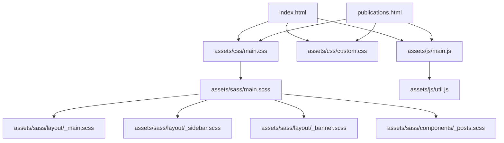
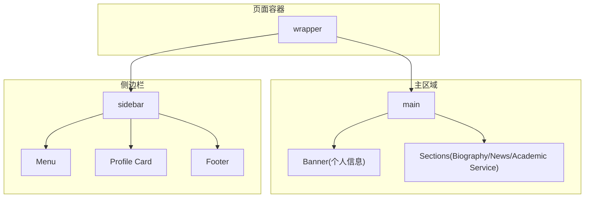
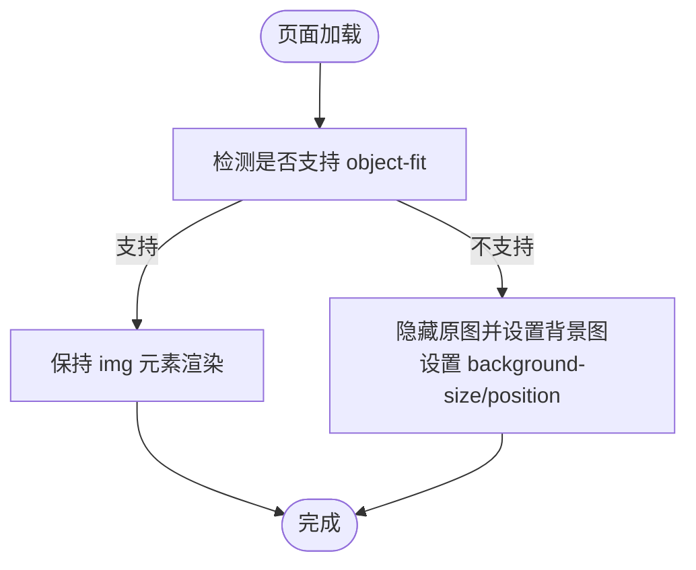
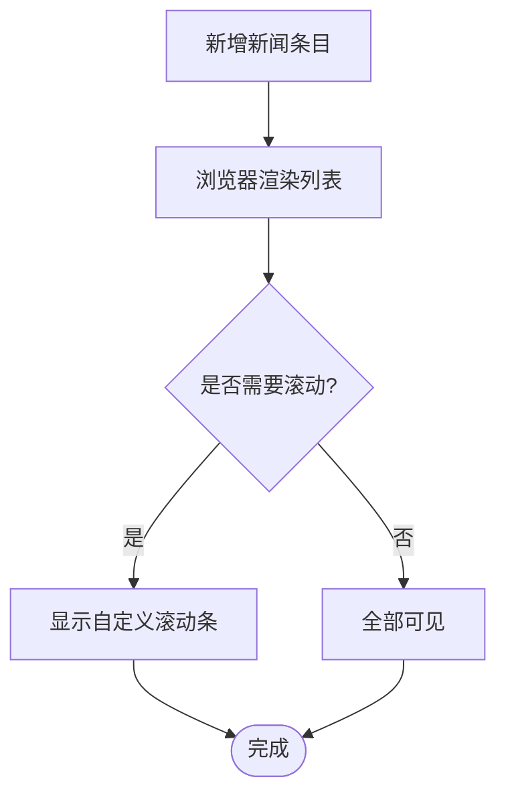
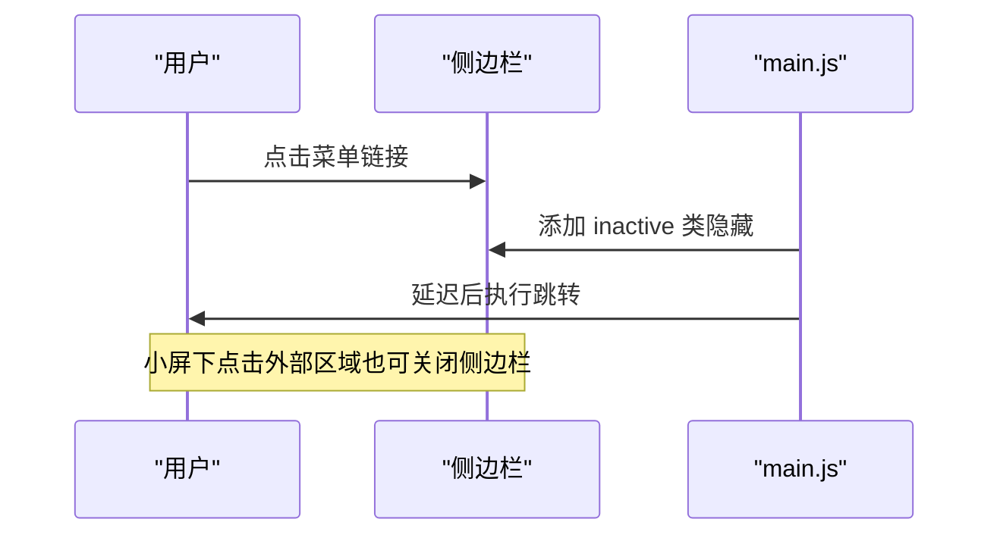
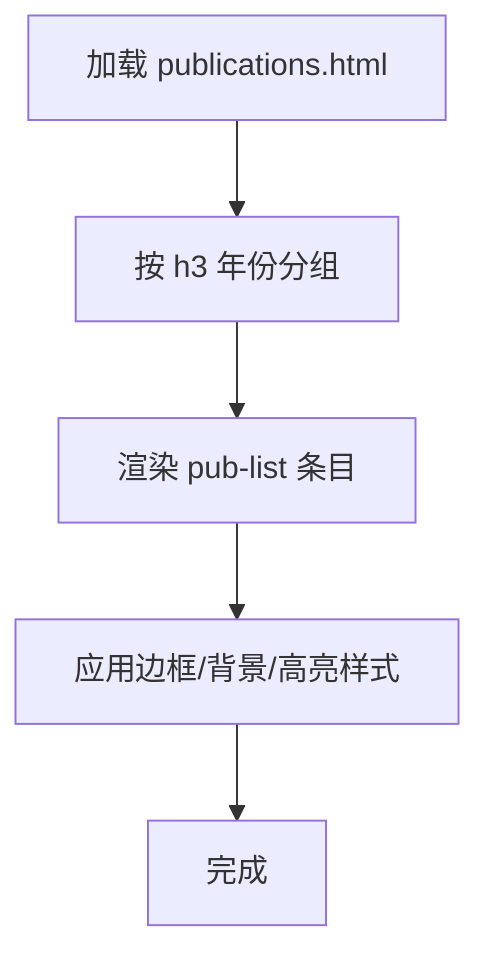
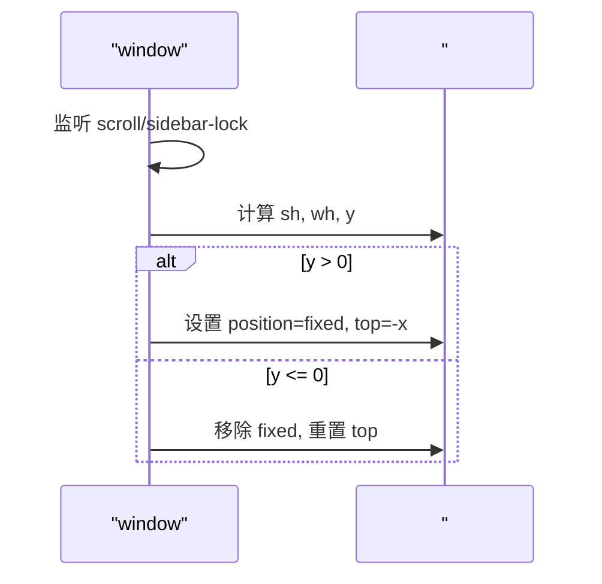
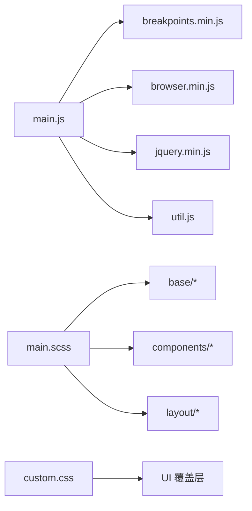

# 页面组件

<cite>
**本文引用的文件**
- [index.html](file://index.html)
- [publications.html](file://publications.html)
- [assets/js/main.js](file://assets/js/main.js)
- [assets/js/util.js](file://assets/js/util.js)
- [assets/sass/main.scss](file://assets/sass/main.scss)
- [assets/css/custom.css](file://assets/css/custom.css)
- [assets/sass/layout/_main.scss](file://assets/sass/layout/_main.scss)
- [assets/sass/layout/_sidebar.scss](file://assets/sass/layout/_sidebar.scss)
- [assets/sass/layout/_banner.scss](file://assets/sass/layout/_banner.scss)
- [assets/sass/components/_posts.scss](file://assets/sass/components/_posts.scss)
- [README.md](file://README.md)
</cite>

## 目录
1. [简介](#简介)
2. [项目结构](#项目结构)
3. [核心组件](#核心组件)
4. [架构总览](#架构总览)
5. [详细组件分析](#详细组件分析)
6. [依赖关系分析](#依赖关系分析)
7. [性能考虑](#性能考虑)
8. [故障排查指南](#故障排查指南)
9. [结论](#结论)
10. [附录](#附录)

## 简介
本文件面向个人主页与论文发表页面的页面级组件，重点说明：
- 主页面（首页）与论文发表页面的组件结构与实现方式
- 个人信息展示模块、新闻列表系统、学术服务信息卡片等核心组件的HTML结构、CSS样式与JavaScript交互逻辑
- 组件配置项、自定义方法与扩展点
- 组件间通信机制与数据流
- 响应式适配与移动端优化策略
- 最佳实践与可维护性建议

该项目基于HTML5 UP Editorial模板定制，采用静态HTML+SCSS+jQuery的组合，通过Sass模块化组织样式，使用媒体查询与JS断点实现响应式布局。

## 项目结构
- 入口页面
  - 首页：index.html
  - 论文页：publications.html
- 样式
  - 编译后的CSS：assets/css/main.css、assets/css/custom.css
  - Sass源文件：assets/sass/main.scss 及 base/components/layout 子模块
- 脚本
  - assets/js/main.js：页面交互与响应式行为
  - assets/js/util.js：通用工具（面板、占位符、DOM优先排序等）
  - 第三方库：browser.min.js、breakpoints.min.js、jquery.min.js（由模板引入）

图表来源
- [assets/sass/main.scss:1-62](file://assets/sass/main.scss#L1-L62)
- [assets/sass/layout/_main.scss:1-58](file://assets/sass/layout/_main.scss#L1-L58)
- [assets/sass/layout/_sidebar.scss:1-223](file://assets/sass/layout/_sidebar.scss#L1-L223)
- [assets/sass/layout/_banner.scss:1-75](file://assets/sass/layout/_banner.scss#L1-L75)
- [assets/sass/components/_posts.scss:1-179](file://assets/sass/components/_posts.scss#L1-L179)

章节来源
- [index.html:1-147](file://index.html#L1-L147)
- [publications.html:1-184](file://publications.html#L1-L184)
- [assets/sass/main.scss:1-62](file://assets/sass/main.scss#L1-L62)

## 核心组件
- 头部导航（Header）
  - 作用：站点Logo与页面切换链接（Homepage / Publications）
  - HTML结构：header#header + a.logo
  - 样式要点：底部边框色、内边距由custom.css覆盖；基础布局来自layout/_header.scss（模板）
  - 交互：无复杂交互，点击跳转至对应页面
- 横幅区（Banner/个人信息展示）
  - 作用：展示姓名、当前职位、邮箱与头像
  - HTML结构：section#banner > .content + .image.object
  - 样式要点：flex布局，图片object-fit兼容处理；移动端竖屏时上下堆叠
  - 交互：main.js对不支持object-fit的浏览器进行背景图回退
- 主体内容区（Main Sections）
  - 作用：承载“Biography”、“News”、“Academic Service”等区块
  - HTML结构：section#biography、section[News]、section[Academic Service]
  - 样式要点：section间距、标题样式由layout/_main.scss与custom.css共同控制
- 侧边栏（Sidebar）
  - 作用：菜单、个人信息卡片、页脚
  - HTML结构：div#sidebar > .inner > nav#menu + section.sidebar-profile + footer#footer
  - 样式要点：固定宽度、滚动锁定、移动端折叠/展开
  - 交互：main.js实现折叠、点击关闭、滚动锁、小屏下遮罩点击关闭
- 新闻列表（News List）
  - 作用：时间线式展示最新成果与动态
  - HTML结构：ul.news-list > li.news-item（含news-icon、news-year、news-main、news-topic）
  - 样式要点：横向弹性布局、年份标签、主题副文本、滚动条美化、最大高度限制
  - 交互：纯CSS滚动，无JS逻辑
- 论文列表（Publications List）
  - 作用：按年份分组列出论文条目，支持高亮重要论文
  - HTML结构：h3.year + ul.pub-list > li（pub-title、pub-authors）
  - 样式要点：左侧彩色边框、浅灰背景、作者名高亮、重要论文渐变高亮
  - 交互：纯CSS展示，无JS逻辑

章节来源
- [index.html:20-82](file://index.html#L20-L82)
- [publications.html:20-125](file://publications.html#L20-L125)
- [assets/css/custom.css:1-378](file://assets/css/custom.css#L1-L378)
- [assets/sass/layout/_main.scss:1-58](file://assets/sass/layout/_main.scss#L1-L58)
- [assets/sass/layout/_sidebar.scss:1-223](file://assets/sass/layout/_sidebar.scss#L1-L223)
- [assets/sass/layout/_banner.scss:1-75](file://assets/sass/layout/_banner.scss#L1-L75)

## 架构总览
页面采用“主内容+侧边栏”的双栏布局，通过Sass断点与JS断点协同实现响应式。移动端侧边栏以抽屉形式出现，桌面端常驻显示。

图表来源
- [index.html:13-118](file://index.html#L13-L118)
- [publications.html:13-161](file://publications.html#L13-L161)
- [assets/sass/layout/_main.scss:1-58](file://assets/sass/layout/_main.scss#L1-L58)
- [assets/sass/layout/_sidebar.scss:1-223](file://assets/sass/layout/_sidebar.scss#L1-L223)

## 详细组件分析

### 个人信息展示模块（Banner）
- HTML结构
  - 外层section#banner，内部.content包含姓名与联系信息，.image.object包含头像
- CSS样式
  - 使用flex布局，左右分栏；图片使用object-fit居中裁剪
  - custom.css中调整了图片尺寸、圆角、间距，并在竖屏与小屏下改为纵向堆叠
- JavaScript交互
  - main.js检测object-fit兼容性，在不支持的浏览器中将图片转为背景图并设置background-size/background-position
- 配置与扩展点
  - 可通过修改.custom.css中的图片尺寸与间距快速适配不同屏幕
  - 如需增加社交图标或联系方式，可在.content内追加列表项
- 响应式与移动端优化
  - 横屏/竖屏分别处理；小屏下图片缩小并居中
  - 使用max-height与vh单位避免图片过大影响首屏

图表来源
- [assets/js/main.js:53-70](file://assets/js/main.js#L53-L70)
- [assets/sass/layout/_banner.scss:1-75](file://assets/sass/layout/_banner.scss#L1-L75)
- [assets/css/custom.css:29-101](file://assets/css/custom.css#L29-L101)

章节来源
- [index.html:26-40](file://index.html#L26-L40)
- [assets/js/main.js:53-70](file://assets/js/main.js#L53-L70)
- [assets/sass/layout/_banner.scss:1-75](file://assets/sass/layout/_banner.scss#L1-L75)
- [assets/css/custom.css:29-101](file://assets/css/custom.css#L29-L101)

### 新闻列表系统（News List）
- HTML结构
  - ul.news-list，每个li包含news-icon、news-year、news-main、可选news-topic
- CSS样式
  - 使用flex布局，行内元素对齐基线；年份标签带半透明背景
  - 列表最大高度与滚动条样式在custom.css中定义，提升长列表可读性
  - 特色新闻（如Nature Medicine）通过.news-feature类加粗放大
- JavaScript交互
  - 无JS逻辑，纯CSS滚动与样式
- 配置与扩展点
  - 新增新闻只需添加li并按规范命名class
  - 可通过调整max-height与滚动条样式控制密度与视觉风格
- 响应式与移动端优化
  - 在小屏下自动换行，保证可读性

图表来源
- [index.html:49-72](file://index.html#L49-L72)
- [assets/css/custom.css:249-310](file://assets/css/custom.css#L249-L310)

章节来源
- [index.html:49-72](file://index.html#L49-L72)
- [assets/css/custom.css:249-310](file://assets/css/custom.css#L249-L310)

### 学术服务信息卡片（Sidebar Profile）
- HTML结构
  - section.sidebar-profile，包含姓名、机构、职位与联系方式列表（GitHub、Google Scholar、LinkedIn等）
- CSS样式
  - 侧边栏背景与分隔线由custom.css与layout/_sidebar.scss共同控制
  - 链接颜色与悬停效果统一为品牌色
- JavaScript交互
  - 无直接交互；侧边栏整体折叠/展开由main.js控制
- 配置与扩展点
  - 新增链接只需在.profile-links中添加li与对应图标
  - 可调整字体大小、颜色与间距以匹配新品牌风格
- 响应式与移动端优化
  - 侧边栏在小屏下折叠，点击body或外部区域关闭

图表来源
- [assets/js/main.js:91-164](file://assets/js/main.js#L91-L164)
- [assets/sass/layout/_sidebar.scss:154-223](file://assets/sass/layout/_sidebar.scss#L154-L223)
- [index.html:98-110](file://index.html#L98-L110)

章节来源
- [index.html:98-110](file://index.html#L98-L110)
- [assets/js/main.js:91-164](file://assets/js/main.js#L91-L164)
- [assets/sass/layout/_sidebar.scss:154-223](file://assets/sass/layout/_sidebar.scss#L154-L223)

### 论文发表页面（Publications）
- HTML结构
  - 按年份分组（h3），每组一个ul.pub-list，li包含论文标题与作者列表
  - 重要论文可使用.pub-highlight类进行高亮
- CSS样式
  - 每条论文带左边框与浅灰背景，作者名高亮；高亮条目使用渐变背景与阴影
- JavaScript交互
  - 无JS逻辑，纯静态展示
- 配置与扩展点
  - 新增论文按年份分组插入li即可
  - 可通过自定义类进一步扩展样式（如标注代码/数据集链接）
- 响应式与移动端优化
  - 列表在小屏下自然换行，阅读体验良好

图表来源
- [publications.html:27-125](file://publications.html#L27-L125)
- [assets/css/custom.css:311-378](file://assets/css/custom.css#L311-L378)

章节来源
- [publications.html:27-125](file://publications.html#L27-L125)
- [assets/css/custom.css:311-378](file://assets/css/custom.css#L311-L378)

### 侧边栏滚动锁定（Sidebar Lock）
- 功能
  - 在大屏上，当侧边栏内容高于视口时，滚动到一定位置后侧边栏内容固定，提升导航可用性
- 实现
  - main.js监听窗口滚动与resize，计算侧边栏内容与视口高度差，动态切换position与top值
- 配置与扩展点
  - 若侧边栏内容高度变化，需触发resize.sidebar-lock事件以保持同步
- 响应式与移动端优化
  - 小屏下禁用滚动锁定，改为抽屉式滑动

图表来源
- [assets/js/main.js:166-235](file://assets/js/main.js#L166-L235)
- [assets/sass/layout/_sidebar.scss:154-223](file://assets/sass/layout/_sidebar.scss#L154-L223)

章节来源
- [assets/js/main.js:166-235](file://assets/js/main.js#L166-L235)
- [assets/sass/layout/_sidebar.scss:154-223](file://assets/sass/layout/_sidebar.scss#L154-L223)

## 依赖关系分析
- 样式依赖
  - main.scss聚合base、components、layout三个层次，确保样式模块化与可维护性
  - custom.css覆盖默认主题色、排版与组件细节，便于品牌化定制
- 脚本依赖
  - main.js依赖jQuery、browser.min.js、breakpoints.min.js
  - util.js提供通用工具方法，供其他脚本复用
- 组件耦合
  - Banner与main.js存在弱耦合（object-fit回退）
  - Sidebar与main.js强耦合（折叠、滚动锁定、点击关闭）
  - News与Publications为纯展示组件，几乎无耦合

图表来源
- [assets/sass/main.scss:1-62](file://assets/sass/main.scss#L1-L62)
- [assets/js/main.js:1-262](file://assets/js/main.js#L1-L262)
- [assets/js/util.js:1-587](file://assets/js/util.js#L1-L587)

章节来源
- [assets/sass/main.scss:1-62](file://assets/sass/main.scss#L1-L62)
- [assets/js/main.js:1-262](file://assets/js/main.js#L1-L262)
- [assets/js/util.js:1-587](file://assets/js/util.js#L1-L587)

## 性能考虑
- 首屏加载
  - 使用is-preload类在资源加载完成后移除，避免闪烁
- 图片优化
  - 使用object-fit减少重复图片；在不支持环境下回退为背景图
- 滚动性能
  - 滚动锁定仅在>=large断点启用，减少移动端重排
- 样式体积
  - 通过Sass模块化与按需引入，避免冗余样式
- 交互节流
  - resize事件使用定时器去抖，降低频繁计算开销

章节来源
- [assets/js/main.js:25-49](file://assets/js/main.js#L25-L49)
- [assets/js/main.js:53-70](file://assets/js/main.js#L53-L70)
- [assets/sass/base/_page.scss:36-48](file://assets/sass/base/_page.scss#L36-L48)

## 故障排查指南
- 图片未正确显示
  - 检查是否加载了custom.css与main.css
  - 在不支持object-fit的浏览器中确认main.js已执行回退逻辑
- 侧边栏无法折叠/展开
  - 确认main.js已加载且jQuery可用
  - 检查是否在<=large断点下正确添加inactive类
- 滚动锁定异常
  - 若侧边栏内容高度变化，调用$window.trigger('resize.sidebar-lock')以重新计算
- 新闻列表滚动条不显示
  - 确认容器设置了max-height与overflow-y:auto，且custom.css未被覆盖

章节来源
- [assets/js/main.js:91-164](file://assets/js/main.js#L91-L164)
- [assets/js/main.js:166-235](file://assets/js/main.js#L166-L235)
- [assets/css/custom.css:249-310](file://assets/css/custom.css#L249-L310)

## 结论
该网站通过清晰的HTML结构、模块化的Sass样式与轻量级的jQuery交互，实现了稳定、易维护的个人主页与论文发表页面。核心组件包括个人信息展示、新闻列表、学术服务信息与论文列表，均具备良好的响应式表现与可扩展性。建议在后续迭代中：
- 继续以Sass变量管理主题色与间距，提高一致性
- 将新闻与论文数据抽离为JSON，通过JS动态渲染，便于管理与SEO优化
- 增强无障碍访问（ARIA属性、键盘导航）与国际化支持

## 附录
- 模板来源与版权
  - 模板由HTML5 UP提供，遵循CC许可证
- 参考文件
  - README说明了模板来源与站点地址

章节来源
- [README.md:1-10](file://README.md#L1-L10)