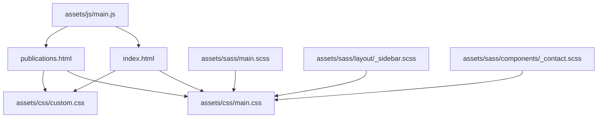
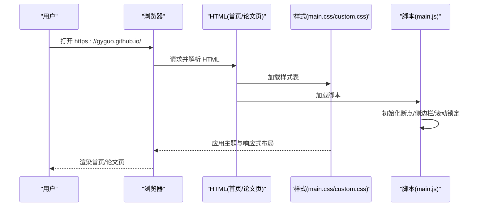
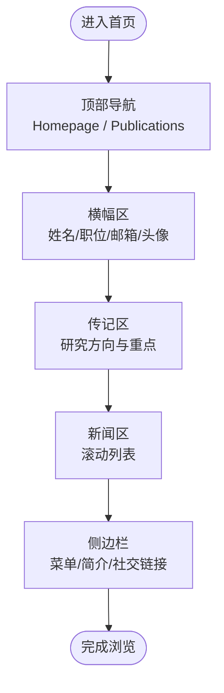
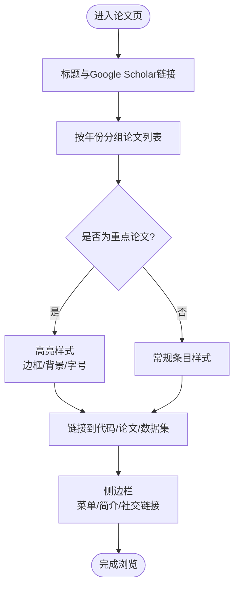
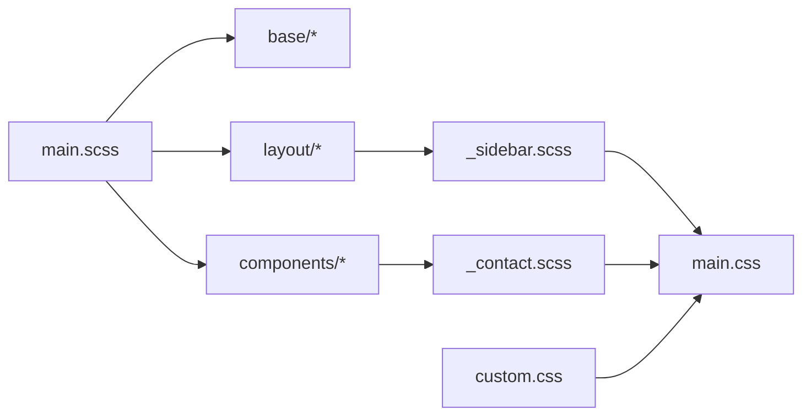
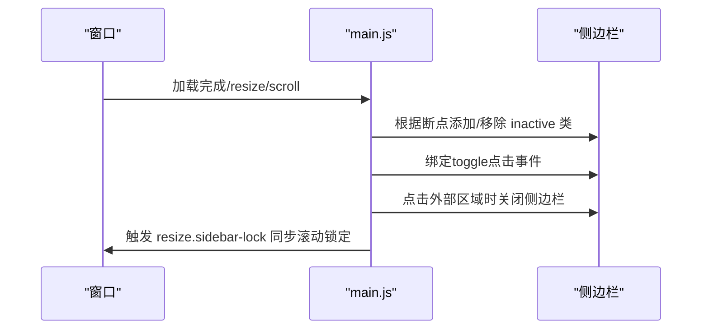
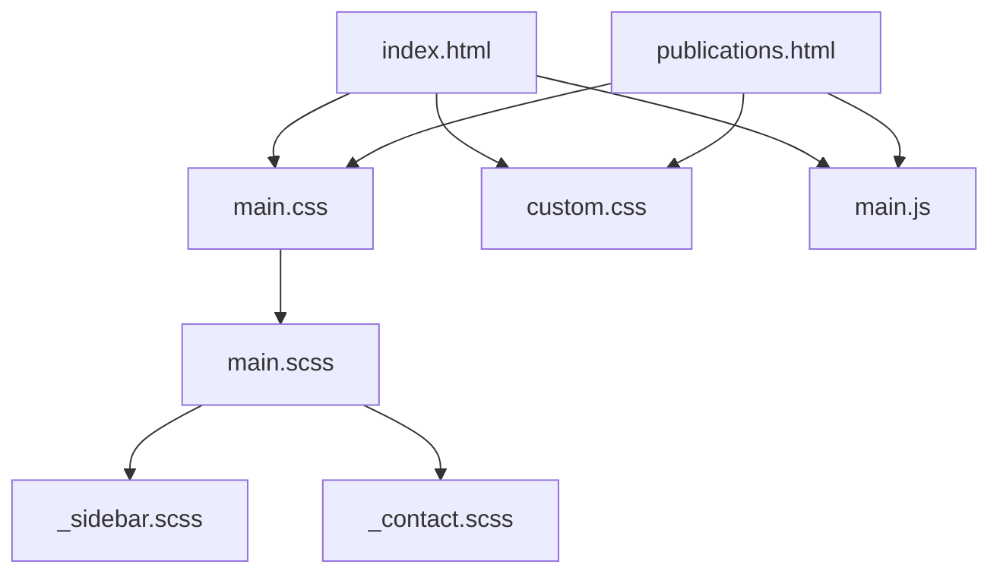

# 项目概述

<cite>
**本文引用的文件**
- [README.md](file://README.md)
- [index.html](file://index.html)
- [publications.html](file://publications.html)
- [assets/sass/main.scss](file://assets/sass/main.scss)
- [assets/css/custom.css](file://assets/css/custom.css)
- [assets/js/main.js](file://assets/js/main.js)
- [assets/sass/layout/_sidebar.scss](file://assets/sass/layout/_sidebar.scss)
- [assets/sass/components/_contact.scss](file://assets/sass/components/_contact.scss)
</cite>

## 目录
1. [简介](#简介)
2. [项目结构](#项目结构)
3. [核心组件](#核心组件)
4. [架构总览](#架构总览)
5. [详细组件分析](#详细组件分析)
6. [依赖关系分析](#依赖关系分析)
7. [性能与可访问性](#性能与可访问性)
8. [故障排查指南](#故障排查指南)
9. [结论](#结论)
10. [附录：快速开始](#附录快速开始)

## 简介
本项目是一个基于 HTML5 UP Editorial 模板构建的静态个人学术主页，用于集中展示郭广宇博士的学术成果、研究经历与联系方式。网站采用响应式布局，适配桌面端与移动端浏览；通过清晰的导航与侧边栏个人信息模块，帮助访客快速了解作者背景、近期新闻与论文列表。

- 项目目的：为学术界与业界同行提供一个简洁、专业、易维护的个人主页，便于传播研究成果与建立学术联系。
- 目标用户：潜在合作者、审稿人、学生与研究人员，以及关注人工智能与医学影像分析的学术社区成员。
- 核心价值：以最小化技术栈实现高可读性与高可维护性的学术名片页，强调内容优先、跨设备一致体验与易于扩展的样式/脚本组织方式。

**章节来源**
- [README.md:1-10](file://README.md#L1-L10)
- [index.html:1-147](file://index.html#L1-L147)
- [publications.html:1-184](file://publications.html#L1-L184)

## 项目结构
项目采用“页面 + 资源”的清晰分层：HTML 页面承载内容与导航，Sass 源文件按 base/components/layout 组织样式，编译后的 CSS 由 main.css 与 custom.css 提供；JavaScript 负责交互与响应式行为。

**图表来源**
- [assets/sass/main.scss:1-62](file://assets/sass/main.scss#L1-L62)
- [assets/sass/layout/_sidebar.scss:1-223](file://assets/sass/layout/_sidebar.scss#L1-L223)
- [assets/sass/components/_contact.scss:1-47](file://assets/sass/components/_contact.scss#L1-L47)
- [assets/js/main.js:1-262](file://assets/js/main.js#L1-L262)
- [index.html:1-147](file://index.html#L1-L147)
- [publications.html:1-184](file://publications.html#L1-L184)

**章节来源**
- [assets/sass/main.scss:1-62](file://assets/sass/main.scss#L1-L62)
- [assets/css/custom.css:1-378](file://assets/css/custom.css#L1-L378)
- [assets/js/main.js:1-262](file://assets/js/main.js#L1-L262)
- [index.html:1-147](file://index.html#L1-L147)
- [publications.html:1-184](file://publications.html#L1-L184)

## 核心组件
- 首页（index.html）
  - 顶部导航：包含“Homepage”与“Publications”入口。
  - 横幅区：展示姓名、当前职位、邮箱与头像。
  - 传记区：简述研究方向与当前重点。
  - 新闻区：滚动列表展示最新录用/入职等动态。
  - 学术服务：列出会议与期刊审稿经历。
  - 侧边栏：菜单、个人简介与社交链接（GitHub、Google Scholar、LinkedIn）。
- 论文页（publications.html）
  - 标题与 Google Scholar 链接。
  - 按年份分组的论文列表，含作者标注、代码/论文链接与突出显示的重要论文。
  - 与首页一致的侧边栏与导航。

这些组件共同构成一个“主内容 + 侧边栏”的经典布局，确保信息密度与可读性平衡。

**章节来源**
- [index.html:20-116](file://index.html#L20-L116)
- [publications.html:20-161](file://publications.html#L20-L161)

## 架构总览
网站为纯静态站点，无后端逻辑。浏览器加载 HTML 后，依次引入样式与脚本，完成渲染与交互。Sass 作为样式开发语言，通过导入基础、组件与布局模块，最终生成 main.css；custom.css 用于覆盖主题配色与个性化排版。main.js 提供断点监听、侧边栏折叠/展开、滚动锁定与移动端优化等交互能力。

**图表来源**
- [index.html:1-147](file://index.html#L1-L147)
- [publications.html:1-184](file://publications.html#L1-L184)
- [assets/sass/main.scss:1-62](file://assets/sass/main.scss#L1-L62)
- [assets/js/main.js:1-262](file://assets/js/main.js#L1-L262)

## 详细组件分析

### 首页（index.html）
- 导航与横幅：提供作者身份与联系方式的快速可见性。
- 传记与新闻：以时间线形式呈现学术进展与职业轨迹。
- 侧边栏：固定于右侧，包含菜单与个人简介，支持移动端折叠。

**图表来源**
- [index.html:20-116](file://index.html#L20-L116)

**章节来源**
- [index.html:20-116](file://index.html#L20-L116)

### 论文页（publications.html）
- 论文列表按年份分组，突出重要发表，并提供代码/论文/GitHub 等外链。
- 作者名加粗标识本人参与，便于快速识别贡献度。

**图表来源**
- [publications.html:27-125](file://publications.html#L27-L125)
- [assets/css/custom.css:311-378](file://assets/css/custom.css#L311-L378)

**章节来源**
- [publications.html:27-125](file://publications.html#L27-L125)
- [assets/css/custom.css:311-378](file://assets/css/custom.css#L311-L378)

### 样式系统（Sass → CSS）
- 入口 main.scss 统一导入基础、组件与布局模块，并定义断点策略，保证响应式一致性。
- layout/_sidebar.scss 控制侧边栏宽度、折叠状态与移动端固定定位行为。
- components/_contact.scss 提供联系人列表的基础样式，配合自定义样式实现侧边栏个人简介。
- custom.css 对主题进行品牌化定制（颜色、间距、滚动条、新闻与论文列表样式）。

**图表来源**
- [assets/sass/main.scss:1-62](file://assets/sass/main.scss#L1-L62)
- [assets/sass/layout/_sidebar.scss:1-223](file://assets/sass/layout/_sidebar.scss#L1-L223)
- [assets/sass/components/_contact.scss:1-47](file://assets/sass/components/_contact.scss#L1-L47)

**章节来源**
- [assets/sass/main.scss:1-62](file://assets/sass/main.scss#L1-L62)
- [assets/sass/layout/_sidebar.scss:1-223](file://assets/sass/layout/_sidebar.scss#L1-L223)
- [assets/sass/components/_contact.scss:1-47](file://assets/sass/components/_contact.scss#L1-L47)
- [assets/css/custom.css:1-378](file://assets/css/custom.css#L1-L378)

### 交互与响应式（main.js）
- 断点管理：与 Sass 断点对齐，驱动不同屏幕下的布局切换。
- 侧边栏：在 <=large 时默认隐藏，可通过 toggle 按钮展开；点击外部区域或链接自动收起。
- 滚动锁定：在大屏下保持侧边栏内容可视高度稳定，避免抖动。
- 兼容处理：针对不支持 object-fit 的浏览器回退为背景图方案。

**图表来源**
- [assets/js/main.js:13-23](file://assets/js/main.js#L13-L23)
- [assets/js/main.js:72-164](file://assets/js/main.js#L72-L164)
- [assets/js/main.js:166-235](file://assets/js/main.js#L166-L235)

**章节来源**
- [assets/js/main.js:13-23](file://assets/js/main.js#L13-L23)
- [assets/js/main.js:72-164](file://assets/js/main.js#L72-L164)
- [assets/js/main.js:166-235](file://assets/js/main.js#L166-L235)

## 依赖关系分析
- 页面依赖：两个 HTML 页面均引入 main.css 与 custom.css，并在底部加载 jQuery、browser.min、breakpoints.min、util.js、main.js。
- 样式依赖：main.scss 聚合基础、组件与布局模块；custom.css 覆盖主题色与个性化细节。
- 交互依赖：main.js 依赖 jQuery 与第三方工具库（browser、breakpoints、util），实现响应式与侧边栏行为。

**图表来源**
- [index.html:1-147](file://index.html#L1-L147)
- [publications.html:1-184](file://publications.html#L1-L184)
- [assets/sass/main.scss:1-62](file://assets/sass/main.scss#L1-L62)
- [assets/js/main.js:1-262](file://assets/js/main.js#L1-L262)

**章节来源**
- [index.html:1-147](file://index.html#L1-L147)
- [publications.html:1-184](file://publications.html#L1-L184)
- [assets/sass/main.scss:1-62](file://assets/sass/main.scss#L1-L62)
- [assets/js/main.js:1-262](file://assets/js/main.js#L1-L262)

## 性能与可访问性
- 性能
  - 静态资源：CSS/JS 均为轻量级，利于快速首屏渲染。
  - 图片：横幅头像使用固定尺寸与裁剪策略，减少重排。
  - 滚动列表：新闻区采用局部滚动容器，避免长列表导致的主线程阻塞。
- 可访问性
  - 语义化标签与清晰的标题层级提升阅读体验。
  - 链接具备明确文本描述，便于辅助技术识别。
  - 响应式断点确保小屏下内容仍可被完整访问。

[本节为通用指导，不直接分析具体文件]

## 故障排查指南
- 侧边栏在小屏无法展开
  - 检查 main.js 中断点与 inactive 类切换逻辑是否正常执行。
  - 确认浏览器控制台是否有 jQuery 或第三方库加载错误。
- 图片显示异常
  - 若浏览器不支持 object-fit，main.js 会回退为背景图方案；请检查图片路径与容器尺寸。
- 样式未生效
  - 确认 main.css 与 custom.css 已正确加载且未被缓存；检查浏览器开发者工具的 Network 面板。
- 链接跳转问题
  - 侧边栏在移动端点击链接后会先收起再跳转；如出现延迟，检查事件冒泡与 setTimeout 调用。

**章节来源**
- [assets/js/main.js:72-164](file://assets/js/main.js#L72-L164)
- [assets/js/main.js:166-235](file://assets/js/main.js#L166-L235)
- [assets/css/custom.css:29-101](file://assets/css/custom.css#L29-L101)

## 结论
该项目以极简技术栈实现了专业、美观且易维护的个人学术主页。通过清晰的页面结构与模块化样式/脚本组织，既保证了跨设备的优秀体验，也为后续扩展（新增页面、更新内容、调整主题）提供了良好基础。建议持续保持内容时效性，并遵循现有命名与目录约定，以确保长期可维护性。

[本节为总结性内容，不直接分析具体文件]

## 附录：快速开始
- 访问网站
  - 直接在浏览器中打开 https://gyguo.github.io/ 即可浏览首页与论文页。
- 本地预览
  - 将仓库克隆至本地，使用任意静态服务器（如 VS Code Live Server、Python http.server）打开 index.html 或 publications.html 进行预览。
- 修改内容
  - 更新 index.html 中的传记、新闻与侧边栏信息；更新 publications.html 中的论文条目。
  - 如需调整外观，编辑 assets/css/custom.css；如需重构样式，修改 assets/sass 对应模块后重新编译为 CSS。
- 发布更新
  - 提交更改至 GitHub，GitHub Pages 会自动部署最新版本。

**章节来源**
- [README.md:1-10](file://README.md#L1-L10)
- [index.html:1-147](file://index.html#L1-L147)
- [publications.html:1-184](file://publications.html#L1-L184)
- [assets/css/custom.css:1-378](file://assets/css/custom.css#L1-L378)