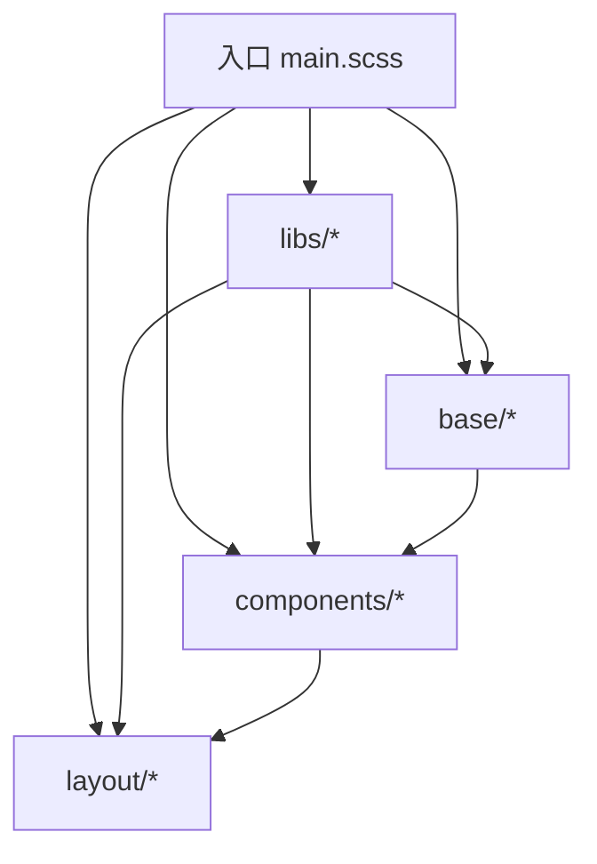
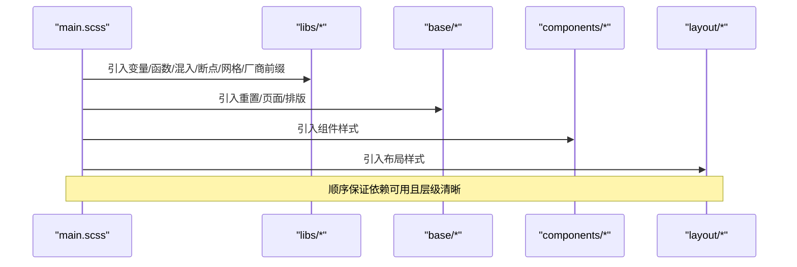
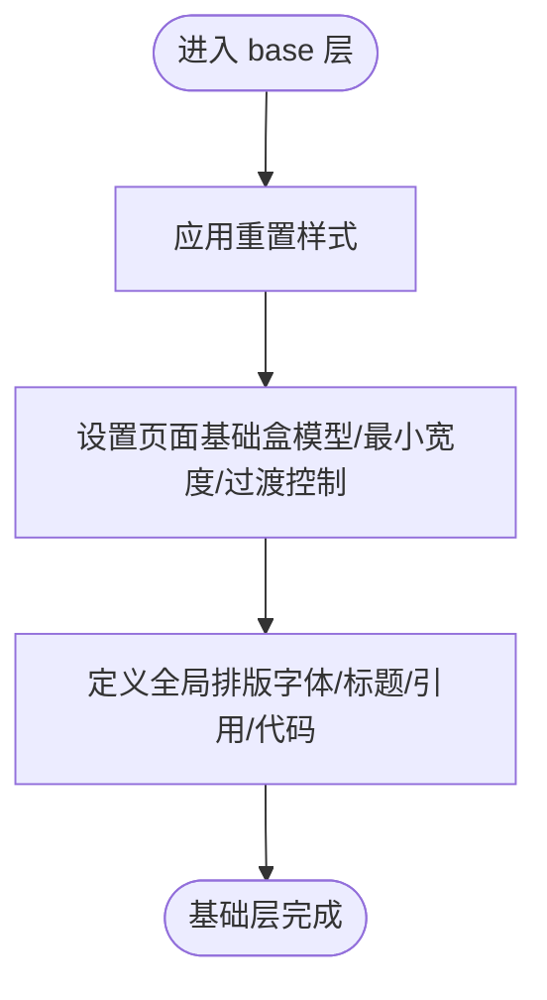
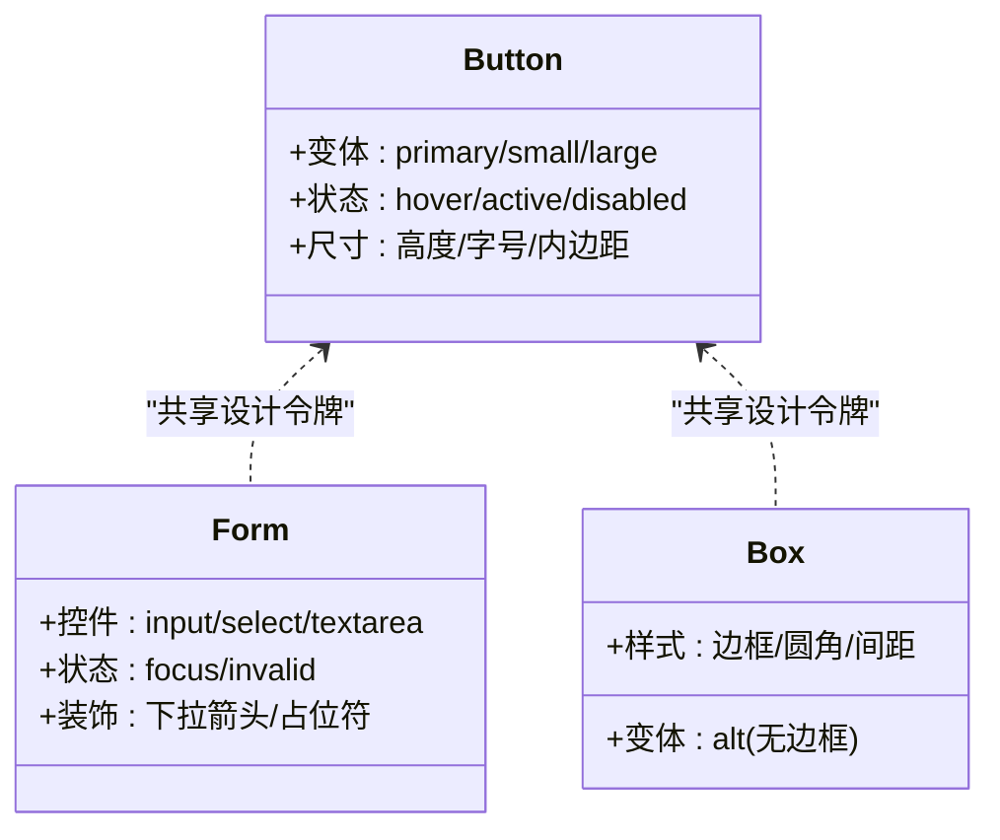
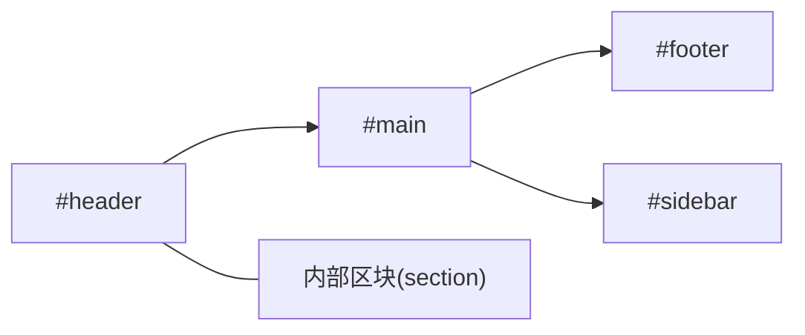
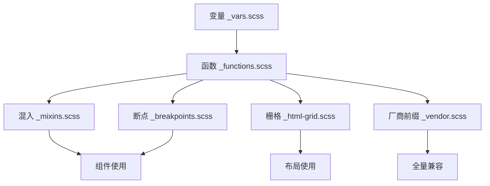
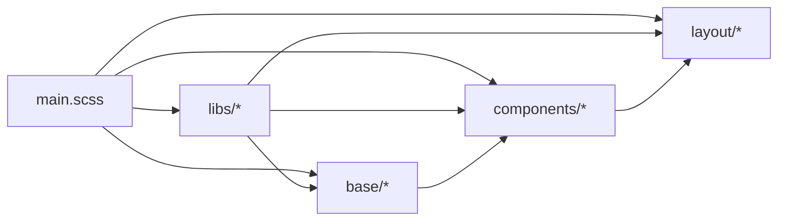

# Sass模块化架构

<cite>
**本文引用的文件**
- [assets/sass/main.scss](file://assets/sass/main.scss)
- [assets/sass/base/_reset.scss](file://assets/sass/base/_reset.scss)
- [assets/sass/base/_page.scss](file://assets/sass/base/_page.scss)
- [assets/sass/base/_typography.scss](file://assets/sass/base/_typography.scss)
- [assets/sass/components/_button.scss](file://assets/sass/components/_button.scss)
- [assets/sass/components/_form.scss](file://assets/sass/components/_form.scss)
- [assets/sass/components/_box.scss](file://assets/sass/components/_box.scss)
- [assets/sass/layout/_header.scss](file://assets/sass/layout/_header.scss)
- [assets/sass/layout/_footer.scss](file://assets/sass/layout/_footer.scss)
- [assets/sass/layout/_main.scss](file://assets/sass/layout/_main.scss)
- [assets/sass/libs/_vars.scss](file://assets/sass/libs/_vars.scss)
- [assets/sass/libs/_functions.scss](file://assets/sass/libs/_functions.scss)
- [assets/sass/libs/_mixins.scss](file://assets/sass/libs/_mixins.scss)
- [assets/sass/libs/_breakpoints.scss](file://assets/sass/libs/_breakpoints.scss)
- [assets/sass/libs/_html-grid.scss](file://assets/sass/libs/_html-grid.scss)
- [assets/sass/libs/_vendor.scss](file://assets/sass/libs/_vendor.scss)
</cite>

## 目录
1. [简介](#简介)
2. [项目结构](#项目结构)
3. [核心组件](#核心组件)
4. [架构总览](#架构总览)
5. [详细组件分析](#详细组件分析)
6. [依赖关系分析](#依赖关系分析)
7. [性能考量](#性能考量)
8. [故障排查指南](#故障排查指南)
9. [结论](#结论)
10. [附录](#附录)

## 简介
本文件面向希望理解与扩展该站点样式系统的开发者，系统化阐述基于Sass的模块化架构。文档围绕四个核心模块（base、components、layout、libs）的职责边界、相互依赖与组合方式展开，并以入口文件 main.scss 的导入顺序为主线，解释样式从“基础层”到“组件层”再到“布局层”的装配流程。同时提供可视化图表与使用示例，帮助快速上手与二次开发。

## 项目结构
样式代码位于 assets/sass 目录下，采用分层组织：
- libs：工具与基础设施（变量、函数、混入、断点、网格、厂商前缀等）
- base：全局重置、页面基础、排版等基础样式
- components：可复用的UI组件（按钮、表单、盒子、列表、图标、分页等）
- layout：页面级布局区块（包装器、主内容区、侧边栏、头部、横幅、页脚、菜单）
- main.scss：统一入口，按固定顺序引入各模块，确保编译产物的一致性与可维护性

图示来源
- [assets/sass/main.scss:1-62](file://assets/sass/main.scss#L1-L62)

章节来源
- [assets/sass/main.scss:1-62](file://assets/sass/main.scss#L1-L62)

## 核心组件
- libs（基础设施）
  - _vars.scss：集中管理主题色板、字号/字重、间距、尺寸、动画时长等设计令牌
  - _functions.scss：提供取值函数（如 _palette、_size、_font、_duration），统一访问设计令牌
  - _mixins.scss：通用混入（图标、内边距计算、SVG数据URL编码等）
  - _breakpoints.scss：断点系统，支持命名断点与媒体查询封装
  - _html-grid.scss：响应式栅格混入，生成列宽、偏移、间距等类
  - _vendor.scss：自动为CSS属性与值添加厂商前缀，提升兼容性
- base（基础样式）
  - _reset.scss：浏览器默认样式重置，统一行为
  - _page.scss：页面级基础设置（盒模型、最小宽度、加载态控制等）
  - _typography.scss：全局排版（字体、行高、标题、引用、代码块、对齐等）
- components（组件）
  - _button.scss：按钮样式与变体（主次、尺寸、禁用态等）
  - _form.scss：表单控件样式（输入框、选择框、单选/多选、焦点态等）
  - _box.scss：通用容器卡片样式
  - 其他组件（row、section、icon、image、list、actions、icons、contact、pagination、table、mini-posts、features、posts）：按职责拆分，便于复用与组合
- layout（布局）
  - _wrapper.scss：页面整体包裹容器
  - _main.scss：主内容区域与内边距、分节分隔线
  - _sidebar.scss：侧边栏布局
  - _header.scss：头部区域（Logo、社交图标等）
  - _banner.scss：横幅区域
  - _footer.scss：页脚版权信息
  - _menu.scss：导航菜单

章节来源
- [assets/sass/libs/_vars.scss:1-44](file://assets/sass/libs/_vars.scss#L1-L44)
- [assets/sass/libs/_functions.scss:1-90](file://assets/sass/libs/_functions.scss#L1-L90)
- [assets/sass/libs/_mixins.scss:1-78](file://assets/sass/libs/_mixins.scss#L1-L78)
- [assets/sass/libs/_breakpoints.scss:1-223](file://assets/sass/libs/_breakpoints.scss#L1-L223)
- [assets/sass/libs/_html-grid.scss:1-149](file://assets/sass/libs/_html-grid.scss#L1-L149)
- [assets/sass/libs/_vendor.scss:1-376](file://assets/sass/libs/_vendor.scss#L1-L376)
- [assets/sass/base/_reset.scss:1-76](file://assets/sass/base/_reset.scss#L1-L76)
- [assets/sass/base/_page.scss:1-48](file://assets/sass/base/_page.scss#L1-L48)
- [assets/sass/base/_typography.scss:1-187](file://assets/sass/base/_typography.scss#L1-L187)
- [assets/sass/components/_button.scss:1-85](file://assets/sass/components/_button.scss#L1-L85)
- [assets/sass/components/_form.scss:1-179](file://assets/sass/components/_form.scss#L1-L179)
- [assets/sass/components/_box.scss:1-26](file://assets/sass/components/_box.scss#L1-L26)
- [assets/sass/layout/_header.scss:1-51](file://assets/sass/layout/_header.scss#L1-L51)
- [assets/sass/layout/_footer.scss:1-18](file://assets/sass/layout/_footer.scss#L1-L18)
- [assets/sass/layout/_main.scss:1-58](file://assets/sass/layout/_main.scss#L1-L58)

## 架构总览
入口文件 main.scss 的导入顺序体现了清晰的层次：
1) 先引入 libs 下的所有工具与基础设施（变量、函数、混入、断点、网格、厂商前缀）
2) 再引入 base 基础样式（重置、页面、排版）
3) 然后引入 components 组件样式（原子/分子级UI）
4) 最后引入 layout 布局样式（页面骨架与区块）

这种顺序确保了：
- 组件与布局可以安全地消费基础变量与混入
- 布局层能覆盖或组合组件样式，形成最终页面结构
- 通过断点与栅格实现一致的响应式体验

图示来源
- [assets/sass/main.scss:1-62](file://assets/sass/main.scss#L1-L62)

章节来源
- [assets/sass/main.scss:1-62](file://assets/sass/main.scss#L1-L62)

## 详细组件分析

### 基础层（base）
- 重置（_reset.scss）
  - 作用：统一浏览器默认样式，消除差异
  - 关键点：元素显示模式、列表样式、表格边框折叠、输入框外观统一
- 页面（_page.scss）
  - 作用：设置全局盒模型、最小宽度、加载/缩放时的过渡控制
  - 关键点：border-box 继承、移动端最小宽度保障
- 排版（_typography.scss）
  - 作用：定义全局字体、字号、行高、标题层级、引用与代码块样式
  - 关键点：使用 _font 与 _size 获取设计令牌；响应式字号调整

图示来源
- [assets/sass/base/_reset.scss:1-76](file://assets/sass/base/_reset.scss#L1-L76)
- [assets/sass/base/_page.scss:1-48](file://assets/sass/base/_page.scss#L1-L48)
- [assets/sass/base/_typography.scss:1-187](file://assets/sass/base/_typography.scss#L1-L187)

章节来源
- [assets/sass/base/_reset.scss:1-76](file://assets/sass/base/_reset.scss#L1-L76)
- [assets/sass/base/_page.scss:1-48](file://assets/sass/base/_page.scss#L1-L48)
- [assets/sass/base/_typography.scss:1-187](file://assets/sass/base/_typography.scss#L1-L187)

### 组件层（components）
- 按钮（_button.scss）
  - 作用：统一的按钮视觉与交互状态（悬停、激活、禁用、主次、尺寸）
  - 关键点：使用 _palette 与 _size 保持一致；transition 平滑过渡
- 表单（_form.scss）
  - 作用：输入框、选择框、单选/复选框的统一样式与焦点态
  - 关键点：自定义下拉箭头（SVG data URL）、占位符颜色、聚焦高亮
- 盒子（_box.scss）
  - 作用：通用卡片容器，提供边框、圆角、间距与可选的无边框变体

图示来源
- [assets/sass/components/_button.scss:1-85](file://assets/sass/components/_button.scss#L1-L85)
- [assets/sass/components/_form.scss:1-179](file://assets/sass/components/_form.scss#L1-L179)
- [assets/sass/components/_box.scss:1-26](file://assets/sass/components/_box.scss#L1-L26)

章节来源
- [assets/sass/components/_button.scss:1-85](file://assets/sass/components/_button.scss#L1-L85)
- [assets/sass/components/_form.scss:1-179](file://assets/sass/components/_form.scss#L1-L179)
- [assets/sass/components/_box.scss:1-26](file://assets/sass/components/_box.scss#L1-L26)

### 布局层（layout）
- 头部（_header.scss）
  - 作用：顶部区域布局（Logo、社交图标），响应式调整
- 主内容（_main.scss）
  - 作用：主体区域与内边距、分节分隔线，响应式适配
- 页脚（_footer.scss）
  - 作用：版权信息与链接样式

图示来源
- [assets/sass/layout/_header.scss:1-51](file://assets/sass/layout/_header.scss#L1-L51)
- [assets/sass/layout/_main.scss:1-58](file://assets/sass/layout/_main.scss#L1-L58)
- [assets/sass/layout/_footer.scss:1-18](file://assets/sass/layout/_footer.scss#L1-L18)

章节来源
- [assets/sass/layout/_header.scss:1-51](file://assets/sass/layout/_header.scss#L1-L51)
- [assets/sass/layout/_main.scss:1-58](file://assets/sass/layout/_main.scss#L1-L58)
- [assets/sass/layout/_footer.scss:1-18](file://assets/sass/layout/_footer.scss#L1-L18)

### 工具层（libs）
- 变量（_vars.scss）
  - 作用：集中管理主题色板、字体、尺寸、间距、动画时长等
- 函数（_functions.scss）
  - 作用：提供 _palette/_size/_font/_duration 等取值函数，统一访问变量
- 混入（_mixins.scss）
  - 作用：图标混入、内边距计算、SVG数据URL编码等
- 断点（_breakpoints.scss）
  - 作用：定义命名断点，封装 @media 查询，简化响应式写法
- 栅格（_html-grid.scss）
  - 作用：生成12列栅格、偏移、间距与对齐类
- 厂商前缀（_vendor.scss）
  - 作用：自动为属性与值添加厂商前缀，提升兼容性

图示来源
- [assets/sass/libs/_vars.scss:1-44](file://assets/sass/libs/_vars.scss#L1-L44)
- [assets/sass/libs/_functions.scss:1-90](file://assets/sass/libs/_functions.scss#L1-L90)
- [assets/sass/libs/_mixins.scss:1-78](file://assets/sass/libs/_mixins.scss#L1-L78)
- [assets/sass/libs/_breakpoints.scss:1-223](file://assets/sass/libs/_breakpoints.scss#L1-L223)
- [assets/sass/libs/_html-grid.scss:1-149](file://assets/sass/libs/_html-grid.scss#L1-L149)
- [assets/sass/libs/_vendor.scss:1-376](file://assets/sass/libs/_vendor.scss#L1-L376)

章节来源
- [assets/sass/libs/_vars.scss:1-44](file://assets/sass/libs/_vars.scss#L1-L44)
- [assets/sass/libs/_functions.scss:1-90](file://assets/sass/libs/_functions.scss#L1-L90)
- [assets/sass/libs/_mixins.scss:1-78](file://assets/sass/libs/_mixins.scss#L1-L78)
- [assets/sass/libs/_breakpoints.scss:1-223](file://assets/sass/libs/_breakpoints.scss#L1-L223)
- [assets/sass/libs/_html-grid.scss:1-149](file://assets/sass/libs/_html-grid.scss#L1-L149)
- [assets/sass/libs/_vendor.scss:1-376](file://assets/sass/libs/_vendor.scss#L1-L376)

## 依赖关系分析
- 入口依赖
  - main.scss 依次引入 libs → base → components → layout，确保依赖可用
- 组件依赖
  - 组件普遍依赖 libs 的设计令牌与混入（如 _palette、_size、_font、_duration、_breakpoint、_vendor）
- 布局依赖
  - 布局层依赖 base 的基础样式与 libs 的栅格/断点能力
- 基础层依赖
  - base 层仅依赖 libs 的设计令牌与混入，不依赖组件与布局

图示来源
- [assets/sass/main.scss:1-62](file://assets/sass/main.scss#L1-L62)
- [assets/sass/libs/_functions.scss:1-90](file://assets/sass/libs/_functions.scss#L1-L90)
- [assets/sass/libs/_breakpoints.scss:1-223](file://assets/sass/libs/_breakpoints.scss#L1-L223)
- [assets/sass/libs/_html-grid.scss:1-149](file://assets/sass/libs/_html-grid.scss#L1-L149)
- [assets/sass/base/_typography.scss:1-187](file://assets/sass/base/_typography.scss#L1-L187)
- [assets/sass/components/_button.scss:1-85](file://assets/sass/components/_button.scss#L1-L85)
- [assets/sass/layout/_main.scss:1-58](file://assets/sass/layout/_main.scss#L1-L58)

章节来源
- [assets/sass/main.scss:1-62](file://assets/sass/main.scss#L1-L62)
- [assets/sass/libs/_functions.scss:1-90](file://assets/sass/libs/_functions.scss#L1-L90)
- [assets/sass/libs/_breakpoints.scss:1-223](file://assets/sass/libs/_breakpoints.scss#L1-L223)
- [assets/sass/libs/_html-grid.scss:1-149](file://assets/sass/libs/_html-grid.scss#L1-L149)
- [assets/sass/base/_typography.scss:1-187](file://assets/sass/base/_typography.scss#L1-L187)
- [assets/sass/components/_button.scss:1-85](file://assets/sass/components/_button.scss#L1-L85)
- [assets/sass/layout/_main.scss:1-58](file://assets/sass/layout/_main.scss#L1-L58)

## 性能考量
- 合理分层减少重复：将公共样式放入 base/libs，避免在各组件中重复定义
- 使用断点与栅格：通过 _breakpoints 与 _html-grid 减少冗余媒体查询与宽度计算
- 控制样式体积：按需引入组件，避免未使用的样式被打包进生产构建
- 利用混入与函数：通过 _mixins 与 _functions 统一处理厂商前缀与取值逻辑，降低维护成本
- 优化渲染路径：基础层先行，组件与布局后加载，有助于浏览器尽早解析关键样式

[本节为通用指导，无需特定文件来源]

## 故障排查指南
- 样式未生效
  - 检查 main.scss 的导入顺序是否正确（libs → base → components → layout）
  - 确认组件是否使用了正确的类名与变体
- 响应式异常
  - 核对断点名称是否在 _breakpoints 中正确定义
  - 检查是否误用媒体查询语法
- 主题不一致
  - 统一通过 _palette/_size/_font 等函数访问设计令牌，避免硬编码颜色与尺寸
- 表单样式错乱
  - 检查是否覆盖了默认的 appearance 与焦点态样式
  - 确认下拉箭头与占位符样式未被第三方库覆盖
- 兼容性问题
  - 确认 vendor 混入已启用，必要时在 _vendor.scss 中补充需要前缀的属性或值

章节来源
- [assets/sass/main.scss:1-62](file://assets/sass/main.scss#L1-L62)
- [assets/sass/libs/_breakpoints.scss:1-223](file://assets/sass/libs/_breakpoints.scss#L1-L223)
- [assets/sass/libs/_vendor.scss:1-376](file://assets/sass/libs/_vendor.scss#L1-L376)
- [assets/sass/components/_form.scss:1-179](file://assets/sass/components/_form.scss#L1-L179)

## 结论
本项目采用清晰的Sass分层架构：以 libs 为基础设施，base 提供全局基础样式，components 实现可复用UI，layout 负责页面级布局。入口文件 main.scss 的导入顺序保证了依赖的正确性与样式的可维护性。借助断点、栅格与设计令牌，系统具备良好的可扩展性与一致性，适合持续迭代与团队协作。

[本节为总结性内容，无需特定文件来源]

## 附录
- 使用示例（概念性）
  - 创建一个按钮：在HTML中使用 .button 类，并附加 primary/small/large 等修饰类以获得不同样式
  - 构建一个表单：使用 form、input、select、textarea 等元素，结合组件样式获得一致的外观与交互
  - 搭建页面布局：使用 #header、#main、#footer 等布局容器，配合 section 划分内容区块
  - 响应式布局：利用栅格类（如 col-*）与断点混入，在不同屏幕尺寸下调整布局

[本节为概念性说明，无需特定文件来源]