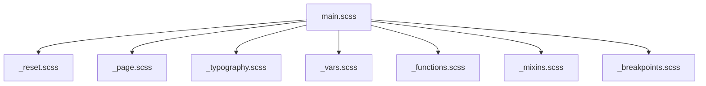
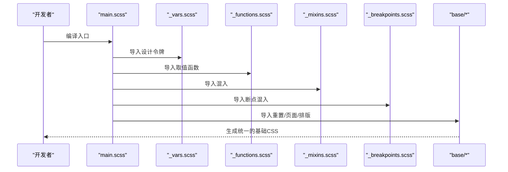
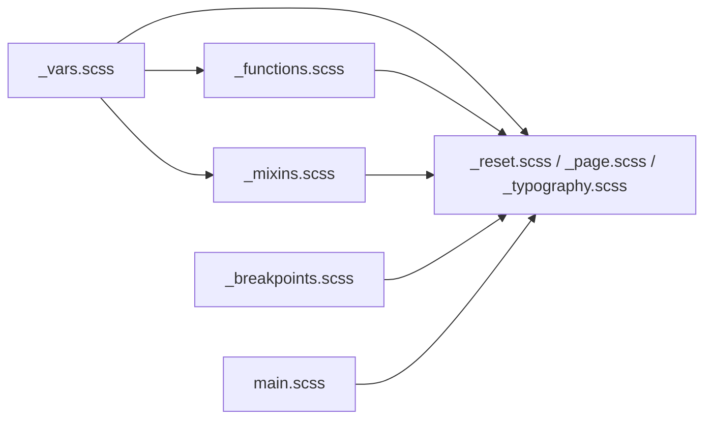

# 基础样式模块

<cite>
**本文引用的文件**
- [assets/sass/base/_reset.scss](file://assets/sass/base/_reset.scss)
- [assets/sass/base/_page.scss](file://assets/sass/base/_page.scss)
- [assets/sass/base/_typography.scss](file://assets/sass/base/_typography.scss)
- [assets/sass/libs/_vars.scss](file://assets/sass/libs/_vars.scss)
- [assets/sass/libs/_functions.scss](file://assets/sass/libs/_functions.scss)
- [assets/sass/libs/_mixins.scss](file://assets/sass/libs/_mixins.scss)
- [assets/sass/libs/_breakpoints.scss](file://assets/sass/libs/_breakpoints.scss)
- [assets/sass/main.scss](file://assets/sass/main.scss)
</cite>

## 目录
1. [简介](#简介)
2. [项目结构](#项目结构)
3. [核心组件](#核心组件)
4. [架构总览](#架构总览)
5. [详细组件分析](#详细组件分析)
6. [依赖关系分析](#依赖关系分析)
7. [性能考量](#性能考量)
8. [故障排查指南](#故障排查指南)
9. [结论](#结论)
10. [附录：使用与自定义指南](#附录使用与自定义指南)

## 简介
本模块为网站提供统一的视觉基线与基础排版能力，涵盖 CSS 重置、页面基础设置以及字体与文本样式。通过集中管理颜色变量、字体栈、基础间距和响应式断点，确保全站风格一致且易于扩展。

## 项目结构
基础样式位于 assets/sass/base 目录下，由三个文件组成：
- _reset.scss：浏览器默认样式的统一重置
- _page.scss：页面级基础设置（盒模型、背景、最小宽度、动画控制）
- _typography.scss：全局字体、字号、行高、标题层级、引用、代码块、分割线及文本对齐

这些文件在 assets/sass/main.scss 中按顺序引入，并依赖 libs 下的变量、函数、混入与断点系统。

图表来源
- [assets/sass/main.scss:1-33](file://assets/sass/main.scss#L1-L33)

章节来源
- [assets/sass/main.scss:1-33](file://assets/sass/main.scss#L1-L33)

## 核心组件
- 变量与工具
  - 颜色、尺寸、字体、时长等设计令牌集中在变量文件中，并通过函数以命名方式访问，便于全局统一管理。
- 响应式断点
  - 通过断点混入将媒体查询抽象为语义化名称，使样式在不同屏幕下可预测地变化。
- 基础重置
  - 消除浏览器默认差异，统一元素行为，减少后续样式冲突。
- 页面基础
  - 设定全局盒模型、背景、最小宽度与加载/缩放时的动画冻结策略。
- 排版基础
  - 定义正文、链接、标题、引用、代码、分割线等通用文本样式，并提供对齐辅助类。

章节来源
- [assets/sass/libs/_vars.scss:1-44](file://assets/sass/libs/_vars.scss#L1-L44)
- [assets/sass/libs/_functions.scss:57-90](file://assets/sass/libs/_functions.scss#L57-L90)
- [assets/sass/libs/_breakpoints.scss:17-27](file://assets/sass/libs/_breakpoints.scss#L17-L27)
- [assets/sass/base/_reset.scss:10-76](file://assets/sass/base/_reset.scss#L10-L76)
- [assets/sass/base/_page.scss:19-48](file://assets/sass/base/_page.scss#L19-L48)
- [assets/sass/base/_typography.scss:9-187](file://assets/sass/base/_typography.scss#L9-L187)

## 架构总览
基础样式通过“变量 + 函数 + 混入”的体系，配合“重置 + 页面 + 排版”的分层组织，形成稳定的前端样式基座。main.scss 作为入口，依次引入库与基础样式，保证编译顺序与依赖正确。

图表来源
- [assets/sass/main.scss:1-33](file://assets/sass/main.scss#L1-L33)
- [assets/sass/libs/_vars.scss:1-44](file://assets/sass/libs/_vars.scss#L1-L44)
- [assets/sass/libs/_functions.scss:57-90](file://assets/sass/libs/_functions.scss#L57-L90)
- [assets/sass/libs/_mixins.scss:1-78](file://assets/sass/libs/_mixins.scss#L1-L78)
- [assets/sass/libs/_breakpoints.scss:17-27](file://assets/sass/libs/_breakpoints.scss#L17-L27)

## 详细组件分析

### CSS 重置规则（_reset.scss）
职责
- 统一所有常见 HTML 元素的 margin、padding、border、font-size、vertical-align，消除浏览器默认差异。
- 将语义化标签（如 article、aside、nav 等）设置为 block，便于布局。
- 移除列表默认样式、引号伪元素、表格边框折叠与间距。
- 禁用输入框的浏览器原生外观，保证表单控件一致性。
- 针对移动端优化 text-size-adjust，避免自动缩放影响布局。

关键点
- 采用广泛覆盖的选择器集合，一次性重置大量元素。
- 对 blockquote/q 的伪元素进行清理，避免多余内容。
- 对 input/select/textarea 去除浏览器默认外观，便于主题定制。

章节来源
- [assets/sass/base/_reset.scss:10-76](file://assets/sass/base/_reset.scss#L10-L76)

### 页面基础样式（_page.scss）
职责
- 为 IE/Edge 兼容设置视口与滚动条样式，防止滚动条遮挡内容。
- 在小屏设备上限制 html/body 的最小宽度，避免过窄导致布局错乱。
- 将 box-sizing 设为 border-box，并继承到所有元素，简化尺寸计算。
- 设置 body 背景色，并在 is-preload/is-resizing 状态下暂停所有过渡与动画，提升首屏体验。

关键点
- 使用断点混入限定最小宽度，保障可读性。
- 通过全局状态类控制动画，避免加载或窗口缩放时闪烁。

章节来源
- [assets/sass/base/_page.scss:19-48](file://assets/sass/base/_page.scss#L19-L48)

### 字体、排版与文本样式（_typography.scss）
职责
- 定义正文、输入、选择、文本域的字体族、字号、字重、行高，并按断点调整字号。
- 链接样式包含下划线与悬停效果，强调交互反馈。
- 标题 h1-h6 使用独立的标题字体族与字重，保持层级清晰；标题内链接去除装饰。
- 引用块使用左侧边框与斜体，增强引用语义。
- 代码与预格式化代码块使用等宽字体，提供内联与块级两种展示方式。
- 分割线 hr 提供常规与加粗两种间距变体。
- 提供 align-left/align-center/align-right 文本对齐辅助类。

关键点
- 字号随断点递减，适配不同屏幕。
- 标题与正文使用不同的字体族，强化信息层次。
- 代码相关样式兼顾可读性与可滚动性。

章节来源
- [assets/sass/base/_typography.scss:9-187](file://assets/sass/base/_typography.scss#L9-L187)

### 设计令牌与工具（_vars.scss, _functions.scss, _mixins.scss）
职责
- 变量集中管理颜色、尺寸、字体、时长等设计令牌。
- 函数提供安全的取值方式，如获取调色板、字体、尺寸、时长等。
- 混入封装常用模式，如 padding 混入考虑 element-margin，避免重复计算。

关键点
- 通过 _palette/_font/_size/_duration 等函数读取变量，提高可维护性。
- 断点混入屏蔽复杂 media query 语法，使用语义化名称。

章节来源
- [assets/sass/libs/_vars.scss:1-44](file://assets/sass/libs/_vars.scss#L1-L44)
- [assets/sass/libs/_functions.scss:57-90](file://assets/sass/libs/_functions.scss#L57-L90)
- [assets/sass/libs/_mixins.scss:40-59](file://assets/sass/libs/_mixins.scss#L40-L59)

### 响应式断点配置（_breakpoints.scss 与 main.scss）
职责
- 在 main.scss 中注册断点名称与像素范围，供 @include breakpoint(...) 使用。
- 断点混入根据传入的名称与操作符生成对应的媒体查询。

关键点
- 支持 >=、<=、>、<、! 等操作符，灵活组合条件。
- 小屏设备（xxsmall）用于处理极小屏幕的最小宽度限制。

章节来源
- [assets/sass/main.scss:18-27](file://assets/sass/main.scss#L18-L27)
- [assets/sass/libs/_breakpoints.scss:17-27](file://assets/sass/libs/_breakpoints.scss#L17-L27)

## 依赖关系分析
- main.scss 是编译入口，按序引入 libs 与 base/components/layout。
- base 下的三个文件依赖 libs 中的变量、函数与断点混入。
- 各基础样式之间无直接相互依赖，但共享同一套设计令牌与断点。

图表来源
- [assets/sass/main.scss:1-33](file://assets/sass/main.scss#L1-L33)
- [assets/sass/libs/_vars.scss:1-44](file://assets/sass/libs/_vars.scss#L1-L44)
- [assets/sass/libs/_functions.scss:57-90](file://assets/sass/libs/_functions.scss#L57-L90)
- [assets/sass/libs/_mixins.scss:1-78](file://assets/sass/libs/_mixins.scss#L1-L78)
- [assets/sass/libs/_breakpoints.scss:17-27](file://assets/sass/libs/_breakpoints.scss#L17-L27)

章节来源
- [assets/sass/main.scss:1-33](file://assets/sass/main.scss#L1-L33)

## 性能考量
- 首屏动画冻结：在 is-preload/is-resizing 状态下暂停过渡与动画，减少渲染抖动。
- 盒模型统一：border-box 降低尺寸计算复杂度，减少回排回绘。
- 响应式字号：通过断点逐步减小字号，避免在小屏上出现溢出与换行过多。
- 代码块滚动：pre/code 启用横向滚动，避免长代码破坏布局。

[本节为通用指导，不直接分析具体文件]

## 故障排查指南
- 链接下划线异常
  - 检查是否被其他样式覆盖；确认链接样式来自基础排版模块。
  - 参考路径：[assets/sass/base/_typography.scss:29-46](file://assets/sass/base/_typography.scss#L29-L46)
- 标题内链接仍带下划线
  - 确认标题内链接已去除装饰；若未生效，检查优先级与覆盖情况。
  - 参考路径：[assets/sass/base/_typography.scss:61-73](file://assets/sass/base/_typography.scss#L61-L73)
- 小屏布局过窄
  - 确认最小宽度限制是否生效；检查断点配置是否正确。
  - 参考路径：[assets/sass/base/_page.scss:19-24](file://assets/sass/base/_page.scss#L19-L24), [assets/sass/main.scss:18-27](file://assets/sass/main.scss#L18-L27)
- 表单控件样式不一致
  - 确认已应用 appearance 重置；检查浏览器兼容性。
  - 参考路径：[assets/sass/base/_reset.scss:71-76](file://assets/sass/base/_reset.scss#L71-L76)
- 代码块显示异常
  - 检查 pre/code 的字体与滚动设置；确认父容器宽度。
  - 参考路径：[assets/sass/base/_typography.scss:143-165](file://assets/sass/base/_typography.scss#L143-L165)

章节来源
- [assets/sass/base/_typography.scss:29-73](file://assets/sass/base/_typography.scss#L29-L73)
- [assets/sass/base/_page.scss:19-24](file://assets/sass/base/_page.scss#L19-L24)
- [assets/sass/base/_reset.scss:71-76](file://assets/sass/base/_reset.scss#L71-L76)
- [assets/sass/base/_typography.scss:143-165](file://assets/sass/base/_typography.scss#L143-L165)

## 结论
基础样式模块通过标准化的重置、页面设置与排版规则，结合集中化的设计令牌与响应式断点，为整个网站提供了稳定一致的视觉基线。开发者可在不破坏整体风格的前提下，便捷地扩展与定制样式。

[本节为总结性内容，不直接分析具体文件]

## 附录：使用与自定义指南

- 统一颜色与主题
  - 修改调色板变量以全局更新颜色。
  - 参考路径：[assets/sass/libs/_vars.scss:34-44](file://assets/sass/libs/_vars.scss#L34-L44)
  - 使用函数获取颜色值，避免硬编码。
  - 参考路径：[assets/sass/libs/_functions.scss:78-83](file://assets/sass/libs/_functions.scss#L78-L83)

- 调整字体与字号
  - 修改字体族与字重变量，影响正文与标题。
  - 参考路径：[assets/sass/libs/_vars.scss:22-32](file://assets/sass/libs/_vars.scss#L22-L32)
  - 通过断点调整不同屏幕下的字号。
  - 参考路径：[assets/sass/base/_typography.scss:9-27](file://assets/sass/base/_typography.scss#L9-L27)

- 自定义基础间距
  - 修改元素间距变量，影响段落、引用、分割线等间距。
  - 参考路径：[assets/sass/libs/_vars.scss:12-20](file://assets/sass/libs/_vars.scss#L12-L20)
  - 使用函数获取间距值，保持一致性。
  - 参考路径：[assets/sass/libs/_functions.scss:85-90](file://assets/sass/libs/_functions.scss#L85-L90)

- 扩展响应式断点
  - 在入口文件中新增或调整断点名称与范围。
  - 参考路径：[assets/sass/main.scss:18-27](file://assets/sass/main.scss#L18-L27)
  - 在样式中使用断点混入包裹响应式规则。
  - 参考路径：[assets/sass/libs/_breakpoints.scss:17-27](file://assets/sass/libs/_breakpoints.scss#L17-L27)

- 示例：为链接添加新的悬停效果
  - 在基础排版模块中扩展链接悬停样式，确保与现有主题一致。
  - 参考路径：[assets/sass/base/_typography.scss:29-46](file://assets/sass/base/_typography.scss#L29-L46)

- 示例：调整标题层级与行高
  - 修改标题字号与行高，使其更符合阅读节奏。
  - 参考路径：[assets/sass/base/_typography.scss:61-122](file://assets/sass/base/_typography.scss#L61-L122)

- 示例：在全局启用/禁用动画
  - 通过给 body 添加 is-preload 或 is-resizing 类，临时禁用过渡与动画。
  - 参考路径：[assets/sass/base/_page.scss:36-48](file://assets/sass/base/_page.scss#L36-L48)

- 示例：统一表单控件外观
  - 利用重置样式去除浏览器默认外观，再按需定制。
  - 参考路径：[assets/sass/base/_reset.scss:71-76](file://assets/sass/base/_reset.scss#L71-L76)

章节来源
- [assets/sass/libs/_vars.scss:12-44](file://assets/sass/libs/_vars.scss#L12-L44)
- [assets/sass/libs/_functions.scss:57-90](file://assets/sass/libs/_functions.scss#L57-L90)
- [assets/sass/main.scss:18-27](file://assets/sass/main.scss#L18-L27)
- [assets/sass/base/_typography.scss:29-122](file://assets/sass/base/_typography.scss#L29-L122)
- [assets/sass/base/_page.scss:36-48](file://assets/sass/base/_page.scss#L36-L48)
- [assets/sass/base/_reset.scss:71-76](file://assets/sass/base/_reset.scss#L71-L76)