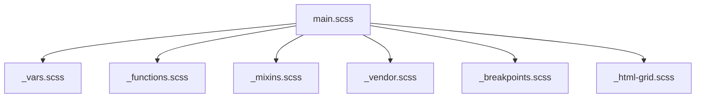
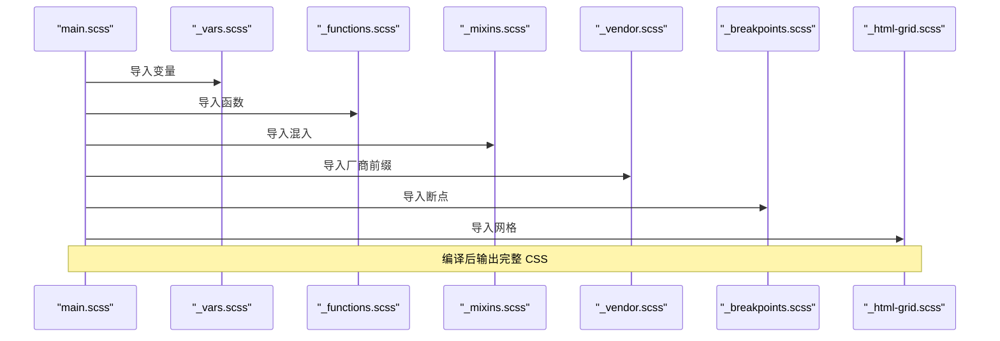
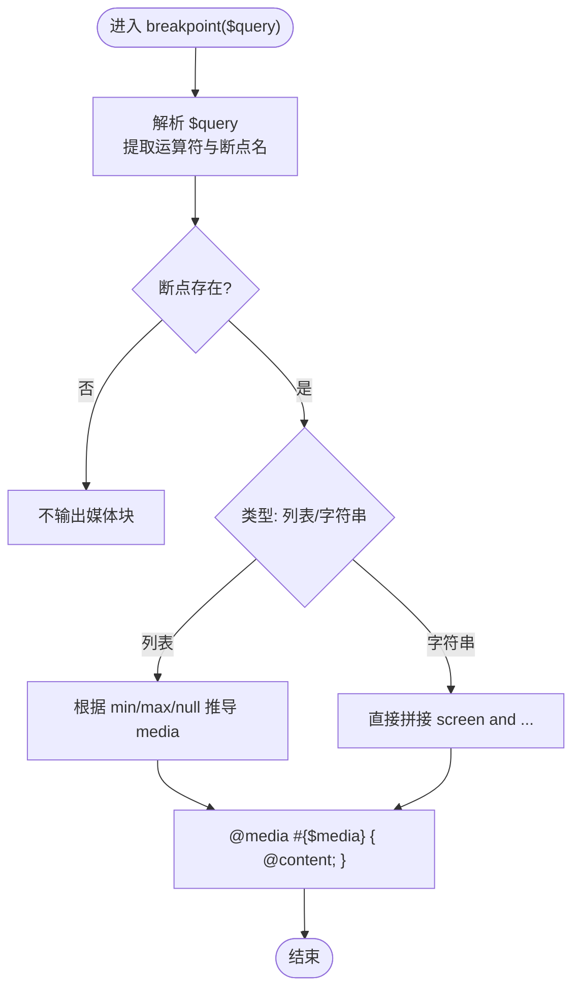
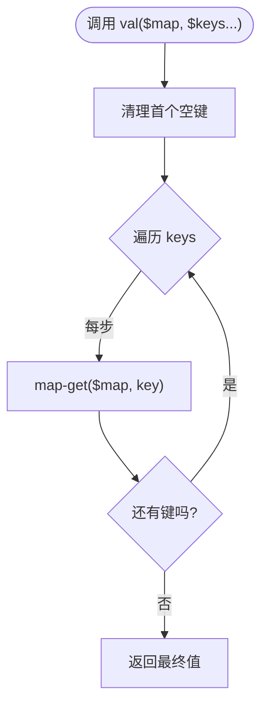
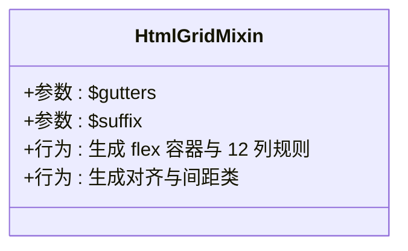
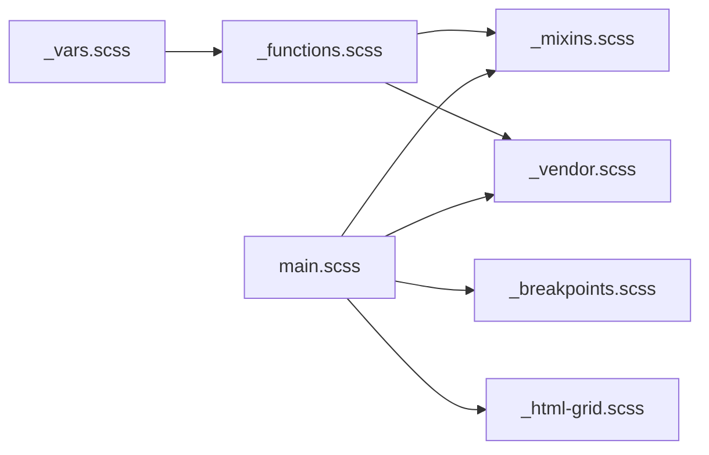

# 工具库模块

<cite>
**本文引用的文件**
- [assets/sass/main.scss](file://assets/sass/main.scss)
- [assets/sass/libs/_breakpoints.scss](file://assets/sass/libs/_breakpoints.scss)
- [assets/sass/libs/_functions.scss](file://assets/sass/libs/_functions.scss)
- [assets/sass/libs/_mixins.scss](file://assets/sass/libs/_mixins.scss)
- [assets/sass/libs/_vars.scss](file://assets/sass/libs/_vars.scss)
- [assets/sass/libs/_html-grid.scss](file://assets/sass/libs/_html-grid.scss)
- [assets/sass/libs/_vendor.scss](file://assets/sass/libs/_vendor.scss)
</cite>

## 目录
1. [简介](#简介)
2. [项目结构](#项目结构)
3. [核心组件](#核心组件)
4. [架构总览](#架构总览)
5. [详细组件分析](#详细组件分析)
6. [依赖关系分析](#依赖关系分析)
7. [性能考量](#性能考量)
8. [故障排查指南](#故障排查指南)
9. [结论](#结论)
10. [附录：使用示例与自定义指南](#附录使用示例与自定义指南)

## 简介
本模块为 Sass 工具库，提供响应式断点、通用函数、样式混入、全局变量、HTML 网格系统与浏览器前缀处理等能力。通过集中化的配置与可复用逻辑，显著降低重复代码，提升开发效率与一致性。

## 项目结构
- 入口文件按顺序引入工具库：变量、函数、混入、厂商前缀、断点、网格系统，随后再引入基础、组件与布局样式。
- 工具库位于 assets/sass/libs 下，每个文件职责清晰：
  - _vars.scss：全局设计令牌（颜色、尺寸、字体、时长等）
  - _functions.scss：数据访问与列表操作函数
  - _mixins.scss：图标、间距、SVG 编码等常用混入/函数
  - _vendor.scss：跨浏览器前缀与关键帧封装
  - _breakpoints.scss：响应式断点声明与媒体查询生成
  - _html-grid.scss：基于 Flexbox 的 12 列网格系统

图表来源
- [assets/sass/main.scss:1-6](file://assets/sass/main.scss#L1-L6)

章节来源
- [assets/sass/main.scss:1-62](file://assets/sass/main.scss#L1-L62)

## 核心组件
- 响应式断点：通过统一配置映射名称到区间或媒体查询，支持多种比较运算符与范围组合。
- 数学与字符串函数：提供从命名空间 map 中取值、移除列表中指定项、字符串替换等能力。
- 样式混入：图标注入、智能 padding、SVG data URL 编码等。
- 全局变量：以 map 形式组织设计令牌，便于集中管理与按需读取。
- HTML 网格：快速生成 12 列栅格、对齐、间距与偏移类名。
- 浏览器前缀：自动为属性与值添加厂商前缀，并封装 keyframes。

章节来源
- [assets/sass/libs/_breakpoints.scss:1-223](file://assets/sass/libs/_breakpoints.scss#L1-L223)
- [assets/sass/libs/_functions.scss:1-90](file://assets/sass/libs/_functions.scss#L1-L90)
- [assets/sass/libs/_mixins.scss:1-78](file://assets/sass/libs/_mixins.scss#L1-L78)
- [assets/sass/libs/_vars.scss:1-44](file://assets/sass/libs/_vars.scss#L1-L44)
- [assets/sass/libs/_html-grid.scss:1-149](file://assets/sass/libs/_html-grid.scss#L1-L149)
- [assets/sass/libs/_vendor.scss:1-376](file://assets/sass/libs/_vendor.scss#L1-L376)

## 架构总览
工具库在编译期工作，将 Sass 语法转换为 CSS。入口 main.scss 负责导入顺序，确保变量先于函数与混入使用，断点与网格在后续样式中使用。

图表来源
- [assets/sass/main.scss:1-6](file://assets/sass/main.scss#L1-L6)

## 详细组件分析

### 响应式断点（_breakpoints.scss）
- 功能要点
  - 通过 @mixin breakpoints 定义断点映射，键名为语义化名称，值为区间或媒体查询字符串。
  - 通过 @mixin breakpoint($query) 生成媒体查询，支持 >=、<=、>、<、! 与等于等运算符。
  - 支持仅最小宽度、仅最大宽度、区间以及纯媒体查询字符串三种配置方式。
  - 内置 @mixin orientation 用于横竖屏方向控制。
- 典型用法
  - 在 main.scss 中调用 breakpoints 配置多档断点。
  - 在组件样式中使用 breakpoint("small") 或 breakpoint("> medium") 等。
- 复杂度与边界
  - 解析逻辑包含分支判断与字符串切片，时间复杂度近似 O(1) 每次调用。
  - 对无效索引或越界会触发警告；未命中断点时不输出媒体块。

图表来源
- [assets/sass/libs/_breakpoints.scss:27-223](file://assets/sass/libs/_breakpoints.scss#L27-L223)

章节来源
- [assets/sass/libs/_breakpoints.scss:1-223](file://assets/sass/libs/_breakpoints.scss#L1-L223)
- [assets/sass/main.scss:16-27](file://assets/sass/main.scss#L16-L27)

### 数学与字符串函数（_functions.scss）
- 功能要点
  - remove-nth($list, $index)：安全地从列表中移除指定位置元素，含参数校验与警告。
  - val($map, $keys...)：链式从嵌套 map 中取值，空首键会被忽略。
  - _duration/_font/_misc/_palette/_size：便捷访问对应命名空间的值。
- 复杂度与边界
  - remove-nth 遍历列表，时间复杂度 O(n)。
  - val 逐层 map-get，时间复杂度 O(k)，k 为键数量。
  - 非法输入会发出警告但不中断编译。

图表来源
- [assets/sass/libs/_functions.scss:43-55](file://assets/sass/libs/_functions.scss#L43-L55)

章节来源
- [assets/sass/libs/_functions.scss:1-90](file://assets/sass/libs/_functions.scss#L1-L90)

### 样式混入（_mixins.scss）
- 功能要点
  - icon($content, $category, $where)：为伪元素注入 Font Awesome 图标，支持品牌/常规/实心三类。
  - padding($tb, $lr, $pad, $important)：智能计算垂直内边距，考虑 element-margin 与单位差异。
  - svg-url($svg)：对 SVG 进行必要转义并生成 data URL，兼容 IE。
- 使用建议
  - 图标混入配合 Font Awesome 使用，注意选择正确的 category。
  - padding 混入适合段落、卡片等需要与行高/外边距协调的场景。

章节来源
- [assets/sass/libs/_mixins.scss:1-78](file://assets/sass/libs/_mixins.scss#L1-L78)

### 全局变量（_vars.scss）
- 内容概览
  - $misc：如 z-index-base 等杂项常量。
  - $duration：动画与过渡时长。
  - $size：圆角、元素高度、外边距、侧栏宽度、栅格间距等。
  - $font：字体族、字重、字偶距等。
  - $palette：背景、前景、边框、强调色等。
- 使用方式
  - 通过 _functions.scss 中的 _size/_palette/_font/_duration/_misc 等函数读取。
  - 集中修改一处，全局生效，利于主题定制。

章节来源
- [assets/sass/libs/_vars.scss:1-44](file://assets/sass/libs/_vars.scss#L1-L44)
- [assets/sass/libs/_functions.scss:57-90](file://assets/sass/libs/_functions.scss#L57-L90)

### HTML 网格系统（_html-grid.scss）
- 功能要点
  - html-grid($gutters, $suffix)：初始化 Flex 容器与子项，自动生成 12 列宽、偏移、对齐与间距类。
  - 支持单值或双值 gutters（列/行），以及可选后缀以限定作用域。
  - 提供 gtr-* 系列类调整间距倍数，gtr-uniform 使所有子项间距一致。
  - 提供 aln-left/center/right/top/middle/bottom 对齐类。
- 使用建议
  - 在父容器上应用 html-grid 混入，子元素使用 col-* 与 off-* 类布局。
  - 通过 gtr-* 微调间距，避免额外样式覆盖。

图表来源
- [assets/sass/libs/_html-grid.scss:5-149](file://assets/sass/libs/_html-grid.scss#L5-L149)

章节来源
- [assets/sass/libs/_html-grid.scss:1-149](file://assets/sass/libs/_html-grid.scss#L1-L149)

### 浏览器前缀处理（_vendor.scss）
- 功能要点
  - 维护需加前缀的属性与值白名单，以及前缀列表。
  - vendor($property, $value)：根据白名单自动为属性或值添加厂商前缀。
  - keyframes($name)：为关键帧生成带前缀的多版本。
  - 提供 str-replace/str-replace-all/remove-nth 等辅助函数。
- 使用建议
  - 对新特性使用 vendor 混入，无需手写多个前缀。
  - 对于尚未标准化的值，可在值中标记占位符由 mixin 展开。

章节来源
- [assets/sass/libs/_vendor.scss:1-376](file://assets/sass/libs/_vendor.scss#L1-L376)

## 依赖关系分析
- 导入顺序决定可用性：变量必须先于函数与混入；函数依赖变量；混入可能依赖函数与前缀工具。
- 耦合度
  - _functions.scss 与 _vars.scss 强耦合（通过命名空间 map）。
  - _breakpoints.scss 独立，但被 main.scss 配置驱动。
  - _html-grid.scss 与 _mixins.scss/_functions.scss/_vendor.scss 弱耦合（主要依赖 Sass 原生能力）。
- 循环依赖：无显式循环导入，顺序导入即可满足依赖。

图表来源
- [assets/sass/main.scss:1-6](file://assets/sass/main.scss#L1-L6)
- [assets/sass/libs/_functions.scss:57-90](file://assets/sass/libs/_functions.scss#L57-L90)

章节来源
- [assets/sass/main.scss:1-62](file://assets/sass/main.scss#L1-L62)

## 性能考量
- 编译期开销
  - 断点解析与网格类生成均为编译期计算，运行时零开销。
  - 大量断点或复杂媒体查询会增加 CSS 体积，建议按需启用。
- 优化建议
  - 合理拆分断点，避免过多重叠区间。
  - 使用 gtr-* 控制间距而非重复写 margin/padding。
  - 利用 vendor 混入减少重复前缀代码，提高可读性。

## 故障排查指南
- 断点不生效
  - 检查是否在 main.scss 中正确调用 breakpoints 配置。
  - 确认使用的断点名是否存在，或媒体查询字符串是否合法。
- 函数返回值异常
  - 检查 map 层级是否正确，键名是否拼写一致。
  - remove-nth 的索引必须为非零整数且不超过列表长度。
- 图标显示异常
  - 确认已引入 Font Awesome 资源，并选择正确的 category。
- 前缀未生效
  - 确认属性或值在白名单中；必要时扩展 vendor.scss 的白名单。

章节来源
- [assets/sass/libs/_breakpoints.scss:27-223](file://assets/sass/libs/_breakpoints.scss#L27-L223)
- [assets/sass/libs/_functions.scss:6-35](file://assets/sass/libs/_functions.scss#L6-L35)
- [assets/sass/libs/_mixins.scss:5-38](file://assets/sass/libs/_mixins.scss#L5-L38)
- [assets/sass/libs/_vendor.scss:335-376](file://assets/sass/libs/_vendor.scss#L335-L376)

## 结论
该工具库通过集中化的变量、函数、混入与工具方法，构建了稳定、可扩展的前端样式基础设施。开发者只需关注业务样式，将通用逻辑交由工具库处理，从而提升一致性与可维护性。

## 附录：使用示例与自定义指南

- 自定义断点
  - 在 main.scss 中通过 breakpoints 新增或调整断点映射，随后在组件中使用 breakpoint() 调用。
  - 参考路径：[assets/sass/main.scss:16-27](file://assets/sass/main.scss#L16-L27)

- 读取全局变量
  - 使用 _size/_palette/_font/_duration/_misc 等函数获取设计令牌。
  - 参考路径：[assets/sass/libs/_functions.scss:57-90](file://assets/sass/libs/_functions.scss#L57-L90)
  - 参考路径：[assets/sass/libs/_vars.scss:1-44](file://assets/sass/libs/_vars.scss#L1-L44)

- 使用网格系统
  - 在父容器上应用 html-grid 混入，子元素使用 col-* 与 off-* 类实现 12 列布局。
  - 参考路径：[assets/sass/libs/_html-grid.scss:5-149](file://assets/sass/libs/_html-grid.scss#L5-L149)

- 插入图标
  - 使用 icon 混入为伪元素注入图标，选择合适的 category。
  - 参考路径：[assets/sass/libs/_mixins.scss:5-38](file://assets/sass/libs/_mixins.scss#L5-L38)

- 添加浏览器前缀
  - 使用 vendor 混入为属性或值自动添加厂商前缀；使用 keyframes 混入生成多版本关键帧。
  - 参考路径：[assets/sass/libs/_vendor.scss:324-376](file://assets/sass/libs/_vendor.scss#L324-L376)

- 列表与字符串操作
  - 使用 remove-nth 安全删除列表元素；使用 str-replace/str-replace-all 进行字符串替换。
  - 参考路径：[assets/sass/libs/_functions.scss:6-35](file://assets/sass/libs/_functions.scss#L6-L35)
  - 参考路径：[assets/sass/libs/_vendor.scss:289-320](file://assets/sass/libs/_vendor.scss#L289-L320)