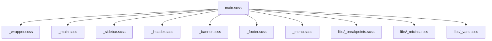
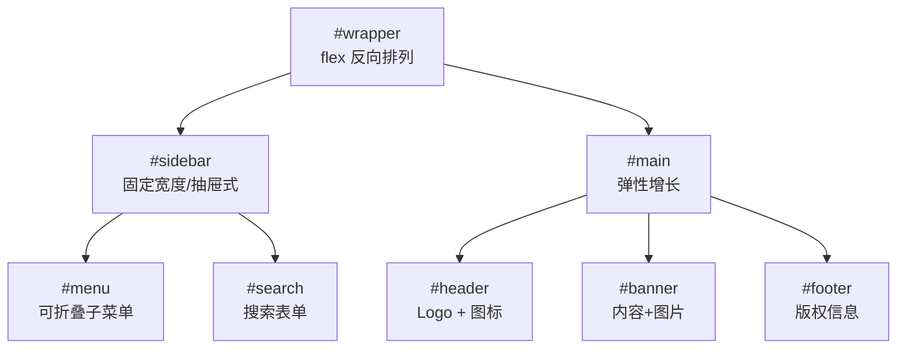
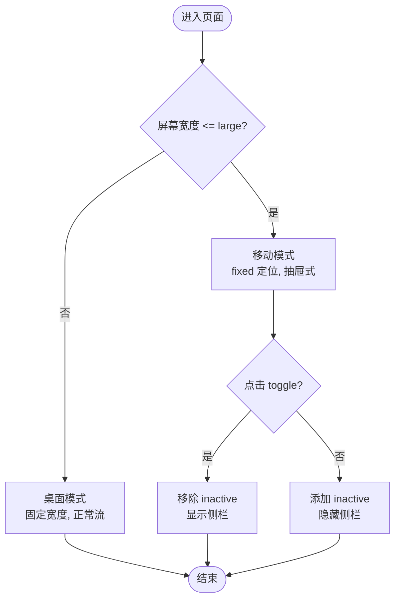
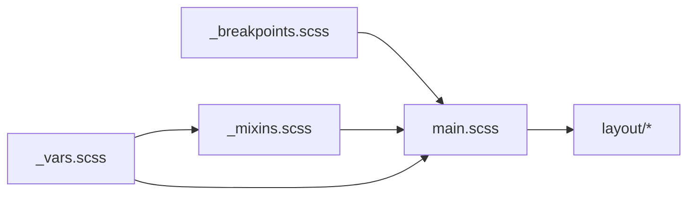

# 布局样式模块

<cite>
**本文引用的文件**
- [assets/sass/main.scss](file://assets/sass/main.scss)
- [assets/sass/layout/_wrapper.scss](file://assets/sass/layout/_wrapper.scss)
- [assets/sass/layout/_main.scss](file://assets/sass/layout/_main.scss)
- [assets/sass/layout/_sidebar.scss](file://assets/sass/layout/_sidebar.scss)
- [assets/sass/layout/_header.scss](file://assets/sass/layout/_header.scss)
- [assets/sass/layout/_banner.scss](file://assets/sass/layout/_banner.scss)
- [assets/sass/layout/_footer.scss](file://assets/sass/layout/_footer.scss)
- [assets/sass/layout/_menu.scss](file://assets/sass/layout/_menu.scss)
- [assets/sass/libs/_breakpoints.scss](file://assets/sass/libs/_breakpoints.scss)
- [assets/sass/libs/_mixins.scss](file://assets/sass/libs/_mixins.scss)
- [assets/sass/libs/_vars.scss](file://assets/sass/libs/_vars.scss)
</cite>

## 目录
1. [简介](#简介)
2. [项目结构](#项目结构)
3. [核心组件](#核心组件)
4. [架构总览](#架构总览)
5. [详细组件分析](#详细组件分析)
6. [依赖关系分析](#依赖关系分析)
7. [性能考量](#性能考量)
8. [故障排查指南](#故障排查指南)
9. [结论](#结论)
10. [附录：定制与扩展指南](#附录定制与扩展指南)

## 简介
本模块聚焦于 layout 目录下的布局样式实现，涵盖整体包装器、主内容区、侧边栏、头部导航、横幅区域、页脚以及菜单系统。文档将说明各组件的层级关系、响应式适配策略，并提供可操作的定制与扩展建议，帮助你在不破坏现有结构的前提下进行主题化与二次开发。

## 项目结构
布局样式由 main.scss 统一引入，按 base → components → layout 的顺序组织。layout 下每个文件对应一个页面级区块，通过变量、mixin 和断点机制实现一致的视觉与行为。

图表来源
- [assets/sass/main.scss:54-62](file://assets/sass/main.scss#L54-L62)
- [assets/sass/libs/_breakpoints.scss:17-27](file://assets/sass/libs/_breakpoints.scss#L17-L27)
- [assets/sass/libs/_mixins.scss:40-59](file://assets/sass/libs/_mixins.scss#L40-L59)
- [assets/sass/libs/_vars.scss:12-20](file://assets/sass/libs/_vars.scss#L12-L20)

章节来源
- [assets/sass/main.scss:1-62](file://assets/sass/main.scss#L1-L62)

## 核心组件
- 包装器 #wrapper：使用 Flexbox 反向排列，使侧边栏在视觉上位于右侧（DOM 顺序为 sidebar + main），并保证最小高度覆盖视口。
- 主内容区 #main：弹性增长/收缩，内部 .inner 控制内边距与最大宽度；section 之间以边框分隔，首项去除上边框。
- 侧边栏 #sidebar：固定宽度，支持收起/展开动画；小屏切换为固定定位抽屉式侧栏，带滚动条与遮罩效果。
- 头部 #header：Flex 布局，底部强调色边框；logo 与图标区域左右分布，移动端调整位置与尺寸。
- 横幅 #banner：双列布局（内容+图片），横屏时水平排列，竖屏时垂直堆叠，图片自适应裁剪居中。
- 页脚 #footer：版权信息轻量样式，链接继承颜色。
- 菜单 #menu：无列表样式的大写标题风格，支持子菜单折叠/展开，交互通过 active 类驱动。

章节来源
- [assets/sass/layout/_wrapper.scss:7-13](file://assets/sass/layout/_wrapper.scss#L7-L13)
- [assets/sass/layout/_main.scss:7-58](file://assets/sass/layout/_main.scss#L7-L58)
- [assets/sass/layout/_sidebar.scss:7-223](file://assets/sass/layout/_sidebar.scss#L7-L223)
- [assets/sass/layout/_header.scss:7-51](file://assets/sass/layout/_header.scss#L7-L51)
- [assets/sass/layout/_banner.scss:7-75](file://assets/sass/layout/_banner.scss#L7-L75)
- [assets/sass/layout/_footer.scss:7-18](file://assets/sass/layout/_footer.scss#L7-L18)
- [assets/sass/layout/_menu.scss:7-98](file://assets/sass/layout/_menu.scss#L7-L98)

## 架构总览
布局采用“容器-区域”分层：#wrapper 作为根容器，内部包含 #sidebar 与 #main；#main 内部再细分 #header、#banner、#footer 等区块；#sidebar 中包含搜索框与 #menu。

图表来源
- [assets/sass/layout/_wrapper.scss:7-13](file://assets/sass/layout/_wrapper.scss#L7-L13)
- [assets/sass/layout/_sidebar.scss:37-223](file://assets/sass/layout/_sidebar.scss#L37-L223)
- [assets/sass/layout/_main.scss:9-27](file://assets/sass/layout/_main.scss#L9-L27)
- [assets/sass/layout/_header.scss:9-30](file://assets/sass/layout/_header.scss#L9-L30)
- [assets/sass/layout/_banner.scss:9-42](file://assets/sass/layout/_banner.scss#L9-L42)
- [assets/sass/layout/_footer.scss:9-18](file://assets/sass/layout/_footer.scss#L9-L18)
- [assets/sass/layout/_menu.scss:9-98](file://assets/sass/layout/_menu.scss#L9-L98)

## 详细组件分析

### 包装器 #wrapper
- 作用：提供全局 flex 容器，反向排列使侧边栏在视觉上位于右侧；设置最小高度确保占满视口。
- 关键点：使用 vendor 前缀兼容旧浏览器；配合 #sidebar 与 #main 的 flex 属性形成稳定布局。

章节来源
- [assets/sass/layout/_wrapper.scss:7-13](file://assets/sass/layout/_wrapper.scss#L7-L13)

### 主内容区 #main
- 作用：承载页面主体内容，内部 .inner 控制内容与最大宽度；section 间以边框分隔，首 section 去除上边框避免重复线。
- 响应式：在不同断点下调减内边距与 section 上下间距，保持可读性与空间利用率。
- 复杂度：O(1) 样式计算；通过 mixin padding 自动处理元素外边距补偿。

章节来源
- [assets/sass/layout/_main.scss:7-58](file://assets/sass/layout/_main.scss#L7-L58)
- [assets/sass/libs/_mixins.scss:40-59](file://assets/sass/libs/_mixins.scss#L40-L59)

### 侧边栏 #sidebar
- 作用：放置搜索框与菜单；桌面端固定宽度，小屏切换为固定定位抽屉式侧栏，具备阴影与滚动优化。
- 交互：通过 inactive 类控制 margin-left 负值隐藏；toggle 按钮用于切换显示状态。
- 响应式：xlarge 以下调整宽度与内边距；large 及以下启用 fixed 定位与滚动容器；small 进一步优化 toggle 按钮尺寸与可见性。
- 性能：transition 仅作用于 margin-left 与 box-shadow，减少重排；overflow-y 滚动提升长列表体验。

图表来源
- [assets/sass/layout/_sidebar.scss:37-223](file://assets/sass/layout/_sidebar.scss#L37-L223)

章节来源
- [assets/sass/layout/_sidebar.scss:7-223](file://assets/sass/layout/_sidebar.scss#L7-L223)

### 头部 #header
- 作用：展示站点标识与社交图标；底部强调色边框强化品牌识别。
- 响应式：小屏增加顶部留白，logo 字号增大，图标区域绝对定位至右上角以避免挤压。

章节来源
- [assets/sass/layout/_header.scss:7-51](file://assets/sass/layout/_header.scss#L7-L51)

### 横幅 #banner
- 作用：首屏重点信息展示，采用双列布局（内容+图片）。
- 响应式：横屏水平排列，竖屏垂直堆叠；图片使用 object-fit 裁剪并保持居中；竖屏限制图片高度比例以适应视口。

章节来源
- [assets/sass/layout/_banner.scss:7-75](file://assets/sass/layout/_banner.scss#L7-L75)

### 页脚 #footer
- 作用：展示版权信息与链接；颜色较浅，链接继承父级颜色。

章节来源
- [assets/sass/layout/_footer.scss:7-18](file://assets/sass/layout/_footer.scss#L7-L18)

### 菜单 #menu
- 作用：侧边栏内的导航菜单，支持多级折叠；默认大写、加粗字重与字距增强可读性。
- 交互：通过 .opener 与 .active 类控制子菜单显示与箭头旋转；hover 高亮强调色。
- 结构：一级菜单项以边框分隔，二级菜单缩进且字号更小。

章节来源
- [assets/sass/layout/_menu.scss:7-98](file://assets/sass/layout/_menu.scss#L7-L98)

## 依赖关系分析
- 变量与工具：_vars.scss 提供尺寸、字体、调色板；_mixins.scss 提供 icon、padding 等通用能力；_breakpoints.scss 提供断点与方向检测。
- 入口：main.scss 按顺序引入基础、组件与布局，确保样式优先级与覆盖顺序正确。
- 耦合度：布局组件低耦合，主要通过 CSS 选择器与命名约定协作；侧边栏与小屏交互依赖 JS 动态类名（inactive/active）控制。

图表来源
- [assets/sass/main.scss:1-8](file://assets/sass/main.scss#L1-L8)
- [assets/sass/libs/_vars.scss:1-44](file://assets/sass/libs/_vars.scss#L1-L44)
- [assets/sass/libs/_mixins.scss:1-78](file://assets/sass/libs/_mixins.scss#L1-L78)
- [assets/sass/libs/_breakpoints.scss:1-27](file://assets/sass/libs/_breakpoints.scss#L1-L27)

章节来源
- [assets/sass/main.scss:1-62](file://assets/sass/main.scss#L1-L62)
- [assets/sass/libs/_vars.scss:12-20](file://assets/sass/libs/_vars.scss#L12-L20)
- [assets/sass/libs/_mixins.scss:40-59](file://assets/sass/libs/_mixins.scss#L40-L59)
- [assets/sass/libs/_breakpoints.scss:17-27](file://assets/sass/libs/_breakpoints.scss#L17-L27)

## 性能考量
- 使用 transition 仅对必要属性（margin-left、box-shadow、transform）进行动画，降低重绘成本。
- 小屏侧边栏使用 fixed 定位与 overflow-y 滚动，避免影响主内容流。
- 图片使用 object-fit 与 object-position 保证缩放质量与居中，减少额外容器计算。
- 断点与方向查询集中管理，便于维护与缓存命中。

[本节为通用性能建议，无需特定文件引用]

## 故障排查指南
- 侧边栏在小屏未显示或无法滚动
  - 检查是否添加了 inactive 类导致隐藏；确认 toggle 按钮是否正确切换类名。
  - 确认 .inner 是否设置了 overflow-y 与固定高度，避免内容溢出不可见。
  - 参考：[assets/sass/layout/_sidebar.scss:154-196](file://assets/sass/layout/_sidebar.scss#L154-L196)

- 主内容区 section 顶部出现重复边框
  - 确认首个 section 是否去除了上边框；必要时使用 !important 覆盖第三方样式。
  - 参考：[assets/sass/layout/_main.scss:19-26](file://assets/sass/layout/_main.scss#L19-L26)

- 横幅图片在小屏变形或遮挡文字
  - 检查竖屏模式下图片高度限制与 object-fit 设置；确保容器高度合理。
  - 参考：[assets/sass/layout/_banner.scss:44-74](file://assets/sass/layout/_banner.scss#L44-L74)

- 菜单子菜单无法展开
  - 确认 .opener 是否被激活（active 类），以及子菜单 display 是否被 JS 切换。
  - 参考：[assets/sass/layout/_menu.scss:33-65](file://assets/sass/layout/_menu.scss#L33-L65)

章节来源
- [assets/sass/layout/_sidebar.scss:154-196](file://assets/sass/layout/_sidebar.scss#L154-L196)
- [assets/sass/layout/_main.scss:19-26](file://assets/sass/layout/_main.scss#L19-L26)
- [assets/sass/layout/_banner.scss:44-74](file://assets/sass/layout/_banner.scss#L44-L74)
- [assets/sass/layout/_menu.scss:33-65](file://assets/sass/layout/_menu.scss#L33-L65)

## 结论
该布局模块通过清晰的层次结构与统一的变量/mixin/断点体系，实现了跨设备的稳定布局与良好的交互体验。各组件职责明确、耦合度低，便于按需定制与扩展。遵循本文档的指南，可在不破坏现有结构的前提下完成主题化与功能增强。

[本节为总结性内容，无需特定文件引用]

## 附录：定制与扩展指南
- 主题化
  - 修改配色：编辑 _vars.scss 中的 $palette，如 accent、bg、fg 等，即可全局生效。
  - 调整尺寸：修改 $size 中的 sidebar-width、element-height、gutter 等，影响侧边栏宽度与控件尺寸。
  - 字体与字重：在 $font 中替换 family、weight-heading 等，统一全站排版。

- 断点与响应式
  - 新增断点：在 main.scss 的 breakpoints 中添加新名称与范围，并在组件中使用 @include breakpoint('new-name') 应用样式。
  - 方向适配：使用 @include orientation(portrait|landscape) 针对横竖屏差异化处理。

- 组件扩展
  - 主内容区：在 #main > .inner 内新增 section，注意首项去除上边框逻辑；可通过自定义 class 覆盖默认样式。
  - 侧边栏：在 #sidebar > .inner 中插入新模块，遵循已有 .alt 背景与分割线规范；如需固定高度滚动，参考 .inner 的 overflow 设置。
  - 菜单：在 #menu ul 中新增 li 与嵌套 ul，保持 .opener 与 .active 的交互约定；子菜单样式已内置缩进与字号差异。

- 最佳实践
  - 优先使用 mixin padding 与变量，避免硬编码数值，提高一致性。
  - 在小屏优先保证可访问性与触控友好性，如增大点击区域、减少复杂动画。
  - 谨慎使用 !important，仅在必要时覆盖第三方样式。

章节来源
- [assets/sass/libs/_vars.scss:12-44](file://assets/sass/libs/_vars.scss#L12-L44)
- [assets/sass/main.scss:17-27](file://assets/sass/main.scss#L17-L27)
- [assets/sass/layout/_main.scss:14-27](file://assets/sass/layout/_main.scss#L14-L27)
- [assets/sass/layout/_sidebar.scss:55-83](file://assets/sass/layout/_sidebar.scss#L55-L83)
- [assets/sass/layout/_menu.scss:69-98](file://assets/sass/layout/_menu.scss#L69-L98)