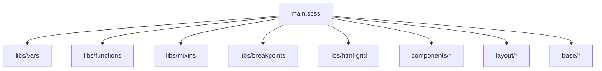
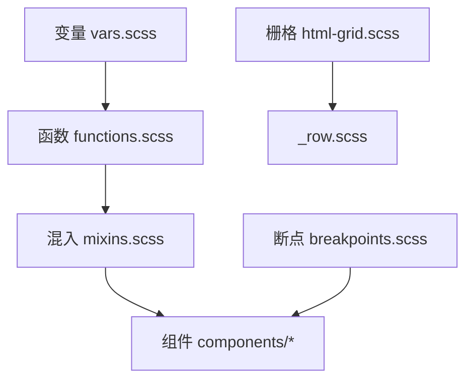
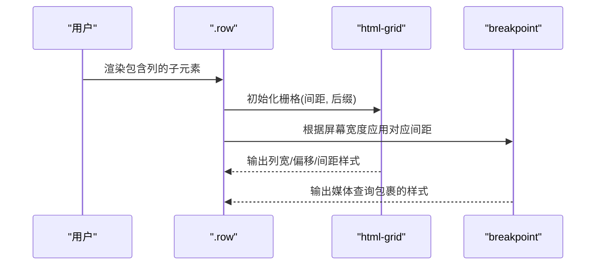
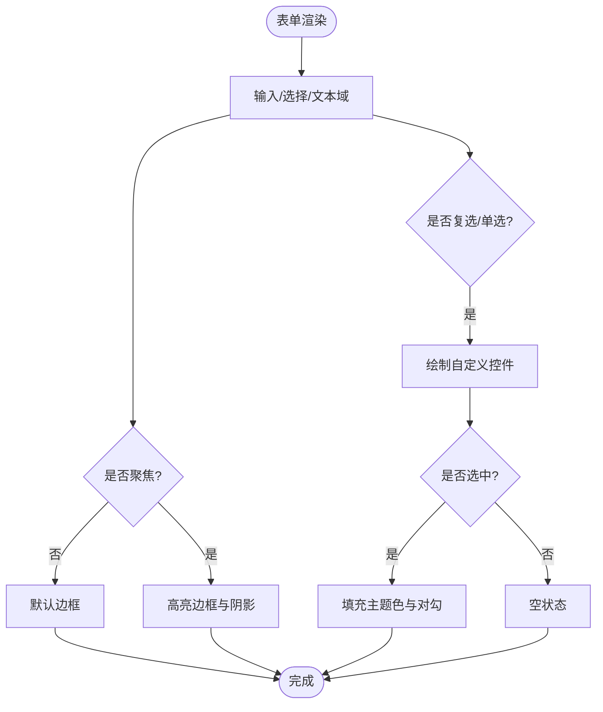
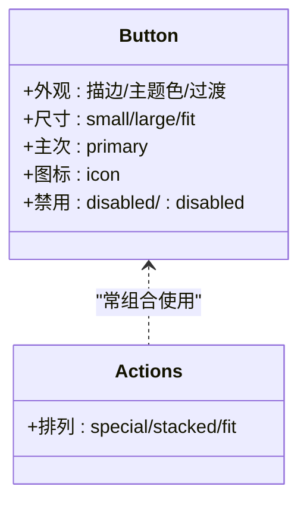
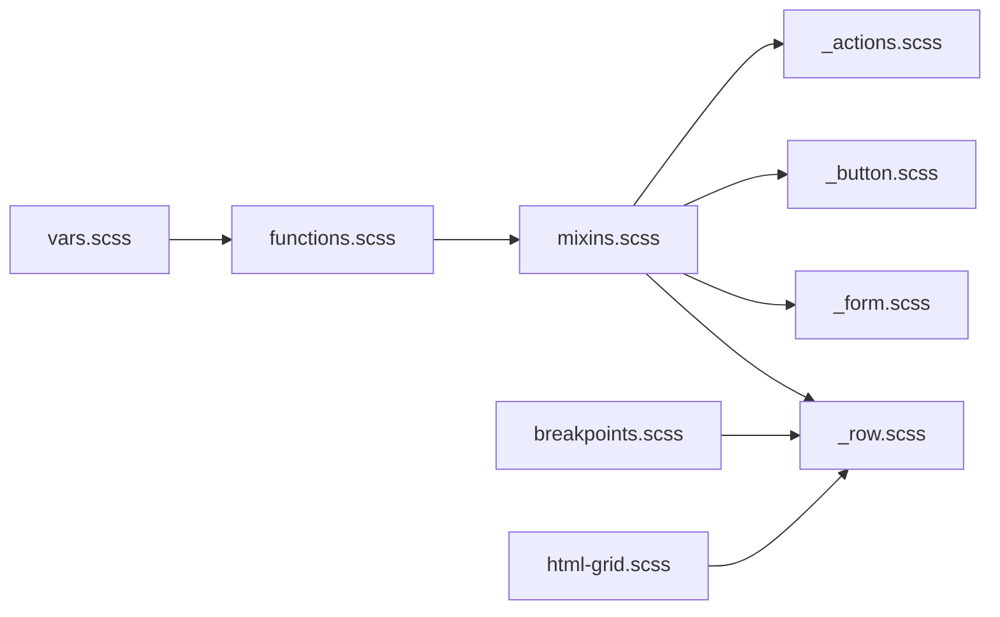

# 组件样式模块

<cite>
**本文引用的文件**
- [assets/sass/main.scss](file://assets/sass/main.scss)
- [assets/sass/libs/_vars.scss](file://assets/sass/libs/_vars.scss)
- [assets/sass/libs/_functions.scss](file://assets/sass/libs/_functions.scss)
- [assets/sass/libs/_mixins.scss](file://assets/sass/libs/_mixins.scss)
- [assets/sass/libs/_breakpoints.scss](file://assets/sass/libs/_breakpoints.scss)
- [assets/sass/libs/_html-grid.scss](file://assets/sass/libs/_html-grid.scss)
- [assets/sass/components/_row.scss](file://assets/sass/components/_row.scss)
- [assets/sass/components/_section.scss](file://assets/sass/components/_section.scss)
- [assets/sass/components/_form.scss](file://assets/sass/components/_form.scss)
- [assets/sass/components/_box.scss](file://assets/sass/components/_box.scss)
- [assets/sass/components/_button.scss](file://assets/sass/components/_button.scss)
- [assets/sass/components/_actions.scss](file://assets/sass/components/_actions.scss)
- [assets/sass/components/_icon.scss](file://assets/sass/components/_icon.scss)
- [assets/sass/base/_typography.scss](file://assets/sass/base/_typography.scss)
</cite>

## 目录
1. [简介](#简介)
2. [项目结构](#项目结构)
3. [核心组件](#核心组件)
4. [架构总览](#架构总览)
5. [详细组件分析](#详细组件分析)
6. [依赖关系分析](#依赖关系分析)
7. [性能与可维护性](#性能与可维护性)
8. [故障排查指南](#故障排查指南)
9. [结论](#结论)
10. [附录：使用示例与最佳实践](#附录使用示例与最佳实践)

## 简介
本文件系统化梳理 components 目录下的 UI 组件样式实现，重点覆盖行布局（_row.scss）、区块（_section.scss）、表单（_form.scss）、盒子（_box.scss）、按钮（_button.scss）等核心组件。文档从设计模式、复用机制、状态管理与交互效果出发，结合变量、函数、混入与断点系统，帮助开发者快速理解并扩展该组件体系。

## 项目结构
样式工程采用模块化组织：
- 基础层：base（重置、页面、排版）
- 组件层：components（通用 UI 组件）
- 布局层：layout（页面骨架）
- 库层：libs（变量、函数、混入、断点、栅格）
- 入口：main.scss 统一引入顺序，确保依赖正确加载

图表来源
- [assets/sass/main.scss:1-62](file://assets/sass/main.scss#L1-L62)

章节来源
- [assets/sass/main.scss:1-62](file://assets/sass/main.scss#L1-L62)

## 核心组件
- 行布局 _row.scss：基于 html-grid 的响应式栅格容器，按断点切换间距与列行为。
- 区块 _section.scss：内容区块与标题修饰，提供对齐与强调样式。
- 表单 _form.scss：输入控件、选择框、复选/单选的统一样式与焦点态。
- 盒子 _box.scss：带边框与圆角的容器，支持“无装饰”变体。
- 按钮 _button.scss：统一按钮外观、尺寸、主次态、禁用态与图标集成。

章节来源
- [assets/sass/components/_row.scss:9-31](file://assets/sass/components/_row.scss#L9-L31)
- [assets/sass/components/_section.scss:9-39](file://assets/sass/components/_section.scss#L9-L39)
- [assets/sass/components/_form.scss:9-179](file://assets/sass/components/_form.scss#L9-L179)
- [assets/sass/components/_box.scss:9-26](file://assets/sass/components/_box.scss#L9-L26)
- [assets/sass/components/_button.scss:9-85](file://assets/sass/components/_button.scss#L9-L85)

## 架构总览
组件样式通过统一的变量、函数与混入构建，保证视觉一致性与可维护性：
- 变量：颜色、字号、间距、字体族等集中管理
- 函数：便捷读取变量值（如 _palette、_size、_font、_duration）
- 混入：封装复杂样式逻辑（如 icon、padding、html-grid、breakpoint）
- 断点：集中定义媒体查询断点，组件按需适配

图表来源
- [assets/sass/libs/_vars.scss:1-44](file://assets/sass/libs/_vars.scss#L1-L44)
- [assets/sass/libs/_functions.scss:60-90](file://assets/sass/libs/_functions.scss#L60-L90)
- [assets/sass/libs/_mixins.scss:1-78](file://assets/sass/libs/_mixins.scss#L1-L78)
- [assets/sass/libs/_breakpoints.scss:13-223](file://assets/sass/libs/_breakpoints.scss#L13-L223)
- [assets/sass/libs/_html-grid.scss:5-149](file://assets/sass/libs/_html-grid.scss#L5-L149)
- [assets/sass/components/_row.scss:9-31](file://assets/sass/components/_row.scss#L9-L31)

## 详细组件分析

### 行布局组件（_row.scss）
- 设计模式：以 html-grid 混入初始化 Flex 栅格，配合 breakpoint 混入在不同断点下调整栅格间距。
- 关键特性：
  - 使用 html-grid 生成 12 列网格、偏移类、间距缩放类与对齐类
  - 通过 breakpoint 在 xlarge/large/medium/small/xsmall 下切换栅格间距
- 复用机制：所有 .row 自动获得一致的栅格能力，无需重复编写列宽与间距
- 状态与交互：无直接交互，但可通过父级 actions 或子元素组合实现交互布局
- 扩展建议：如需自定义间距，可在调用 html-grid 时传入不同 gutters；如需新增断点，先在 main.scss 中配置 breakpoints

图表来源
- [assets/sass/components/_row.scss:9-31](file://assets/sass/components/_row.scss#L9-L31)
- [assets/sass/libs/_html-grid.scss:5-149](file://assets/sass/libs/_html-grid.scss#L5-L149)
- [assets/sass/libs/_breakpoints.scss:13-223](file://assets/sass/libs/_breakpoints.scss#L13-L223)

章节来源
- [assets/sass/components/_row.scss:9-31](file://assets/sass/components/_row.scss#L9-L31)
- [assets/sass/libs/_html-grid.scss:5-149](file://assets/sass/libs/_html-grid.scss#L5-L149)
- [assets/sass/libs/_breakpoints.scss:13-223](file://assets/sass/libs/_breakpoints.scss#L13-L223)

### 区块组件（_section.scss）
- 设计模式：语义化标签 section/article 的增强样式，header 提供多种强调形式
- 关键特性：
  - .special 使内容居中
  - header.major 为标题添加强调底边与内边距
  - header.main 控制底部留白
- 复用机制：通过 class 修饰快速切换区块风格，适合文章、卡片头部等场景
- 状态与交互：静态展示为主，可与按钮/actions 组合形成操作区
- 扩展建议：如需更多强调样式，可参照 major 的模式新增变体

章节来源
- [assets/sass/components/_section.scss:9-39](file://assets/sass/components/_section.scss#L9-L39)

### 表单组件（_form.scss）
- 设计模式：统一输入控件外观，利用伪元素与 SVG 背景实现跨浏览器一致性
- 关键特性：
  - 文本/密码/邮箱/电话/搜索/URL 输入框统一高度、边框、聚焦态
  - select 使用内联 SVG 下拉箭头，隐藏原生展开按钮
  - textarea 增加内边距提升可读性
  - checkbox/radio 通过 label + :before 绘制自定义控件，选中态填充主题色
  - 占位符在各浏览器前缀下保持一致浅色
- 状态与交互：
  - focus 态高亮边框与阴影
  - checked/focus 态改变控件外观
- 复用机制：所有输入控件共享基础样式，减少重复代码
- 扩展建议：
  - 新增输入类型时，加入统一选择器集合以保持样式一致
  - 如需自定义校验提示，可结合 CSS :invalid 与 JS 反馈

图表来源
- [assets/sass/components/_form.scss:21-179](file://assets/sass/components/_form.scss#L21-L179)

章节来源
- [assets/sass/components/_form.scss:9-179](file://assets/sass/components/_form.scss#L9-L179)

### 盒子组件（_box.scss）
- 设计模式：通用容器，提供圆角、边框与内边距，便于承载内容
- 关键特性：
  - 默认边框与圆角，底部外边距
  - 末级子元素自动去除多余底部外边距，避免双重间距
  - .alt 变体移除边框、圆角与内边距，用于无缝拼接
- 复用机制：作为内容块的基础容器，常用于卡片、面板
- 扩展建议：如需阴影或背景，可在 .box 上叠加基础层样式

章节来源
- [assets/sass/components/_box.scss:9-26](file://assets/sass/components/_box.scss#L9-L26)

### 按钮组件（_button.scss）
- 设计模式：统一按钮外观，通过 class 控制尺寸、主次、禁用与图标
- 关键特性：
  - 基础样式：透明背景、描边、主题色文字、过渡动画
  - 尺寸：.small/.large 调整字号与高度
  - 主次：.primary 填充背景与反色文字，hover/active 明暗变化
  - 图标：.icon 在按钮前插入图标并设置间距
  - 全宽：.fit 撑满父容器
  - 禁用：.disabled 或 :disabled 禁用指针事件并降低透明度
- 状态与交互：
  - hover/active 提供背景色渐变反馈
  - 禁用态不可点击
- 复用机制：所有 input/button/a.button 统一样式，便于全局替换
- 扩展建议：如需新尺寸或主题，可仿照现有 class 模式扩展

图表来源
- [assets/sass/components/_button.scss:9-85](file://assets/sass/components/_button.scss#L9-L85)
- [assets/sass/components/_actions.scss:9-63](file://assets/sass/components/_actions.scss#L9-L63)

章节来源
- [assets/sass/components/_button.scss:9-85](file://assets/sass/components/_button.scss#L9-L85)
- [assets/sass/components/_actions.scss:9-63](file://assets/sass/components/_actions.scss#L9-L63)

### 辅助组件与基础支撑
- 动作列表（_actions.scss）：Flex 排列的按钮组，支持居中、堆叠、自适应
- 图标（_icon.scss）：基于 Font Awesome 的图标混入，支持实心/品牌图标
- 排版（_typography.scss）：全局字体、字号、行高、链接与标题样式，影响组件文本表现

章节来源
- [assets/sass/components/_actions.scss:9-63](file://assets/sass/components/_actions.scss#L9-L63)
- [assets/sass/components/_icon.scss:9-33](file://assets/sass/components/_icon.scss#L9-L33)
- [assets/sass/base/_typography.scss:9-187](file://assets/sass/base/_typography.scss#L9-L187)

## 依赖关系分析
- 变量与函数：所有组件通过 _palette、_size、_font、_duration 获取统一的设计令牌
- 混入与栅格：_row.scss 依赖 html-grid 与 breakpoint；_form.scss 依赖 icon 混入与 svg-url
- 入口顺序：main.scss 先引入 libs，再引入 base、components、layout，确保样式优先级与依赖正确

图表来源
- [assets/sass/libs/_vars.scss:1-44](file://assets/sass/libs/_vars.scss#L1-L44)
- [assets/sass/libs/_functions.scss:60-90](file://assets/sass/libs/_functions.scss#L60-L90)
- [assets/sass/libs/_mixins.scss:1-78](file://assets/sass/libs/_mixins.scss#L1-L78)
- [assets/sass/libs/_breakpoints.scss:13-223](file://assets/sass/libs/_breakpoints.scss#L13-L223)
- [assets/sass/libs/_html-grid.scss:5-149](file://assets/sass/libs/_html-grid.scss#L5-L149)
- [assets/sass/components/_row.scss:9-31](file://assets/sass/components/_row.scss#L9-L31)
- [assets/sass/components/_form.scss:9-179](file://assets/sass/components/_form.scss#L9-L179)
- [assets/sass/components/_button.scss:9-85](file://assets/sass/components/_button.scss#L9-L85)
- [assets/sass/components/_actions.scss:9-63](file://assets/sass/components/_actions.scss#L9-L63)

章节来源
- [assets/sass/main.scss:1-62](file://assets/sass/main.scss#L1-L62)

## 性能与可维护性
- 性能
  - 使用变量与函数减少硬编码，编译期计算，运行时零开销
  - 断点集中管理，避免重复媒体查询
  - 使用 flex 栅格减少布局复杂度，提高渲染效率
- 可维护性
  - 组件职责单一，样式集中在各自文件中
  - 通过 class 变体扩展，避免修改基础样式
  - 统一命名与层级，便于团队协作与重构

[本节为通用指导，不直接分析具体文件]

## 故障排查指南
- 表单控件样式异常
  - 检查是否正确引入 fontawesome-all.min.css 与 Google Fonts
  - 确认 select 的 SVG 背景未被其他样式覆盖
  - 验证 placeholder 前缀是否被浏览器策略屏蔽
- 按钮状态不生效
  - 确认 .disabled 与 :disabled 同时存在以确保兼容性
  - 检查父容器是否设置了 pointer-events 导致事件被拦截
- 栅格错位
  - 检查 .row 是否被错误嵌套或父容器 width 限制
  - 确认断点配置是否与预期一致

章节来源
- [assets/sass/components/_form.scss:51-74](file://assets/sass/components/_form.scss#L51-L74)
- [assets/sass/components/_button.scss:80-85](file://assets/sass/components/_button.scss#L80-L85)
- [assets/sass/components/_row.scss:9-31](file://assets/sass/components/_row.scss#L9-L31)

## 结论
该组件样式体系通过变量、函数、混入与断点的协同工作，实现了高内聚、低耦合的 UI 组件库。行布局、区块、表单、盒子与按钮等核心组件具备清晰的职责边界与丰富的变体，便于快速搭建与扩展。遵循本文档的最佳实践，可高效地复用与定制组件，保持全站视觉一致性与可维护性。

[本节为总结，不直接分析具体文件]

## 附录：使用示例与最佳实践
- 行布局
  - 使用 .row 包裹多个 .col-* 子项，借助断点实现响应式列数变化
  - 通过 gtr-* 调整间距，aln-* 控制对齐
- 区块
  - 使用 .special 居中内容，header.major 强调标题
- 表单
  - 为输入控件添加统一 class，利用 :focus 与 :checked 状态提升可用性
  - 使用 select 的自定义下拉箭头，保持跨端一致
- 盒子
  - 使用 .box 承载内容，必要时使用 .alt 进行无缝拼接
- 按钮
  - 使用 .primary 表示主操作，.small/.large 控制尺寸，.icon 搭配图标
  - 使用 .fit 让按钮在全宽容器中均匀分布

章节来源
- [assets/sass/components/_row.scss:9-31](file://assets/sass/components/_row.scss#L9-L31)
- [assets/sass/components/_section.scss:9-39](file://assets/sass/components/_section.scss#L9-L39)
- [assets/sass/components/_form.scss:21-179](file://assets/sass/components/_form.scss#L21-L179)
- [assets/sass/components/_box.scss:9-26](file://assets/sass/components/_box.scss#L9-L26)
- [assets/sass/components/_button.scss:9-85](file://assets/sass/components/_button.scss#L9-L85)