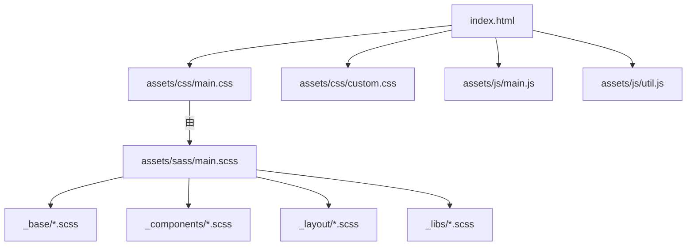
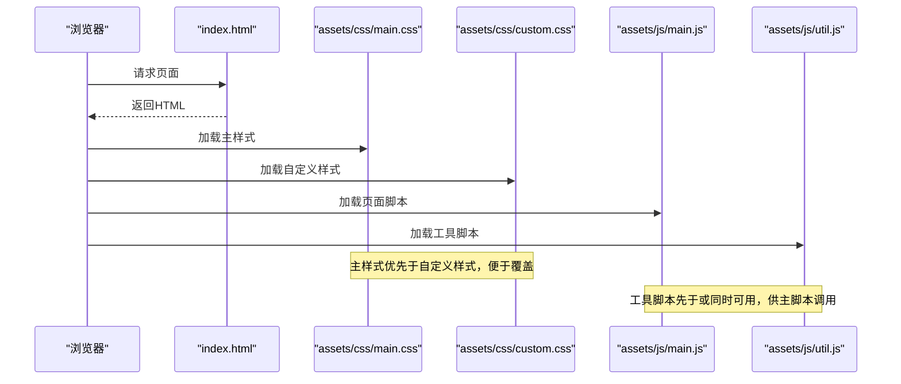
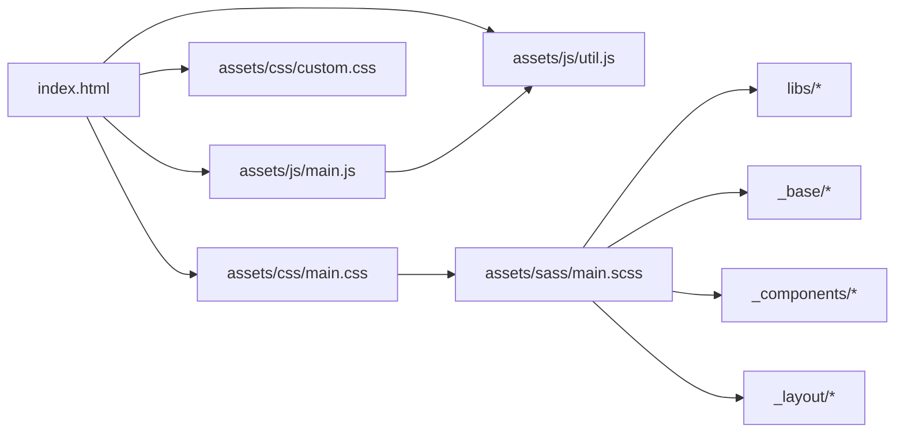

# 文件命名规范

<cite>
**本文引用的文件**
- [assets/sass/main.scss](file://assets/sass/main.scss)
- [assets/css/main.css](file://assets/css/main.css)
- [assets/css/custom.css](file://assets/css/custom.css)
- [assets/js/main.js](file://assets/js/main.js)
- [assets/js/util.js](file://assets/js/util.js)
- [assets/sass/base/_reset.scss](file://assets/sass/base/_reset.scss)
- [assets/sass/components/_button.scss](file://assets/sass/components/_button.scss)
- [assets/sass/layout/_header.scss](file://assets/sass/layout/_header.scss)
- [index.html](file://index.html)
</cite>

## 目录
1. [简介](#简介)
2. [项目结构](#项目结构)
3. [核心组件](#核心组件)
4. [架构总览](#架构总览)
5. [详细组件分析](#详细组件分析)
6. [依赖关系分析](#依赖关系分析)
7. [性能考虑](#性能考虑)
8. [故障排查指南](#故障排查指南)
9. [结论](#结论)
10. [附录：命名示例与反例](#附录：命名示例与反例)

## 简介
本规范基于当前仓库的实际文件组织与引用方式，总结并统一前端资源（CSS、Sass、JavaScript）的命名约定与模块化组织方式。目标是让团队在新增或修改样式/脚本时保持一致性，降低维护成本，提升可读性与可协作性。

## 项目结构
- 样式层
  - Sass 源码位于 assets/sass，按职责分目录：base（基础重置）、components（组件）、layout（布局）、libs（工具与第三方）。
  - 编译产物 main.css 位于 assets/css，作为主样式入口；custom.css 用于覆盖与业务定制。
- 脚本层
  - assets/js 下包含第三方库与业务脚本：main.js（页面交互）、util.js（通用工具），以及浏览器兼容与断点等辅助脚本。
- 入口页
  - index.html 通过 link/script 标签引入 assets/css/main.css、assets/css/custom.css 与 assets/js/*。

图表来源
- [index.html:8-9](file://index.html#L8-L9)
- [index.html:121-125](file://index.html#L121-L125)
- [assets/sass/main.scss:1-62](file://assets/sass/main.scss#L1-L62)

章节来源
- [index.html:8-9](file://index.html#L8-L9)
- [index.html:121-125](file://index.html#L121-L125)
- [assets/sass/main.scss:1-62](file://assets/sass/main.scss#L1-L62)

## 核心组件
- 样式入口与分层
  - Sass 入口 assets/sass/main.scss 负责导入 libs、base、components、layout，体现“先基础、再组件、后布局”的层级顺序。
  - 编译后的 assets/css/main.css 是最终加载的主样式。
- 自定义样式
  - assets/css/custom.css 直接以 CSS 形式存在，用于覆盖主题或业务定制，避免污染 Sass 源码。
- 脚本组织
  - assets/js/main.js 负责页面级交互（如侧边栏、菜单、断点响应等）。
  - assets/js/util.js 提供通用 jQuery 插件能力（面板、占位符填充、元素优先级等）。

章节来源
- [assets/sass/main.scss:1-62](file://assets/sass/main.scss#L1-L62)
- [assets/css/custom.css:1-391](file://assets/css/custom.css#L1-L391)
- [assets/js/main.js:1-262](file://assets/js/main.js#L1-L262)
- [assets/js/util.js:1-587](file://assets/js/util.js#L1-L587)

## 架构总览
从构建到渲染的关键路径如下：

图表来源
- [index.html:8-9](file://index.html#L8-L9)
- [index.html:121-125](file://index.html#L121-L125)

## 详细组件分析

### Sass 模块与下划线前缀
- 模块划分
  - base：基础重置与排版（例如 _reset.scss、_page.scss、_typography.scss）。
  - components：可复用组件（例如 _button.scss、_box.scss、_form.scss 等）。
  - layout：页面布局块（例如 _header.scss、_footer.scss、_sidebar.scss 等）。
  - libs：变量、函数、mixin、断点、网格与厂商前缀等基础设施。
- 下划线前缀
  - 所有模块文件均以 _ 开头，表示为“部分文件”，仅被 @import 引用，不会单独生成 CSS。
  - 入口 assets/sass/main.scss 集中 @import 各模块，保证编译顺序与依赖清晰。
- 命名约定
  - 文件名使用小写英文单词，语义明确，避免缩写；多词用连字符分隔（如 _mini-posts.scss）。
  - 目录名使用小写复数名词（base、components、layout、libs），体现集合概念。

章节来源
- [assets/sass/main.scss:1-62](file://assets/sass/main.scss#L1-L62)
- [assets/sass/base/_reset.scss:1-76](file://assets/sass/base/_reset.scss#L1-L76)
- [assets/sass/components/_button.scss:1-85](file://assets/sass/components/_button.scss#L1-L85)
- [assets/sass/layout/_header.scss:1-51](file://assets/sass/layout/_header.scss#L1-L51)

### CSS 文件命名规则
- 主样式文件
  - 名称：main.css，作为编译输出与页面主样式入口。
  - 作用：承载由 Sass 编译而来的全局样式与组件样式。
- 自定义样式文件
  - 名称：custom.css，独立于框架/模板样式，用于覆盖与业务定制。
  - 加载顺序：在 main.css 之后加载，确保覆盖生效。
- 第三方样式
  - 名称遵循第三方包约定（如 fontawesome-all.min.css），保持原样引入。

章节来源
- [index.html:8-9](file://index.html#L8-L9)
- [assets/css/main.css:1-800](file://assets/css/main.css#L1-L800)
- [assets/css/custom.css:1-391](file://assets/css/custom.css#L1-L391)

### JavaScript 文件命名与模块化
- 主交互脚本
  - 名称：main.js，负责页面级行为（断点监听、侧边栏开关、滚动锁定、菜单交互等）。
- 工具脚本
  - 名称：util.js，封装通用 jQuery 插件方法，供 main.js 或其他脚本复用。
- 第三方脚本
  - 名称遵循第三方包约定（如 browser.min.js、breakpoints.min.js、jquery.min.js），保持原样引入。
- 模块化组织建议
  - 单文件职责单一：UI 交互集中在 main.js，通用能力集中在 util.js。
  - 如需扩展，可按功能域拆分文件，并在 main.js 中按需引入，保持入口清晰。

章节来源
- [assets/js/main.js:1-262](file://assets/js/main.js#L1-L262)
- [assets/js/util.js:1-587](file://assets/js/util.js#L1-L587)
- [index.html:121-125](file://index.html#L1-L125)

### 样式与脚本的加载顺序与依赖
- 样式加载顺序
  - 先 main.css（框架/模板样式），后 custom.css（覆盖样式），确保覆盖有效。
- 脚本加载顺序
  - 先依赖库（jQuery、browser、breakpoints），再工具脚本（util.js），最后主脚本（main.js）。
- 原因
  - 保证 main.js 能调用 util.js 提供的能力，且依赖库已就绪。

章节来源
- [index.html:8-9](file://index.html#L8-L9)
- [index.html:121-125](file://index.html#L121-L125)

## 依赖关系分析
- 入口依赖
  - index.html 显式引入 assets/css/main.css、assets/css/custom.css 与 assets/js/*。
- Sass 编译依赖
  - assets/sass/main.scss 依次导入 libs、base、components、layout，形成清晰的依赖链。
- 运行时依赖
  - main.js 依赖 util.js 暴露的方法；两者均依赖 jQuery 与第三方工具（browser、breakpoints）。

图表来源
- [index.html:8-9](file://index.html#L8-L9)
- [index.html:121-125](file://index.html#L121-L125)
- [assets/sass/main.scss:1-62](file://assets/sass/main.scss#L1-L62)

## 性能考虑
- 样式合并与压缩
  - 将多个 Sass 模块编译为单个 main.css，减少 HTTP 请求；生产环境建议启用压缩与缓存。
- 自定义样式分离
  - 使用 custom.css 隔离业务覆盖，便于增量更新与回滚，不影响主样式。
- 脚本按需加载
  - 将通用工具与页面逻辑分离，避免重复定义；必要时可按页面拆分脚本。
- 字体与图标
  - 外部字体与图标按需引入，避免阻塞首屏；可考虑预加载关键资源。

## 故障排查指南
- 样式未生效
  - 检查 custom.css 是否在 main.css 之后加载；确认选择器优先级未被覆盖。
- Sass 变更未反映
  - 确认已重新编译 assets/sass/main.scss 至 assets/css/main.css。
- 脚本报错
  - 检查依赖库是否先于 main.js 加载；确认 util.js 暴露的方法已被正确调用。
- 移动端异常
  - 核对断点配置与媒体查询；检查浏览器兼容性脚本是否加载。

章节来源
- [index.html:8-9](file://index.html#L8-L9)
- [index.html:121-125](file://index.html#L121-L125)
- [assets/sass/main.scss:1-62](file://assets/sass/main.scss#L1-L62)

## 结论
本项目采用“Sass 模块化 + 编译产物主样式 + 自定义样式覆盖 + 脚本职责分离”的组织方式。遵循本规范可在不破坏现有结构的前提下，安全地扩展样式与脚本，保持团队协作一致性与长期可维护性。

## 附录：命名示例与反例
- Sass 模块
  - 正例：_reset.scss、_button.scss、_header.scss、_breakpoints.scss
  - 反例：Reset.scss、Button.scss、Header.scss（大小写混用）、reset.scss（缺少下划线前缀）
- CSS 文件
  - 正例：main.css、custom.css、fontawesome-all.min.css
  - 反例：Main.css、CUSTOM.CSS（大小写不一致）
- JavaScript 文件
  - 正例：main.js、util.js、vendor.min.js
  - 反例：Main.js、Util.js、VENDOR.JS（大小写不一致）
- 目录命名
  - 正例：base、components、layout、libs
  - 反例：Base、Components、Layout、Libs（大写）