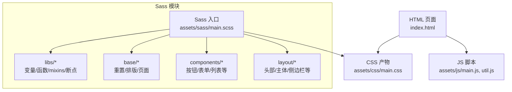
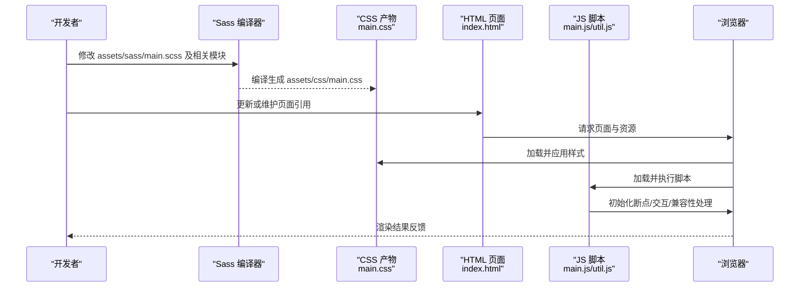
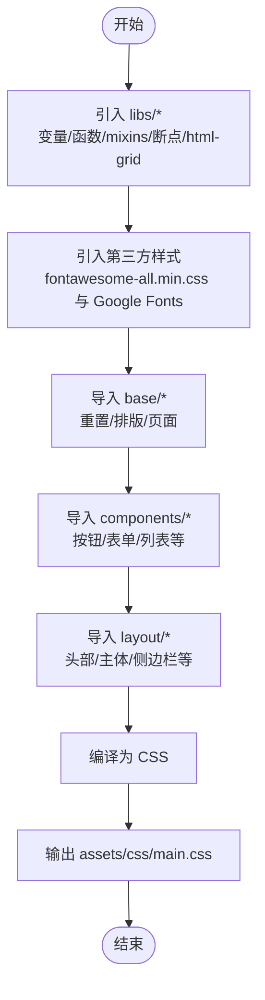
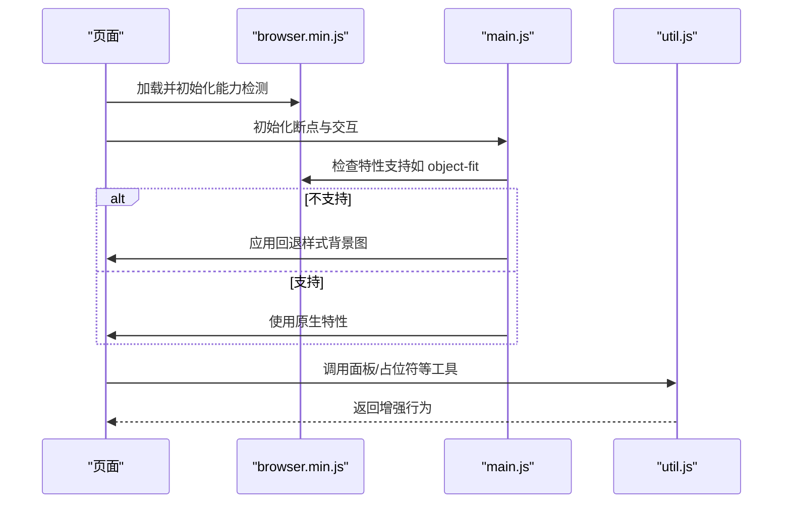
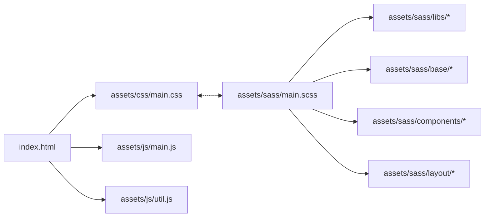

# 构建流程

<cite>
**本文引用的文件**
- [README.md](file://README.md)
- [index.html](file://index.html)
- [assets/sass/main.scss](file://assets/sass/main.scss)
- [assets/css/main.css](file://assets/css/main.css)
- [assets/js/main.js](file://assets/js/main.js)
- [assets/js/util.js](file://assets/js/util.js)
</cite>

## 目录
1. [简介](#简介)
2. [项目结构](#项目结构)
3. [核心组件](#核心组件)
4. [架构总览](#架构总览)
5. [详细组件分析](#详细组件分析)
6. [依赖分析](#依赖分析)
7. [性能考虑](#性能考虑)
8. [故障排查指南](#故障排查指南)
9. [结论](#结论)
10. [附录](#附录)

## 简介
本构建流程文档面向一个基于静态 HTML/CSS/JS 的个人主页站点，说明从源代码到最终部署文件的完整转换过程。重点包括：
- Sass 编译与 CSS 生成机制
- JavaScript 压缩与优化策略
- 浏览器兼容性工具集成与使用
- 本地开发环境搭建与构建命令
- 常见问题排查方法
- 生产环境优化与部署准备

该项目采用模块化 Sass（按 base/components/layout/libs 组织）并通过主入口 main.scss 聚合样式；JavaScript 通过 jQuery 生态实现响应式断点、侧边栏交互与表单兼容等能力。

**章节来源**
- [README.md:1-10](file://README.md#L1-L10)

## 项目结构
仓库采用清晰的资源分层：
- assets/sass：Sass 源码，按基础、组件、布局、库进行模块化管理，main.scss 作为统一入口
- assets/css：编译后的 CSS 产物（如 main.css），供页面引用
- assets/js：运行时脚本，包含业务逻辑与工具函数
- index.html / publications.html：页面入口，引用编译后的 CSS 与 JS

**图表来源**
- [assets/sass/main.scss:1-62](file://assets/sass/main.scss#L1-L62)
- [assets/css/main.css:1-200](file://assets/css/main.css#L1-L200)
- [index.html:1-150](file://index.html#L1-L150)

**章节来源**
- [assets/sass/main.scss:1-62](file://assets/sass/main.scss#L1-L62)
- [assets/css/main.css:1-200](file://assets/css/main.css#L1-L200)
- [index.html:1-150](file://index.html#L1-L150)

## 核心组件
- Sass 入口与模块聚合：main.scss 负责引入变量、函数、mixins、断点、第三方字体与图标，并按 base/components/layout 顺序组合样式
- 样式产物：main.css 为编译输出，包含全局重置、排版、组件与布局样式，并引用外部字体与图标
- 运行时脚本：main.js 提供断点管理、加载动画控制、图片适配、侧边栏交互与滚动锁定；util.js 提供面板、占位符填充、元素优先级等通用工具
- 页面引用：index.html 在 head 中引入 main.css 与 custom.css，在 body 末尾引入 jQuery、browser、breakpoints、util、main 等脚本

**章节来源**
- [assets/sass/main.scss:1-62](file://assets/sass/main.scss#L1-L62)
- [assets/css/main.css:1-200](file://assets/css/main.css#L1-L200)
- [assets/js/main.js:1-262](file://assets/js/main.js#L1-L262)
- [assets/js/util.js:1-587](file://assets/js/util.js#L1-L587)
- [index.html:1-150](file://index.html#L1-L150)

## 架构总览
下图展示了从源代码到浏览器渲染的构建与运行路径：

**图表来源**
- [assets/sass/main.scss:1-62](file://assets/sass/main.scss#L1-L62)
- [assets/css/main.css:1-200](file://assets/css/main.css#L1-L200)
- [index.html:1-150](file://index.html#L1-L150)
- [assets/js/main.js:1-262](file://assets/js/main.js#L1-L262)
- [assets/js/util.js:1-587](file://assets/js/util.js#L1-L587)

## 详细组件分析

### Sass 编译流程与 CSS 生成机制
- 入口文件 main.scss 依次引入 libs（变量、函数、mixins、vendor、断点、html-grid）、第三方样式（fontawesome-all.min.css）与 Google Fonts，再按 base/components/layout 的顺序导入各模块
- 断点系统通过 mixins/breakpoints 将命名断点映射为媒体查询，确保响应式样式在不同视口下生效
- 编译产物 main.css 包含全局重置、排版、组件与布局样式，并在顶部引入外部字体与图标

**图表来源**
- [assets/sass/main.scss:1-62](file://assets/sass/main.scss#L1-L62)
- [assets/css/main.css:1-200](file://assets/css/main.css#L1-L200)

**章节来源**
- [assets/sass/main.scss:1-62](file://assets/sass/main.scss#L1-L62)
- [assets/css/main.css:1-200](file://assets/css/main.css#L1-L200)

### JavaScript 压缩与优化
- 当前仓库未包含自动化压缩任务配置，但已提供 minified 版本的第三方库（如 browser.min.js、breakpoints.min.js），表明生产环境建议使用压缩版本以减少体积
- 建议对业务脚本 main.js 与 util.js 进行压缩与合并，以进一步减少网络传输开销
- 可通过构建工具链（如 gulp/grunt/webpack/vite）完成：
  - 压缩：移除空白、注释，缩短变量名
  - 合并：将多个脚本合并为单文件，减少请求数
  - 缓存：结合版本号或哈希进行长期缓存
  - 按需加载：仅在需要时加载非关键脚本

**章节来源**
- [index.html:120-130](file://index.html#L120-L130)

### 浏览器兼容性处理工具的集成与使用
- 页面在 head 中引入 browser.min.js，用于检测浏览器特性与能力，配合 main.js 中的功能降级与 polyfill 逻辑
- main.js 中使用 breakpoints 与 browser 能力检测，实现：
  - 响应式断点监听与侧边栏状态切换
  - 针对不支持 object-fit 的浏览器进行背景图回退
  - 特定平台（如 Android Chrome）滚动条显示修复
- util.js 提供 placeholder 兼容方案与面板交互增强，提升旧版浏览器体验

**图表来源**
- [index.html:120-130](file://index.html#L120-L130)
- [assets/js/main.js:1-262](file://assets/js/main.js#L1-L262)
- [assets/js/util.js:1-587](file://assets/js/util.js#L1-L587)

**章节来源**
- [index.html:120-130](file://index.html#L120-L130)
- [assets/js/main.js:1-262](file://assets/js/main.js#L1-L262)
- [assets/js/util.js:1-587](file://assets/js/util.js#L1-L587)

### 本地开发环境搭建指南与构建命令
- 安装 Node.js 与 npm/yarn（若需引入构建工具）
- 安装 Sass 编译器（推荐 Dart Sass）
- 创建或编辑构建脚本（示例思路）：
  - watch：监听 assets/sass 变化并实时编译到 assets/css
  - build：一次性编译 Sass，并对 JS 进行压缩与合并
- 常用命令（概念性）：
  - sass --watch assets/sass:assets/css
  - 使用 gulp/grunt/webpack 定义任务：build、dev、prod
- 启动本地服务器预览（可选）：
  - 使用 Python http.server 或 VS Code Live Server 等工具

注意：本项目未包含构建配置文件，上述命令为通用实践建议。实际使用时可根据团队规范选择合适工具链。

[本节为通用指导，不直接分析具体文件]

### 常见构建问题的排查方法与解决方案
- Sass 编译失败
  - 检查 main.scss 的 import 路径是否正确，确保 libs/base/components/layout 模块存在且语法无误
  - 查看错误堆栈定位具体文件与行号，修正语法或变量缺失问题
- 样式未生效
  - 确认页面正确引用了 assets/css/main.css 与 assets/css/custom.css
  - 检查浏览器开发者工具的网络面板，确认 CSS 是否成功加载
- JS 交互异常
  - 检查控制台是否有报错，确认 jQuery、browser、breakpoints、util、main 的加载顺序与依赖关系
  - 验证浏览器能力检测逻辑（如 object-fit）是否触发回退分支
- 构建产物不一致
  - 清理旧的 CSS/JS 产物后重新构建，避免缓存干扰
  - 对 JS 进行压缩前备份原始文件，便于对比差异

**章节来源**
- [assets/sass/main.scss:1-62](file://assets/sass/main.scss#L1-L62)
- [index.html:1-150](file://index.html#L1-L150)
- [assets/js/main.js:1-262](file://assets/js/main.js#L1-L262)
- [assets/js/util.js:1-587](file://assets/js/util.js#L1-L587)

### 生产环境的优化策略与部署准备
- 样式优化
  - 启用 Sass 压缩模式，去除多余空白与注释
  - 合并重复的媒体查询与规则，减少 CSS 体积
- 脚本优化
  - 使用 minified 版本的第三方库（browser.min.js、breakpoints.min.js）
  - 对 main.js 与 util.js 进行压缩与合并，必要时拆分关键路径与非关键路径
- 资源优化
  - 启用 Gzip/Brotli 压缩
  - 使用 CDN 托管字体与图标，降低首屏延迟
  - 合理设置缓存头，利用浏览器缓存
- 部署准备
  - 仅提交编译后的 assets/css 与 assets/js 产物至发布分支
  - 保持 HTML 引用路径一致，避免路径变更导致资源 404
  - 在 CI/CD 中集成构建步骤，确保每次发布均经过构建与校验

[本节为通用指导，不直接分析具体文件]

## 依赖分析
- 页面依赖
  - index.html 依赖 assets/css/main.css、assets/css/custom.css 以及 assets/js 下的多个脚本
- Sass 依赖
  - main.scss 依赖 libs/*（变量、函数、mixins、断点、html-grid）、第三方样式与字体，再依赖 base/components/layout 模块
- 运行时依赖
  - main.js 依赖 jQuery、browser、breakpoints，并与 util.js 提供的工具协作

**图表来源**
- [index.html:1-150](file://index.html#L1-L150)
- [assets/sass/main.scss:1-62](file://assets/sass/main.scss#L1-L62)
- [assets/css/main.css:1-200](file://assets/css/main.css#L1-L200)

**章节来源**
- [index.html:1-150](file://index.html#L1-L150)
- [assets/sass/main.scss:1-62](file://assets/sass/main.scss#L1-L62)
- [assets/css/main.css:1-200](file://assets/css/main.css#L1-L200)

## 性能考虑
- 减少请求数：合并 CSS/JS，优先使用 minified 版本
- 减少体积：启用 Sass/JS 压缩，移除未使用的样式与脚本
- 提升首屏速度：关键 CSS 内联，非关键脚本延迟加载
- 缓存策略：为静态资源设置长期缓存与版本号
- 网络优化：启用 HTTP/2、Gzip/Brotli，使用 CDN 分发资源

[本节为通用指导，不直接分析具体文件]

## 故障排查指南
- 样式问题
  - 检查 Sass 编译是否成功，确认 main.scss 的 import 顺序与路径
  - 使用浏览器开发者工具检查样式覆盖与媒体查询生效情况
- 脚本问题
  - 检查控制台错误与网络请求，确认依赖加载顺序
  - 验证 browser 能力检测与回退逻辑是否符合预期
- 构建问题
  - 清理缓存后重新构建，确认产物一致性
  - 逐步缩小范围，定位具体模块或文件的问题

**章节来源**
- [assets/sass/main.scss:1-62](file://assets/sass/main.scss#L1-L62)
- [assets/js/main.js:1-262](file://assets/js/main.js#L1-L262)
- [assets/js/util.js:1-587](file://assets/js/util.js#L1-L587)
- [index.html:1-150](file://index.html#L1-L150)

## 结论
本项目采用模块化 Sass 与 jQuery 生态脚本，具备清晰的资源结构与良好的可维护性。通过引入构建工具链可实现 Sass 自动编译、JS 压缩与合并、浏览器兼容性处理与生产环境优化。建议在团队内统一构建规范与 CI/CD 流程，以确保发布质量与效率。

[本节为总结性内容，不直接分析具体文件]

## 附录
- 术语解释
  - Sass：CSS 预处理器，支持变量、混入、嵌套等特性
  - 断点：响应式设计中的视口阈值，用于适配不同设备尺寸
  - Polyfill：为旧版浏览器提供缺失特性的兼容代码
- 参考链接
  - 模板来源：README.md 中提及的 HTML5 UP Editorial 模板

**章节来源**
- [README.md:1-10](file://README.md#L1-L10)