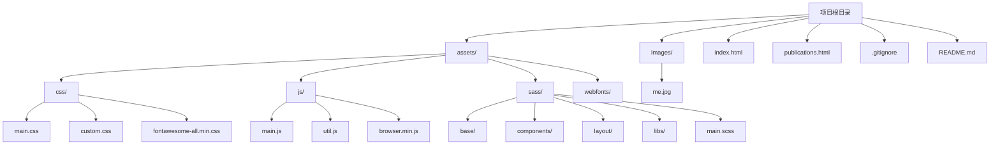
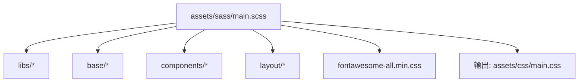
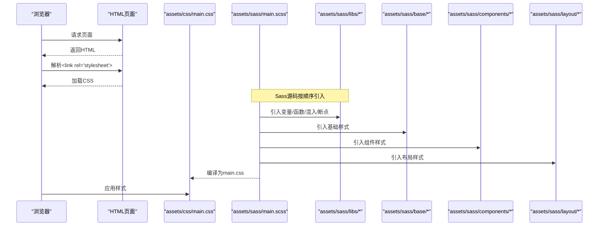
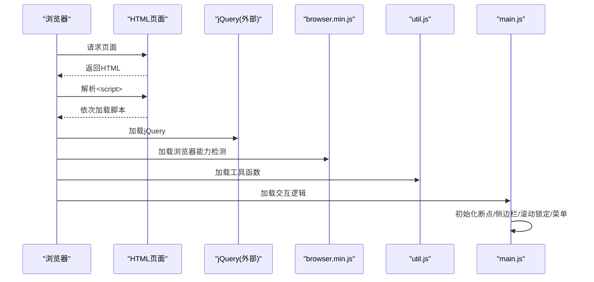

# 目录组织

<cite>
**本文引用的文件**
- [README.md](file://README.md)
- [.gitignore](file://.gitignore)
- [index.html](file://index.html)
- [publications.html](file://publications.html)
- [assets/sass/main.scss](file://assets/sass/main.scss)
- [assets/css/custom.css](file://assets/css/custom.css)
- [assets/js/main.js](file://assets/js/main.js)
</cite>

## 目录与职责总览
本项目是一个基于 HTML5 UP Editorial 模板的个人主页站点，采用“页面 + 静态资源”的简单结构。根目录下包含两个 HTML 页面、一个图片资源目录和一个统一的静态资源目录 assets，以及版本控制忽略规则 .gitignore。assets 下按类型划分 css、js、sass、webfonts 等子目录；images 用于存放页面引用的图片资源。

图表来源
- [index.html:8-9](file://index.html#L8-L9)
- [index.html:121-125](file://index.html#L121-L125)
- [publications.html:8-9](file://publications.html#L8-L9)
- [publications.html:166-170](file://publications.html#L166-L170)
- [assets/sass/main.scss:1-8](file://assets/sass/main.scss#L1-L8)

章节来源
- [README.md:1-10](file://README.md#L1-L10)
- [index.html:1-128](file://index.html#L1-L128)
- [publications.html:1-184](file://publications.html#L1-L184)
- [assets/sass/main.scss:1-62](file://assets/sass/main.scss#L1-L62)
- [assets/css/custom.css:1-391](file://assets/css/custom.css#L1-L391)
- [assets/js/main.js:1-262](file://assets/js/main.js#L1-L262)

## 项目结构说明
- 根目录
  - index.html：个人主页入口，包含头部、横幅、简介、新闻、学术服务与侧边栏导航。
  - publications.html：论文列表页，按年份组织发表成果。
  - images/：存放页面引用的图片（如头像）。
  - assets/：统一的前端静态资源目录，按类型细分。
  - .gitignore：版本控制忽略规则。
  - README.md：项目说明与模板来源。

- 资源组织原则
  - 样式：Sass 源码位于 assets/sass，编译产物 main.css 位于 assets/css；业务定制样式放在 custom.css。
  - 脚本：通用工具 util.js、浏览器能力检测 browser.min.js、交互逻辑 main.js 位于 assets/js。
  - 字体：图标字体 fontawesome-all.min.css 引入于 Sass 入口，实际字体文件通常由 CDN 或本地 webfonts 提供。
  - 图片：页面通过相对路径引用 images 下的图片。

章节来源
- [index.html:8-9](file://index.html#L8-L9)
- [index.html:121-125](file://index.html#L121-L125)
- [publications.html:8-9](file://publications.html#L8-L9)
- [publications.html:166-170](file://publications.html#L166-L170)
- [assets/sass/main.scss:1-8](file://assets/sass/main.scss#L1-L8)

## assets 目录详解

### assets/css
- 职责：存放最终被浏览器加载的 CSS 文件。
- 文件组织
  - main.css：由 Sass 入口编译生成的主样式表，包含基础、组件与布局样式。
  - custom.css：业务定制样式，覆盖主题配色、排版与页面特定布局。
  - fontawesome-all.min.css：图标字体样式表（可通过 CDN 或本地方式引入）。
- 使用方式：HTML 中通过 link 标签引入 main.css 与 custom.css。

章节来源
- [index.html:8-9](file://index.html#L8-L9)
- [publications.html:8-9](file://publications.html#L8-L9)
- [assets/sass/main.scss:1-8](file://assets/sass/main.scss#L1-L8)
- [assets/css/custom.css:1-391](file://assets/css/custom.css#L1-L391)

### assets/js
- 职责：存放页面交互与工具脚本。
- 文件组织
  - main.js：页面交互核心（断点适配、侧边栏行为、滚动锁定、菜单展开等）。
  - util.js：工具函数集合（供 main.js 调用）。
  - browser.min.js：浏览器能力检测与兼容处理。
- 使用方式：HTML 底部 script 标签按依赖顺序引入。

章节来源
- [index.html:121-125](file://index.html#L121-L125)
- [publications.html:166-170](file://publications.html#L166-L170)
- [assets/js/main.js:1-262](file://assets/js/main.js#L1-L262)

### assets/sass
- 职责：Sass 源码目录，按职责分层组织，便于维护与扩展。
- 目录结构
  - base/：基础重置、页面骨架、排版等底层样式。
  - components/：可复用 UI 组件（按钮、表单、列表、卡片等）。
  - layout/：页面级布局（头部、主体、侧边栏、横幅、页脚、包装器、菜单）。
  - libs/：变量、函数、混入、响应式断点、网格与厂商前缀等库。
  - main.scss：入口文件，按顺序引入 libs、base、components、layout，并引入第三方样式与字体。
- 编译产物：生成 assets/css/main.css。

图表来源
- [assets/sass/main.scss:1-62](file://assets/sass/main.scss#L1-L62)

章节来源
- [assets/sass/main.scss:1-62](file://assets/sass/main.scss#L1-L62)

### assets/webfonts
- 职责：存放图标字体文件（如 FontAwesome 的字体文件），配合 fontawesome-all.min.css 使用。
- 管理建议
  - 若使用 CDN 引入图标样式，则无需本地字体文件。
  - 若离线部署，请将对应字体文件放入此目录并确保路径正确。

章节来源
- [assets/sass/main.scss:7-8](file://assets/sass/main.scss#L7-L8)

## images 目录
- 用途：存放页面引用的图片资源，例如首页头像 me.jpg。
- 管理方式
  - 以语义化命名（如 me.jpg）并按用途归类。
  - 在 HTML 中以相对路径引用，如 images/me.jpg。
  - 建议对图片进行压缩与格式优化以提升加载性能。

章节来源
- [index.html:37-39](file://index.html#L37-L39)

## HTML 页面结构与命名规范
- 页面文件
  - index.html：主页，包含个人信息、新闻与学术服务。
  - publications.html：论文列表页，按年份分组展示。
- 结构约定
  - 统一在 head 中引入 assets/css/main.css 与 assets/css/custom.css。
  - 统一在 body 底部引入 assets/js 下的脚本，遵循依赖顺序。
  - 页面内容通过语义化标签（header、section、footer、nav）组织。
- 命名规范
  - 页面文件名使用小写英文加连字符（如 index.html、publications.html）。
  - 资源路径统一使用相对路径，避免绝对路径带来的迁移成本。

章节来源
- [index.html:8-9](file://index.html#L8-L9)
- [index.html:121-125](file://index.html#L121-L125)
- [publications.html:8-9](file://publications.html#L8-L9)
- [publications.html:166-170](file://publications.html#L166-L170)

## .gitignore 配置与忽略规则
- 作用：排除不需要提交到版本库的文件与目录，减少仓库体积与噪声。
- 规则说明
  - macOS 系统文件与目录：.DS_Store、.AppleDouble、._*、Spotlight-V100、Trashes、fseventsd 等。
  - Windows 系统文件：缩略图缓存与桌面配置文件。
  - Linux 临时文件：以 ~ 结尾的备份文件。
- 影响范围：仅影响版本控制，不影响运行时资源加载。

章节来源
- [.gitignore:1-21](file://.gitignore#L1-L21)

## 关键流程与依赖关系

### 样式加载与编译流程

图表来源
- [assets/sass/main.scss:1-62](file://assets/sass/main.scss#L1-L62)
- [index.html:8-9](file://index.html#L8-L9)

### 脚本加载与交互流程

图表来源
- [index.html:121-125](file://index.html#L121-L125)
- [publications.html:166-170](file://publications.html#L166-L170)
- [assets/js/main.js:1-262](file://assets/js/main.js#L1-L262)

## 依赖分析
- 页面依赖
  - CSS：main.css（来自 Sass 编译）、custom.css（业务定制）、fontawesome-all.min.css（图标样式）。
  - JS：jQuery（外部依赖）、browser.min.js（能力检测）、util.js（工具）、main.js（交互）。
- 样式依赖
  - Sass 入口 main.scss 按顺序引入 libs、base、components、layout，确保变量与混入先于使用处定义。
- 资源路径
  - 所有资源均使用相对路径，便于在不同环境部署时保持一致性。

章节来源
- [assets/sass/main.scss:1-62](file://assets/sass/main.scss#L1-L62)
- [index.html:8-9](file://index.html#L8-L9)
- [index.html:121-125](file://index.html#L121-L125)
- [publications.html:8-9](file://publications.html#L8-L9)
- [publications.html:166-170](file://publications.html#L166-L170)

## 性能与可维护性建议
- 样式
  - 保持 Sass 分层清晰，新增组件优先放入 components，布局变更集中在 layout。
  - 将业务定制样式集中在 custom.css，避免污染主样式。
- 脚本
  - 严格遵循脚本加载顺序，确保依赖先于使用者加载。
  - 将通用逻辑抽离至 util.js，保持 main.js 聚焦交互。
- 图片
  - 使用合适格式与尺寸，启用懒加载以减少首屏压力。
- 字体
  - 若使用 CDN 引入图标字体，可减少本地资源体积；离线部署需确保字体文件完整。

[本节为通用指导，不直接分析具体文件]

## 故障排查指南
- 样式未生效
  - 检查 HTML 是否正确引入 assets/css/main.css 与 assets/css/custom.css。
  - 确认 Sass 已正确编译为 main.css 且路径无误。
- 交互异常
  - 检查脚本加载顺序：jQuery → browser.min.js → util.js → main.js。
  - 查看控制台是否有 jQuery 或依赖缺失错误。
- 图片不显示
  - 确认 images 目录存在对应图片且路径正确。
- 版本控制问题
  - 检查 .gitignore 是否误忽略重要文件或目录。

章节来源
- [.gitignore:1-21](file://.gitignore#L1-L21)
- [index.html:8-9](file://index.html#L8-L9)
- [index.html:121-125](file://index.html#L121-L125)
- [publications.html:8-9](file://publications.html#L8-L9)
- [publications.html:166-170](file://publications.html#L166-L170)

## 结论
本项目采用清晰的目录组织与分层样式结构，便于维护与扩展。assets 下按类型与职责划分，Sass 分层明确；HTML 页面简洁且依赖统一；images 集中管理图片资源；.gitignore 屏蔽系统无关文件。遵循本文的命名与组织规范，开发者可以快速定位资源、理解职责边界并进行高效迭代。