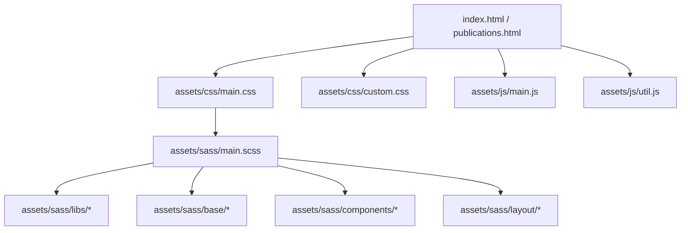
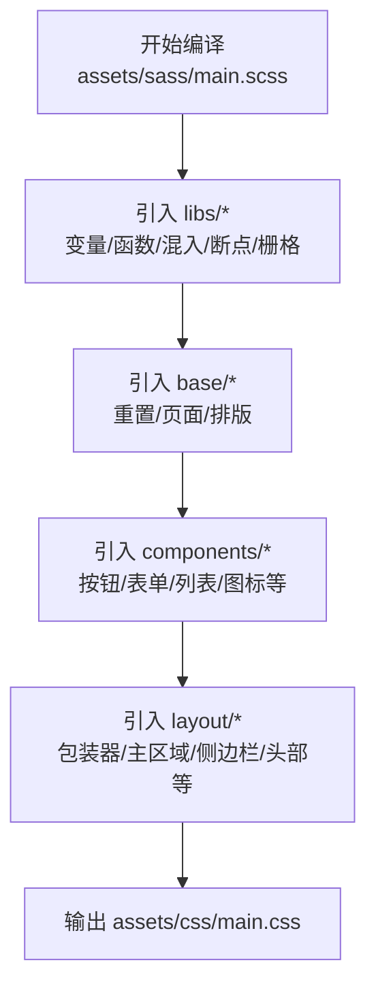
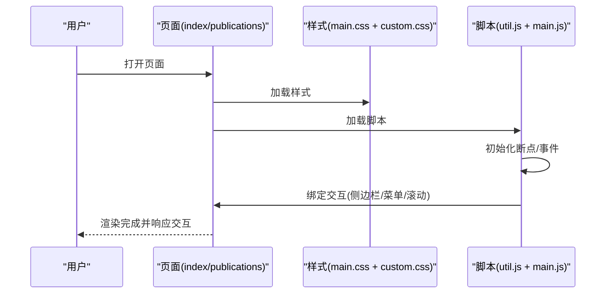
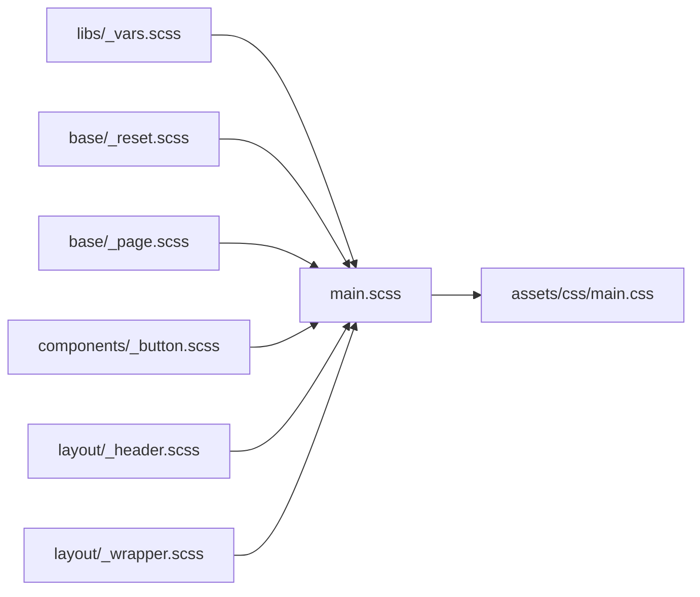
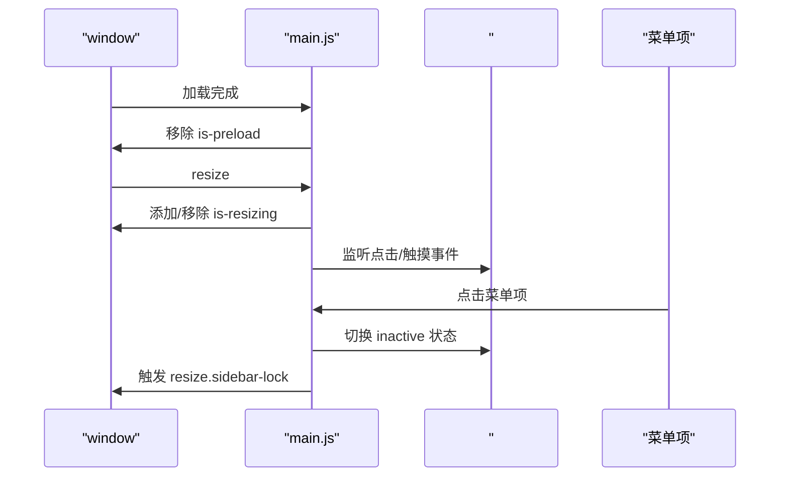
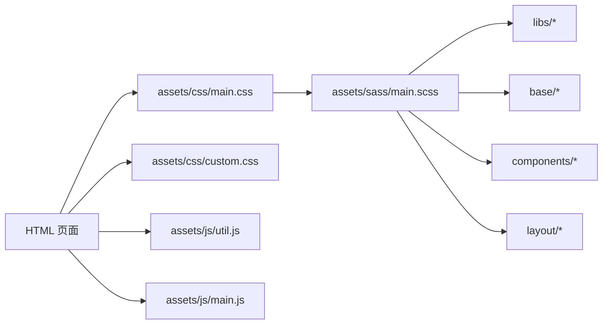

# 项目结构

<cite>
**本文引用的文件**
- [README.md](file://README.md)
- [index.html](file://index.html)
- [publications.html](file://publications.html)
- [assets/sass/main.scss](file://assets/sass/main.scss)
- [assets/sass/libs/_vars.scss](file://assets/sass/libs/_vars.scss)
- [assets/sass/base/_reset.scss](file://assets/sass/base/_reset.scss)
- [assets/sass/base/_page.scss](file://assets/sass/base/_page.scss)
- [assets/sass/components/_button.scss](file://assets/sass/components/_button.scss)
- [assets/sass/layout/_header.scss](file://assets/sass/layout/_header.scss)
- [assets/sass/layout/_wrapper.scss](file://assets/sass/layout/_wrapper.scss)
- [assets/css/custom.css](file://assets/css/custom.css)
- [assets/js/main.js](file://assets/js/main.js)
- [assets/js/util.js](file://assets/js/util.js)
</cite>

## 目录与文件组织原则
- 资源集中管理：所有前端静态资源统一放在 assets/ 下，按类型划分 css、js、sass、webfonts。
- 样式分层：Sass 采用 base（基础重置与页面）、components（可复用组件）、layout（页面布局区块）、libs（变量、函数、混入、断点等）的模块化架构，便于维护与扩展。
- 编译产物分离：Sass 编译后的 main.css 与业务自定义 custom.css 在 HTML 中分别引入，保证模板样式与个性化样式解耦。
- 脚本职责清晰：util.js 提供通用工具方法；main.js 负责页面交互与响应式行为；第三方库以独立文件引入。
- 多页面共享结构：index.html 与 publications.html 共用相同的头部、侧边栏与脚本加载顺序，便于统一风格与行为。

**章节来源**
- [assets/sass/main.scss:1-62](file://assets/sass/main.scss#L1-L62)
- [index.html:8-9,120-125:8-9](file://index.html#L8-L9)
- [publications.html:8-9,165-170:8-9](file://publications.html#L8-L9)

## 核心组件
- 入口页面：index.html 与 publications.html 作为站点页面入口，定义页面骨架、内容区块与脚本加载顺序。
- 样式系统：assets/sass/main.scss 为 Sass 总入口，按 libs → base → components → layout 的顺序引入模块，最终输出 assets/css/main.css。
- 自定义样式：assets/css/custom.css 用于覆盖或增强模板样式，不修改模板源码，便于升级与维护。
- 交互逻辑：assets/js/main.js 实现响应式断点、侧边栏切换、滚动锁定、菜单展开等；assets/js/util.js 提供面板、占位符填充、元素优先级等工具方法。

**章节来源**
- [assets/sass/main.scss:1-62](file://assets/sass/main.scss#L1-L62)
- [assets/js/main.js:13-23,72-164,237-260:13-23](file://assets/js/main.js#L13-L23)
- [assets/js/util.js:7-35,42-297,526-585:7-35](file://assets/js/util.js#L7-L35)

## 架构总览
下图展示了从 HTML 到样式与脚本的整体依赖关系，以及 Sass 模块的组织方式。

**图表来源**
- [assets/sass/main.scss:1-62](file://assets/sass/main.scss#L1-L62)
- [index.html:8-9,120-125:8-9](file://index.html#L8-L9)
- [publications.html:8-9,165-170:8-9](file://publications.html#L8-L9)

## 详细组件分析

### Sass 模块化架构
- 入口文件 assets/sass/main.scss 按顺序引入：
  - libs：变量、函数、混入、供应商前缀、断点、栅格等基础设施。
  - base：重置样式、页面基础设置、排版。
  - components：按钮、表单、列表、图标、卡片等可复用组件。
  - layout：包装器、主区域、侧边栏、头部、横幅、页脚、菜单等布局区块。
- 通过 @import 串联，最终生成 assets/css/main.css。

**图表来源**
- [assets/sass/main.scss:1-62](file://assets/sass/main.scss#L1-L62)

**章节来源**
- [assets/sass/main.scss:1-62](file://assets/sass/main.scss#L1-L62)
- [assets/sass/libs/_vars.scss:1-44](file://assets/sass/libs/_vars.scss#L1-L44)
- [assets/sass/base/_reset.scss:1-76](file://assets/sass/base/_reset.scss#L1-L76)
- [assets/sass/base/_page.scss:1-48](file://assets/sass/base/_page.scss#L1-L48)
- [assets/sass/components/_button.scss:1-85](file://assets/sass/components/_button.scss#L1-L85)
- [assets/sass/layout/_header.scss:1-51](file://assets/sass/layout/_header.scss#L1-L51)
- [assets/sass/layout/_wrapper.scss:1-13](file://assets/sass/layout/_wrapper.scss#L1-L13)

### HTML 页面结构与组件划分
- 公共结构：
  - 头部 header：包含站点标识与导航链接。
  - 主体 main：承载页面主要内容区块（如横幅、简介、新闻、服务信息等）。
  - 侧边栏 sidebar：包含菜单、个人简介信息与页脚版权信息。
- 页面差异：
  - index.html 侧重个人主页展示（横幅、简介、新闻、学术服务）。
  - publications.html 侧重论文列表展示，按年份分组列出标题、作者、链接等。
- 资源加载：
  - 样式：先引入 main.css，再引入 custom.css，确保自定义样式能正确覆盖模板样式。
  - 脚本：依次引入 jQuery、浏览器检测、断点工具、通用工具 util.js、主交互 main.js。

**图表来源**
- [index.html:8-9,120-125:8-9](file://index.html#L8-L9)
- [publications.html:8-9,165-170:8-9](file://publications.html#L8-L9)
- [assets/js/main.js:13-23,72-164,237-260:13-23](file://assets/js/main.js#L13-L23)
- [assets/js/util.js:7-35,42-297,526-585:7-35](file://assets/js/util.js#L7-L35)

**章节来源**
- [index.html:13-118](file://index.html#L13-L118)
- [publications.html:13-163](file://publications.html#L13-L163)

### 样式编译流程与依赖关系
- 编译入口：assets/sass/main.scss。
- 依赖顺序：
  - libs：定义颜色、尺寸、字体、断点等全局变量与工具。
  - base：重置默认样式、设置 box-sizing、处理最小宽度与动画暂停类。
  - components：具体 UI 组件样式（按钮、表单、列表、图标等）。
  - layout：页面布局（包装器、主区域、侧边栏、头部、横幅、页脚、菜单）。
- 输出：assets/css/main.css。
- 自定义覆盖：assets/css/custom.css 在 main.css 之后引入，用于主题定制与局部调整。

**图表来源**
- [assets/sass/main.scss:1-62](file://assets/sass/main.scss#L1-L62)
- [assets/sass/libs/_vars.scss:1-44](file://assets/sass/libs/_vars.scss#L1-L44)
- [assets/sass/base/_reset.scss:1-76](file://assets/sass/base/_reset.scss#L1-L76)
- [assets/sass/base/_page.scss:1-48](file://assets/sass/base/_page.scss#L1-L48)
- [assets/sass/components/_button.scss:1-85](file://assets/sass/components/_button.scss#L1-L85)
- [assets/sass/layout/_header.scss:1-51](file://assets/sass/layout/_header.scss#L1-L51)
- [assets/sass/layout/_wrapper.scss:1-13](file://assets/sass/layout/_wrapper.scss#L1-L13)

**章节来源**
- [assets/sass/main.scss:1-62](file://assets/sass/main.scss#L1-L62)

### JavaScript 交互流程
- 断点初始化：根据屏幕宽度启用不同行为。
- 预加载与重绘：页面加载完成后移除 is-preload 类，避免初始动画闪烁；窗口 resize 时标记 is-resizing。
- 图片兼容：在不支持 object-fit 的浏览器中用背景图模拟。
- 侧边栏：
  - 小屏默认隐藏，点击切换显示/隐藏。
  - 点击侧边栏内链接后自动收起并在延迟后跳转。
  - 在大屏模式下保持固定，滚动时根据高度计算进行“滚动锁定”。
- 菜单：支持多级菜单展开/收起，并在状态变化时触发侧边栏锁定的重新计算。

**图表来源**
- [assets/js/main.js:25-49,72-164,237-260:25-49](file://assets/js/main.js#L25-L49)

**章节来源**
- [assets/js/main.js:25-49,72-164,237-260:25-49](file://assets/js/main.js#L25-L49)
- [assets/js/util.js:42-297](file://assets/js/util.js#L42-L297)

### 文件命名规范与最佳实践
- Sass 模块：
  - 使用下划线前缀的文件名表示 partial（如 _vars.scss、_reset.scss），仅通过 @import 引用，不会单独生成 CSS。
  - 按职责分目录：base（基础）、components（组件）、layout（布局）、libs（工具）。
- 样式覆盖：
  - 优先通过 custom.css 覆盖模板样式，避免直接修改模板源码，便于后续升级。
- 脚本组织：
  - util.js 提供通用工具方法，main.js 负责页面级交互逻辑，保持职责单一。
- 资源路径：
  - 统一通过相对路径引用 assets 下的资源，确保在不同部署环境下路径稳定。
- 断点与响应式：
  - 使用统一的断点配置（libs/breakpoints），在 Sass 与 JS 中保持一致，避免样式与行为不一致。

[本节为通用指导，不直接分析具体文件]

## 依赖分析
- 页面依赖：
  - index.html 与 publications.html 均依赖 main.css、custom.css、util.js、main.js。
- 样式依赖：
  - main.scss 依赖 libs、base、components、layout 各模块，最终生成 main.css。
- 脚本依赖：
  - main.js 依赖 util.js 提供的工具方法与第三方库（jQuery、browser、breakpoints）。

**图表来源**
- [assets/sass/main.scss:1-62](file://assets/sass/main.scss#L1-L62)
- [index.html:8-9,120-125:8-9](file://index.html#L8-L9)
- [publications.html:8-9,165-170:8-9](file://publications.html#L8-L9)

**章节来源**
- [assets/sass/main.scss:1-62](file://assets/sass/main.scss#L1-L62)
- [index.html:8-9,120-125:8-9](file://index.html#L8-L9)
- [publications.html:8-9,165-170:8-9](file://publications.html#L8-L9)

## 性能考虑
- 样式合并与压缩：建议在生产环境将 Sass 编译并合并为单个 CSS，并进行压缩以减少请求体积。
- 脚本按需加载：确保仅在需要的页面加载必要的脚本，减少不必要的 DOM 操作。
- 图片优化：banner 与头像图片建议使用合适尺寸与格式，避免过大影响首屏加载。
- 断点一致性：保持 Sass 与 JS 中的断点一致，避免重复计算与样式抖动。

[本节为通用指导，不直接分析具体文件]

## 故障排查指南
- 样式未生效：
  - 检查 custom.css 是否在 main.css 之后引入，确保覆盖顺序正确。
  - 确认 Sass 已正确编译并更新 main.css。
- 侧边栏异常：
  - 检查 main.js 是否正确加载，断点是否生效。
  - 在小屏设备上确认 inactive 类切换逻辑正常。
- 图片显示问题：
  - 在不支持 object-fit 的浏览器中，main.js 会用背景图模拟，需确保图片路径正确。
- 菜单交互失效：
  - 检查菜单项是否有正确的 opener 结构与事件绑定。

**章节来源**
- [assets/js/main.js:25-49,72-164,237-260:25-49](file://assets/js/main.js#L25-L49)
- [assets/css/custom.css:1-378](file://assets/css/custom.css#L1-L378)

## 结论
本项目采用清晰的模块化架构与职责分离策略：Sass 按 base、components、layout、libs 分层组织，HTML 页面共享公共结构并通过 custom.css 进行个性化定制，JavaScript 通过 util.js 与 main.js 实现工具方法与页面交互。整体设计易于维护与扩展，适合学术主页类网站的快速迭代与长期演进。

[本节为总结性内容，不直接分析具体文件]